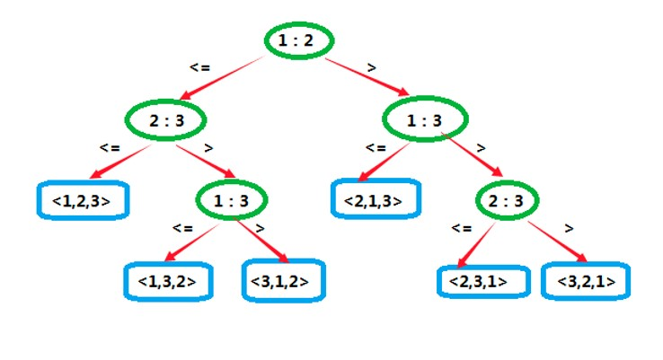

# 基础算法


> 作者: 潘深练
>
> 创建: 2022-07-16

## 一、算法

👉 数据结构和算法的可视化网站：[Data Structure Visualizations | 数据结构可视化](https://www.cs.usfca.edu/~galles/visualization/Algorithms.html)

👉 数据结构和算法的百科网站：[GeeksforGeeks | Algorithms](https://www.geeksforgeeks.org/fundamentals-of-algorithms)

👉 GitHub 最大的开源算法库：[Hello, algorithms](https://the-algorithms.com/)

👉 演算法筆記: [Algorithm & Data Structure ](https://web.ntnu.edu.tw/~algo/)

## 二、排序

排序算法，简而言之，就是将杂乱无章的 **数据元素**，通过一定的方法按照 **关键词** 顺序排列（消灭逆序对）的过程。

### 2.1、复杂度与性能

排序算法     | 平均时间复杂度    | 最好情况         | 最坏情况     | 空间复杂度 | 排序方式   | 稳定性 | 复杂性
----        |  ----           |  ----            |  ----        | ----      | ----       | ----  | ---- 
冒泡排序     | O(n²)           | O(n)             | O(n²)        | O(1)      | In-place   | ✔️    | ★
选择排序     | O(n²)           | O(n²)            | O(n²)        | O(1)      | In-place   | ❌    | ★
插入排序     | O(n²)           | O(n)             | O(n²)        | O(1)      | In-place   | ✔️    | ★
希尔排序     | 步长序列不同而变  | O(n)            | O(nlog²n)     | O(1)      | In-place   | ❌    | ★★
归并排序     | O(nlogn)         | O(nlogn)        | O(nlogn)      | O(n)      | Out-place  | ✔️    | ★★
快速排序     | O(nlogn)         | O(nlogn)        | O(n²)         | O(logn)   | In-place   | ❌    | ★★★
堆排序       | O(nlogn)         | O(nlogn)        | O(nlogn)      | O(1)      | In-place   | ❌    | ★★
计数排序     | O(n+k)           | O(n+k)          | O(n+k)        | O(k)      | Out-place  | ✔️    | ★★
桶排序       | O(n+k)           | O(n+k)          | O(n²)         | O(n·k)    | Out-place  | ✔️    | ★★
基数排序     | O(n·k)           | O(n·k)          | O(n·k)        | O(n+k)    | Out-place  | ✔️    | ★★

- 时间复杂度是O(n+k)
    - n: 数据个数
    - k: 数据范围（跨度）

- 稳定性评判
    - 简单标准
        - 排序是否影响原先同值数据元素的次序，是则不稳定，否则稳定
    - 工业界意义
        - 排序数值（索引）关联到的其它信息（具体数据），排序后其它信息（具体数据）也会影响到顺序
        - 排序算法影响到程序的健壮性（也就是某方面不稳定）
        - 多次排序，想要延续以前排序的顺序（是否还存在这种可能性）


### 2.2、比较类排序

依据一个排序算法是否依赖元素间的比较，我们分为 **比较类排序** 与 **非比较类排序**，常见的比较类排序算法有：

- 无记忆
    - 冒泡排序
    - 选择排序
    - 插入排序
    - 希尔排序（优化之插入排序）
- 有记忆
    - 归并排序
    - 快速排序
    - **堆排序**

非比较类排序算法，一般来说排序效率高，时间复杂度更小，但是往往需要牺牲更多的空间复杂度，常见的非比较类排序算法有：

- 计数排序
- 桶排序
- 基数排序

以下首先了解 **比较类排序算法**：

- **冒泡排序**
    - 动画演示
        - [冒泡排序--动画演示](https://www.cs.usfca.edu/~galles/visualization/ComparisonSort.html)
    - 图示
    
    - 概念
        - 交换排序，双层遍历，引入额外临时变量
        - 冒泡排序（Bubble Sort）又称为泡式排序，是一种简单的排序算法。它重复地走访过要排序的数列，一次比较两个元素，如果它们的顺序错误就把它们交换过来。走访数列的工作是重复地进行直到没有再需要交换，也就是说该数列已经排序完成。这个算法的名字由来是因为越小的元素会经由交换慢慢“浮”到数列的顶端。
    - 思想
        - 把相邻的元素两两比较，当一个元素大于右侧相邻元素时，交换它们的位置；当一个元素小于或等于右侧相邻元素时，位置不变，继续往后比较
    - 优化
        - 外层循环优化
            - 设置标志isSort，默认为排好，如果不交换则跳出本次循环
        - 内层循环优化
            - 已经被移到右侧的元素不用再参与比较了。由于每一轮比较过后，最后一位必然为最大值或最小值，所以下一轮比较时可忽略，即减少最后一位的比对
    - 优点
        - 数据稳定误差小
    - 不足
        - 时间复杂度高，速度慢
- **选择排序**
    - 动画演示
        - [选择排序--动画演示](https://www.cs.usfca.edu/~galles/visualization/ComparisonSort.html)
    - 图示
    
    - 概念
        - 选择排序（Selection sort）是一种简单直观的排序算法。它的工作原理如下。首先在未排序序列中找到最小（大）元素，存放到排序序列的起始位置，然后，再从剩余未排序元素中继续寻找最小（大）元素，然后放到已排序序列的末尾。以此类推，直到所有元素均排序完毕。
    - 冒泡排序算法和选择排序算法的区别
        - 1. 冒泡排序是比较相邻位置的两个数；而选择排序是按顺序比较，找出最大值或者最小值。
        - 2. 冒泡排序扫描一遍数组，位置不对需要不停地互换位置；而选择排序扫描一遍数组，只需要换一次位置，所以一般来说选择排序比冒泡排序效率高。
        - 3. 冒泡排序是通过数去找位置；而选择排序是给定位置去找数。
    - 优点
        - 移动数据的次数少，一轮比较只需要换一次位置
    - 不足
        - 比较数据的次数多，效率慢，**不稳定**（例如对于数组{5,8,5,2,9}，第一遍选择第一个元素5会和2交换，那么原序列中两个5的相对位置前后顺序就破坏了）
- **插入排序**
    - 动画演示
        - [插入排序--动画演示](https://www.cs.usfca.edu/~galles/visualization/ComparisonSort.html)
    - 图示
    
    - 概念
        - 插入排序（Insertion Sort）是一种简单直观的排序算法。它的工作原理是通过构建有序序列，对于未排序数据，在已排序序列中从后向前扫描，找到相应位置并插入。插入排序在实现上，通常采用in-place排序（即只需用到 O(1) 的额外空间的排序），因而在从后向前扫描过程中，需要反复把已排序元素逐步向后挪位，为最新元素提供插入空间。
    - 优化
        - 插入排序由于从后向前扫描，然后比较之后插入，在比较的这个过程当中，我们可以使用二分插入法，这样就不需要 O(n) 比较了，只需要 O(logn) 的时间复杂度，基本接近二分法的效率
    - 优点
        - 数据稳定且速度快
    - 不足
        - 比较次数浮动较大（与选择排序一样，当前索引左边的所有元素都是有序的，但它们的最终位置还不确定，为了给更小的元素腾出空间，它们可能会被移动。不过当索引到达数组的右端时，数组排序就完成了）
- **希尔排序**
    - 动画演示
        - [希尔排序--动画演示](https://www.cs.usfca.edu/~galles/visualization/ComparisonSort.html)
    - 视频
        - [算法系列-希尔排序](https://v.youku.com/v_show/id_XMzI3Mzg5NDQ1Mg==.html)
    - 图示
    - 
    - 概念
        - 希尔排序（Shellsort），也称递减增量排序算法，是 **插入排序** 的一种更高效的改进版本，希尔排序是 **不稳定** 的排序算法。
    - **特点**
        - 简单来说，希尔排序觉得，前面的冒泡、选择、插入等之类排序，在逆序对过多或者次序复杂的情况下，排序时交换和比较行为可能过多，所以希尔排序有个思路，就是先让数据元素序列，大体先有序，然后再小范围进行冒泡或者插入排序，那就可以减少很多交换和比较行为，这样总体效率就是提高，而试验和实践中，也确实如此。
        - 插入排序在对几乎已经排好序的数据操作时，效率高，即可以达到线性排序的效率。
        - 但插入排序一般来说是低效的，因为插入排序每次只能将数据移动一位。
    - 思想
        - 先按一定的间隔将待排序的序列 **分组**，每组进行插入排序，缩小间隔
            - 1. 首次间隔 h 分组，之后每一轮折半（h/2）分组，组内使用插入排序
            - 2. 最后一轮分组间隔 h=1，进行最后一次插入排序
        - 希尔排序是基于 **插入排序** 的以下两点性质而提出改进方法的：
            - 1. 插入排序在对 **几乎** 已经排好序的数据操作时，效率高，即可以达到线性排序的效率
            - 2. 但插入排序一般来说是低效的，因为插入排序每次只能将数据移动一位
    - 优点
        - 在大数据量的情况下，使用希尔排序算法，相比插入算法，比较次数和交换次数都会明显减少，效率高
        - 例如在一个长度 10W 的数组中
        - 
    - 不足
        - 数据不稳定。我们知道一次插入排序是稳定的，不会改变相同元素的相对顺序，但在希尔排序算法中，由于间隔分组，所以在不同分组内发生的插入排序过程中，相同的元素可能在各自的插入排序中移动，最后其稳定性就会被打乱，所以shell排序是 **不稳定** 的
- **归并排序**
    - 动画演示
        - [归并排序--动画演示](https://www.cs.usfca.edu/~galles/visualization/ComparisonSort.html)
    - 图示
    
    - 视频
        - [算法系列-归并排序](https://v.youku.com/v_show/id_XMzI3MzY3NjU0MA==.html)
    - 概念
        - 递归 + 合并
        - 归并排序（Merge sort），是建立在归并操作上的一种有效的排序算法，效率为 O(nlogn)。1945年由约翰·冯·诺伊曼首次提出。该算法是采用分治法（Divide and Conquer）的一个非常典型的应用，且各层分治递归可以同时进行。
    - 采用分治法:
        - 分割：递归地把当前序列平均分割成两半。
        - 整合：在保持元素顺序的同时将上一步得到的子序列整合到一起（归并）。
    - 优点
        - 没有最好最坏时间复杂度，任何情况下都是O(nlogn)，是一种稳定的排序算法
    - 不足
        - **不是原地排序**，需要开辟额外的O(n)空间
    - javascript 实现版本
        ```javascript
            function mergeSort(arr){
                if(arr.length <=1) return arr;
                // 拆分数组
                var middle = Math.floor(arr.length / 2);
                var left = arr.slice(0, middle);
                var right = arr.slice(middle);
                // 递归 - 分而治之
                return merge(mergeSort(left), mergeSort(right)); 
            }
            function merge(left, right){
                var result = [];
                while(left.length > 0 && right.length > 0){
                    if(left[0] < right[0]){
                        result.push(left.shift());
                    }else{
                        result.push(right.shift());
                    }
                }
                return result.concat(left, right);
            }
        ```
- **快速排序**
    - 动画演示
        - [快速排序--动画演示](https://www.cs.usfca.edu/~galles/visualization/ComparisonSort.html)
    - 视频
        - [4分钟动画-秒懂快速排序](https://www.ixigua.com/6967260248398627342)
    - 概念
        - 快速排序（Quicksort），又称分区交换排序（partition-exchange sort），简称快排，是一种分治的排序算法，最早由东尼·霍尔提出。在平均状况下，排序 n 个项目要 O(nlogn) 次比较。在最坏状况下则需要 O(n²) 次比较，但这种状况并不常见。事实上，快速排序 (nlogn) 通常明显比其他演算法更快，因为它的内部循环（inner loop）可以在大部分的架构上很有效率地达成。
    - 特点
        - 排序算法里的明星，时间复杂度也是名副其实，在所有 O(nlogn) 的排序里速度最快，如 JavaScript封装的 sort 方法就是采用的快排思想。
        - 同冒泡排序一样，快速排序也属于 **交换排序**，通过元素之间的比较和交换位置来达到排序的目的。
        - 不同的是，冒泡排序在每一轮中只把1个元素冒泡到数列的一端，而快速排序则在每一轮挑选一个基准元素，并让其他比它大的元素移动到数列一边，比它小的元素移动到数列的另一边，从而把数列拆解成两个部分，这种思路就叫作 **分治法**。
    - 思想
        - 快排的实现还是使用的分治的思想，原理就是以其中一个元素作为分区点（基准），将原数组划分为左右两个部分，让左侧数组的值全部比分区点小，右部分数组的值全部比分区点大，这个操作也叫做 patition。对已经划分的小数组，继续使用 patition 的操作，直到划分为单个元素，不能再进行 patition 操作，整个数组的排序任务完成。
    - 演算法
        - 快速排序使用分治法（Divide and conquer）策略来把一个序列（list）分为较小和较大的2个子序列，然后递归地排序两个子序列。
        - **核心**
            - 1. 选基准
            - 2. 双指针（每次移动单边指针，与基准比较，之后交换）
        - **步骤**
            - 1. 挑选 **基准值**：从数列中挑出一个元素，称为“基准”（pivot）
            - 2. 分割：重新排序数列，所有比基准值小的元素摆放在基准前面，所有比基准值大的元素摆在基准后面（与基准值相等的数可以到任何一边）。在这个分割结束之后，对基准值的排序就已经完成
            - 3. 递归排序子序列：递归地将小于基准值元素的子序列和大于基准值元素的子序列排序。
    - 注意
        - 递归到最底部的判断条件是数列的大小是零或一，此时该数列显然已经有序。
        - **选取基准值** 有数种具体方法，此选取方法对排序的时间性能有 **决定性影响**。
    - 优点
        - 速度快，原地排序，基准选择恰好时，只需要占用 O(logn) 的栈空间
    - 不足
        - 不稳定，**分区点的选择有讲究**，选择不当时最坏情况会退化为 O(n²)，即基准被选择到边界数据（最大或最小），另外需要把待排序的数组一次性读入到内存里
    - 整体
        快速排序的最坏运行情况是 O(n²)，比如说顺序数列的快排，但它的平摊期望时间是 O(nlogn)，且 O(nlogn) 记号中隐含的常数因子很小，比复杂度稳定等于 O(nlogn) 的归并排序要小很多。所以，对绝大多数顺序性较弱的随机数列而言，**快速排序总是优于归并排序**。

- **堆排序**
    - 动画演示
        - [堆排序--动画演示](https://www.cs.usfca.edu/~galles/visualization/HeapSort.html)
    - 图示
    - 
    - 概念
        - **非比较类排序**
        - 堆排序（Heapsort）是指利用堆这种数据结构所设计的一种排序算法。堆是一个近似完全二叉树的结构，并同时满足堆积的性质：即子节点的键值或索引总是小于（或者大于）它的父节点。
        - 堆排序是一种基于二叉堆数据结构的基于比较的排序技术。它类似于选择排序，我们首先找到最小（大）元素并将最小（大）元素放在开头。我们对其余元素重复相同的过程。
    - 优点
        - 1. **效率**：执行堆排序所需的时间以对数方式增加，而其他算法可能会随着要排序的项目数量的增加而呈指数增长。这种排序算法非常有效。堆排序效率相对的来说是比较的稳定的，不像快排，在最不好的情况之下，时间复杂度会变成O(n^2))。所以，不管是待排序序列是不是有序，堆排序的效率都是O(nlogn)保持不变。同时要注意了，这里的稳定指的是平均时间复杂度=最坏时间复杂度，并不是那个稳定，这是因为，堆排序自身是不稳定的。**堆排序的效率和快排、归并一样，都达到了基于比较的排序算法效率的峰值**。
        - 2. **内存使用**：内存使用最少，因为除了保存要排序的初始项目列表所必需的之外，它不需要额外的内存空间来工作，只要O(1)的辅助空间，它效率高，同时也最节省空间。
        - 3. **简单**：它比其他同样有效的排序算法更容易理解，因为它不使用递归等高级计算机科学概念
    - 不足
        - 堆的维护成本


> 比较的排序算法在最坏状况下，时间复杂度最快也只能达到O(nlogn)

类似以下的决策树，所有可能结果就是 n 的阶层，O(n!) 约等于 O(nlogn) 。因为你只要是基于比较，那经过的层次就基本不可能低于 n 的 logn 层，因为你（比较）不经过这些层，到达不了这些叶子节点（确定不了最终的顺序），所以基于比较的排序，下限就是 O(nlogn) 。




### 2.3、计数排序

- 动画演示
    - [计数排序--动画演示](https://www.cs.usfca.edu/~galles/visualization/CountingSort.html)
- 图示

- 概念
    - **非比较类排序**
    - 计数排序（Counting sort）是一种稳定的 **线性时间排序算法**。该算法于1954年由 Harold H. Seward 提出。计数排序使用一个 **额外的数组** C ，其中第 i 个元素是待排序数组 A 中值等于 i 的元素的个数。然后根据数组 C 来将 A 中的元素排到正确的位置。
- 优点
    - 适用于连续分布的数值数据排序，例如考试分数等
- 不足
    - 不适用跨度较大、数值稀疏分散的数据排序
- Java 版本实现
```java

   /**
    * 计数排序
    */
    public class CountSort {

        public static int[] countSort(int[] array, int offset) {
            int[] nums = new int[array.length];
            for (int i = 0; i < array.length; i++) {
                int n = (array[i] - offset);
                //数字自增
                nums[n]++;
            }
            int[] nums2 = new int[array.length];
            // i是计数数组下标，k是新数组下标
            for (int i = 0, k = 0; i < nums.length; i++) {
                for (int j = 0; j < nums[i]; j++) {
                    nums2[k++] = i + offset;
                }
            }
            return nums2;
         }

         public static void main(String[] args) {
            int[] scores = {95, 94, 91, 98, 99, 90, 99, 93, 91, 92};
            for (int n : countSort(scores, 90)) {
              System.out.println(n);
            }
         }
    }
```

### 2.4、桶排序

- 动画演示
    - [桶排序--动画演示](https://www.cs.usfca.edu/~galles/visualization/BucketSort.html)
- 图示

- 概念
    - **非比较类排序**
    - 桶排序（Bucket sort）或所谓的箱排序，是一个排序演算法，工作的原理是将阵列分到有限数量的桶里。每个桶再个别排序（有可能再使用别的排序演算法或是以递回方式继续使用桶排序进行排序）。桶排序是 **鸽巢排序** 的一种归纳结果。当要被排序的阵列内的数值是均匀分配的时候，桶排序使用线性时间 O(n) 。但桶排序并不是比较排序，他不受到 O(nlogn) 下限的影响。
- 优点
    - 线性、简单
    - 桶排序的时间复杂度为O（n+k）（k为桶内排序所使用的排序方式的复杂度），而当桶越多，其时间效率就越高，利用桶排序，可以实现线性的时间复杂度，并且桶排序是稳定的。
- 不足
    - 耗空间。桶越多，空间复杂度就越高
- 适用
    - 数据较为集中、区间均匀（由于桶内要排序）
- Java 版本实现
```java
    public class BucketSort {
        public static double[] bucketSort(double[] array) {
            double max = 0;
            double min = 0;
            
            //获得最大值和最小值之间的差
            for (int i = 0; i < array.length; i++) {
                if (array[i] > max) {
                    max = array[i];
                }
                if (array[i] < min) {
                    min = array[i];
                }
            }
            double d = max - min;
        
            //桶初始化
            int bucketNum = array.length;
            ArrayList<LinkedList<Double>> bucketList =
                        new ArrayList<LinkedList<Double>>(bucketNum);
            for (int i = 0; i < bucketNum; i++) {
                bucketList.add(new LinkedList<Double>());
            }
            
            //将每个元素放入桶中
            for (int i = 0; i < array.length; i++) {
                int num = (int) ((array[i] - min) * (bucketNum - 1) / d);
                bucketList.get(num).add(array[i]);
            }
            
            //对每个桶内部进行排序
            for (int i = 0; i < bucketList.size(); i++) {
                Collections.sort(bucketList.get(i));
            }

            //输出全部元素
            double[] sortedArray = new double[array.length];
            int index = 0;
            for (LinkedList<Double> list : bucketList) {
                for (double element : list) {
                    sortedArray[index] = element;
                    index++;
                }
            }
            return sortedArray;
        }
        public static void main(String[] args) {
            double[] array = {4.12, 6.421, 0.0023, 3.0, 2.123, 8.122, 4.12, 10.09};
            double[] sortedArray = bucketSort(array);
            System.out.println(Arrays.toString(sortedArray));
        }
    }
```

### 2.5、基数排序

- 动画演示
    - [基数排序--动画演示](https://www.cs.usfca.edu/~galles/visualization/RadixSort.html)
- 图示

- 概念
    - **非比较类排序**
    - 基数排序（Radix sort）是一种非比较型整数排序算法，其原理是将整数按位数切割成不同的数字，然后按每个位数分别比较。由于整数也可以表达字符串（比如名字或日期）和特定格式的浮点数，所以基数排序也不是只能使用于整数。基数排序的发明可以追溯到1887年赫尔曼·何乐礼在列表機（Tabulation Machine）上的贡献。
- 思路
    - 将所有待比较数值（正整数）统一为同样的数位长度，数位较短的数前面补零。然后，从最低位开始，依次进行一次排序。这样 **从最低位** 排序一直到 **最高位** 排序完成以后，数列就变成一个有序序列。

**非比较类的排序算法小结**

- **计数排序**：每个槽只存储单一键值
- **桶排序**：每个桶存储一定范围的数值
- **基数排序**：根据键值的每位数字来分配槽（个十百千，就是四个槽，以此类推）

> 非比较类排序算法，对于数值序列特征的要求，最好都要求是范围集中，不过于分散或跳跃，否则实际应用会丧失理论效率。

### 2.6、并行排序算法

我们在设计排序算法过程中，如果引入并行排序的思路，那么原本被认为不够高效的排序算法，在引入并行排序之后，往往效果显著，例如：

- 冒泡排序可以进行 **奇偶交换**
- 归并排序可以进行 **并行归并**

当然，并不是所有算法都可以引入并行排序的思路，需要判断算法本身是否支持并行，否则无法引入并行思路。

另外，还有一些特别的并行排序算法，例如：

- **双调排序**，可参考详细介绍[《并行算法——双调排序》](https://blog.csdn.net/Asensio_20/article/details/105068977)
    - 图示


### 2.7、排序算法小结

基本排序算法可以从几个维度去思考、设计和优化：

👉 内部排序和外部排序（依赖设备的选择）

👉 时间复杂度是否稳定

👉 空间复杂度 && inplace,outplace

👉 原始次序是否稳定

👉 可并行度

## 三、查找

- 详见：[数据结构](/zh-cn/03-data-structure.md)

## 四、图

### 4.1、无向图
### 4.2、有向图
### 4.3、最小生成树
### 4.4、最短路径

## 五、字符串

### 5.1、字符串排序
### 5.2、单词查找树
### 5.3、子字符串查找
#### 5.3.1、单模式匹配

- BF算法
    - 概念
        - BF 算法中的 BF 是 Brute Force 的缩写，中文叫作暴力匹配算法，也叫朴素匹配算法
        - 这种算法的字符串匹配方式很“暴力”，当然也就会比较简单、好懂，但相应的性能也不高
- RK算法
- BM算法
- KMP算法

#### 5.3.2、多模式匹配

- Tire树
- AC自动机


### 5.4、正则表达式
### 5.5、数据压缩

#### HyperLogLog

- [演示 - 《LogLog 与 HyperLogLog》](http://content.research.neustar.biz/blog/hll.html)
- [论文 - 《HyperLogLog: the analysis of a near-optimal cardinality estimation algorithm》](http://algo.inria.fr/flajolet/Publications/FlFuGaMe07.pdf)

## 六、算法思维
### 6.1、递归
### 6.2、贪心算法
### 6.3、分治算法
### 6.4、回溯算法
### 6.5、动态规划