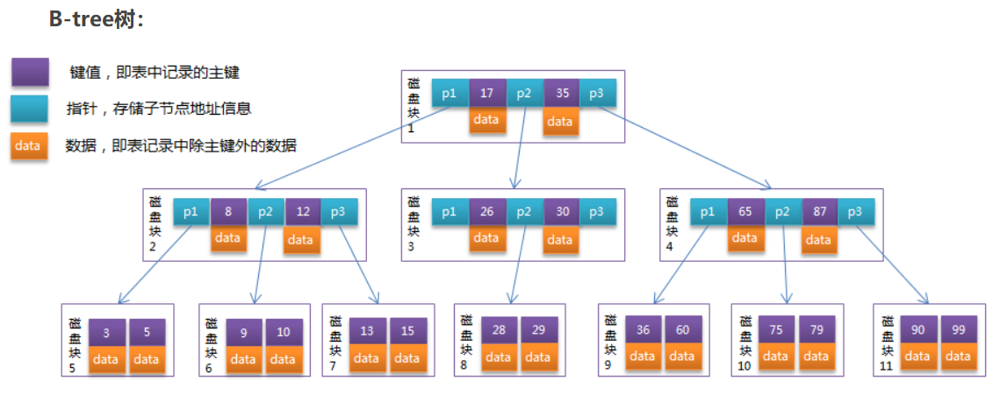
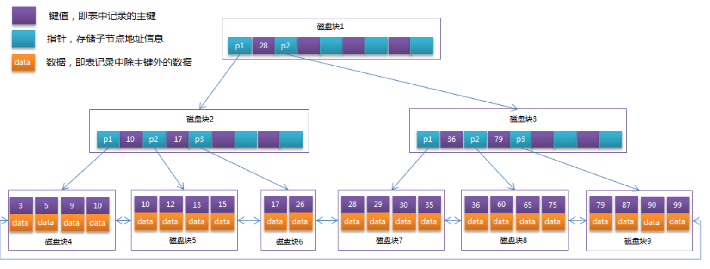
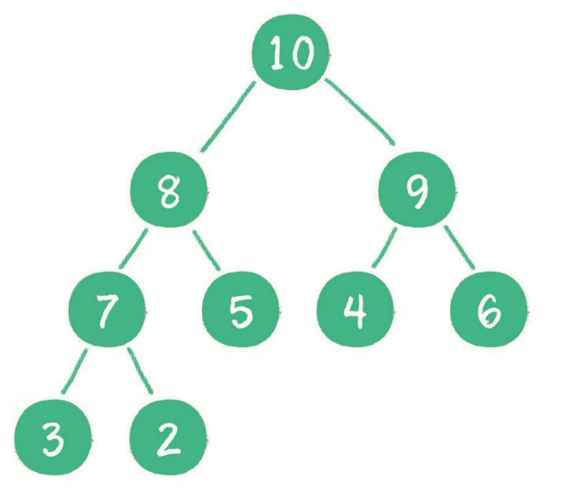
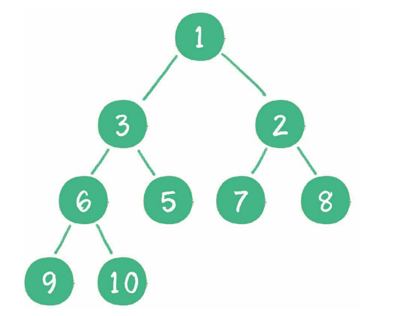
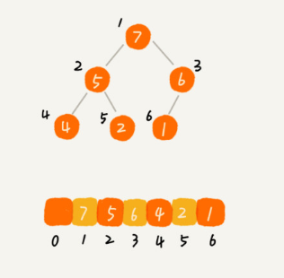

# 数据结构


> 作者: 潘深练
>
> 创建: 2022-06-07
>
> 版权声明：自由转载-非商用-非衍生-保持署名（[创意共享3.0许可证](https://creativecommons.org/licenses/by-nc-nd/3.0/deed.zh)）


## 一、数据结构


👉 数据结构和算法的可视化网站：[Data Structure Visualizations | 数据结构可视化](https://www.cs.usfca.edu/~galles/visualization/Algorithms.html)

👉 数据结构和算法的百科网站：[GeeksforGeeks | Algorithms](https://www.geeksforgeeks.org/fundamentals-of-algorithms)

👉 GitHub 最大的开源算法库：[Hello, algorithms](https://the-algorithms.com/)

👉 演算法筆記: [Algorithm & Data Structure ](https://web.ntnu.edu.tw/~algo/)


### 1.1、集合性能

Collection | Ordering | Random Access | Key-Value | Duplicate Elements | Null Element | Thread Safety 
----                 | ----  | ----  | ----  | ----  | ----  | ---- 
ArrayList            | ✔️ | ✔️ | ❌ | ✔️ | ✔️ | ❌ 
LinkedList           | ✔️ | ❌ | ❌ | ✔️ | ✔️ | ❌ 
HashSet              | ❌ | ❌ | ❌ | ❌ | ✔️ | ❌  
TreeSet              | ✔️ | ❌ | ❌ | ❌ | ❌ | ❌ 
HashMap              | ❌ | ✔️ | ✔️ | ❌ | ✔️ | ❌ 
TreeMap              | ✔️ | ✔️ | ✔️ | ❌ | ❌ | ❌ 
Vector               | ✔️ | ✔️ | ❌ | ✔️ | ✔️ | ✔️ 
HashTable            | ❌ | ✔️ | ✔️ | ❌ | ❌ | ✔️ 
Properties           | ❌ | ✔️ | ✔️ | ❌ | ❌ | ✔️ 
Stack                | ✔️ | ❌ | ❌ | ✔️ | ✔️ | ✔️ 
CopyOnWriteArrayList | ✔️ | ✔️ | ❌ | ✔️ | ✔️ | ✔️ 
ConcurrentHashMap    | ❌ | ✔️ | ✔️ | ❌ | ❌ | ✔️ 
CopyOnWriteArraySet  | ❌ | ❌ | ❌ | ❌ | ✔️ | ✔️ 


## 二、线性表

### 2.1、数组

### 2.2、链表

### 2.3、栈

### 2.4、队列 


## 三、散列表

- 概念
    - 散列表也叫作哈希表（hash table），这种数据结构提供了键（Key）和值（Value）的映射关系。只要给出一个Key，就可以高效查找到它所匹配的Value，时间复杂度接近于O(1)。 

- 存储原理
    - 哈希函数
        - 散列表在本质上也是一个数组。散列表的Key则是以字符串类型为主的，通过hash函数把Key和数组下标进行转换，作用是把任意长度的输入通过散列算法转换成固定类型、固定长度的散列值。

- 哈希冲突
    - 解决哈希冲突的方法主要有两种：
        - 开放寻址法
            - 开放寻址法的原理是当一个Key通过哈希函数获得对应的数组下标已被占用时，就寻找下一个空档位置
            - 在Java中，ThreadLocal所使用的就是开放寻址法
        - 链表法
            - 数组的每一个元素不仅是一个Entry对象，还是一个链表的头节点。每一个Entry对象通过next指针指向它的下一个Entry节点。当新来的Entry映射到与之冲突的数组位置时，只需要插入到对应的链表中即可，默认next指向null

- Hash扩容（resize）
    - 散列表是基于数组实现的，所以散列表需要扩容
    - 当经过多次元素插入，散列表达到一定饱和度时，Key映射位置发生冲突的概率会逐渐提高。这样一来，大量元素拥挤在相同的数组下标位置，形成很长的链表，对后续插入操作和查询操作的性能都有很大影响
    - 影响扩容的因素有两个：
        - Capacity：HashMap的当前长度
        - LoadFactor：HashMap的负载因子（阈值），默认值为0.75f
    - 当HashMap.Size >= Capacity×LoadFactor时，需要进行扩容
        - 扩容的步骤：
            - 1. 扩容，创建一个新的Entry空数组，长度是原数组的2倍
            - 2. 重新Hash，遍历原Entry数组，把所有的Entry重新Hash到新数组中

- HashMap实现
    - 关于HashMap的实现，JDK 8和以前的版本有着很大的不同。当多个Entry被Hash到同一个数组下标位置时，为了提升插入和查找的效率，HashMap会把Entry的链表转化为红黑树这种数据结构。
    - JDK1.8前在HashMap扩容时，会反序单链表，这样在高并发时会有死循环的可能

- 时间复杂度
    - 写操作： O(1) + O(m) = O(m) m为单链元素个数
    - 读操作：O(1) + O(m) m为单链元素个数
    - Hash冲突写单链表：O(m)
    - Hash扩容：O(n) n是数组元素个数 rehash
    - Hash冲突读单链表：O(m) m为单链元素个数

- 优缺点
    - 优点：读写快
    - 缺点：哈希表中的元素是没有被排序的、Hash冲突、扩容 重新计算

- 应用
    - HashMap
        - 设计
            - JDK1.7中HashMap使用一个table数组来存储数据，用key的hashcode取模来决定key会被放到数组里的位置，如果hashcode相同，或者hashcode取模后的结果相同，那么这些key会被定位到Entry数组的同一个格子里，这些key会形成一个链表，在极端情况下比如说所有key的hashcode都相同，将会导致这个链表会很长，那么put/get操作需要遍历整个链表，那么最差情况下时间复杂度变为O（n）。
        - 扩容死链
            - 针对JDK1.7中的这个性能缺陷，JDK1.8中的table数组中可能存放的是链表结构，也可能存放的是红黑树结构，如果链表中节点数量不超过8个则使用链表存储，超过8个会调用treeifyBin函数，将链表转换为红黑树。那么即使所有key的hashcode完全相同，由于红黑树的特点，查找某个特定元素，也只需要O（logn）的开销。
    - 字典
        - Redis字典dict又称散列表（hash），是用来存储键值对的一种数据结构。
        - Redis整个数据库是用字典来存储的。（K-V结构）
        - 对Redis进行CURD操作其实就是对字典中的数据进行CURD操作。
        - Redis字典实现包括：字典(dict)、Hash表(dictht)、Hash表节点(dictEntry)。
    - 布隆过滤器
        - 布隆过滤器（Bloom Filter）是1970年由布隆提出的。它实际上是一个很长的二进制向量和一系列随机hash映射函数。
        - 布隆过滤器可以用于检索一个元素是否在一个集合中。它的优点是空间效率和查询时间都远远超过一般的算法。
        - 布隆过滤器的原理是，当一个元素被加入集合时，通过K个Hash函数将这个元素映射成一个数组中的K个点，把它们置为1。检索时，我们只要看看这些点是不是都是1就（大约）知道集合中有没有它了：如果这些点有任何一个0，则被检元素一定不在；如果都是1，则被检元素很可能在。这就是布隆过滤器的基本思想。
    - 位图
        - 原理
            - Bitmap 的基本原理就是用一个 bit 来标记某个元素对应的 Value，而 Key 即是该元素。由于采用一个bit 来存储一个数据，因此可以大大的节省空间。
        - 应用
            - Java 中 int 类型占用 4 个字节，即 4 byte，又 1 byte = 8 bit。
            - 试想以下，如果有一个很大的 int 数组，如 10000000，数组中每一个数值都要占用 4 个字节，则一共需要占用 10000000 * 4 = 40000000 个字节，即 40000000 / 1024.0 / 1024.0 = 38 M
            - 如果使用 bit 来存放上述 10000000 个元素，只需要 10000000 个 bit 即可， 10000000 / 8.0 / 1024.0 / 1024.0 = 1.19 M 左右，可以看到 bitmap 可以大大的节约内存。
 

## 四、递归 

- 概念
    - 递归，在数学与计算机科学中，是指在函数的定义中使用函数自身的方法。也就是说，递归算法是一种直接或者间接调用自身函数或者方法的算法。

- 本质
    - 递归，去的过程叫"递"，回来的过程叫”归“
    - 递是调用，归是结束后回来
    - 是一种循环，而且在循环中执行的就是调用自己
    - 递归调用将每次返回的结果存在栈帧中

- 递归三要素
    - 递归结束条件
        - 既然是循环就必须要有结束，不结束就会OOM了
    - 函数的功能
        - 这个函数要干什么，打印，计算....
    - 函数的等价关系式
        - 递归公式，一般是每次执行之间，或者与个数之间的逻辑关系

- 经典案例
    - 斐波那契数列：0、1、1、2、3、5、8、13、21、34、55.....
    - 规律：从第3个数开始，每个数等于前面两个数的和

- 优缺点
    - 优点：代码简单
    - 缺点：占用空间较大、如果递归太深，可能会发生栈溢出、可能会有重复计算 通过备忘录或递归的方式去优化（动态规划）

- 应用
    - **递归作为基础算法，应用非常广泛，比如在二分查找、快速排序、归并排序、树的遍历上都有使用递归回溯算法、分治算法、动态规划中也大量使用递归算法实现**


## 五、二分查找  

- 概念
    - 二分查找（Binary Search）算法，也叫折半查找算法
    - 当我们要从一个序列中查找一个元素的时候，二分查找是一种非常快速的查找算法
    - 二分查找是针对 **有序** 数据集合的查找算法，如果是 **无序** 数据集合就 **遍历** 查找

- 本质
    - 二分查找之所以快速，是因为它在匹配不成功的时候，每次都能排除剩余元素中一半的元素。因此可能包含目标元素的有效范围就收缩得很快，而不像顺序查找那样，每次仅能排除一个元素。

- 时间复杂度
    - 时间复杂度就是 O(logn)

- 优缺点
    - 优点：速度快，不占空间，不开辟新空间
    - 缺点：必须是有序的数组，数据量太小没有意义，但数据量也不能太大，因为数组要占用连续的空间

- 应用
    - 有序的查找都可以使用二分法。

## 六、树

- 概念
    - 有很多数据的逻辑关系并不是线性关系，在实际场景中，常常存在着一对多，甚至是多对多的情况。
    - 二叉树的存储结构，可以是顺序存储（之数组）或链式存储（之链表）。

- 分类
    - 二叉树
        - 满二叉树
            - 全部节点都满，根节点 -> 枝节点 -> 叶子节点
        - 完全二叉树
        - 平衡二叉树
        - 二叉查找树
            - binary search tree ，成了 **有序** 树，在二叉树基础上增加了条件定义：
                - 1、如果左子树不为空，则左子树上所有节点的值均小于根节点的值
                - 2、如果右子树不为空，则右子树上所有节点的值均大于根节点的值
                - 3、左、右子树也都是二叉查找树
        - 平衡二叉查找树
            - AVL树（很棒棒的平衡策略之一）
                - 场景
                    - 与红黑树相比，AVL 树更平衡，但在插入和删除过程中可能会导致更多的旋转。因此，如果您的应用程序涉及频繁的插入和删除，那么应该首选红黑树。如果插入和删除不那么频繁，而搜索是一种更频繁的操作，那么 AVL 树应该优先于红黑树。
            - 红黑树（很棒棒的平衡策略之二）
                - 性能
                    - 红黑树相对于AVL树来说，牺牲了部分平衡性以换取插入/删除操作时少量的旋转操作，整体来说性能要优于AVL树。
                - 自平衡
                    - 左旋转（逆时针）
                    - 右旋转（顺时针 ）
                    - 颜色反转
                - 注意
                    - **适用于索引数据量小之数据，可存之于内存（整棵树）。如遇到数据量大之存储需要，建议都是用B树（多路树）来存储（索引和数据可分离）**
    - 多路树
        - 概念
            - 多路查找树(muitl-way search tree)，其每一个节点的孩子数可以 **多于两个**，且每一个节点处可以 **存储多个元素**。
        - M阶
            - 简单来说就是有 M 个叉
        - B树
            - B树（BalanceTree）是对 **二叉查找树的改进**。它的设计思想是，将相关数据尽量集中在一起，以便一次读取多个数据，减少硬盘操作次数。
        - B-树
        - B+树
        - B*树
        - 2-3树
        - 2-3-4树
    - 堆
        - 小顶堆
        - 大顶堆
        - 优先级队列
        - 斐波那契堆
        - 二项堆
    - 其他
        - 树状数组
        - 线段树   

> 关于不同类型的二叉树，理论上使用链表（next/prev -> right/left）存储是相对能更好的利用内存，无论是满二叉树，还是缺少节点的稀疏树，自然都可以，但是如果使用数组来存储，除非是满二叉树的情况或者完全二叉树的情况，能够很好的利用内存，否则一颗太稀疏的树，对内存的浪费就太多了，会流出很多空值位置。

**二叉树的遍历**

二叉树，是典型的非线性数据结构，遍历时需要把非线性关联的节点转化成一个线性的序列，以不同的方式来遍历，遍历出的序列顺序也不同。

- 深度优先遍历
    - 概念
        - 所谓深度优先，顾名思义，就是偏向于纵深，“一头扎到底”的访问方式。
    - 实现
        - 前序遍历
            - 二叉树的前序遍历，输出顺序是根节点、左子树、右子树
        - 中序遍历
            - 二叉树的中序遍历，输出顺序是左子树、根节点、右子树
        - 后序遍历
            - 二叉树的后序遍历，输出顺序是左子树、右子树、根节点
    - 代码
        - 树节点
        ```java
        public class TreeNode {

            // 数据
            int data;

            // 左子节点
            TreeNode leftChild;

            // 右子节点
            TreeNode rightChild;

            public TreeNode(int data) {
                this.data = data;
            }
        }
        ```
        - 二叉查找树
        ```java
        public class BinarySearchTree {
            private TreeNode root;

            /**
            * 插入节点
            * @param data
            */
            public void insertNode(int data){
                root = insert(root,data);
            }

            /**
            * 插入树节点
            * @param node
            * @param data
            * @return
            */
            private TreeNode insert(TreeNode node, int data) {
                // 递归结束条件
                if (null == node){
                    return new TreeNode(data);
                }
                // 数据小于父节点插入到左边
                if (node.data > data){
                    node.leftChild = insert( node.leftChild , data);
                }
                // 数据大于父节点插入到右边
                else if (node.data < data){
                    node.rightChild = insert( node.rightChild , data);
                }
                // 数据相等，不新插入，原数据返回
                else {
                    node.data = data;
                }
                return node;
            }

            /**
            * 前序遍历
            * @param node
            */
            public void preOrderTraversal(TreeNode node){
                // 递归结束条件
                if (node == null){
                    return;
                }
                // 根 -> 左 -> 右
                System.out.println(" 前序遍历 \t\t " +node.data);
                preOrderTraversal(node.leftChild);
                preOrderTraversal(node.rightChild);
            }

            /**
            * 中序遍历
            *    <p>
            *        中序遍历二叉排序树可以得到一个有序的序列
            *    </p>
            * @param node
            */
            public void midOrderTraversal(TreeNode node){
                // 递归结束条件
                if (node == null){
                    return;
                }
                // 左 -> 根 -> 右
                midOrderTraversal(node.leftChild);
                System.out.println(" 中序遍历 \t\t " +node.data);
                midOrderTraversal(node.rightChild);
            }

            /**
            * 后序遍历
            * @param node
            */
            public void afterTraversal(TreeNode node){
                if (node == null){
                    return;
                }
                // 左 -> 右 -> 根
                afterTraversal(node.leftChild);
                afterTraversal(node.rightChild);
                System.out.println(" 后序遍历 \t\t " +node.data);
            }

            /**
            * 测试入口
            * @param args
            */
            public static void main(String[] args) {

                // 初始化树 1-2-3-4-5-6-7-8-9-10-11-12-13-14-15
                //               8
                //       4               12
                //   2       6       10       14
                // 1   3   5   7   9   11   13   15
                BinarySearchTree binarySearchTree = new BinarySearchTree();
                binarySearchTree.insertNode(8);
                binarySearchTree.insertNode(4);
                binarySearchTree.insertNode(12);
                binarySearchTree.insertNode(2);
                binarySearchTree.insertNode(6);
                binarySearchTree.insertNode(10);
                binarySearchTree.insertNode(14);
                binarySearchTree.insertNode(1);
                binarySearchTree.insertNode(3);
                binarySearchTree.insertNode(5);
                binarySearchTree.insertNode(7);
                binarySearchTree.insertNode(9);
                binarySearchTree.insertNode(11);
                binarySearchTree.insertNode(13);
                binarySearchTree.insertNode(15);

                // 标题
                System.out.println( " ============================================ ");
                System.out.println( " 深度遍历 \t\t " + "值 ");
                // 前序遍历
                System.out.println( " ============================================ ");
                binarySearchTree.preOrderTraversal(binarySearchTree.root);
                // 中序遍历
                System.out.println( " ============================================ ");
                binarySearchTree.inOrderTraversal(binarySearchTree.root);
                // 后序遍历
                System.out.println( " ============================================ ");
                binarySearchTree.afterTraversal(binarySearchTree.root);
            }
        ```
        - 结果输出
        ```shell
        ============================================ 
        深度遍历 		 值 
        ============================================ 
        前序遍历 		 8
        前序遍历 		 4
        前序遍历 		 2
        前序遍历 		 1
        前序遍历 		 3
        前序遍历 		 6
        前序遍历 		 5
        前序遍历 		 7
        前序遍历 		 12
        前序遍历 		 10
        前序遍历 		 9
        前序遍历 		 11
        前序遍历 		 14
        前序遍历 		 13
        前序遍历 		 15
        ============================================ 
        中序遍历 		 1
        中序遍历 		 2
        中序遍历 		 3
        中序遍历 		 4
        中序遍历 		 5
        中序遍历 		 6
        中序遍历 		 7
        中序遍历 		 8
        中序遍历 		 9
        中序遍历 		 10
        中序遍历 		 11
        中序遍历 		 12
        中序遍历 		 13
        中序遍历 		 14
        中序遍历 		 15
        ============================================ 
        后序遍历 		 1
        后序遍历 		 3
        后序遍历 		 2
        后序遍历 		 5
        后序遍历 		 7
        后序遍历 		 6
        后序遍历 		 4
        后序遍历 		 9
        后序遍历 		 11
        后序遍历 		 10
        后序遍历 		 13
        后序遍历 		 15
        后序遍历 		 14
        后序遍历 		 12
        后序遍历 		 8
        ============================================
        ```

- 广度优先遍历
    - 概念
        - 也叫 **层序遍历**，顾名思义，就是二叉树按照从根节点到叶子节点的层次关系，一层一层横向遍历各个节点。
    - 实现
        - 二叉树同一层次的节点之间是没有直接关联的，利用 **队列** 可以实现
            - 从 root 节点开始入队 queue ，然后 while 遍历出队，出队时把左右子节点入队
            ```java
               /*
                * 层序遍历
                */ 
                public  void levelOrderTraversal(TreeNode root){
                    Queue<TreeNode> queue = new LinkedList<TreeNode>();
                    // offer: 加入队列尾部（最后一个元素），超界返回 false
                    queue.offer(root);
                    while(!queue.isEmpty()){
                        // poll: 队列头部移出一个元素，为空返回 null
                        TreeNode node = queue.poll();
                        System.out.println(node.data);
                        if(node.leftChild != null){
                            queue.offer(node.leftChild);
                        }
                        if(node.rightChild != null){
                            queue.offer(node.rightChild);
                        }
                    }    
                }
            ```
            - 结果输出
            ```shell
            ============================================ 
            广度遍历 		 值 
            ============================================ 
            层序遍历 		 8
            层序遍历 		 4
            层序遍历 		 12
            层序遍历 		 2
            层序遍历 		 6
            层序遍历 		 10
            层序遍历 		 14
            层序遍历 		 1
            层序遍历 		 3
            层序遍历 		 5
            层序遍历 		 7
            层序遍历 		 9
            层序遍历 		 11
            层序遍历 		 13
            层序遍历 		 15
            ```

- 时间复杂度
    - 二叉查找树的插入和查找时间复杂度为:O(logn)
    - 极端情况下二叉查找树 **退化成链表**，时间复杂度为O(n)，所以需要平衡二叉查找树

- 应用
    - 非线性数据：菜单，组织结构、家谱等等
    - 线性数据：二叉查找树
    - 二叉查找树是有序的，我们只需要 **中序遍历**，就可以在 O(n) 的时间复杂度内，输出 **有序** 的数据序列。
    - 二叉查找树的性能非常稳定，扩容很方便(**链表实现**，数组扩容是很麻烦的一件事，而二叉查找树的扩容就特别快捷简单)

#### BTree

B树（BalanceTree）是 **对二叉查找树的改进**。它的设计思想是，将相关数据尽量集中在一起，以便一次读取多个数据，减少硬盘操作次数。

**一棵m阶的B 树 (m叉树)的特性如下**：

- B树中所有节点的孩子节点数中的最大值称为B树的阶，记为M
- 树中的每个节点至多有M棵子树 ---即：如果定了M，则这个B树中任何节点的子节点数量都不能超过M
- 若根节点不是终端节点，则至少有两棵子树
- 除根节点和叶节点外，所有点至少有m/2棵子树
- 所有的叶子结点都位于同一层

#### B-Tree



#### B+Tree

B+树是B-树的变体，也是一种多路搜索树，其定义基本与B树相同，它的自身特征是：

- 非叶子结点的子树指针与关键字个数相同
- 非叶子结点的子树指针P[i]，指向关键字值属于[K[i], K[i+1])的子树
- 为所有叶子结点增加一个链指针
- 所有关键字都在叶子结点出现



**典型应用**

- MySQL索引B+Tree （叶子节点-->双向链表）
    - B树是为了磁盘或其它存储设备而设计的一种多叉（下面你会看到，相对于二叉，B树每个内结点有多个分支，即多叉）平衡查找树。 多叉平衡
        - B树的高度一般都是在2-4这个高度，树的高度直接影响IO读写的次数。
        - 如果是三层树结构---支撑的数据可以达到20G，如果是四层树结构---支撑的数据可以达到几十T
    - B和B+的区别
        - B树和B+树的最大区别在于非叶子节点是否存储数据的问题
        - B树是非叶子节点和叶子节点都会存储数据。
        - B+树只有叶子节点才会存储数据，而且存储的数据都是在一行上，而且这些数据都是有指针指向的，也就是有顺序的。

> 还有一种B* 树，B*树是B+树的变体，在B+树的非根和非叶子结点再增加指向兄弟的指针。

#### 二叉堆

二叉堆本质上是一种完全二叉树，它分为两个类型

- 1. 大顶堆(最大堆)
    - 最大堆的任何一个父节点的值，都大于或等于它左、右孩子节点的值



- 2. 小顶堆(最小堆)
    - 最小堆的任何一个父节点的值，都小于或等于它左、右孩子节点的值



二叉堆的根节点叫作堆顶

最大堆和最小堆的特点决定了：最大堆的堆顶是整个堆中的最大元素；最小堆的堆顶是整个堆中的最小元素 


**二叉堆的存储原理**

完全二叉树比较适合用数组来存储。用数组来存储完全二叉树是非常节省存储空间的。因为我们不需要存储左右子节点的指针，单纯地通过数组的下标，就可以找到一个节点的左右子节点和父节点。



从图中我们可以看到，数组中下标为 i 的节点的左子节点，就是下标为 i∗2 的节点，右子节点就是下标为 i∗2+1 的节点，父节点就是下标为 i/2 取整的节点

**二叉堆的典型应用**

- 1、优先队列
- 2、利用堆求 Top K问题
    - 在一个包含 n 个数据的数组中，我们可以维护一个大小为 K 的小顶堆，顺序遍历数组，从数组中取出数据与堆顶元素比较。如果比堆顶元素大，我们就把堆顶元素删除，并且将这个元素插入到堆中；如果比堆顶元素小，则不做处理，继续遍历数组。这样等数组中的数据都遍历完之后，堆中的数据就是前 K 大数据了


## 七、应用场景

### 7.1、CopyOnWriteArrayList

首先了解 CopyonwriteArraylist 的一个诞生背景，主要由于 ArrayList 线程不安全（并发场景下的读写冲突问题），而 Vector 虽线程安全锁粒度却又太粗（synchronized），所以在 JDK8 的 JUC 出了个 CopyonwriteArraylist，既能保证线程安全又减小了锁粒度，提高读写性能，唯二不足的就是 copy-on-write 的通病：**占用内存**（写时拷贝副本）、**数据最终一致性**（写时volatile导致读不及时）。

分享了一些实际场景：

- hase etcd里面的数据多版本
- 多副本之间的数据拷贝和最终一致
- 业务数据不同客户读取到的不同数据
- 协同编辑
- linux进程的内存共享
- 业务数据和数据分析的星型模型
- more

CopyOnWriteArrayList(免锁容器)的好处之一是当多个迭代器同时遍历和修改这个列表时，不会抛出 ConcurrentModificationException。在 CopyOnWriteArrayList 中，写入将导致创建整个底层数组的副本，而源数组将保留在原地，使得复制的数组在被修改时，读取操作可以安全地执行。

1. 由于写操作的时候，需要拷贝数组，会消耗内存，如果原数组的内容比较多的情况下，可能导致 young gc 或者 full gc；
2. 不能用于实时读的场景，像拷贝数组、新增元素都需要时间，所以调用一个 set 操作后，读取到数据可能还是旧的,虽然 CopyOnWriteArrayList 能做到最终一致性,但是还是没法满足实时性要求。

CopyOnWriteArrayList 透露的思想：

1. 读写分离，读和写分开
2. 最终一致性
3. 使用另外开辟空间的思路，来解决并发冲突


## 八、QA

### 8.1、How to synchronize ArrayList in Java ?

- 1、Collections.synchronizedList() - method - returns synchronized list 在查询时需要显式使用同步块，例如 synchronized(list){ todo ...}.
- 2、copyOnWriteArrayList - class - Thread Safety variant of ArrayList.

