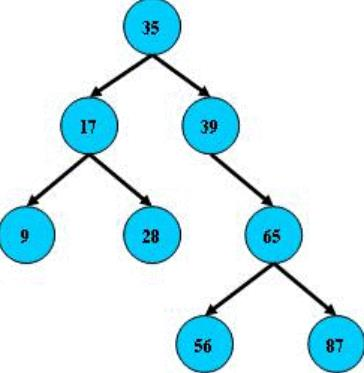
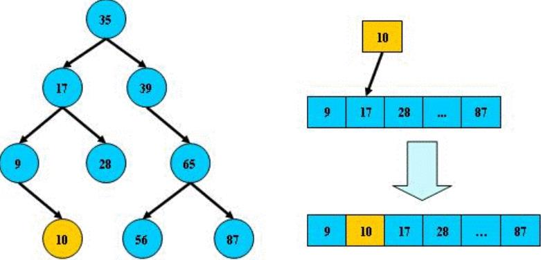
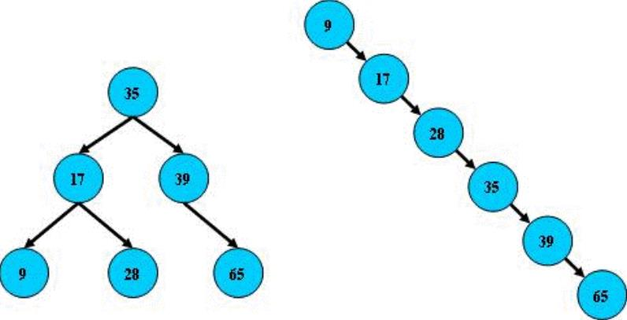
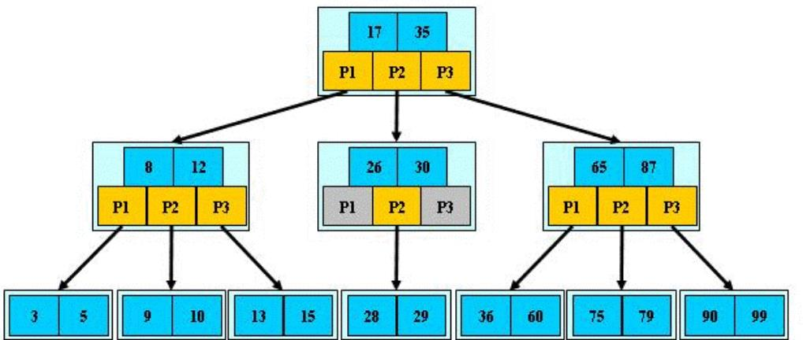
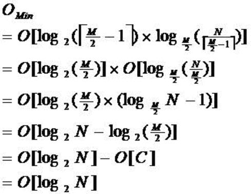
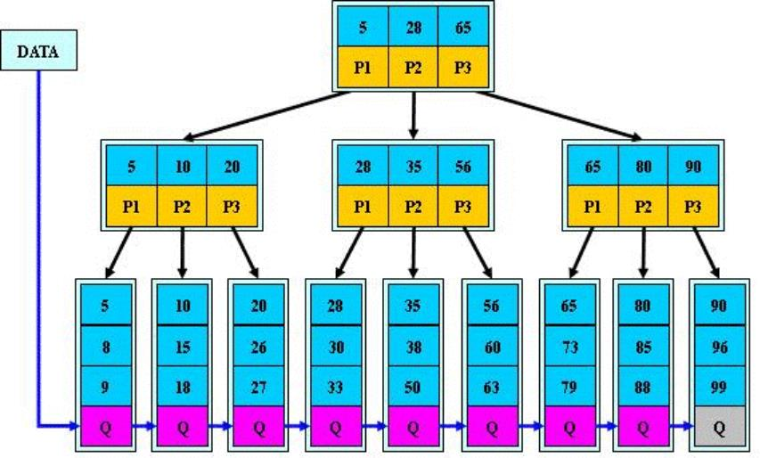
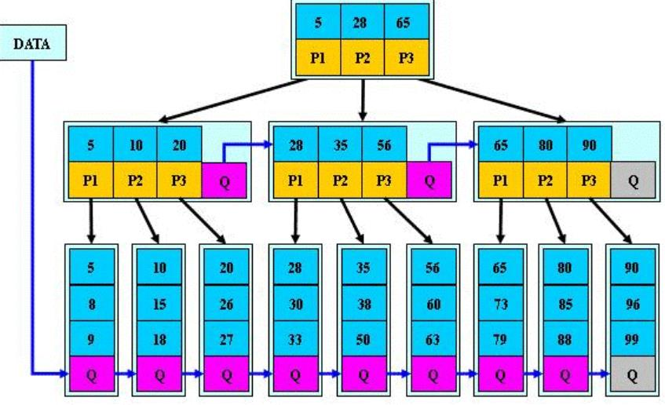

# 数据结构

> 作者: 潘深练
>
> 创建: 2022-06-07

## 一、数据结构概览

### 1.1、集合性能

Collection | Ordering | Random Access | Key-Value | Duplicate Elements | Null Element | Thread Safety 
----                 | ----  | ----  | ----  | ----  | ----  | ---- 
ArrayList            | ✔️ | ✔️ | ❌ | ✔️ | ✔️ | ❌ 
LinkedList           | ✔️ | ❌ | ❌ | ✔️ | ✔️ | ❌ 
HashSet              | ❌ | ❌ | ❌ | ❌ | ✔️ | ❌  
TreeSet              | ✔️ | ❌ | ❌ | ❌ | ❌ | ❌ 
HashMap              | ❌ | ✔️ | ✔️ | ❌ | ✔️ | ❌ 
TreeMap              | ✔️ | ✔️ | ✔️ | ❌ | ❌ | ❌ 
Vector               | ✔️ | ✔️ | ❌ | ✔️ | ✔️ | ✔️ 
HashTable            | ❌ | ✔️ | ✔️ | ❌ | ❌ | ✔️ 
Properties           | ❌ | ✔️ | ✔️ | ❌ | ❌ | ✔️ 
Stack                | ✔️ | ❌ | ❌ | ✔️ | ✔️ | ✔️ 
CopyOnWriteArrayList | ✔️ | ✔️ | ❌ | ✔️ | ✔️ | ✔️ 
ConcurrentHashMap    | ❌ | ✔️ | ✔️ | ❌ | ❌ | ✔️ 
CopyOnWriteArraySet  | ❌ | ❌ | ❌ | ❌ | ✔️ | ✔️ 

## 二、数据结构

### 2.1、线性表

#### 2.1.1、数组

#### 2.1.2、链表

#### 2.1.3、栈

#### 2.1.4、队列

### 2.2、散列表

#### 2.2.1、Hash

#### 2.2.2、位图

### 2.3、递归

### 2.4、二分查找

### 2.5、树

#### 树分类

- 二叉树
    - 满二叉树
    - 完全二叉树
    - 平衡二叉树
    - 平衡二叉查找树
        - AVL树
        - 红黑树
            - 左旋
            - 右旋
- 多路树
    - B树
    - B-树
    - B+树
    - B*树
    - 2-3树
    - 2-3-4树
- 堆
    - 小顶堆
    - 大顶堆
    - 优先级队列
    - 斐波那契堆
    - 二项堆
- 其他
    - 树状数组
    - 线段树

### 2.6、图

#### 2.6.1、有向图

#### 2.6.2、无向图

#### 2.6.3、带权图

#### 树概念

- 深度优先遍历
    - 概念
        - 所谓深度优先，顾名思义，就是偏向于纵深，“一头扎到底”的访问方式。
    - 实现
        - 前序遍历
            - 二叉树的前序遍历，输出顺序是根节点、左子树、右子树
        - 中序遍历
            - 二叉树的中序遍历，输出顺序是左子树、根节点、右子树
        - 后序遍历
            - 二叉树的后序遍历，输出顺序是左子树、右子树、根节点

- 广度优先遍历
    - 概念
        - 也叫层序遍历，顾名思义，就是二叉树按照从根节点到叶子节点的层次关系，一层一层横向遍历各个节点。
    - 实现
        - 二叉树同一层次的节点之间是没有直接关联的，利用队列可以实现

- 时间复杂度
    - 二叉查找树的插入和查找时间复杂度为:O(logn)
    - 极端情况下二叉查找树 **退化成链表**，时间复杂度为O(n)，所以需要平衡二叉查找树

- 应用
    - 非线性数据：菜单，组织结构、家谱等等
    - 线性数据：二叉查找树
    - 二叉查找树是有序的，我们只需要 **中序遍历**，就可以在 O(n) 的时间复杂度内，输出 **有序** 的数据序列。
    - 二叉查找树的性能非常稳定，扩容很方便(**链表实现**，数组扩容是很麻烦的一件事，而二叉查找树的扩容就特别快捷简单)

#### BTree

BTree 即二叉搜索树：

- 1、所有非叶子结点至多拥有两个儿子（Left和Right）；
- 2、所有结点存储一个关键字；
- 3、非叶子结点的左指针指向小于其关键字的子树，右指针指向大于其关键字的子树；

如：

B树的搜索，从根结点开始，如果查询的关键字与结点的关键字相等，那么就命中；否则，如果查询关键字比结点关键字小，就进入左儿子；如果比结点关键字大，就进入右儿子；如果左儿子或右儿子的指针为空，则报告找不到相应的关键字；

如果B树的所有非叶子结点的左右子树的结点数目均保持差不多（平衡），那么B树的搜索性能逼近二分查找；但它比连续内存空间的二分查找的优点是，改变B树结构（插入与删除结点）不需要移动大段的内存数据，甚至通常是常数开销；

如：

但B树在经过多次插入与删除后，有可能导致不同的结构：

右边也是一个B树，但它的搜索性能已经是线性的了；同样的关键字集合有可能导致不同的树结构索引；所以，使用B树还要考虑尽可能让B树保持左图的结构，和避免右图的结构，也就是所谓的“平衡”问题； 

实际使用的B树都是在原B树的基础上加上平衡算法，即“平衡二叉树”；如何保持B树结点分布均匀的平衡算法是平衡二叉树的关键；平衡算法是一种在B树中插入和删除结点的策略；

#### B-Tree

B-Tree 是一种多路搜索树（并不是二叉的）：

- 1、定义任意非叶子结点最多只有M个儿子；且M>2；
- 2、根结点的儿子数为[2, M]；
- 3、除根结点以外的非叶子结点的儿子数为[M/2, M]；
- 4、每个结点存放至少M/2-1（取上整）和至多M-1个关键字；（至少2个关键字）
- 5、非叶子结点的关键字个数=指向儿子的指针个数-1；
- 6、非叶子结点的关键字：K[1], K[2], …, K[M-1]；且K[i] < K[i+1]；
- 7、非叶子结点的指针：P[1], P[2], …, P[M]；其中P[1]指向关键字小于K[1]的子树，P[M]指向关键字大于K[M-1]的子树，其它P[i]指向关键字属于(K[i-1], K[i])的子树；
- 8、所有叶子结点位于同一层；

如：（M=3）

B-树的搜索，从根结点开始，对结点内的关键字（有序）序列进行二分查找，如果命中则结束，否则进入查询关键字所属范围的儿子结点；重复，直到所对应的儿子指针为空，或已经是叶子结点；

**B-树的特性：**

- 1、关键字集合分布在整颗树中；
- 2、任何一个关键字出现且只出现在一个结点中；
- 3、搜索有可能在非叶子结点结束；
- 4、其搜索性能等价于在关键字全集内做一次二分查找；
- 5、自动层次控制；

由于限制了除根结点以外的非叶子结点，至少含有M/2个儿子，确保了结点的至少利用率，其最底搜索性能为：

其中，M为设定的非叶子结点最多子树个数，N为关键字总数；

所以B-树的性能总是等价于二分查找（与M值无关），也就没有B树平衡的问题；

由于M/2的限制，在插入结点时，如果结点已满，需要将结点分裂为两个各占M/2的结点；删除结点时，需将两个不足M/2的兄弟结点合并；

#### B+Tree

B+树是B-树的变体，也是一种多路搜索树：

- 1、其定义基本与B-树同，除了：
- 2、非叶子结点的子树指针与关键字个数相同；
- 3、非叶子结点的子树指针P[i]，指向关键字值属于[K[i], K[i+1])的子树（B-树是开区间）；
- 4、为所有叶子结点增加一个链指针；
- 5、所有关键字都在叶子结点出现；

如：（M=3）

B+树的搜索与B-树也基本相同，区别是B+树只有达到叶子结点才命中（B-树可以在非叶子结点命中），其性能也等价于在关键字全集做一次二分查找；

**B+tree 的特性：**

- 1、所有关键字都出现在叶子结点的链表中（稠密索引），且链表中的关键字恰好是有序的；
- 2、不可能在非叶子结点命中；
- 3、非叶子结点相当于是叶子结点的索引（稀疏索引），叶子结点相当于是存储（关键字）数据的数据层；
- 4、更适合文件索引系统；

#### B*Tree

B*Tree是B+树的变体，在B+树的非根和非叶子结点再增加指向兄弟的指针；

B*树定义了非叶子结点关键字个数至少为(2/3)*M，即块的最低使用率为2/3（代替B+树的1/2）；

**B+树的分裂** ：当一个结点满时，分配一个新的结点，并将原结点中1/2的数据复制到新结点，最后在父结点中增加新结点的指针；B+树的分裂只影响原结点和父结点，而不会影响兄弟结点，所以它不需要指向兄弟的指针；

B*树的分裂 ：当一个结点满时，如果它的下一个兄弟结点未满，那么将一部分数据移到兄弟结点中，再在原结点插入关键字，最后修改父结点中兄弟结点的关键字（因为兄弟结点的关键字范围改变了）；如果兄弟也满了，则在原结点与兄弟结点之间增加新结点，并各复制1/3的数据到新结点，最后在父结点增加新结点的指针；

所以，B*树分配新结点的概率比B+树要低，空间使用率更高；

#### B树小结

**B树：** 二叉树，每个结点只存储一个关键字，等于则命中，小于走左结点，大于走右结点；

**B-树：** 多路搜索树，每个结点存储M/2到M个关键字，非叶子结点存储指向关键字范围的子结点。所有关键字在整颗树中出现，且只出现一次，非叶子结点可以命中；

**B+树：** 在B-树基础上，为叶子结点增加链表指针，所有关键字都在叶子结点中出现，非叶子结点作为叶子结点的索引；B+树总是到叶子结点才命中；

B*树： 在B+树基础上，为非叶子结点也增加链表指针，将结点的最低利用率从1/2提高到2/3；

### 2.8、图（在数据结构中体现）

## 三、应用场景

### 3.1、CopyOnWriteArrayList

首先了解 CopyonwriteArraylist 的一个诞生背景，主要由于 ArrayList 线程不安全（并发场景下的读写冲突问题），而 Vector 虽线程安全锁粒度却又太粗（synchronized），所以在 JDK8 的 JUC 出了个 CopyonwriteArraylist，既能保证线程安全又减小了锁粒度，提高读写性能，唯二不足的就是 copy-on-write 的通病：**占用内存**（写时拷贝副本）、**数据最终一致性**（写时volatile导致读不及时）。

分享了一些实际场景：

- hase etcd里面的数据多版本
- 多副本之间的数据拷贝和最终一致
- 业务数据不同客户读取到的不同数据
- 协同编辑
- linux进程的内存共享
- 业务数据和数据分析的星型模型
- more

CopyOnWriteArrayList(免锁容器)的好处之一是当多个迭代器同时遍历和修改这个列表时，不会抛出 ConcurrentModificationException。在 CopyOnWriteArrayList 中，写入将导致创建整个底层数组的副本，而源数组将保留在原地，使得复制的数组在被修改时，读取操作可以安全地执行。

1. 由于写操作的时候，需要拷贝数组，会消耗内存，如果原数组的内容比较多的情况下，可能导致 young gc 或者 full gc；
2. 不能用于实时读的场景，像拷贝数组、新增元素都需要时间，所以调用一个 set 操作后，读取到数据可能还是旧的,虽然 CopyOnWriteArrayList 能做到最终一致性,但是还是没法满足实时性要求。

CopyOnWriteArrayList 透露的思想：

1. 读写分离，读和写分开
2. 最终一致性
3. 使用另外开辟空间的思路，来解决并发冲突

## 四、QA

### 4.1、How to synchronize ArrayList in Java ?

- 1、Collections.synchronizedList() - method - returns synchronized list 在查询时需要显式使用同步块，例如 synchronized(list){ todo ...}.
- 2、copyOnWriteArrayList - class - Thread Safety variant of ArrayList.

