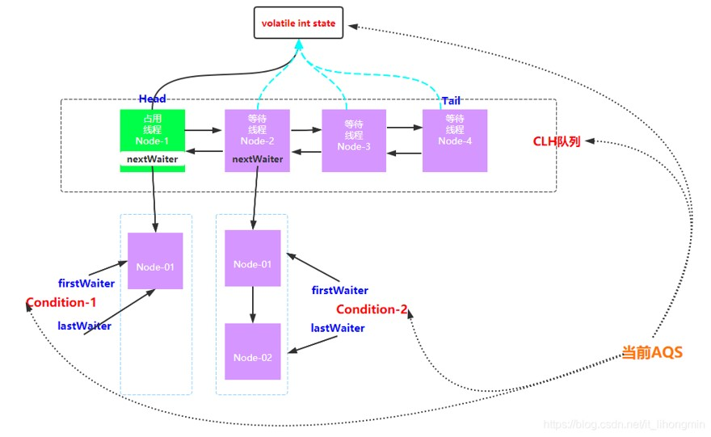

# 并发编程

> 作者: 潘深练
>
> 创建: 2022-04-18

## 一、并发编程高能推荐

- 👉 [知乎 - 《当我们在谈论并发的时候，我们在谈论什么》](https://www.zhihu.com/column/concurrent)

- 👉 [潘深练 - 《Java并发编程聚合文档》](http://concurrent-programming.panshenlian.com/#/zh-cn/00-Java-Concurrency-and-Multithreading-Tutorial)

- 👉 [微信公众号 - 《ThreadLocal夺命11连问》](https://mp.weixin.qq.com/s/xssF-ckUsXI7tY74zix-GQ)

## 二、JUC

以 JDK1.8 为例 JUC 下有两个子包 atomic 和 locks ，atmoic 中主要定义了一些原子操作的类，而 locks 中主要定义了基于 AQS（AbstractQueuedSynchronzer）实现的加锁机制。

### 2.1、AQS

AQS 是一个抽象类，其类中定义了一系列方法，而所有的方法都是通过对 state 变量进行原子从操作来进行锁的实现，其内维护了一个 **双向链表** 用作获取锁的队列。

AQS 定义两种资源共享方式：

- Exclusive（独占，只有一个线程能执行，如 ReentrantLock ）
- Share（共享，多个线程可同时执行，如 Semaphore/CountDownLatch ）。

安全性：

- volatile
- LockSupport(park/unpark)

考虑因素：

1. 队列种类
2. 资源数量
3. 是否阻塞

AQS 的基本架构和工具应用：

基于 AQS 实现的工具应用如：

- CountDownLatch
- CyclicBarrier
- Semaphore
- Executors
- Exchanger

不同的地方就在获取/释放资源的方式，如 `tryeAcquire - tryRelase`

### 2.2、atomic

JUC 中基本就是一个 atomic 包和一个 locks 包，而 atomic 包的基本使用如：

基本设计思路与挑战：

1. 分而治之 --> 合并的性能损耗
2. 减少锁粒度 CAS（乐观锁） --> 复杂度升高、冲突、ABA、长时间自旋可能导致 CPU 开销大、只能保证一个共享变量的原子操作...

### 2.3、Collections

JUC 包下还有其他关于原子操作的类/集合容器：

以 ConcurrentHashMap 为例，当对其进行 put 时，如果未发生 hash 冲突都是采用 CAS 方式实现线程安全的，如果发生冲突需要采用 synchronized 进行加锁处理。

基本设计思路与挑战：

1. 分而治之 --> 合并的性能损耗
2. 减少锁粒度 CAS（乐观锁） --> 复杂度升高、冲突、ABA、长时间自旋可能导致 CPU 开销大、只能保证一个共享变量的原子操作...
3. 读写分离 --> 空间问题

读写分离如：

### 2.4、JUC 优化方案一：不可变

#### 不可变特点

- 不可变形式是安全的；
- 不可变对象被多个线程调用时，不存在竞态条件问题
- 不可变集合不需要考虑变化，因此可以节省时间和空间。

> 所有不可变的集合都比它们的可变形式有更好的内存利用率

| 可变集合接口 | 属于JDK还是Guava | 不可变版本           |
| ------------ | --------------- | ------------------- |
| Collection   | JDK             | ImmutableCollection |
| List         | JDK             | ImmutableList       |
| Set          | JDK             | ImmutableSet        |
| SortedSet    | JDK             | ImmutableSortedSet  |
| NavigableSet | JDK             | ImmutableSortedSet  |
| Map          | JDK             | ImmutableMap        |
| SortedMap    | JDK             | ImmutableSortedMap  |
| Multiset           | Guava           | ImmutableMultiset             |
| SortedMultiset     | Guava           | ImmutableSortedMultiset       |
| Multimap           | Guava           | ImmutableMultimap             |
| ListMultimap       | Guava           | ImmutableListMultimap         |
| SetMultimap        | Guava           | ImmutableSetMultimap          |
| BiMap              | Guava           | ImmutableBiMap                |
| ClassToInstanceMap | Guava           | ImmutableClassToInstanceMap   |
| Table              | Guava           | ImmutableTable                |

**不可变的实现办法也很简单粗暴**，例如调用 `put()` 方法，直接就 `throw new UnsupportedOperationException`

#### 可变 VS 不可变（有何优势）

可以清晰看出，不可变的 ImmutableMap 与 可变的 ConcurrentHashMap 相比：

- 不需要多余的方案，例如扩容方案，例如不需要加解锁等
- 不需要多余的结构，例如复制时的其他数据结构来临时支持等；
- 不需要多余的辅助类，例如类加载时就不需要各种乱七八糟辅助的内部类等。

### 2.5、JUC 优化方案二：环形数组队列（内存重用）

正常的队列：

环形队设计列示意：

理论上仅仅是队尾指向对头

使用环形数组队列的优势：

- 可以为数组 **预先分配内存**，使得数组对象一直存在（除非程序终止）。这就意味着不需要花大量的时间用于垃圾回收。
- 此外，不像链表那样，需要为每一个添加到其上面的对象 **创造节点对象**；并且当删除节点时，需要执行相应的内存清理操作。

### 2.6、JUC 优化方案三：伪共享（防止缓存失效）

所谓 **伪共享**，主要是由于操作系统的内存优化分配策略，作为做小单位的 **缓存行** 中，一般会存放多个不相干的线程的缓存数据。如果其中某个线程的缓存数据遭到更新，会影响到整个 **缓存行** 中的数据。

例如：

- 在核心1上运行的线程想更新变量X，
- 同时核心2上的线程想要更新变量Y。

不幸的是，这两个变量在同一个缓存行中。每个线程都要去竞争缓存行的所有权来更新变量。如果核心1获得了所有权，缓存子系统将会使核心2中对应的缓存行失效。当核心2获得了所有权然后执行更新操作，核心1就要使自己对应的缓存行失效。

所以设计上可以 **膨胀** 自己的数据结构（让自己的数据独占一个数据缓存行），例如以上 `ConcurrentCircularArrayQueueL0Pad` 

### 2.7、JUC 核心设计

并发编程中的 **活性**，基本涉及两块：

- GC
- JUC

而其实我们也可以把 GC 看成是并发容器中的一种，只不过 GC 管理的是 Java 当中的 JVM 堆内存，它是一个广义层面的并发容器，它和 JUC 里面的这一系列东西都可以归为一类，都当做 **并发容器**。

基本并发容器的目标是一样的，如何保证对象存储的安全性，并且保障其活性。

- **安全性**，基本使用三个关键语法来保证：volatile 、synchronized、locksupport。
- **活性**，则如下图分析，基本围绕任务规模、执行效率、冲突来分析优化。
    - 任务规模：例如 GC 中扫描对象的大小，而 JUC 中 ConcurrentHashMap 中分段执行的大小，另外就不要执行多余的操作，例如伪共享等。
    - 执行效率：例如在执行过程中数据结构是不是使用得当，是否使用符合读写特性的数据结构，多方执行者是不是拥有合理的协作效率（或算法）。
    - 冲突：执行者之间有冲突，如何缓解？

## 三、QA

### 3.1、应用容器的线程池，不想自己主动 remove 维护，容器会自动回收吗

- 首先回答：不会。由于：
    - 业务层面把线程变量存储到 Threadlocal 中 （实质是在 ThreadLocalMap），ThreadLocal 只是作为 key ，并且 ThreadLocalMap 中的 key 为 Threadlocal 的弱引用，当一个对象只存在弱引用时，key 会在下一次 GC 的时候被清除掉。
    - 
    - 但是，ThreadLocalMap 对应的 value 是强引用，不会被 gc 清理，这样一来就会导致内存泄露。
    - 所以需要在代码中主动进行 remove 清除，避免：
        - A. 由于ThreadLocalMap.Entry的Value没及时remove，导致的内存堆积、甚至泄露；
        - B. 由于线程池场景下线程复用，导致不同客户端情况出现数据脏读；
    - 参考文章：[《CSDN - ThreadLocal:内存泄漏问题及Java的对应处理办法》](https://blog.csdn.net/cold___play/article/details/105936714)
 