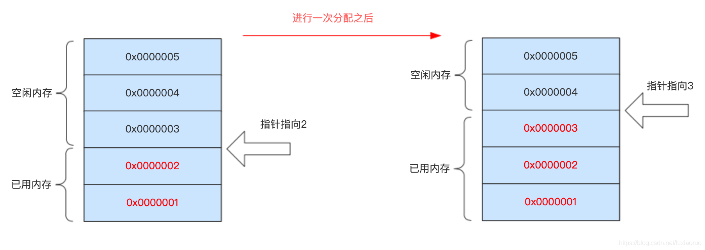
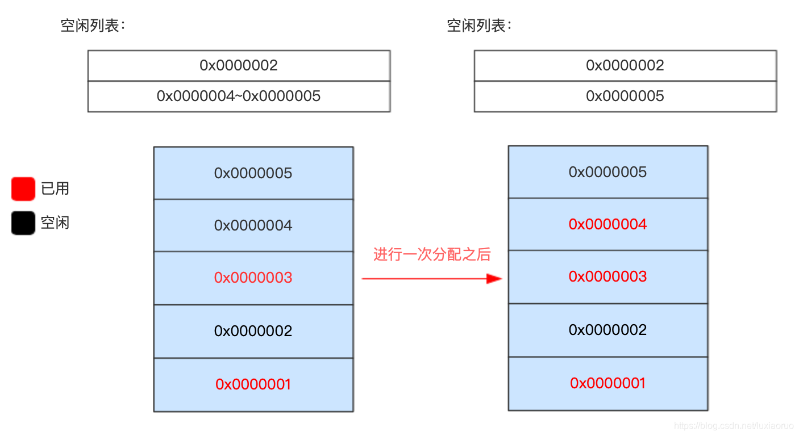

# JVM虚拟机

> 作者: 潘深练
>
> 创建: 2022-04-18

## 文档 

[走近JVM](http://jvm.panshenlian.com/#/zh-cn/02-jvm)

## QA

### 1、JVM 日志错误一般核查办法？

- 直接获取答案：百度、谷歌、咨询系统原有维护人员
- 观察监控异常：从机器维度，jvm 维度，接口流量、程序日志维度。对比近期出现的波动
- 对比正常应用机器：拿异常机器和正常机器做对比，差异点就有可能导致问题的原因
- 分析最近的出现的各类变更，包括代码、配置、上线记录、人工操作等

### 2、Java堆常用的分配方法（Java内存管理机制）？

 Java堆是被所有线程共享的一块内存区域，主要用于存放对象实例，在堆上为对象分配内存就是把一块大小确定的内存从堆内存中划分出来，将对象放进去。常用的分配方法有指针碰撞和空闲列表两种实现方式。

 - **指针碰撞**
    - 适用于 **堆内存完整** 的情况，已分配的内存和空闲内存分表在不同的一侧，通过一个指针指向分界点，当需要分配内存时，把指针往空闲的一端移动与对象大小相等的距离即可，用于 **Serial** 和 **ParNew** 等不会产生内存碎片的垃圾收集器。
    - 
- **空闲列表**
    - 适用于 **堆内存不完整** 的情况，已分配的内存和空闲内存相互交错，JVM 通过维护一张内存列表记录可用的内存块信息，当分配内存时，从列表中找到一个足够大的内存块分配给对象实例，并更新列表上的记录，最常见的使用此方案的垃圾收集器就是 **CMS**。
    - 
