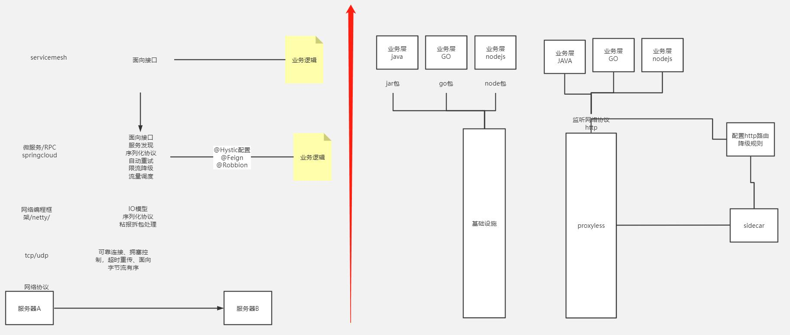
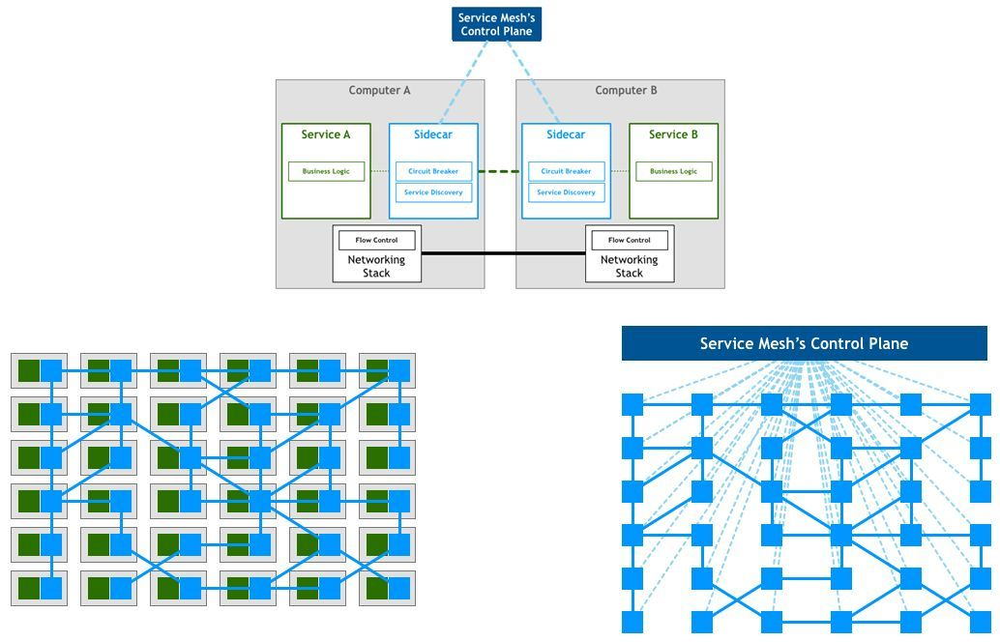

# 架构演化

> 作者: 潘深练
>
> 创建: 2022-04-18
>
> 版权声明：自由转载-非商用-非衍生-保持署名（[创意共享3.0许可证](https://creativecommons.org/licenses/by-nc-nd/3.0/deed.zh)）

## 从单体架构到分布式架构

<iframe id="embed_dom" name="embed_dom" frameborder="0" 
style="display:block;width:100%; height:500px;" 
src="https://www.processon.com/embed/6241bb731e08530789365fca">脑图加载中...</iframe>

点击 [新窗口](https://www.processon.com/view/link/62466e911e085307894295f8) 浏览

## 架构演化总览

<iframe id="embed_dom" name="embed_dom" frameborder="0" 
style="display:block;width:100%; height:500px;" 
src="https://www.processon.com/embed/624521491e085307893ef6f5"></iframe>

点击 [新窗口](https://www.processon.com/view/link/6245222b07912907096b3dd1) 浏览

## 一、单机场景

### 1、特征

应用程序、数据库、文件都在一个服务器上

### 2、挑战

随着网站业务的发展，一台服务器逐渐不能满足需求：性能越来越差，存储空间不足。

## 二、数据与应用分离场景

### 1、特征

#### 应用服务器

- 处理大量的业务
- 需要更快更强的CPU

#### 数据库服务器

- 需要快速磁盘检索和数据缓存
- 需要更快的硬盘和更大的内存

#### 文件服务器

- 要存大量的用户上传文件
- 需要更大的硬盘

## 三、缓存场景

### 1、特征

#### 二八定律

80%的业务访问集中在20%的数据上。所以如果把这一小部分数据缓存在内存中，可以减少数据库的访问压力，提高整个网站的数据访问速度，改善数据库的写入性能。

#### 类型

网站使用的缓存可以分为两种：

- 缓存在应用服务器上的 **本地缓存**
- 缓存在专门的分布缓存服务器上的 **远程缓存**

**本地缓存** 的访问快一些，但受应用服务器内存限制，缓存数据量有限，**远程分布式缓存** 可以使用集群的方式，部署大内存的服务器作为专门的缓存服务器，理论上做到不受内存容量的限制的缓存服务。

## 四、应用集群场景

### 1、诞生背景

使用缓存场景后，数据访问压力得到有效的缓解，但是单一应用服务器能够处理的请求连接有限，在网站高峰期，应用服务器成为整个网站的瓶颈。

## 五、数据库读写分离场景

### 1、诞生背景

网站在使用缓存后，使绝大部分数据操作访问都可以不通过数据库就能完成，但是仍有一部分读操作（缓存访问不命中，缓存过期）和全部的写操作需要访问数据库，在网站的用户达到一定规模后，数据库因为负载压力过高而成为网站的瓶颈。

## 六、CDN 场景

### 1、诞生背景

随着网站业务不断发展，用户规模越来越大，由于中国复杂的网络环境，不同地区的用户访问网站时，速度差别也极大，为了提供更好的用户体验，留住用户，网站需要加速网站访问速度，主要手段有使用CDN的反向代理。

## 七、NOSQL 场景

### 1、诞生背景

随着网站业务越来越复杂，对数据存储和检索的需求也越来越复杂，网站需要采用一些非关系数据库技术如NoSQL和非数据库查询技术如搜索引擎。

## 八、业务拆分场景

### 1、诞生背景

大型网站为了应对日益复杂的业务场景，通过使用分而治之的手段将整个网站业务分成不同的产品线，如大型购物网站就会将首页、商铺、订单、买家、卖家等拆分成不同的产品项，分归不同的业务团队负责。

## 九、分布式微服务场景

### 1、诞生背景

每一个应用都要执行许多相同的业务操作，比如用户管理、商品管理等，那么可以将这些共用的业务提取出来，独立部署。

## 十、MeshService

- [下一代的微服务架构基础是ServiceMesh？](https://www.sohu.com/a/271138706_355140)

## 十一、增长带来的架构场景演化

### 1、增长

- 访问量增长
- 数据量增长
- 用户量增长
- 业务复杂度增长
- 使用场景增长
- 数据类型增长
- 集群规模增长
- 团队协作人数增长
- 更多维度的增长

业务的不断发展带来多维度增长，导致形成更大规模的资源共享，迫使架构演化升级。

