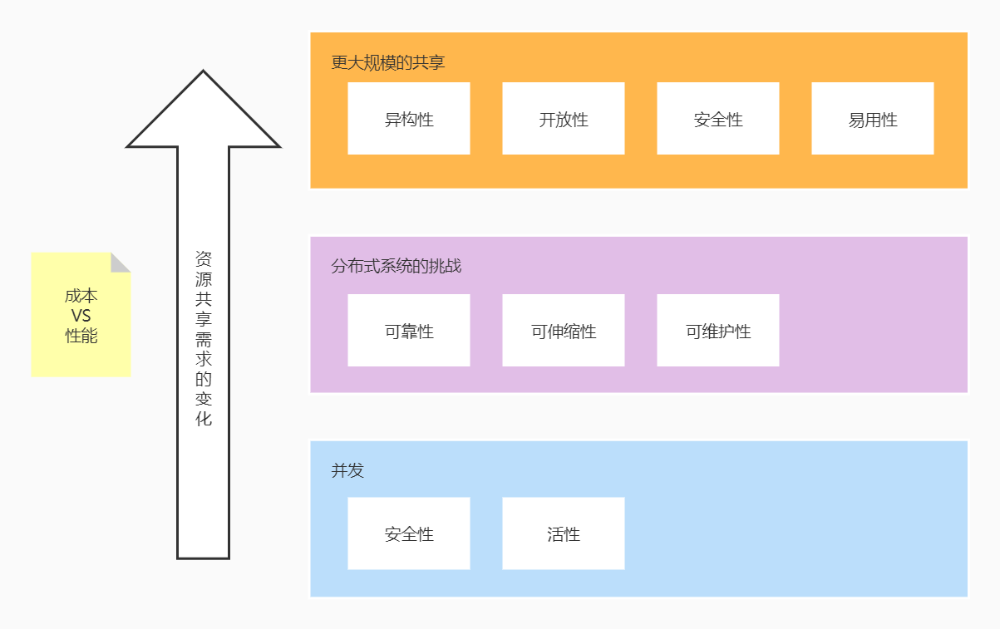

# 架构目标

> 作者: 潘深练
>
> 创建: 2022-04-18
>
> 版权声明：自由转载-非商用-非衍生-保持署名（[创意共享3.0许可证](https://creativecommons.org/licenses/by-nc-nd/3.0/deed.zh)）

## 架构设计目标

## 一、并发保障

### 1.1、安全性

#### 可见性

#### 有序性

#### 原子性

### 1.2、活性

#### 影响因素

- 资源冲突阻塞
- 上下文切换
- CPU浪费
- 重复计算
- 数据结构
- 复杂的任务操作

#### 解决手段

- 场景分离
- 数据分区
- 异步
- 并行
- 合理的数据结构

## 二、分布式挑战

### 2.1、可靠性

> 可靠性意味着即使发生故障，系统也可以正常工作。故障包括硬件（通常是随机的，不相关的）、软件（缺陷通常是系统的，更加难以处理）以及人为（总是很难避免是不是会出错）方面。容错技术可以很好地隐藏某种类型故障，避免影响最终用户。

#### 可靠性的挑战

- 软件错误
- 硬件故障
- 人为错误
- 缺乏全局时钟
- 并发挑战（并发是架构设计基石）
- 网络故障（拜占庭故障） 

每个人脑子里都有一个直观的认识，即什么意味着可靠或不可靠。对于软件，典型的期望包括：

- 应用程序执行用户所期望的功能
- 可以容忍用户出现错误或者不正确的软件使用方法
- 性能可以应对典型场景、合理负载压力和数据量
- 系统可防止任何未经授权的访问和滥用。

如果所有上诉目标都要支持才算 “正常工作”，那么我们可以认为可靠性大致意味着：

“即使发生了某些错误，系统仍可以继续正常工作”。

可能出错的事情称为错误（faults）或故障，系统可应对错误则称为容错（fault-tolerant）或者弹性（resilient）。

> 注意，故障与失效（failure）不完全一致。故障通常被定义为组件偏离其正常规格，而失效意味系统作为一个整体停止，无法向用户提供所需的服务。我们不太可能将故障降低到零，因此通常设计容错机制来避免从故障引发系统失效。

#### 应对方案

- 故障模型
- 故障检测
- 故障恢复

### 2.2、可伸缩性（可扩展性）

> 可扩展性是指负载增加时，有效保持系统性能的相关技术策略。为了讨论可扩展性，我们探讨如何定量描述负载和性能，例如依据响应时间百分位数作为衡量性能的有效方式。对于可扩展的系统，增加处理能力的同时，还可以在高负载情况下持续保持系统的高可用。

#### 可伸缩性的挑战

- 弹性 （`自动检测负载增加，自动计算升级分配资源，或手动扩展`）
- 纵向扩展 （`升级到更强大的机器`）
- 水平扩展 （`即将负载分布到多个更小的机器`）

可扩展性是用来描述 **应对负载增加能力** 的术语。

- 描述负载
    - 首先，我们需要简洁地 **描述系统当前的负载**，只有这样才能更好地讨论后续增长问题（例如负载加倍会意味着什么）。负载可以用称为负载参数的若干数字来描述。参数的最佳选择取决于系统的体系结构，它可能是 Web 服务器的每秒请求处理次数，数据库中的写入比例，聊天室的同时活动用户数量，缓存命中率等。

- 描述性能
    - 描述系统负载之后，接下来 **设想如果负载增加将会发生什么**。有两种考虑方式：
        1. 负载增加，但系统资源（如 CPU、内存、网络宽带等）保持不变，系统性能会发生什么变化？
        2. 负载增加，如果要保持性能不变，需要增加多少资源？
    - 这两个问题都会关注性能指标，所以我们先简要介绍一下如何描述系统性能
        - 在批处理系统如 Hadoop 中，我们通常关心 **吞吐量**（throughput），即每秒可处理的记录条数，或者在某指定数据集上运行作业所需的总时间；
        - 而在线系统通常更看重服务的 **响应时间**（response time），即客户端从发送请求到接收响应之间的间隔。
    - 在衡量性能指标时，例如一个响应时间指标，会由于其他变量因素而引入一些随机延迟抖动，这些因素包括
        - 上下文切换和进程调度
        - 网络数据包丢失和 TCP 重传
        - 垃圾回收暂停
        - 缺页中断和磁盘 I/O
        - 甚至服务器机架的机械振动
    - 因此，使用平均术语
        - 百分位数（percentiles），通常采用较高的响应时间百分位数（tail latencies，尾部延迟或长尾效应），因为他们直接影响用户的总体服务体验
            - 常见的百分位数如第 95、99、99.9（缩写为 p95、p99、p99.9）值
            - 作为典型的响应时间阈值，他们分别表示有 95%、99% 或 99.9% 的请求响应时间快于阈值。
            - 例如，如果 95 百分位数响应时间为 1.5s，这意味着 100 个请求中的 95 个请求快于 1.5s，而 5 个请求则需要 1.5s 或更长时间。
        - 中位数（median）

#### 应对方案

- 数据模型
- IO 模型
- 算法设计

### 2.3、可维护性

> 可维护性则意味着许多方面，但究其本质是为了让工程和运营团队更为轻松。良好的抽象可以帮助降低复杂性，并使系统更易于修改和适配新场景。良好的可操作性意味着对系统健康状况有良好的可观测性和有效的管理方法。

#### 可维护性的挑战

- 可观测
- 可操作
- 简单易用
- 可演化性

众所周知，软件的大部分成本并不在最初的开发阶段，而是在于整个生命周期内持续的投入，这包括维护与缺陷修复，监控系统来保持正常运行、故障排查、适配新平台、搭配新场景、技术缺陷的完善以及增加新功能等。

不幸的是，许多从业人员根本不喜欢维护这些所谓的遗留系统，例如修复他人埋下的错误，或者使用过时的开发平台，或者被迫做不喜欢的工作。坦白说，每一个遗留系统总有其过期的理由，所以很难给出一个通用的建议该如何处理他们。

但是，换个角度，我们可以从软件设计时开始考虑，尽可能较小维护期间的麻烦，甚至避免造成容易过期的系统。为此我们将特别关注软件系统的三个设计原则：

- 可运维性（包含可观测与可操作等）
    - 方便运营团队来保持系统平稳运行
- 简单性
    - 简化系统复杂性，使新工程师能够轻松理解系统。注意这与用户界面的简单性并不一样。
    - 消除意外复杂性最好手段之一是抽象。一个好的设计抽象可以隐藏大量的实现细节，并对外提供干净、易懂的接口。一个好的设计抽象可用于各种不同的应用程序。这样，复用远比多次重复实现更加有效率；另一方面，也带来更高质量的软件，而质量过硬的抽象组件所带来的好处，可以是运行其上的所有应用轻松获益。
- 可演化性
    - 后续工程师能够轻松地对系统进行改进，并根据需求变化将其适配到非典型场景，也称为可延伸性、易修改性或可塑性。
    - 一成不变的系统需求几乎没有，想法和目标经常在不断变化：适配新的外部环境，新的用例，业务优先级的变化，用户要求的新功能，新平台取代旧平台，法律监管要求的变化，业务增长促使架构的演变等.
    - 在组织流程方面，敏捷开发模式为适应变化提供了很好的参考。敏捷社区还发布了很多技术工具和模式，以帮助在频繁变化的环境中开发软件，例如测试驱动开发（TDD）和重构。

#### 应对方案

- 日志监控
- 确定性操作
- 设计模式-抽象、复用、解耦

## 三、设计方案

### 3.1、挑战

> 大规模的资源共享带来更多的挑战

- 异构性
- 开放性
- 安全性
- 易用性
- 服务质量 SLA
- 等等

### 3.2、方案

- [得物技术 - 《浅谈系统稳定性与高可用保障的几种思路》](https://mp.weixin.qq.com/s/-4JrbkutRdFB2-RyrBzSeg)

### 3.3、架构设计详解

- [架构设计目的、流程、原则、实践](https://www.processon.com/view/link/6353fa201e08537e2de88bd7?pw=LGSJ#map)