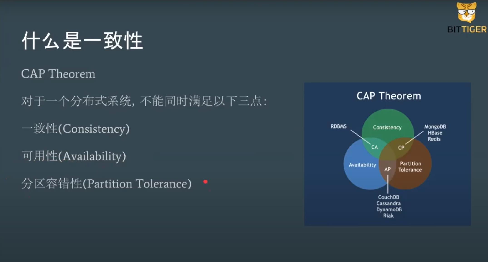
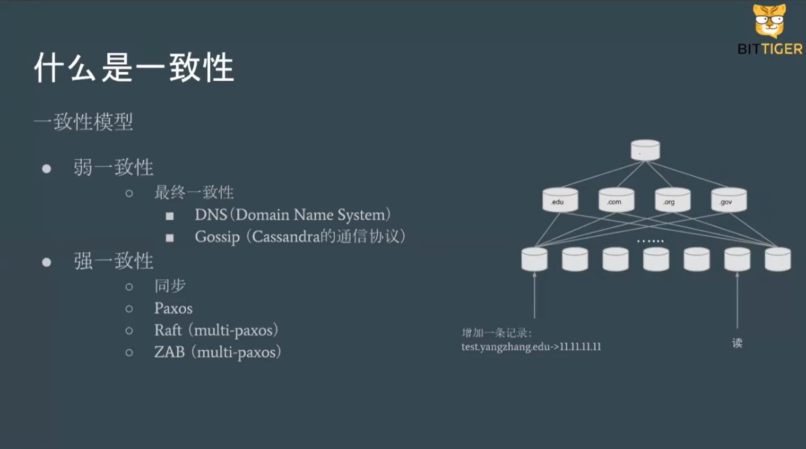
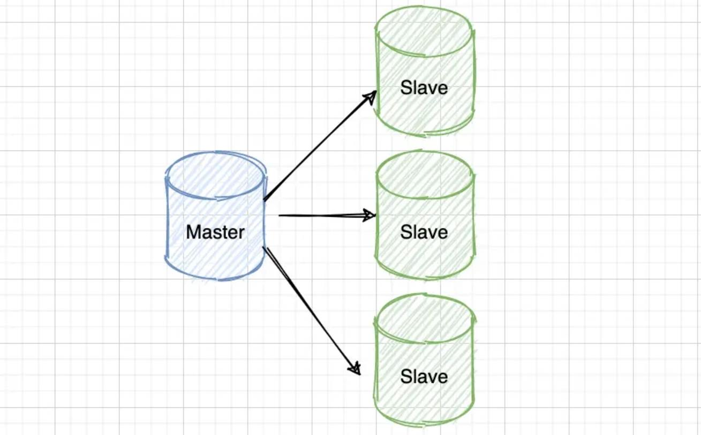
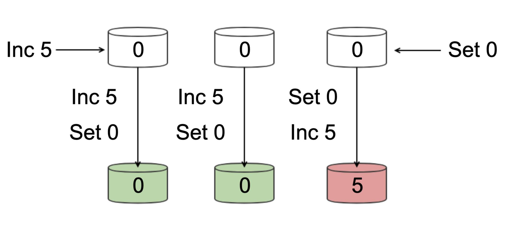

# 共识算法

> 作者: 潘深练
>
> 创建: 2022-05-12

## 一、什么是一致性

### CAP

对于一个分布式系统，不能同时满足一下三点：

- 一致性（Consistency）
- 可用性（Availability）
- 分区容错性（Partition Tolerance）

### 一致性模型

#### 弱一致性

- 最终一致性
    - DNS (Domain Name System)
    - Gossip (Cassandra 的通信协议)

#### 强一致性

- 同步
- Paxos
- Raft (multi-paxos)
- ZAB (multi-paxos)

### 明确问题

强一致性解决什么问题？

- **数据不能存在单点上**。分布式系统对容错（fault tolorence）的一般解决方案是状态机复制（state machine replication），所以主要针对状态机复制（state machine replication）讨论应用之上的共识（consensus）算法。**需要注意的是**， paxos 其实是一个共识算法，系统的最终一致性，不仅需要达成共识，**还会取决于 client 的行为**。

### 有哪些强一致算法？

#### 主从同步复制

基本想法

1. Master接收写请求
2. Master复制日志至slave
3. Master等待，直到**所有**从库返回

问题

1. 一个节点失败，Master阻塞，导致整个集群不可用，保证了一致性，**可用性**却大大降低。

#### 多数派

基本想法

- **每次写**都保证写入大于 N/2 个节点，**每次读**保证都从大于 N/2 个节点中读。

问题

- 在并发环境下，多数派无法保证系统正确性，顺序非常重要。

#### Paxos

**背景**

Lesile Lamport， Latex的发明者。

分布式系统中的节点通信存在两种模型：**共享内存**（Shared memory） 和 **消息传递**（Messages passing）。基于消息传递通信模型的分布式系统，不可避免的会发生以下错误：进程可能会慢、被杀死或者重启，消息可能会延迟、丢失、重复。在最普通的 Paxos 场景中，先不考虑可能出现「消息篡改」（即拜占庭错误的情况）。Paxos 算法解决的问题是在一个可能发生前述异常（即排除消息篡改之外的其他任何异常）的分布式系统中，如何对某个值的看法相同，保证无论发生以上任何异常，都不会破坏决议的共识机制。

一个典型的场景是，在一个分布式数据库系统中，如果各节点的初始状态一致，每个节点都执行相同的操作序列，那么他们最后能得到一个一致的状态。为保证每个节点执行相同的命令序列，需要在每一条指令上执行一个「共识算法」以保证每个节点看到的指令一致。一个通用的共识算法可以应用在许多场景中，是分布式计算中的重要问题。因此从20世纪80年代起对于共识算法的研究就没有停止过。

为描述Paxos算法，Lamport虚拟了一个叫做Paxos的希腊城邦，这个岛按照议会民主制的政治模式制订法律，但是没有人愿意将自己的全部时间和精力放在这种事情上。所以无论是议员，议长或者传递纸条的服务员都不能承诺别人需要时一定会出现，也无法承诺批准决议或者传递消息的时间。（故障模型）

但是这里假设没有拜占庭将军问题（Byzantine failure，即虽然有可能一个消息被传递了两次，但是绝对不会出现 **错误的消息**）；只要等待足够的时间，消息就会被传到。另外，Paxos岛上的议员是 **不会反对** 其他议员提出的决议的。

对应于分布式系统，议员对应于各个节点，制定的法律对应于系统的状态。各个节点需要进入一个一致的状态，例如在独立Cache的对称多处理器系统中，各个处理器读内存的某个字节时，必须读到同样的一个值，否则系统就违背了一致性的要求。一致性要求对应于法律条文只能有一个版本。议员和服务员的不确定性对应于节点和消息传递通道的不可靠性。

Lamport 的论文中基本提到三种 Paxos：

- Basic Paxos
- Multi Paxos
- Fast Paxos

Basic Paxos 角色介绍

- Client : 民众（客户端）。服务系统外部角色，请求发起者。
- Propser : 提出提案。接收 Client 请求并向集群节点提出提案（propose），提案信息包括提案编号和提议的 value，并在冲突发生时，起到冲突调节作用。
- Accpetor(Voter) : acceptor 收到提案后可以接受（accept）提案，若提案获得多数派（majority）的 acceptors 的接受，则称该提案被批准（chosen）。
- Learner :  只能「学习」被批准的提案。backup，备份，对集群一致性无影响，单纯记录。

> 在Leslie Lamport 之后发表的paper中将majority 替换为更通用的quorum 概念，但在描述classic paxos的论文  Paxos made simple（页面存档备份，存于互联网档案馆） 中使用的还是majority的概念。

Basic Paxos 存在的问题

- 难实现
- 效率低（2轮RPC:request > prepare > promise > accept! > accepted ）
- 活锁（liveness）或 dueling

因此出现 Multi Paxos 

- 新概念，Leader：唯一的proposer，所有请求都需经过此Leader。
- 可以理解为 proposer 竞选为 master , 而其余 acceptor 为 follower。
- multi paxos 减少了角色，进一步简化了流程（首次选主，后续直接accept!和accepted）

-- 内容参考[wiki:Paxos算法](https://zh.wikipedia.org/zh-hk/Paxos%E7%AE%97%E6%B3%95)

#### Raft

- 划分成三个子问题
    - Leader Election
    - Log Replication
    - Safety
- 重定义角色
    - Leader
    - Follower
    - Candidate
- 原理动画解释：http://thesecretlivesofdata.com/raft/
- 场景测试：https://raft.github.io/

## 二、 延伸

### Quorum机制

### Lease机制

### NWR协议

## 三、概念

### 主观下线

### 哨兵的选举

## 四、实践

### Zookeeper

### etcd

## 参考阅读

1、[The Part-Time Parliament](https://lamport.azurewebsites.net/pubs/lamport-paxos.pdf) Lamport in 1990.
2、[Paxos Made Simple](https://lamport.azurewebsites.net/pubs/paxos-simple.pdf) Lamport in 2001.
3、[Lamport about paxos](http://lamport.azurewebsites.net/pubs/pubs.html#lamport-paxos)
4、[Paxos Made Moderately Complex](https://paxos.systems/)
5、[In Search of an Understandable Consensus Algorithm](https://web.stanford.edu/~ouster/cgi-bin/papers/raft-atc14)
6、[Paxos intro in《凤凰架构》](http://icyfenix.cn/distribution/consensus/paxos.html)
7、[Implementing Replicated Logs with Paxos](https://ongardie.net/static/raft/userstudy/paxos.pdf)
8、[Zookeeper：分布式系统入门到实战](https://www.youtube.com/watch?v=BhosKsE8up8)（Youtube）
