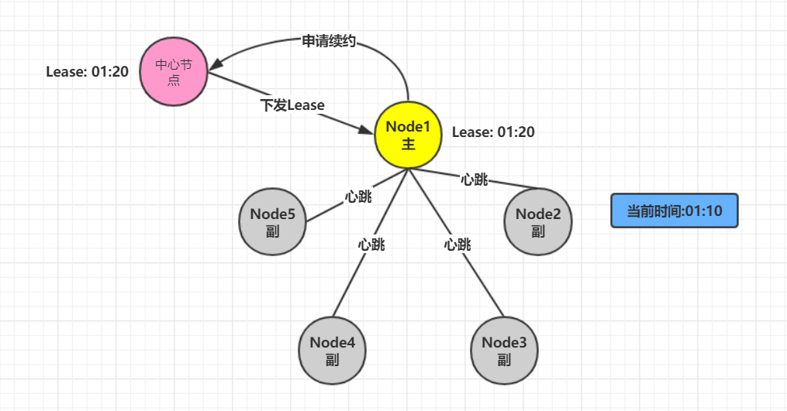

# 共识算法

> 作者: 潘深练
>
> 创建: 2022-06-04

## 一、什么是一致性

### 1.1、CAP理论

对于一个分布式系统，不能同时满足一下三点：

- 一致性（Consistency）
- 可用性（Availability）
- 分区容错性（Partition Tolerance）

### 1.2、BASE理论

CAP 不可能同时满足，而分区容错性是对于分布式系统而言，是必须的。如果系统能够同时实现 CAP 是再好不过的了，所以出现了 BASE 理论，

BASE：全称：Basically Available(基本可用)，Soft state（软状态）,和 Eventually consistent（最终一致性）三个短语的缩写 ,Base 理论是对 CAP 中一致性和可用性权衡的结果，其来源于对大型互联网分布式实践的总结，是基于 CAP 定理逐步演化而来的。其核心思想是： 

**“既是无法做到强一致性（Strongconsistency），但每个应用都可以根据自身的业务特点，采用适当的方式来使系统达到最终一致性（Eventualconsistency）”。**

#### Basically Available(基本可用)

- 什么是基本可用呢？假设系统，出现了不可预知的故障，但还是能用，相比较正常的系统而言：
    - 响应时间上的损失：正常情况下的搜索引擎 0.5 秒即返回给用户结果，而基本可用的搜索引擎可以在 1 秒返回结果。
    - 功能上的损失：在一个电商网站上，正常情况下，用户可以顺利完成每一笔订单，但是到了大促期间，为了保护购物系统的稳定性，部分消费者可能会被引导到一个降级页

#### Soft state（软状态）

- 什么是软状态呢？相对于原子性而言，要求多个节点的数据副本都是一致的，这是一种 “硬状态”。软状态指的是：允许系统中的数据存在中间状态，并认为该状态不会影响系统的整体可用性，即允许系统在多个不同节点的数据副本存在数据延时。

#### Eventually consistent（最终一致性）

- 上面说软状态，然后不可能一直是软状态，必须有个时间期限。在期限过后，应当保证所有副本保持数据一致性。从而达到数据的最终一致性。这个时间期限取决于网络延时，系统负载，数据复制方案设计等等因素。

### 1.3、一致性模型

#### 弱一致性

- 最终一致性
    - DNS (Domain Name System)
    - Gossip (Cassandra 的通信协议)

#### 强一致性

- 同步
- Paxos
- Raft (multi-paxos)
- ZAB (multi-paxos)

### 1.4、明确问题

强一致性解决什么问题？

- **数据不能存在单点上**。分布式系统对容错（fault tolorence）的一般解决方案是状态机复制（state machine replication），所以主要针对状态机复制（state machine replication）讨论应用之上的共识（consensus）算法。**需要注意的是**， paxos 其实是一个共识算法，系统的最终一致性，不仅需要达成共识，**还会取决于 client 的行为**。

分布式数据一致性，指的是数据在多份副本中存储时，各副本中的数据是一致的。因此，对于分布式一致性的理解，本质是了解其：

> 状态机复制的共识算法！

> 状态机复制的共识算法！

> 状态机复制的共识算法！

### 1.5、有哪些强一致算法

#### 1）、强一致算法 ———— 主从同步复制

- 基本思路
    - Master接收写请求
    - Master复制日志至slave
    - Master等待，直到所有从库返回

- 存在问题
    - 一个节点失败，**Master阻塞**，就会导致整个集群不可用，所以主从同步复制虽然保证了一致性，但是 **可用性** 却大大降低。

#### 2）、强一致算法 ———— 多数派

- 基本思路
    - **每次写** 都保证写入大于 N/2 个节点，**每次读** 保证都从大于 N/2 个节点中读。

- 存在问题
    - 在并发环境下，多数派无法保证系统正确性，顺序非常重要（所有节点的先后执行顺序可能不同导致最终结果不一致）。

> 所以以上的两种强一致的算法中，第一个主从同步复制，存在可用性问题（由于节点故障）；第二个多数派，会存在正确性问题（由于并发顺序）。

#### 3）、强一致算法 ———— Paxos

分布式系统中的节点通信存在两种模型：

- **共享内存**（Shared memory） 
- **消息传递**（Messages passing）

基于消息传递通信模型的分布式系统，不可避免的会发生以下错误：进程可能会慢、被杀死或者重启，消息可能会延迟、丢失、重复。在最普通的 Paxos 场景中，先不考虑可能出现「消息篡改」（即拜占庭错误的情况）。Paxos 算法解决的问题是在一个可能发生前述异常（即排除消息篡改之外的其他任何异常）的分布式系统中，如何对某个值的看法相同，**保证无论发生以上任何异常，都不会破坏决议的共识机制**。

一个典型的场景是，在一个分布式数据库系统中，如果各节点的初始状态一致，每个节点都执行相同的操作序列，那么他们最后能得到一个一致的状态。为保证每个节点执行相同的命令序列，需要在每一条指令上执行一个「共识算法」以保证每个节点看到的指令一致。一个通用的共识算法可以应用在许多场景中，是分布式计算中的重要问题。因此从20世纪80年代起对于共识算法的研究就没有停止过。

-- 内容参考[wiki:Paxos算法](https://zh.wikipedia.org/zh-hk/Paxos%E7%AE%97%E6%B3%95)

**Paxos 诞生背景**

Lesile Lamport， Latex的发明者。

Paxos 由 莱斯利·兰伯特(Leslie Lamport)于1998年在《The Part-Time Parliament》论文中首次公开，最初的描述使用希腊的一个小岛 Paxos，描述了 Paxos 小岛中通过决议的流程，并以此命名这个算法，但是这个描述理解起来比较有挑战性。后来在2001年，莱斯利·兰伯特重新发表了朴实的算法描述版本《Paxos Made Simple》

> Lamport虚拟了一个叫做Paxos的希腊城邦，这个岛按照议会民主制的政治模式制订法律，但是没有人愿意将自己的全部时间和精力放在这种事情上。所以无论是议员，议长或者传递纸条的服务员都不能承诺别人需要时一定会出现，也无法承诺批准决议或者传递消息的时间。（故障模型）

但是这里假设没有拜占庭将军问题（Byzantine failure，即虽然有可能一个消息被传递了两次，但是绝对不会出现 **错误的消息**）；只要等待足够的时间，消息就会被传到。另外，Paxos岛上的议员是 **不会反对** 其他议员提出的决议的。

对应于分布式系统，议员对应于各个节点，制定的法律对应于系统的状态。各个节点需要进入一个一致的状态，例如在独立Cache的对称多处理器系统中，各个处理器读内存的某个字节时，必须读到同样的一个值，否则系统就违背了一致性的要求。一致性要求对应于法律条文只能有一个版本。议员和服务员的不确定性对应于节点和消息传递通道的不可靠性。

自 Paxos 问世以来就持续垄断了分布式一致性算法，Paxos 这个名词几乎等同于分布式一致性。Google 的很多大型分布式系统都采用了 Paxos 算法来解决分布式一致性问题，如 Chubby、Megastore 以及 Spanner 等。开源的 ZooKeeper，以及 MySQL 5.7 推出的用来取代传统的主从复制的 MySQL Group
Replication 等纷纷采用 Paxos 算法解决分布式一致性问题。然而，Paxos 的最大特点就是难，不仅难以理解，更难以实现。

> Google Chubby 的作者 Mike Burrows 说过这个世界上只有一种一致性算法，那就是 Paxos，其它的算法都是残次品。

**Paxos 解决了什么问题**

在常见的分布式系统中，总会发生诸如机器宕机或网络异常（包括消息的延迟、丢失、重复、乱序，还有网络分区）等情况。Paxos 算法需要解决的问题就是如何在一个可能发生上述异常的分布式系统中，快速且正确地在集群内部对某个数据的值达成一致，并且保证不论发生以上任何异常，都不会破坏整个系统的一致性。

Lamport 的论文中基本提到三种 Paxos：

- Basic Paxos
- Multi Paxos
- Fast Paxos

具体落地有 Raft 协议（Multi Paxos）和 zookeeper 的 ZAB 协议（Multi Paxos）。

**Basic Paxos 角色介绍**

- Client : 民众（客户端）。服务系统外部角色，请求发起者。
- Propser : 提出提案。接收 Client 请求并向集群节点提出提案（propose），提案信息包括提案编号和提议的 value，并在冲突发生时，起到冲突调节作用。
- Accpetor(Voter) : acceptor 收到提案后可以接受（accept）提案，若提案获得多数派（majority）的 acceptors 的接受，则称该提案被批准（chosen）。
- Learner :  只能「学习」被批准的提案。backup，备份，对集群一致性无影响，单纯记录。

> 在 Leslie Lamport 之后发表的 paper 中将 majority （大多数）替换为更通用的 quorum（法定人数）概念，但在描述 classic paxos 的论文 Paxos made simple（页面存档备份，存于互联网档案馆） 中使用的还是 majority 的概念。

**Basci Paxos 步骤、阶段（phases）**

1. Phase 1-a: Prepare

    - proposer 提出了一个提案，编号为 N ,此 N 大于这个 proposer 之前提出的提案编号。请求 acceptors 的 quorum （法定人数）接受。

2. Phase 1-b: Promise

    - 如果 N 大于此 acceptor 之前接受的任何提案编号则接受，否则拒绝。

3. Phase 2-a: Accept

    - 如果达到了多数派，proposer 会发出 accept 请求，此请求包含提案编号 N，以及提案内容。

4. Phase 2-b: Accepted

    - 如果此 acceptor 在此期间没有收到任何编号大于 N 的提案，则接受此填内容，否则忽略。

**【Basci Paxos 基本流程】**

**【部分节点失败，但达到了 Quoroms】**

多数派中的一个 Acceptor 发生故障，但是只要满足多数派，那么 Basic Paxos 协议仍然成功。

**【proposer 失败】**

Proposer 在提出提案之后但在达成协议之前失败。具体来说，传递到 Acceptor 的时候失败了,这个时候需要选出新的 Proposer（提案人）,那么 Basic Paxos协议仍然成功

**【潜在问题，活锁（liveness）或 dueling】**

最复杂的情况是多个 Proposer 都进行提案,导致 Paxos 的活锁问题.

**针对活锁问题解决起来非常简单: 只需要在每个Proposer再去提案的时候随机加上一个等待时间即可.**

**Basic Paxos 存在的问题**

- 难实现
- 效率低（2轮RPC:request > prepare > promise > accept! > accepted ）
- 活锁（liveness）或 dueling 问题

**因此出现 Multi Paxos**

- 新概念，Leader：唯一的proposer，所有请求都需经过此Leader。
- 可以理解为 proposer 竞选为 master , 而其余 acceptor 为 follower。
- multi paxos 减少了角色，进一步简化了流程（首次选主，后续直接accept!和accepted，少了一轮 RPC） 

**【Multi Paxos 基本流程】**

**【减少角色，进一步简化】**

其中 Servers 中其一节点可以竞选为 Proposer（Master） ，而其余节点则为 Accpetor（Slaver）。

> 由于 Basic Paxos 的复杂性以及存在的问题，而后引入了 Multi Paxos、Fast Paxos ，但是复杂性依旧存在，于是有了 Raft、ZAB 等简化变种.

#### 4）、强一致算法 ———— Raft (multi-paxos)

Paxos 是论证了一致性协议的可行性，但是论证的过程据说晦涩难懂，缺少必要的实现细节，而且工程实现难度比较高, 广为人知实现只有 zk 的实现 zab 协议。

Paxos 协议的出现为分布式强一致性提供了很好的理论基础，但是 Paxos 协议理解起来较为困难，实现比较复杂。

然后斯坦福大学 RamCloud 项目中提出了易实现、易理解的分布式一致性复制协议 Raft。Java，C++，Go 等都有其对应的实现之后出现的 Raft 相对要简洁很多。**引入主节点，通过竞选确定主节点。节点类型：Follower、Candidate 和 Leader**。

Leader 会周期性的发送心跳包给 Follower。每个 Follower 都设置了一个随机的竞选超时时间，一般为 150ms~300ms，如果在这个时间内没有收到 Leader 的心跳包，就会变成 Candidate，进入竞选阶段, 通过竞选阶段的投票多的人成为Leader。

- 划分成三个子问题
    - Leader Election （选主）
    - Log Replication（日志复制）
    - Safety（安全性）
- 重定义角色
    - Leader（主节点）：接受 client 更新请求，写入本地后，然后同步到其他副本中
    - Follower（从节点）：从 Leader 中接受更新请求，然后写入本地日志文件。对客户端提供读请求
    - Candidate（候选节点）：如果 follower 在一段时间内未收到 leader 心跳。则判断 leader 可能故障，发起选主提议。节点状态从 Follower 变为 Candidate 状态，直到选主结束(Leader挂掉或Leader超时未发送心跳【heartbeat-timeout】，Followers进入选主阶段的角色)。
- 其它概念
    - termId：任期号，时间被划分成一个个任期，每次选举后都会产生一个新的 termId，一个任期内只有一个 leader
    - RequestVote：请求投票，candidate 在选举过程中发起，收到多数派响应后，成为 leader
- 原理动画解释：http://thesecretlivesofdata.com/raft/
- 场景测试：https://raft.github.io/

> 一致性并不一定代表完全正确性！

仍然有可能发生几种结果：
- 成功
- 失败
- unknown

因为不仅靠 server 服务端节点的共识机制，毕竟在特殊情况下服务端节点仲裁也会造成数据丢失问题（可在【raft官网】中可以尝试各种场景，例如：

- 5个节点（abcde），3个节点（abc）挂掉只剩下2节点（de）
- 由于2个及节点（de）达不到多数派所以接收到客户端的很多数据请求都处于未提交确认状态
- 如果此时这2个节点（de）突然挂掉，而另外3个节点（abc）之后又恢复，就会导致之前客户端往de写入未提交的数据丢失

所以 client 客户端往往需要有相关仲裁策略。

#### 5）、强一致算法 ———— ZAB (multi-paxos)

ZAB 之于 Raft：

- ZAB 基本与 Raft 相同。
- 在有一些名词的叫法上有些区别：如 ZAB 将某一个 leader 的周期称为 epoch ，而 Raft 则称之为 term。
- 实现上也有些许不同：如 Raft 保证日志连续性，心跳方向为 leader 至 follower，而 ZAB 则相反是从 follower 至 leader。

## 二、强一致算法项目实践

### 2.1、Zookeeper

Zookeeper 使用的是 ZAB 作为共识算法实现方案。

### 2.2、etcd

etcd 使用的是 raft 作为共识算法实现方案。

## 三、 延伸

### 3.1、NWR协议（Quorum）

NWR是一种在分布式存储系统中用于控制一致性级别的一种策略。在亚马逊的云存储系统中，就应用NWR来控制一致性。

- N：在分布式存储系统中，有多少份备份数据
- W：代表一次成功的更新操作要求至少有w份数据写入成功
- R：代表一次成功的读数据操作要求至少有R份数据成功读取

NWR值的不同组合会产生不同的一致性效果，当W+R>N的时候，整个系统对于客户端来讲能保证强一致性。

- 以常见的N=3、W=2、R=2为例:
    - N=3，表示，任何一个对象都必须有三个副本
    - W=2表示，对数据的修改操作只需要在3个副本中的2个上面完成就返回
    - R=2表示，从三个对象中要读取到2个数据对象，才能返回

> 在分布式系统中，数据的单点是不允许存在的。即线上正常存在的备份数量N设置1的情况是非常危险的，因为一旦这个备份发生错误，就 可能发生数据的永久性错误。假如我们把N设置成为2，那么，只要有一个存储节点发生损坏，就会有单点的存在。所以N必须大于2。N越高，系统的维护和整体 成本就越高。工业界通常把N设置为3。

- 当W是2、R是2的时候，W+R>N，这种情况对于客户端就是强一致性的。

在上图中，如果R+W>N,则读取操作和写入操作成功的数据一定会有交集（如图中的
Node2），这样就可以保证一定能够读取到最新版本的更新数据，数据的强一致性得到了保证。在满足数据一致性协议的前提下，R或者W设置的越大，则系统延迟越大，因为这取决于最慢的那份备份数据的响应时间。

- 当R+W<=N，无法保证数据的强一致性

因为成功写和成功读集合可能不存在交集，这样读操作无法读取到最新的更新数值，也就无法保证数据的强一致性。

### 3.2、Gossip协议

Gossip 协议也叫 Epidemic 协议 （流行病协议）。原本用于分布式数据库中节点同步数据使用，后被广泛用于数据库复制、信息扩散、集群成员身份确认、故障探测等。

从 gossip 单词就可以看到，其中文意思是八卦、流言等意思，我们可以想象下绯闻的传播（或者流行病的传播）；gossip 协议的工作原理就类似于这个。gossip 协议利用一种随机的方式将信息传播到整个网络中，并在一定时间内使得系统内的所有节点数据一致。Gossip 其实是一种去中心化思路的分布式协议，解决状态在集群中的传播和状态一致性的保证两个问题。

Gossip 协议的消息传播方式有两种：反熵传播和谣言传播。

- 反熵传播
    - 是以固定的概率传播所有的数据。所有参与节点只有两种状态：Suspective(病原)、Infective(感染)。过程是种子节点会把所有的数据都跟其他节点共享，以便消除节点之间数据的任何不一致，它可以保证最终、完全的一致。缺点是消息数量非常庞大，且无限制；通常只用于 **新加入节点的数据初始化**。

- 谣言传播
    - 是以固定的概率仅传播新到达的数据。所有参与节点有三种状态：Suspective(病原)、Infective(感染)、Removed(愈除)。过程是消息只包含最新 update，谣言消息在某个时间点之后会被标记为 removed，并且不再被传播。缺点是系统有一定的概率会不一致，通常用于节点间数据 **增量同步**。

#### Gossip通信方式

Gossip 协议最终目的是将数据分发到网络中的每一个节点。根据不同的具体应用场景，网络中两个节点之间存在三种通信方式：

- 推送模式
- 拉取模式
- 推/拉模式

1. Push

节点 A 将数据 (key,value,version) 及对应的版本号推送给 B 节点，B 节点更新 A 中比自己新的数据。

2. Pull

A 仅将数据 key, version 推送给 B，B 将本地比 A 新的数据（Key, value, version）推送给 A，A 更新本地。

3. Push/Pull

与 Pull 类似，只是多了一步，A 再将本地比 B 新的数据推送给 B，B 则更新本地。

综上所述，我们可以得出 **Gossip 是一种去中心化的分布式协议，数据通过节点像病毒一样逐个传播**。因为是指数级传播，整体传播速度非常快。

- 优点
    - 扩展性：允许节点的任意增加和减少，新增节点的状态 最终会与其他节点一致
    - 容错：任意节点的宕机和重启都不会影响 Gossip 消息的传播，具有天然的分布式系统容错特性
    - 去中心化：无需中心节点，所有节点都是对等的，任意节点无需知道整个网络状况，只要网络连通，任意节点可把消息散播到全网
    - 最终一致性：Gossip 协议实现信息指数级的快速传播，因此在有新信息需要传播时，消息可以快速地发送到全局节点，在有限的时间内能够做到所有节点都拥有最新的数据。
- 缺点
    - 消息延迟:节点随机向少数几个节点发送消息，消息最终是通过多个轮次的散播而到达全网；不可避免的造成消息延迟。
    - 消息冗余:节点定期随机选择周围节点发送消息，而收到消息的节点也会重复该步骤；不可避免的引起同一节点消息多次接收，增加消息处理压力

Gossip 协议由于以上的优缺点，所以适合于 **AP** 场景的数据一致性处理（弱一致性），常见应用有：

- CouchDB
- Cassandra
- DynamoDB
- Rlak
- P2P网络通信
- Redis Cluster
- Consul

### 3.3、Paxos协议

Paxos 协议其实说的就是 Paxos 算法, Paxos 算法是 **基于消息传递** 且具有 **高度容错特性** 的一致性算法，是目前公认的解决分布式一致性问题最有效的算法之一。

关于 Paxos 协议巨细说明，详见以上：

- 1.5、有哪些强一致算法
    - 3）、强一致算法 ———— Paxos

### 3.4、Lease机制

Lease 机制，翻译过来即是 **租约机制**，是一种在分布式系统常用的协议，是维护分布式系统数据一致性的一种常用工具。

- Lease 机制有以下几个特点：
    - Lease 是颁发者对一段时间内数据一致性的承诺；
    - 颁发者发出 Lease 后，不管是否被接收，只要 Lease 不过期，颁发者都会按照协议遵守承诺；
    - Lease 的持有者只能在 Lease 的有效期内使用承诺，一旦 Lease 超时，持有者需要放弃执行，重新申请 Lease。

#### Lease机制解决了什么问题

分布式系统中，如何确认一个节点是否工作正常？如果有5副本1-5。其中1号为主副本。

在分布式中最直观的处理方法是在每个副本与主副本维护一个心跳，期望通过心跳是否存在而判断对方是否依旧存活。

心跳方法其实根本无法解决分布式下节点是否正常的这个的这个问题。考虑如下场景：

1. 在某个时刻Node1主节点突然出现网络抖动或者网络中断情况(注意:不是宕机),导致从节点无法接受到心跳.

2. 会在剩下的副节点中选取一当主节点.

**主要解决思路有四种：**

- 设计能容忍双主的分布式协议
- Raft 协议-通过 Term 版本高的同步低的.
- 用 lease 机制
- 涉及去中心化-Gossip协议

#### Lease的原理

1. 引入中心节点负责下发Lease

2. 出现网络问题

在 01:05 期间如果出现网络抖动导致其他节点申请 Lease 会申请失败, 因为中心节点在 01:10 之前都会承认有主节点,不允许其他节点在申请 Lease

3. 如果网络恢复

4. 如果到 01:10 时间,主节点会进行续约操作,然后在下发新的 Lease

5. 如果主节点宕机,其他节点申请 Lease 也会失败,承认主节点存在

6. 副节点申请 Lease,申请成功. 因为 Lease 过期

#### lease的容错

1. 主节点宕机
    - lease 机制天生即可容忍网络、lease 接收方的出错,时间即 Lease 剩余过期时长

2. 中心节点异常
    - 颁发者宕机可能使得全部节点没有 lease，系统处于不可用状态，解决的方法就是使用一个小集群而不是单一节点作为颁发者。

3. 时差问题
    - 中心节点与主节点之间的时钟可能也存在误差，只需要中心节点考虑时钟误差即可。

**lease 时间长短一般取经验值 1-10 秒即可。太短网络压力大，太长则收回承诺时间过长影响可用性。**

#### lease的应用

1. GFS(Google 文件系统)中，Master 通过 lease 机制决定哪个是主副本，lease 在给各节点的心跳响应消息中携带。收不到心跳时，则等待 lease 过期，再颁发给其他节点。

2. chubby 中，paxos 选主后，从节点会给主颁发 lease，在期限内不选其他节点为主。另一方面，主节点给每个 client 节点发送 lease，用于判断 client 死活。

## 参考阅读

1、[Zookeeper：分布式系统入门到实战 【YouTube 推荐】](https://www.youtube.com/watch?v=BhosKsE8up8)（Youtube）

2、[The Part-Time Parliament](https://lamport.azurewebsites.net/pubs/lamport-paxos.pdf) Lamport in 1990.

3、[Paxos Made Simple](https://lamport.azurewebsites.net/pubs/paxos-simple.pdf) Lamport in 2001.

4、[Lamport about paxos](http://lamport.azurewebsites.net/pubs/pubs.html#lamport-paxos)

5、[Paxos Made Moderately Complex](https://paxos.systems/)

6、[In Search of an Understandable Consensus Algorithm](https://web.stanford.edu/~ouster/cgi-bin/papers/raft-atc14)

7、[Paxos intro in《凤凰架构》](http://icyfenix.cn/distribution/consensus/paxos.html)

8、[Implementing Replicated Logs with Paxos](https://ongardie.net/static/raft/userstudy/paxos.pdf)