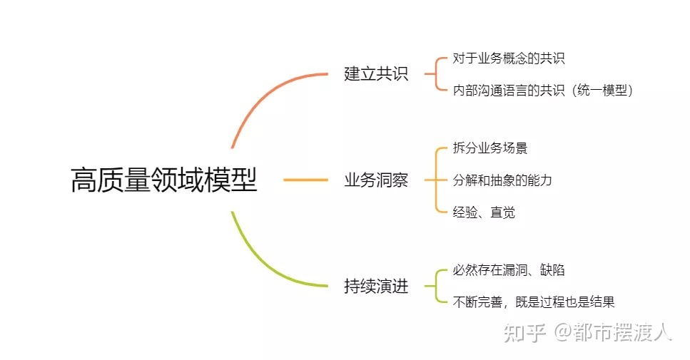
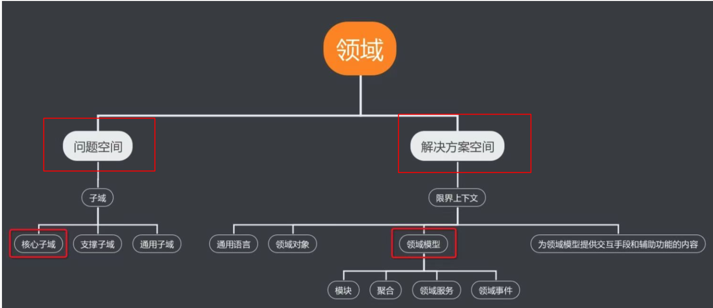
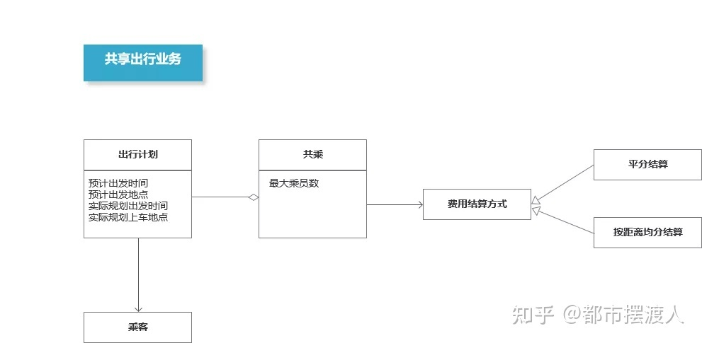
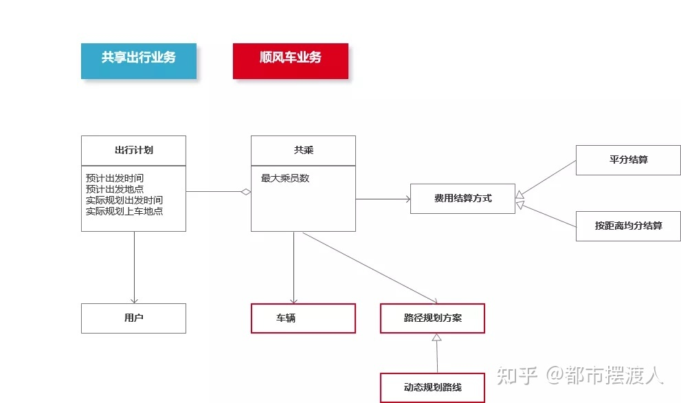
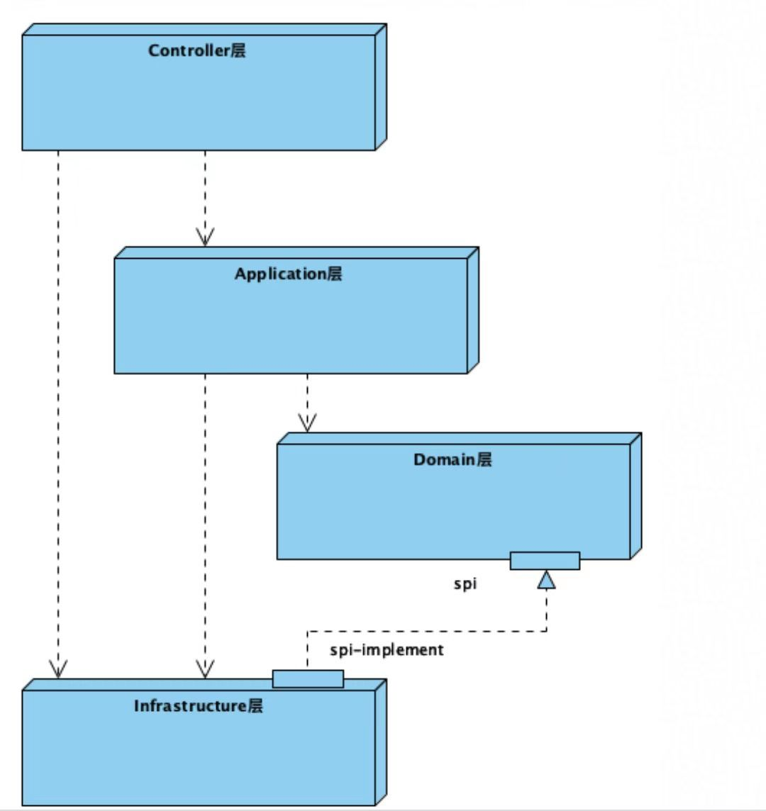
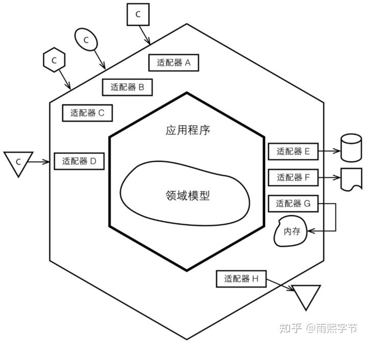

# 领域模型驱动设计（DDD）


> 作者: 潘深练
>
> 创建: 2022-04-20
>
> 版权声明：自由转载-非商用-非衍生-保持署名（[创意共享3.0许可证](https://creativecommons.org/licenses/by-nc-nd/3.0/deed.zh)）


## DDD 解决什么问题？

首先 DDD，就是：

- D 领域模型
- D 驱动
- D 设计

领域模型 驱动 技术设计

领域模型 驱动 产品设计

领域模型 驱动 业务设计

...



### 达成共识

为了跟产品、业务、领域专家、行业达成共识，共识包括：概念名词，业务分类，用户场景，行为数据，场景之间的关联等等。


达成共识，保证大家都被绑定在一个大家都能理解的 “统一语言”上，让业务从上至下，永不失真。而这个统一语言是什么呢？就是领域问题和领域解决方案，这两个就是 DDD 的战略设计。



### 领域问题 
### 领域解决方案
### [《领域建模：分清问题域和问题解决域》](https://zhuanlan.zhihu.com/p/59886663)


伴随业务的发展和变更，各方积极绑在一起，无论是增添名词、增加关联等，都从已达成的共识上修改，持续达成共识。

如此一来，业务不会胡乱提需求，因为要考虑到之前的需求就是自己提的。产品不会胡乱设计因为要考虑到之前的共识，技术不会胡乱实现因为需求已经相当明确。

达成共识，再也不会出现，产品认为很简单，其实技术心里很苦逼的事情了。产品如果设计的不合理，在修改共识的这个阶段就会因为逻辑不自洽而卡住。技术也因为有这个共识的存在，而很容易看的懂业务的全貌，而不会错误实现，依据共识照葫芦画瓢，非常真诚朴实的翻译出来即可，无需增添东西，也不要少东西。

## 实际场景

### 滴滴出行

参考：[学学领域模型](https://zhuanlan.zhihu.com/p/392926694)

出行的问题域是什么？

1. 用户的出行需求是什么？
2. 用户需要的交通工具是什么？
3. 用户需要怎么付钱？



上图基本解答了以上 3 个问题，但是问题又来了，用户希望对路线进行规划，如何规划呢？规划方案有哪些呢？



只要业务、产品、领域专家等达成共识，例如产品说流程里面有四个步骤：

- 步骤一：打车
- 步骤二：上车
- 步骤三：到达目的地
- 步骤四：付钱

那对技术人员来说，代码就依据此类实现即可，例如：

```java
private void 打车流程(){
   打车();
   上车();
   到达目的地();
   付钱();
}
```

当然，突然技术层面如果需要添加缓存或其他性能优化，加快打车方法执行效率或其他优化，一定不能侵入领域，代码不可写在领域代码之中，因为已达成了共识，从产品、运营、业务、领域专家等，都没说用缓存，技术不能写缓存这样的名词侵入到领域代码里面。

那就只能通过 **依赖倒置**。




例如 Domain 领域层还保持一个方法，即 打车（）：

```java
private void 打车(){
  获取车辆信息()；
}
```

然后由 facade 层或者 infrstructure 层（任何共识/统一语言以外的东西，都可以扔到里面）去实现这个缓存逻辑。

```java
public 获取车辆信息WithCache() {
   redis.....get
}
```

> 让 infra 依赖 domain

这样的好处是什么呢？domain能保证是当初那个共识的忠实拷贝。这样产品、运营、领域专家等修改一心、同频，防止出现撕扯骂街现象。

整体没进行任何添油加醋，就是翻译了一下，完全干净。做到：

- Domain 以内无技术。
- Domain 以外无业务共识。

所以 DDD 的本质还是为了维护这个共识，不被技术语言污染和破坏。

最终就是大家在网上经常能看到的那个六边形架构。



分层是保护领域模型，保护大家好不容易达成的共识。也就是：**领域层－－防腐层－－外部依赖／基础设施**。

其中防腐层，防止领域模型被技术语言或者第三方标准给腐蚀破坏掉。

所以有了以上的共识，技术落地真的没什么，DDD 的核心压根不在技术落地上，说白了技术落地只是上了一层保护措施而已。

因此可以认为领域模型是一个行业的共识。这个共识牵动的绝不只是设计者，还有行业的各类参与者，他们的行为方式、未来动向，规律，分类，层次，共同作用形成的共识。这个共识可以反应现在，也可以预测将来。因为他是整个行业的从业者无论是设计者还是使用者，参与者，维护者，共同的行为规律抽象出来的。

当然，如果这个共识没能正常的反应市场规律，就是一万个技术研发 ７＊２４ 小时熬夜加班，也无济于事。

**ＤＤＤ真正的核心在问题域的划分和回答**。

技术只是抄了一份那个问答笔录，然后用了所谓的六边形架构保护起来了而已。

**问题域** 可不是那么简单就能寻找和回答对的。

举例：如果名表行业是一个领域。你可能认为问题核心在于如何把设计和舒适度打造到极致，但是其实往往还有更深层次的问题：
- 富人的心理和表的稀有程度。

如果这个问题域没有找对，没有回答正确，后面再设计再研发也是枉然。

所以什么是领域模型？解决了什么问题？

1. 整体的共识
2. 正确反映行业发展

所以领域驱动设计，得找领域专家指导！真的是在一个行业深耕很多年，摸清了行业规律的人，才敢设计这个领域模型。而技术跟人家讨论咨询，得出一个共识，赶紧用六边形架构保护起来。

> 就例如有一个绝佳的例子

设想一下，公司的组织架构，是谁设计的？是某个研发吗？这个组织架构设计出来，如果把这个组织架构做成信息化的，比如钉钉上面的汇报关系和岗位分配，研发敢改吗？能因为代码里面把逻辑写乱了或者数据迁移不好做，就让组织架构重新设计吗。

因此，在这个场景下，六边形架构就是成了自保，“赶紧把我技术的东西撤出来，我可不跟它纠缠在一起”，基本这都是 DDD 的近似场景。

