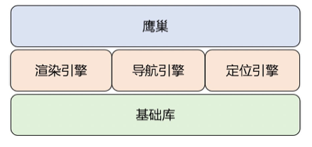

# 从业务开发中学习和理解架构设计


> 作者: 张东爱(当爱) | 阿里巴巴 
>
> 创建: 2022-07-21 10:28 发表于北京


原链：[《阿里开发者 - 从业务开发中学习和理解架构设计》](https://mp.weixin.qq.com/s/1LF0qdfvBooV7S-CNAjnow)

## 前言

在软件开发领域经常会接触到架构这个词汇，在我最初的印象中，架构是一个很高级的词汇。它似乎代表了复杂的工程结构、高层次的抽象设计、最新的开发语言特性等等。对于当时只专注于写业务逻辑的我来说，不免心生对架构的敬畏。工作中对架构的讨论很少，出现则是一些高级晦涩的描述，但是从来没有人清楚地解释过架构做了哪些事。所以，架构到底是什么？架构和业务之间是什么关系？


当我们看一些关于架构的书籍或者资料，不免会接触到一些对架构的定义或者描述。比如：约束、规则、边界、实体关系、模型定义等等。但是懂得这些概念并不能帮助我们设计出来更好的架构，当我们套用设计原则进行架构设计时，不免会觉得空洞乏味，总觉得少了点什么。虽然我们为架构设计做了很多事，但是似乎什么也没做。因为只针对架构设计本身来说，很难说清楚它所产生的价值。所以，好的架构设计的出发点是什么？好的架构应该是什么样的呢？


去年我有一个任务：将我们当前工程的代码进行重新的拆分和组合，以厘清模块间的关系，控制工程中模块依赖的复杂度。这看起来是一个很简单的工作，找到一个不同于当前的且更合理的目录划分方案，就可以尝试落地实施。但是这又是一个很困难的工作，因为我们首先要回答有哪些模块、模块间是什么依赖关系的问题。其实，回到任务的本身，我们并不是只想对代码文件进行重新的组织和划分，我们的目标是业务模块解耦合，定义并明确业务模块间的依赖规则。面对这样的目标，我们需要首先从业务视角更清晰地定义和划分模块，然后从工程结构视角确定模块间的关系。所以，代码目录调整实际上是一个对业务场景、工程结构理解和设计的问题。代码目录的结构代表了我们的工程结构，也是业务场景划分的抽象描述，更是模块定义以及模块依赖关系的展现。


在设计代码目录划分方案的过程中，看了一些工程结构设计的资料，读了一些关于架构设计的书。对于架构有了一些理解。本文是对这段学习和任务完成过程的思考和沉淀。我希望能够回答上面提到的几个问题：

1. 架构到底是什么？架构和业务之间的关系
2. 好的架构的设计出发点是什么？好的架构应该是什么样的


## 什么是架构

### 架构的定义

首先架构是一个汉语词汇。它的定义是：人们对一个结构内的元素及元素间关系的一种主观映射的产物。从这个定义可以看出，传统的架构在描述一个系统中有什么元素，以及元素之间关系。在建筑领域，架构也用于描述建筑物的结构。


作为一个计算机领域的词汇，架构的定义是：有关软件整体结构与组件的抽象描述，用于指导大型软件系统各个方面的设计。实际上也在定义有什么以及关系的问题。


### 从工程化解读架构设计的作用

无论是在建筑领域还是计算机领域，我们通常会用工程描述这类工作的项目。比如我所在的部门是工程技术中心，我是一个工程类的程序员等。我们可以称之为工程的工作项目包括：建筑工程、军事工程、水利工程、生物工程、软件工程等。而我们在完成项目的过程中，进行架构设计实际上就是推进实施工程化的一部分。那么进行工程架构设计会考虑哪些因素，它对实施工程化的作用是什么呢？

假设，读者你现在是一位建筑工程师，负责建造一栋房屋。

虽然我们没有真正的盖过房子，但是在进行房屋的整体结构设计时，你一定会关心这些：

1. 房屋用途。首先要明确这栋房子是干什么用的

2. 房屋层数。和用途紧密相关，不同用途的房子层数也是不一样的

3. 房屋外观。定义这栋房屋应该长什么样

4. 房屋的布局。定义这栋房屋应该怎么更好地被使用

等等。我们称上面这几个属性是房屋的基础能力。作为一个靠谱的建筑工程师，你一定还会着重地设计这些：

1. 水电走向。这很重要。保证房屋的安全性和使用的便捷

2. 承重和抗压。房屋的使用寿命很大程度上依赖于此

等等。我们称上面的这几个属性是安全性和性能。

另外一方面，你大概不会关心房屋的装修风格、地板颜色、衣柜品牌等等因素。我们称这些为应用细节。
总结来说，进行房屋的工程架构设计时更多地关系底层设计，而不在乎过多的技术细节。

所以，我们可以给架构的作用下一个定义：在明确用途的基础上定义使用的规则和约束，提供了基础的支撑能力，并保障安全性、性能和使用周期。


### 软件架构设计的原则和要求

到目前为止，我们已经明确了在做架构设计时必须遵循的前提和原则：明确用途。此外也对架构设计提出要求：提供基础能力、保障安全性、性能等。
同样的，引申到计算机领域。当我们进行软件架构设计时也必须遵循的原则有：

1. 架构设计一定要从业务场景出发

这实际上就是明确用途的大前提。架构设计一定是要从业务出发、面向业务变化的。只有在我们明确了我们的业务场景和业务目标后，在此基础上进行的架构设计才是能真正产生业务价值的。一个脱离了业务场景而设计的架构，无论多么新颖和高级，也绝不是一个好的架构。

2. 架构设计一定要落到业务场景中去验证

我们不能只从基础能力、安全性或者性能方面去评判一个架构的好坏。架构对业务开发的支持能力，面向业务变化时的灵活度以及持续演进能力等都是评判的因素。

此外，我们要求软件架构必须是灵活的，能够满足未来业务持续发展的要求。

业务场景是不断变化的，架构也要具有跟随业务形态不断演进的能力。架构设计的核心是保证面向业务变化时有足够灵活的响应力，这要求架构设计能够识别到业务的核心领域。所以，无论是面向当前还是面向未来，架构设计都需要真正地识别和理解业务问题。

## 架构设计的原则

本章节介绍几个软件架构设计时可以遵循的原则，实际上在进行功能模块设计也可以参考这些设计原则。

### SRP 单一职责原则

1. 一个函数只负责完成一个功能
2. 任何一个模块只对某一类行为者负责
3. 一个类或者函数应该有且仅有一个被改变的理由

在实际的编码中，我们还是可以看到很多违反单一职责的例子的，比如超长的函数体。一个函数内做了很多事，实际上就是负责了太多的功能，很多的变更都要修改这个函数，这导致很难控制变更影响的范围。

我们可以将大函数拆分成小函数，小函数体负责的功能更加单一，相应的也会更加灵活。所以我们建议大家多写一些小的函数体。但是不要在函数拆分的过程中进行过度的封装和抽象。

### OCP 开闭原则

1. 易于扩展，抗拒修改

模块要易于扩展，控制修改。这是我们在初学编程语言时就会被教育到的设计原则。开闭原则帮助我们设计更加灵活的模块，同时还能控制模块变更的影响范围。


### LSP 里氏替换原则

1. 所有引用父类的地方都可以替换成子类，而行为不发生改变

使用里氏替换原则可以保证父类的复用性。它主要是用来判断抽象和继承关系设计是否合理，即某个类是否应该具有某个属性，以及一个类到底是不是另外一个类的子类。

举一个典型的例子，乘马是乘马，乘白马也是乘马，乘黑马也是乘马。那么白马和黑马就是马的子类，是符合LSP的。
下面是两个典型的违反LSP原则的例子。也是网上也特别常见的例子。

第一个是正方形不是矩形。

```c
class Rectangle {
 public:
     int32_t getWidth() const {return width;}
     int32_t getHeight() const {return height;}

     virtual void setWidth(int32_t w) {
         width = w;
     }
     virtual void setHeight(int32_t h) {
       height = h;
    }
private:
    int32_t width = 0;
    int32_t height = 0;
};
```

```c
class Square : public Rectangle {
 public:
     void setWidth(int32_t w) override {
         Rectangle::setWidth(w);
         Rectangle::setHeight(w);
     }
     void setHeight(int32_t h) override {
          // …
     }
 };

 void reSize(Rectangle rect) {
     while (rect.getHeight() <= rect.getWidth()){
         rect.setHeight(rect.getWidth() + 1);
    }
 }
```

正方形类Square继承自矩形类Rectangle，并且重写了函数setWidth和setHeight。在函数reSize中，将父类Rectangle对象替换成子类Square后，将会出现死循环，程序出现异常。不符合LSP原则。

所以正方形不是矩形。第二个是鸵鸟不是鸟。

```c
class Bird {
public:
     int32_t getVelocity() const {return velocity;}
 private:
     int32_t velocity = 0; // 飞行速度
 };

 class Ostrich : public Bird {
 };
 ```

 ```c
void crossRiver(Bird bird) {
     int32_t distance = 1000;
     int32_t elapsed = distance / bird.getVelocity();
 }
 ```

 鸟类Brid具有飞行速度的属性，鸵鸟类Ostrich继承自类Brid，飞行速度默认为0。在函数crossRiver中，将基类Brid对象替换成子类Ostrich对象后，获取的飞行速度为0，出现了除0异常。不符合LSP原则。

所以鸵鸟不是鸟。

在这两个例子中，结合里氏替换原则， 我们得出了两个奇怪的结论，违背了几何学和生物学的常识。其实问题在于我们对抽象和接口的设计上。比如前一个例子中reSize函数，它的条件判断是有问题的。对于一个矩形对象，宽高不一定非得相等，所以将宽高相等作为循环的条件是不合理的。

对于后一个例子，飞行并不是鸟类的统一特征，所以抽象的鸟类不应该拥有飞行速度这个属性，也不应该具有飞行的接口。那么我们应该怎么处理这个问题呢。准确来说，鸟类可以具有是否可以飞行的接口，然后有一个速度属性。可以飞行的鸟返回飞行速度，而鸵鸟返回行走速度。

所以，里氏替换原则用于验证我们的接口和抽象设计是否合理，同时也可以验证继承关系是否合理。

### ISP 接口隔离原则

1. 不依赖于自己不需要的东西
2. 使用接口类的方式细化功能模块，每个接口类负责某一类明确的功能

指导我们进行接口设计的原则。类似于单一职责原则，多个单一的接口负责的功能更简单，更易于维护，这比一个庞大的接口要好。在做接口设计时要尽量保证接口的小巧、简洁和正交，这样给业务层提供了更多的灵活性。一个大的接口可能会做业务层并不希望做的事，同时当业务层需要扩展功能时也会使变更影响的范围过大。


### DIP 依赖反转原则（依赖倒置）


1. 为了保证系统的灵活性（易于修改）和稳定性（修改影响范围小），在依赖关系中应该避免引用具体的类
2. 接口比实现更稳定，所以尽量避免修改函数实现时对依赖该接口的模块的影响
3. 继承关系是依赖关系中最强的，尽量避免继承自有具体实现的类

这个原则目的在于降低使模块间的耦合度，并且使底层模块更易于被修改和替换。当下层功能发生变化时可以控制对上层业务的影响范围，使得整体系统更加稳定和灵活。

DIP原则在后面章节介绍架构设计方法时也会多次提到。

以上这五个设计原则统称为SOLID原则。在《整洁架构之道》中有比较详细的介绍。

### 奥卡姆剃刀原则

奥卡姆剃刀原则不是在软件开发领域提出的，而是在哲学领域提出的。奥卡姆剃刀原则对科学和哲学的发展都极为重要，因为它告诉人们理论应该尽量简洁，理论中一切不影响结论的多余部分都应该被剔除掉。

正如奥卡姆剃刀原则的精髓一样，它的描述非常简洁有力：如非必要，勿增实体。

我们也可以称它为简单即为美原则。通俗的描述是：用尽量少的步骤完成一件事。或者，如果对于一个事物有两种解释，采用最简单或能被证伪的那种。正是因为奥卡姆剃刀原则，我们才更加相信哥白尼的日心说，更相信牛顿和爱因斯坦。否则，地球是宇宙中心的理论也没错，只是其他行星和恒星环绕地球的轨道公式也太复杂了，而且也容易被自然现象证伪。

在众多的介绍软件设计方法的书籍和资料中也多次提到过奥卡姆剃刀原则。应用到软件开发领域，它确实给了我们很大的启示。设想一下我们是不是遇到过这样的场景：

1. 费力地向别人解释某个模块为什么那么设计
2. 为某段代码加的注释比代码都多
3. 为了解决一个问题而引入一个新的模块

当我们费力说明和解释某个代码设计时，真正的问题并不在于我们解释的不够充分，或者听众不够聪明理解不了，而在于代码设计本身没有很好地体现其业务语义。实际上过多的解释和注释都是多余的，是可以被奥卡姆剃刀砍掉的。

对于为了解决一个问题而引入一个模块也是在工作中经常遇到的问题。有很多原因导致某些模块变得腐化难以维护，比如最初的设计没有很好地贴合业务场景；编码规范不够好，后面的修改也没有遵守规则；接手者没有完全理解作者的意图就着手修改等等。而程序员也经常会有的一个想法是：当一个模块难以维护了，最好的方法是用一个新模块替换掉它。实际上这种方法并没有触及问题的本质，在没有找到导致模块腐化的原因之前，在没有制定规范的模块设计方案之前，我们都不能保证新模块不会有旧模块一样的问题。所以，想开发新模块替换掉旧模块很大程度上是在逃避对旧模块问题的思考，新模块也很有可能沦落到旧模块一样的地步。如果回答不了这个矛盾的问题，还是用奥卡姆剃刀把新模块剔除掉吧，新模块是多余的，并没有解决真正的问题。

奥卡姆剃刀原则保证解决问题的方法是简单有效的，同时也约束我们应当思考更根本的问题，不能浮于问题表象采用最省力的方法。

### 其他的设计原则概览

DRY（Dont Repeat Yourself）：保证代码的可复用性，避免代码逻辑的重复

YAGNI（You Aint Gonna Need It）：代码应易于扩展，但要避免过度设计，不要编写当前用不到的代码。

KISS(Keep It Simple, Stupid)：把事情想复杂，做简单

POLA(Principle of Least Astonishment)：最小惊奇原则。代码应合乎逻辑和规范，给阅读者最少的惊吓。接口设计避免标新立异。

## 常用的几种架构设计

### 分层架构

分层架构是指基于具体的业务模型按照功能模块将代码进行分层组织。每一层代表了一组相关功能的集合。具体分为几层没有明确的规则，通常可以分为3-4层或者更多。在分层架构中，依赖关系是由上往下，上层依赖于下层，不能反向依赖。越往下的层次越通用，偏向于基础能力。越往上层次越动态，偏向于业务。


分层架构设计按照依赖规则的严格程度分为严格型分层架构和松散型分层架构。严格型分层架构要求每一层只能访问其直接依赖的层，不能访问其间接依赖的层。松散型分层架构允许每一层访问位于其下方的任意一层。严格型分层架构使得各个层之间的耦合度降到最低，但是灵活性不足，当上层需要访问下面间接层的能力时必须从上往下层层穿透。松散型分层架构在保证依赖规则的前提下提供了足够的灵活性，所以大部分分层架构都是松散型的。

分层架构设计简洁易懂。对抽象事物按照基础特征进行分类，符合我们的思维习惯，易于理解。分层架构设计保证每一层内部有较好的内聚性，减少了层与层之间的耦合度，易于基础能力的沉淀和复用，也易于控制变更带来的风险。

另外一方面，分层架构设计虽然定义了多个层，但是层与层之间的边界并不是特别清晰。对于新增的模块有可能难以确定应该放在哪一层。或者随着业务逻辑的变化，未来可能需要调整模块所属的层次。分层架构中，上层模块对下层模块有直接的依赖，下层模块的实现直接向上层模块暴露。在修改或者替换下层模块时需要修改上层模块，对上层业务的影响较大。业务实现与基础能力没有完全解耦合。

### 六边形架构

又称为端口-适配器架构。为了解决具体实现依赖于基础能力的问题，采用依赖倒置设计方法将工程分为内部和外部。内部是具体的业务逻辑，外部是依赖的基础能力。内部业务逻辑不再直接依赖于外部基础能力，而是都依赖于其抽象定义。使用依赖注入的方式将外部实现传入内部业务逻辑中。内部和外部使用接口进行交互，内部业务逻辑访问基础能力时直接调用其抽象接口即可。


六边形架构解决了业务逻辑直接依赖外部模块的问题，它们都依赖于抽象，不依赖于直接的实现和细节。它们直接通过定义好的接口进行交互。因为业务逻辑和外部模块没有直接的依赖关系，在修改和替换外部模块时只需要按照接口定义实现功能，不需要改动业务逻辑。


### 洋葱圈架构（整洁架构）

洋葱圈架构又称为整洁架构，结合了分层架构、六边形架构和领域驱动设计特点的架构设计方法。洋葱圈架构是对六边形架构的进一步扩展，依赖关系依然是外部依赖内部。参考领域驱动设计，将依赖层次划分为3-4层甚至更多。从内向外依次为：领域模型、业务逻辑、领域服务、基础能力、外部模块等。

洋葱圈架构具有六边形架构的优点，采用依赖倒置的原则使内部业务模型不再直接依赖于外部基础能力。外部模块的变动和替换不影响内部业务逻辑。采用领域驱动设计的方法划分实体和模型，利于业务规则的抽象和业务模型的建立，对未来业务迭代的支持较好。洋葱圈架构使业务实体、业务模型和业务实现处在里层，保
证了业务模型和实现的稳定，避免受到外部模块变动的影响。

例如，使三方SDK或者数据库系统属于最外层，使用依赖注入的方法将它们的实现传入内部逻辑。当替换三方SDK或者数据库系统时，按照接口定义实现具体细节即可。不需要对内部逻辑进行改动。

### 领域驱动设计方法

领域驱动设计简称为 DDD（Domain-Driven Design）。准确来说它不是一个架构设计方法，而是一种以业务分析和划分来驱动系统架构设计的软件开发方法。它强调识别业务的核心问题域来确定问题边界，同时将问题域进行分解降低分析的复杂度。DDD强调通过关注业务核心提升业务价值。

下面是DDD的一些核心概念，我们做一些简单的介绍。

1. 领域：有确定的范围和边界的业务问题域。实际上是我们要解决什么业务问题的抽象描述。比如提供给用户当前位置、目的地位置且提供到达信息是高德地图的问题域。
2. 子域：将大的问题域根据业务规则的不同拆分成的小问题域。比如高德地图的问题域太大了，难以解决。我们可以将问题域拆分成定位、POI搜索、路线规划等子问题域。
3. 界限上下文：领域之间的抽象边界。封装了领域内的概念、规则和模型。
4. 实体：具有唯一标识的、存在生命周期的对象。比如展示给用户可见的POI气泡是一个实体，它有状态和确定的生命周期。
5. 值对象：没有唯一标识和生命周期的对象，依附于实体而存在。比如POI信息是值对象，本身没有状态，只能依附于POI气泡这个实体而存在。
6. 聚合：领域内一组实体、值对象的集合。封装了集合与外界的交互


使用DDD对业务问题进行分析和拆解后，可以采用任何一种架构设计方法，无论是分层架构、六边形架构或者整洁架构等。但是DDD要求架构设计从实际的业务场景出发，理解业务的核心问题。架构需要明确概念、规则的设计，并且保证业务模型的稳定性。使用分层架构展现DDD的领域设计方法，将工程分为4层：基础设施层、领域层、应用层和用户接口层。


## 我们所用的架构方案

### 鹰巢

我所在的团队——鹰巢业务组负责高德地图规划和导航的业务能力实现。它向下对接引擎层，包括定位引擎、导航引擎、渲染引擎等，向上对接前端JS层。除了承接功能庞大、逻辑复杂的导航业务外，鹰巢还负责引擎能力的封装以及将这些封装能力向上层JS透出。

在进行代码目录划分之前，鹰巢的功能实现也是按照模块化进行设计的，但是模块之间并没有明确的依赖关系。任何代码都可以互相的引用，这也就导致了工程中各模块之间有错综复杂的调用关系，很难以说清楚某一个模块应该处于哪个位置，应该如何被引用。虽然我们一直将工程代码分为框架层和业务层，但是框架层和业务层之间的依赖关系并不明确。业务层依赖框架层，框架层也依赖了业务层，并不符合分层架构的设计原则，所以鹰巢的工程架构不属于分层架构。

在我们去年的代码目录划分的工作中，我们最终参考领域驱动设计的方法对代码目录进行了重新的组织和划分。将工程代码整体上分为4层：基础能力、业务层、工具层和接入层。以下是整体结构图：


适配层与以下的4层不在同一个仓库，它包含了与前端JS交互的必要能力封装。按照模块的划分规则，我们可以说，鹰巢的工程架构属于结合领域驱动设计的松散型分层架构。它的特点是：

1. 按照领域驱动设计对工程代码进行组织和划分，在业务层按照不同业务领域划分代码模块
2. 采用分层架构设计将工程分为多层，上层依赖于下层，下层不能依赖于上层
3. 上层任意模块都可以调用下层任意模块，属于松散型架构。更加灵活

### 工程技术中心C++能力层（包括地图引擎层）

在工程技术中心的语言能力框架中，从鹰巢、地图引擎到基础库都是C++语言实现。使用统一的流程管控它们的开发、构建、集成。在引擎架构升级之前的相当长的一段时间内，它们都属于松散型分层架构，以下是简化版的结构图：




实际上，包括引擎库在内的C++层有几十上百个代码仓库，层次众多，且从上层到下层的依赖关系复杂。如果将所有的依赖关系绘制出来，将是一个复杂的网状。虽然整体架构依然遵守了分层架构的设计原则：只能上层依赖下层。但是因为依赖层次和关系的复杂，导致下层代码的改动对上层的影响很大，在构建时也经常出现库版本不匹配的冲突。这使得上层业务层经常处于不稳定状态，不利于上层业务的快速迭代。并且下层能力升级也必然需要上层业务层做大工作量的适配。

在去年的引擎架构升级中，抽离出抽象层，使得各个仓库都依赖于抽象接口，不再依赖于具体的实现。抽象出来的抽象层包括：InterfaceApp、InterfaceAR、InterfaceARWalk、InterfaceHorus、InterfaceMap、InterfaceVMap、InterfaceTBT、InterfacePosEngine等。比如鹰巢和TBT都依赖于InterfaceTBT抽象层，使用依赖倒置的原则在App初始化时将TBT的实例化对象设置给鹰巢。鹰巢通过调用实例化对象的抽象接口访问TBT的能力。同理，鹰巢和渲染都依赖于InterfaceMap抽象层。这种方式使得上层的业务层比较稳定，只要保证抽象层接口的稳定性，业务层基本上就不会受到下层改动的影响。而且，当下层进行能力升级时，只要按照抽象接口定义实现对应能力即可，不需要业务层做适配。

从这方面来讲，在引擎架构升级后，引擎具有整洁架构的特征。但是并不能完全称为整洁架构，因为从更大的视角来看（将基础库和Native层包括进去），依然是松散型的分层架构。所以，我们可以称之为具有整洁架构特征的松散型分层架构。


## 总结

对于架构设计的学习和理解，我认为很难的一点是：即使懂得很多道理还是很难把事情做好。众多的设计原则都是在不同业务场景下提出的，有些原则之间本身就是矛盾的。无论是架构设计方法还是设计原则，它们不是金科玉律，更不可能放之四海而皆准。它们的价值在于告诉我们应该摒弃什么，应该遵守什么。我们不用那些技术官僚的词汇，用更接地气的描述来说，设计原则也只是要求我们做到简洁、规范和易于理解而已。架构设计并不高端，它本身所产生的价值并不明显，真正能够产生价值的在于我们当前正在走的路：如何理解我们的业务问题。


## 参考资料和书籍


- [应用架构之道：分离业务逻辑和技术细节](https://www.cnblogs.com/alisystemsoftware/p/13846127.html)

- [The Onion Architecture](https://jeffreypalermo.com/2008/07/the-onion-architecture-part-1/)

- [《架构整洁之道》](https://book.douban.com/subject/30333919/)

- [《领域驱动设计-ThoughtWorks洞见》](https://book.douban.com/subject/35728308/)

- [《代码精进之路-从码农到工匠》](https://book.douban.com/subject/34922776/)

- [《UNIX编程艺术》](https://book.douban.com/subject/1467587/)

## 附录

- 工程：是指以某组设想的目标为依据，应用有关的科学知识和技术手段，通过有组织的一群人将某个（或某些）现有实体（自然的或人造的）转化为具有预期使用价值的人造产品过程

- 工程化：是指以提高效率、降低成本、保证质量保证为目的从而促进多人合作，实现功能强大，健壮性好的项目的手段和措施