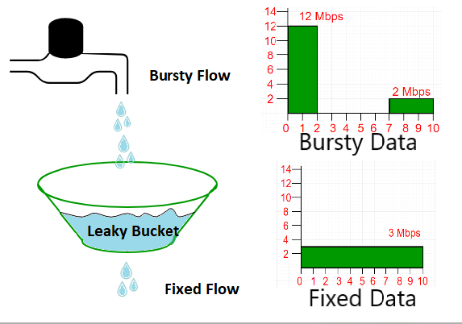
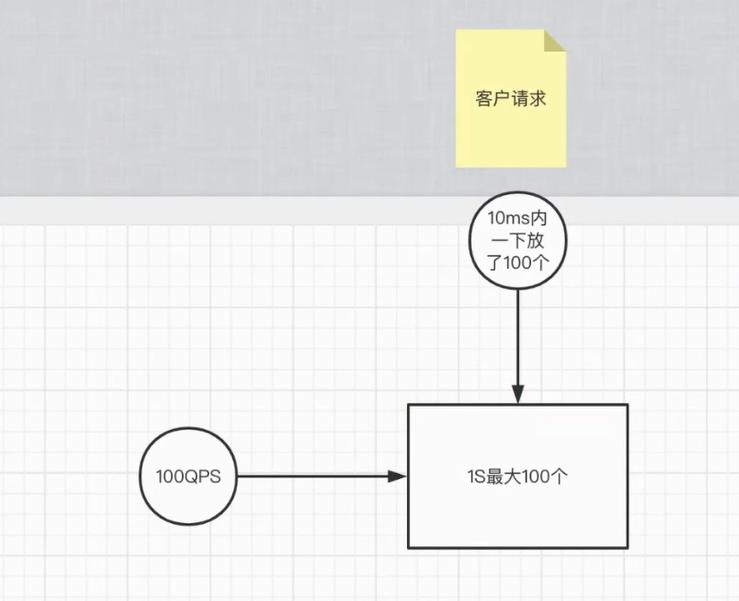

# 限流算法

> 作者: 潘深练
>
> 创建: 2022-06-12

## 一、限流背景

在资源有限的情况下，面对不断增长的流量，如何保证系统依然处于一个正常负载的状态呢？

**限流**。限流问题可以追溯到网络通信中（例如 [TCP/IP 拥塞控制](https://dev.to/swyx/networking-essentials-congestion-control-26n2) 的工作原理）的流量整形（Traffic Shaping）和流量控制（Traffic Policing），这些知识让我们了解 Intenet 流量是如何形成的，但是拥塞控制是非常底层的，我们或许可以对 Internet 流量设置高层级别的限制，以解决资源或业务限制，我们称之为速率限制（Rate Limit）或流量整形（Traffic Shaping），他们的思想基本是相同的。

限流（Rate Limit，或说是速率限制），是指防止操作的频率超过某些约束。在大型系统中，**Rate Limit 通常用于保护底层服务和资源**。

## 二、流量分类方法

流量不可能都是平滑的，就流量模型而言，传输数据通常是 **突发性** 的，而传输音频通常是 **连续/均匀** 的，因为您正在传输一组相当稳定的数据。由于压缩，传输视频可能是连续的或突发的。

对流量进行分类的高级方法归结为：

- **恒定比特率（CBR，Constant Bit Rate）**：流量定期到达，数据包大小大致相同，这导致比特率恒定（例如音频）。我们根据其峰值负载来塑造 CBR 流量。
- **可变比特率（VBR，Variable Bit Rate）**：所有可变的（例如视频和数据）。我们根据峰值和平均负载来塑造 VBR 流量。

## 三、限流算法

在 Guava、Hystrix、Sentinel 等工具/中间件中，他们的核心诉求基本是：在资源有限的情况下，流量还在不断增长，那如何去保证系统依然是健康的？所以限流本身跟伸缩性和可靠性都是相关的，由于流量的伸缩性，可能导致系统出现一些可靠性风险，因此限流算法基本是在这样一种故障模型下去处理系统可靠性风险。

我们可以从三个角度去设计策略：

- (r, t) shaping （时间窗口，R:rate速率，T:time时间窗口）
- Leaky Bucket（漏桶，时间窗口的变种）
- Token Bucket（令牌桶，时间窗口的变种）

### 1、固定窗口计数器(Fixed window counter)

在一个固定的时间窗口下，我们允许进入的流量是多少，这就是简单的限流，也一定程度上代表了系统的处理能力。简单描述就是我们人为设计一个策略，在第一个请求到来之后，就记录下一个时间节点，后面固定每一秒内只能进入100个请求，然后你可以考虑在缓存或数据库中记录一个key，然后value对应一些过期时间和访问数量（计数器）等，如果一个key在规定得过期时间（时间窗口）内没有超出访问数量上线，那么就可以继续接受请求流量，我们认为是合理请求，但是一旦超过限制，那我们就可以拒绝这些请求流量。

以上的固定窗口计数器设计，看起来好像挺合理，在每一个固定的时间窗口（每一秒）内都能保证请求流量不超过100个，但其实存在一些问题，例如你把时间窗口画在特定某一秒之内，例如1秒和2秒时间的交界处，是有可能超过100个请求的，例如以下就达到了200个请求，因此只要在两个时间窗口交界处发生 **流量突刺** 的 **临界** 问题，那么就会超过QPS，这类特殊流量模型是很大可能击垮系统的。

**流量曲线**（显然流量模型很尖锐）

- 优点：实现简单

- 缺点：**精确度不够**，临界情况下会qps会超出实际的值。

固定窗口由于存在临界情况下会超QPS，所以引出了改进的方法：**滑动窗口**。

### 2、滑动窗口计数器(Sliding window counter) 

简单来看，简单窗口精确度不够的原因在于，窗口移动的步伐太大，没有关注到之前窗口的流量。导致漏掉了一些统计窗口，所以我们可以慢慢的移动，让过去的流量被关注到，避免漏掉统计窗口。 

但是这样就解决问题了吗？它只是 **概率性** 的缓解了问题。

相邻的窗口之间确实没有了突发流量，但是只要是有滑动距离且滑动距离内可以进入多个流量，就会像上图所示，在统计窗口T内超过本来的限流设置。

**流量曲线**（相比固定窗口的流量曲线，滑动窗口显得没那么尖锐且平滑了些许，但还是不够）

- 优点：一定程度上解决了精确度的问题。

- 缺点：**精确度不稳定**，极端情况下还是会超过总的qps（当然我们可以通过减小时间窗口来减少这种概率，但是不能完全消除掉，且增多时间窗口会导致计算复杂度升高，从而降低限流组件本身的性能。所以这种滑动窗口的设计，只要你越精确，成本就越高，永远不可能达到绝对精确）。

那针对滑动窗口的不足，我们看看一种能够保障绝对精度的设计：**滑动日志**。

### 3、滑动窗口日志(Sliding window log)

我们可以分析一下，之所以有精确度问题，是因为无论我们如何划分时间窗口，只要是一个静态划分且这个窗口可再分割（不涉及哲学问题和普朗克时间balabala），那么就存在我们关注不到的统计窗口。

换句话说统计窗口几乎是无限的，难道这就结束了吗？

我们换个思路再来看一下，其实我们的问题在于丢掉了统计窗口，我们到底丢掉了哪些统计窗口。然后你会发现我们丢掉的窗口都是因为人为划分了时间区域模糊掉了区域中请求的真正到达时间。也就是说我们其实不必追究统计窗口无限的这个点，只需要把这些被摸糊掉的请求到达时间记录下来并且每次进行统计窗口的判断就可以了。

**那么算法就演变成了当每次流控判断时，取出以当前请求时间为end的时间窗口内的请求数，看是否大于流控阈值**。

相当于给每一个请求都定制一个时间窗口，如果没有流量请求，不记录也不划定时间窗口。

这样每一个统计窗口都被我们关注到了，精确度问题解决。但是我们付出了计算复杂度的代价。

- 优点：精确度完全精确。

- 缺点：首先，我们要保存一个长度最大为N的请求日志队列，这意味着空间复杂度达到O(N)，如果要针对不同的流控key，那么空间上会占用更多。其次，我们需要在队列中确定时间窗口，即寻找不早于当前时间戳t-T的请求记录。以二分查找为例，时间复杂度是O(logN)。（简而言之，就是牺牲了空间复杂度和时间复杂度，但是保证了绝对精确。）

**流量曲线**

整体的流量形状与滑动窗口的类似，只不过不会存在超过限流的情况，精确度提升。

**平滑度问题**

虽然我们付出了 **计算复杂度** 的代价，好在精确度问题有解了。这就结束了吗？还没有！如果你仔细观察这些算法的流量曲线的话，你会发现他们都有一个特点，就是尖刺凸起！尖刺凸起代表什么问题呢？

比如设置的限流是100qps，但是这100个请求在窗口的前10ms就进来了（流量突然爆发），如果把这10ms内的请求折算为QPS的话，是100*(1000/10ms) = 10000qps，这个从请求数来看没什么变化，但是从负载来看确实远超设置的限流qps的。

因此面对这种突然爆发的流量，系统不一定能扛得住，平滑度问题有可能就成为系统挂掉的原因。

如果从监控的秒s级别来看流量曲线，是很平滑的。

但是如果你放大到毫秒ms

再放大一点，你就发现跟上面的流量曲线很类似了。

**问题在哪？？外部请求流量不是均匀的**，因为我们只是按照窗口约束了窗口内的流量大小，但是对于窗口内是否均匀并没有定义。当然我们可以减小这个窗口，变成 qpms、qpus、qpns，从而达到更细粒度的平滑，但是同时也伴随着更更细粒度的尖刺，因为即便是 qpns 级别，外部请求依然是可以在 1ns 的前十分之一处全部打进来，**看起来我们可以用计算复杂度去换取平滑度，但是仿佛不能做到绝对平滑**。

**漏桶&令牌桶**

那平滑度还有更好的办法吗？

我们再来分析一下为什么不平滑， 其中有一个原因在于窗口的机制只是对窗口之间的平滑度做了限制，而没有限制窗口内，即便窗口分的再细，依然存在窗口内的小凸起。所以我们只要把窗口内也一同限制了就好了嘛！

**漏桶和令牌桶算法便是这样来平滑流量的，他们的基本思路就是控制平均访问速率 v ≤ N / T**。

- 漏桶：有一个人在匀速的按照速度v往桶里面往外拿令牌，然后请求者去放令牌，桶里还能放得下就算通过，否则限流。

- 令牌桶：有一个人在匀速的按照速度v往桶里面放令牌直到桶满，然后请求者去取令牌，取到就算通过，否则限流。

> 漏桶和令牌桶算法本质是一样的，都算是滑动窗口的变种，特殊点在于他们能够在窗口内控制速率，以保证窗口内的平滑度问题，所以可以理解为这两种桶就是控制速率的滑动窗口。另外，他两在桶的初始容量不同时，在流量曲线上会有一些不同。比如空漏桶比空令牌桶能允许流量突发，如果把空令牌桶换成满令牌桶，跟空漏桶的效果是一样的！

### 4、漏桶(Leaky bucket)

漏桶算法类似一个限制出水速度的水桶，通过一个固定大小FIFO队列+定时取队列元素的方式实现，请求进入队列后会被匀速的取出处理（桶底部开口匀速出水），当队列被占满后后来的请求会直接拒绝（水倒的太快从桶中溢出来）

 

以下这种情况，如果漏桶容量限制最多放100个，那么完全有可能出现客户端在10毫秒内就放入了100个请求，这样一来，还是没法处理窗口内平滑度的问题。 

那怎么处理平滑度呢？就是控制漏桶的容量，例如我们控制漏桶的容量为20个，那么客户端在10毫秒内最多也就只能放入20个请求。

这样一来，窗口内(漏桶流出的速率反推时间窗口)平滑度的问题就解决了.

- **漏桶算法的优点** 是可以削峰填谷，不论请求多大多快，都只会匀速发给后端，不会出现突刺现象，保护了下游服务，使得下游服务得以正常运行。

- **漏桶算法的缺点** 就是在桶队列中的请求会排队（等待流出），响应时间拉长。

### 5、令牌桶(Token bucket)

令牌桶算法是以一个恒定的速度往桶里放置令牌（如果桶里的令牌满了就废弃），每进来一个请求去桶里找令牌，有的话就拿走令牌继续处理，没有就拒绝请求。

以下这种情况，如果令牌桶在每一秒放入100个令牌，那么完全有可能出现客户端在10毫秒内就全部把令牌取出，这样一来，还是没法处理窗口内平滑度的问题。

那怎么处理平滑度呢？就是控制放令牌的速率，例如我们每隔200毫秒放入20个令牌，那么客户端在10毫秒内最多也就只能取出20个令牌。

这样一来，窗口内平滑度的问题就解决了。

- **令牌桶算法的优点** 是可以应对突发流量，当桶里有令牌时请求可以快速的响应，也不会产生漏桶队列中的等待时间。

- **令牌桶算法的缺点** 就是相对漏桶一定程度上减小了对下游服务的保护。

### 令牌桶与漏桶注意

当桶的容量大于1时，会和滑动窗口算法一样，有超过限流值的风险。

令牌桶的容量大于1时的流量曲线：

漏桶的容量大于1时的流量曲线：

- 优点：可控的平滑度，且当桶容量等于1时，精确度和平滑度都得到了完美的解决。（一点小问题-速率依赖于时间精度，时间精度会依赖于时钟物理上限，时间精度也是一种计算复杂度）

- 缺点：当桶容量大于1时会有超过限流值的风险。虽然精确度和平滑度都解决了，但是遇到突发流量时会设计到队列排队问题甚至会大量拒绝请求，且用户的RT时间会变长，体验不好，很多业务对RT是相当敏感的。

> 因此，漏桶和令牌桶，基本就是控制好两个方面：服务启动时的初始容量控制，以及后续滑动窗口的速率控制。

当然，控制好了令牌桶和漏桶的速度，反过来也会影响客户端 RT，进而影响用户体验。

### Sentinel的实现

市面上也有比较成熟的限流工具和框架。如 Google 出品的 Guava 中基于 **令牌桶** 实现的限流组件，拿来即用；以及 alibaba 开源的面向分布式服务架构的流量控制框架 Sentinel 更会让你爱不释手，它是基于 **滑动窗口** 实现的，以流量为切入点，从流量控制、熔断降级、系统负载保护等多个维度保护服务的稳定性。

那 Sentinel 是如何实现流控的呢？**Cumulative moving average**（累计移动平均）

是一种在子窗口内允许小尖刺，避免了大窗口内的大尖刺，从而满足平滑度的需求。是细化了窗口粒度的滑动窗口算法。

一些优化细节：

- **数据统计：** 为了统计资源的访问次数，使用了**加锁的 HashMap** 而不是 ConcurrentHashMap，因为程序只会在最开始的时候用一次锁，所以程序稳定以后 HashMap 性能会更好。
- **时间获取：** daemon线程定时更新当前时间
- **窗口滑动：** 环形数组
- **指标计数：** LongAdder：不是绝对准确的，但sentinel的场景计数操作并不是核心，性能更优。

指标计数时使用了返回累加的和可能不是绝对准确的，因为调用这个方法时还有其他线程可能正在进行计数累加，，这种情况使用LongAdder则是更优的一种考虑

### 总结

如果把上面这些算法抽象一下、你会发现限流问题变成了这样一句话：

**任意给定时间窗口T内的访问量不大于N，如何保证算法的**：

- **精确度**
- **平滑度**
- **平均RT**
- **计算复杂度**

总体看来上面这些算法都是有缺憾的，因为这几个维度中精确度和计算复杂度是有技术矛盾的，而平滑度（不允许流量爆发）又和平均RT有技术矛盾。所以看起来在这四个维度都达到完美不是那么容易的，针对限流问题在这几个维度不同的解答和权衡，就得到了不同的限流算法。

会有算法在这几个维度更接近于完美吗？不知道，我相信或许这就是技术的魅力所在的，追求是永无止境的。期待更多精巧的算法。

## 思考

限流算法基本在单机上进行思考设计，如果希望是做集群分布式限流设计，那其实很大可能影响到 **接口响应时间（RT）**，而且一般分布式限流设计会考虑异步统计并推送至各单机节点，那异步统计中 **时延** 和 **精确度** 又是个棘手的问题。

## 文献参考

1、[Google Cloud - Rate-limiting strategies and techniques](https://cloud.google.com/architecture/rate-limiting-strategies-techniques)

2、[知乎 - 限流算法小窥](https://zhuanlan.zhihu.com/p/336243181)

3、[dev.to - Rate Limiting and Traffic Shaping](https://dev.to/swyx/networking-essentials-rate-limiting-and-traffic-shaping-43ii)

4、[Figma - An alternative approach to rate limiting](https://www.figma.com/blog/an-alternative-approach-to-rate-limiting/)

5、[classdojo - Better Rate Limiting With Redis Sorted Sets](https://engineering.classdojo.com/blog/2015/02/06/rolling-rate-limiter/)