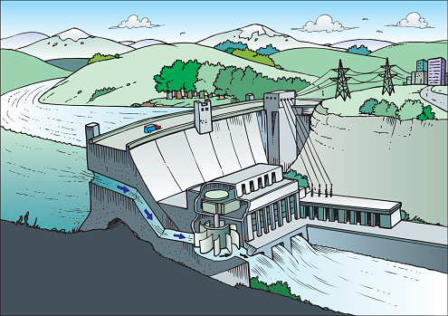
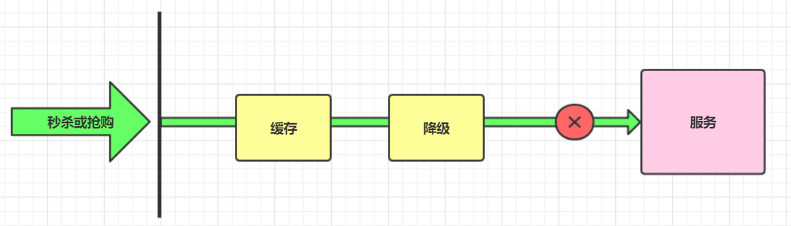
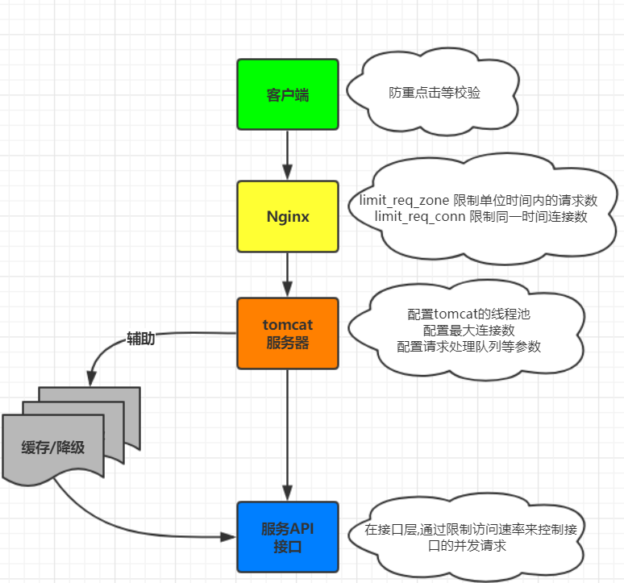

# 分布式服务治理

> 作者: 潘深练
>
> 创建: 2022-06-04

## 一、服务协调

## 二、服务削峰

### 2.1、为什么要削峰

### 2.2、流量削峰方案

## 三、服务降级

### 3.1、什么是服务降级

### 3.2、降级策略

### 3.3、分级降级

## 四、服务限流

### 4.1、什么是服务限流

计算机系统中，常常会有各种业务场景需要限制调用方的调用频次，当下游调用频次过高时，往往会造成服务端过多资源占用从而请求报错，超时甚至服务崩溃等超出预期的情况。在此时限流算法就显得非常有必要。

限流并非新鲜事，在生活中亦无处不在，下面例举一二：

- 博物馆：限制每天参观总人数以保护文物
- 地铁安检：有若干安检口，乘客依次排队，工作人员根据安检快慢决定是否放人进去。遇到节假日，可以增加安检口来提高处理能力，同时增加排队等待区长度。
- 水坝泄洪：水坝可以通过闸门控制泄洪速度。

以上"限流"例子，可以让服务提供者稳定的服务客户。

限流的目的是通过 **对并发访问请求进行限速** 或者 **一个时间窗口内的的请求数量进行限速** 来保护系统，一旦达到限制速率则可以拒绝服务、排队或等待。

### 4.2、多维度限流

在请求到达目标服务接口的时候, 可以使用 **多维度的限流策略**，这样就可以让系统平稳度过瞬间来临的并发。

### 4.3、限流算法

[限流算法](/zh-cn/06-rate-limit-algorithm.md)

## 五、服务熔断

### 5.1、什么是服务熔断

### 5.2、熔断机制

### 5.3、熔断机制实现

## 六、服务链路追踪

### 6.1、什么是链路追踪

### 6.2、链路跟踪具备的功能

### 6.3、链路跟踪设计原则

### 6.4、链路跟踪Trace模型

## 参考阅读

1. [常见的限流算法 - Aaron Ai](https://aaron-ai.com/docs/rate_limiting_algorithms/)
2. [Rate limiting - Wikipedia](https://en.wikipedia.org/wiki/Rate_limiting)
3. [Rate limiting - Abayomi Popoola](https://medium.com/swlh/rate-limiting-fdf15bfe84ab)
