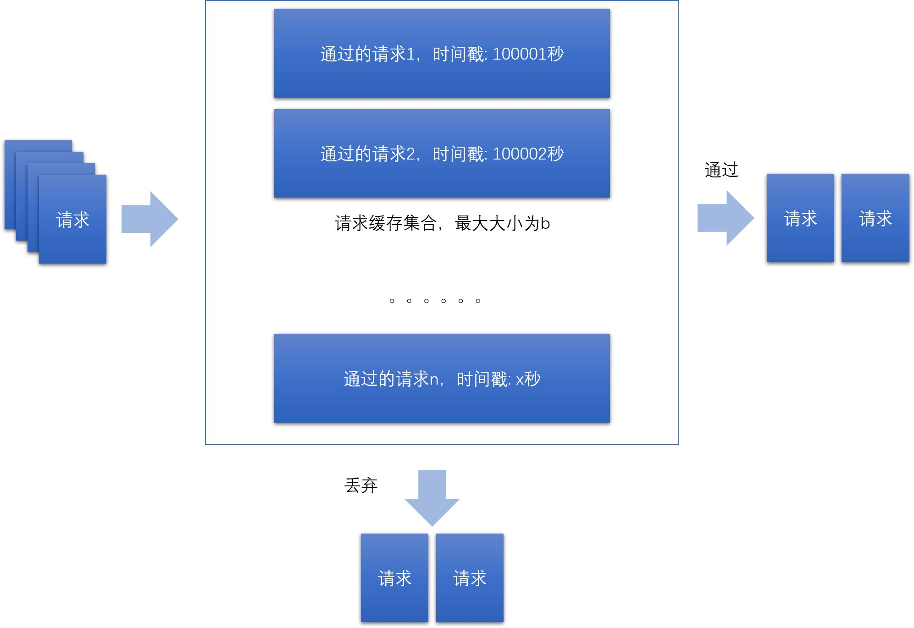
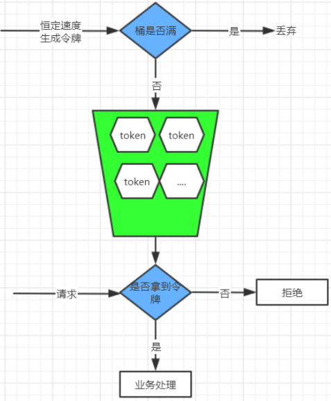

# 分布式服务治理

> 作者: 潘深练
>
> 创建: 2022-06-04

## 一、服务协调

## 二、服务削峰

### 2.1、为什么要削峰

### 2.2、流量削峰方案

## 三、服务降级

### 3.1、什么是服务降级

### 3.2、降级策略

### 3.3、分级降级

## 四、服务限流

### 4.1、什么是服务限流

计算机系统中，常常会有各种业务场景需要限制调用方的调用频次，当下游调用频次过高时，往往会造成服务端过多资源占用从而请求报错，超时甚至服务崩溃等超出预期的情况。在此时限流算法就显得非常有必要。

限流并非新鲜事，在生活中亦无处不在，下面例举一二：

- 博物馆：限制每天参观总人数以保护文物
- 地铁安检：有若干安检口，乘客依次排队，工作人员根据安检快慢决定是否放人进去。遇到节假日，可以增加安检口来提高处理能力，同时增加排队等待区长度。
- 水坝泄洪：水坝可以通过闸门控制泄洪速度。

以上"限流"例子，可以让服务提供者稳定的服务客户。

限流的目的是通过 **对并发访问请求进行限速** 或者 **一个时间窗口内的的请求数量进行限速** 来保护系统，一旦达到限制速率则可以拒绝服务、排队或等待。

### 4.2、多维度限流

在请求到达目标服务接口的时候, 可以使用 **多维度的限流策略**，这样就可以让系统平稳度过瞬间来临的并发。

### 4.3、限流算法

#### 1）、固定窗口计数器(Fixed window counter)

计数器限制每一分钟或者每一秒钟内请求不能超过一定的次数，在下一秒钟计数器清零重新计算

**存在问题:**

客户端在第一分钟的59秒请求100次，在第二分钟的第1秒又请求了100次, 2秒内后端会受到200次请求的压力，形成了 **流量突刺** 。

#### 2）、滑动窗口日志(Sliding window log)

滑动日志根据缓存之前接受请求对应的 **时间戳**，与当前请求的时间戳进行计算，控制速率。这样可以严格限制请求速率。一般的网上提到的滑动窗算法也指的是这里的滑动日志（Sliding Log）算法，但是我们这里的滑动窗口是另一种优化的算法，待会会提到。

简单来说，滑动日志算法，利用记录下来的用户的请求时间，请求数，当该用户的一个新的请求进来时，比较这个用户在这个窗口内的请求数是否超过了限定值，超过的话就拒绝这个请求。

算法大概是： 假设n秒内最多处理b个请求。那么会最多缓存 b 个通过的请求与对应的时间戳，假设这个缓存集合为B。每当有请求到来时，从B中删除掉n秒前的所有请求，查看有序集合是否满了，如果没满，则通过请求，并放入集合，如果满了就触发拒绝策略。

分布式环境下的滑动日志的实现需要考虑如下几个问题：

1. 我们的算法其实已经简化了存储，但是对于高并发的场景，要缓存的请求可能会很多（例如限制每秒十万的请求，那么这个缓存的大小是否就应该能存储十万个请求？），这个缓存应该如何实现？

2. 高并发场景下，对于这个集合的删除掉n秒前的所有请求的这个操作，需要速度非常快。如果你的缓存集合实现对于按照时间戳删除这个操作比较慢，可以缓存多一点请求，定时清理删除n秒前的所有请求而不是每次请求到来都删除。请求到来的时候，查看b个之前的请求是否存在并且时间差小于n秒，存在并且小于代表应该触发限流策略。 

- 优点：
    - 避免了固定窗口算法在窗口边界可能出现的两倍流量问题
    - 由于是针对每个用户进行统计的，不会引发惊群效应

- 缺点：
    - 需要保存大量的请求日志
    - 每个请求都需要考虑该用户之前的请求情况，在分布式系统中尤其难做到

#### 3）、滑动窗口计数器(Sliding window counter)

> 滑动窗口算法结合了固定窗口算法和滑动日志算法。

前面的滑动日志，我们提到了一个问题“要缓存的请求可能会很多”。也许在我们的架构内不能使用一个恰当的缓存来实现，我们可以通过滑动窗口这个方法来减少要存储的请求数量，并减少集合大小减少同一个集合上面的并发。

滑动窗口其实是细分后的计数器，它将每个时间窗口又细分成若干个时间片段，每过一个时间片段，整个时间窗口就会往右移动一格

时间窗口向右滑动一格，这时这个时间窗口其实已经打满了100次，客户端将被拒绝访问，**时间窗口划分的越细，滑动窗口的滚动就越平滑，限流的效果就会越精确**。

#### 4）、漏桶(Leaky bucket)

漏桶算法类似一个限制出水速度的水桶，通过一个固定大小FIFO队列+定时取队列元素的方式实现，请求进入队列后会被匀速的取出处理（桶底部开口匀速出水），当队列被占满后后来的请求会直接拒绝（水倒的太快从桶中溢出来）

- **漏桶算法的优点** 是可以削峰填谷，不论请求多大多快，都只会匀速发给后端，不会出现突刺现象，保证下游服务正常运行。

- **漏桶算法的缺点** 就是在桶队列中的请求会排队，响应时间拉长

#### 5）、令牌桶(Token bucket)

令牌桶算法是以一个恒定的速度往桶里放置令牌（如果桶里的令牌满了就废弃），每进来一个请求去桶里找令牌，有的话就拿走令牌继续处理，没有就拒绝请求。

- **令牌桶算法的优点** 是可以应对突发流量，当桶里有令牌时请求可以快速的响应，也不会产生漏桶队列中的等待时间

- **令牌桶算法的缺点** 就是相对漏桶一定程度上减小了对下游服务的保护

#### 6)、总结

1. **固定窗口算法** 实现简单，性能高，但是会有临界突发流量问题，瞬时流量最大可以达到阈值的2倍。

2. 为了解决临界突发流量，可以将窗口划分为多个更细粒度的单元，每次窗口向右移动一个单元，于是便有了 **滑动窗口算法**。滑动窗口当流量到达阈值时会瞬间掐断流量，所以导致流量不够平滑。

3. 想要达到限流的目的，又不会掐断流量，使得流量更加平滑？可以考虑 **漏桶算法**！需要注意的是，漏桶算法通常配置一个FIFO的队列使用以达到允许限流的作用。由于速率固定，即使在某个时刻下游处理能力过剩，也不能得到很好的利用，这是漏桶算法的一个短板。

4. 限流和瞬时流量其实并不矛盾，在大多数场景中，短时间突发流量系统是完全可以接受的。**令牌桶算法** 就是不二之选了，令牌桶以固定的速率v产生令牌放入一个固定容量为n的桶中，当请求到达时尝试从桶中获取令牌。当桶满时，允许最大瞬时流量为n；当桶中没有剩余流量时则限流速率最低，为令牌生成的速率v。

5. 如何实现更加灵活的多级限流呢？可以考虑 **滑动日志** 限流算法！这里的日志则是请求的时间戳，通过计算制定时间段内请求总数来实现灵活的限流。当然，由于需要存储时间戳信息，其占用的存储空间要比其他限流算法要大得多。

不管黑猫白猫，能抓到老鼠的就是好猫。限流算法并没有绝对的好劣之分，如何选择合适的限流算法呢？不妨从一下多方面考量：

- 性能
- 是否允许超出阈值
- 落地成本
- 流量平滑度
- 是否允许突发流量
- 系统资源大小限制
- more

当然，市面上也有比较成熟的限流工具和框架。如 Google 出品的 Guava 中基于 **令牌桶** 实现的限流组件，拿来即用；以及 alibaba 开源的面向分布式服务架构的流量控制框架 Sentinel 更会让你爱不释手，它是基于 **滑动窗口** 实现的，以流量为切入点，从流量控制、熔断降级、系统负载保护等多个维度保护服务的稳定性。

## 五、服务熔断

### 5.1、什么是服务熔断

### 5.2、熔断机制

### 5.3、熔断机制实现

## 六、服务链路追踪

### 6.1、什么是链路追踪

### 6.2、链路跟踪具备的功能

### 6.3、链路跟踪设计原则

### 6.4、链路跟踪Trace模型

## 参考阅读

1. [常见的限流算法 - Aaron Ai](https://aaron-ai.com/docs/rate_limiting_algorithms/)
2. [Rate limiting - Wikipedia](https://en.wikipedia.org/wiki/Rate_limiting)
3. [Rate limiting - Abayomi Popoola](https://medium.com/swlh/rate-limiting-fdf15bfe84ab)
