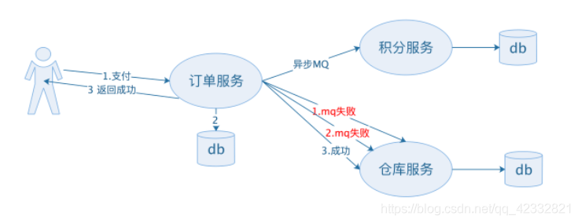

# 分布式存储架构

> 作者: 潘深练
>
> 创建: 2022-11-14
>
> 版权声明：自由转载-非商用-非衍生-保持署名（[创意共享3.0许可证](https://creativecommons.org/licenses/by-nc-nd/3.0/deed.zh)）

## 一、网络分区与CAP

### 1.1、简单CAP之间关系

单机系统，最大的特点，状态要么成功，要么失败，我们认为是 **二态**，二态中基本涉及：

- 计算
- 存储

而分布式系统中，则为 **三态**，除了成功、失败，中间还有个未知态，或认为是网络故障，失联了，三态中基本涉及：

- 计算
- 存储
- **网络**

既然是分布式（集群），那在网络故障中势必可能出现 **网络分区**，简单理解在一个集群中切割成两个分区或更多分区，当然这个集群可以是集中式也可以是非集中式。

而网络分区则就引入 CAP 之 P （Partition tolerance，分区容错性），一旦有了分区，那就引出了另外的问题？

- **1、我们要求他们之间数据一致吗？**
    - 1.1、假如我们要求数据一定要强一致，那就是 C （Consistency，一致性）
    - 1.2、假如对数据一致性的要求是没那么强，那么我们提出另外的问题？
        - **1.2.1、分区还提供服务吗？**
        - 假如我们要求提供服务，那就是 A （Availability，可用性）？

所以简单分析分布式系统只能在 CP 与 AP 之间取舍， 因为从 P -> C ，或者 P -> A 是不同的分支路线。

**强一致 or 高可用 ？ 选其一！**

### 1.2、简单BASE

另外，数据不要求强一致，每个应用可以根据自身的业务特定，采用合适的方式来达到最终一致性，保障服务基本可用，允许软状态。

则为 BASE 定理，是 CAP 中一致性和可用性的权衡结果，它来自大规模互联网分布式系统的总结，是基于 CAP 定理逐步演化而来的，BASE 是 ：

- Basically Available (基本可用)
- Soft state (软状态)
- Eventually consistent (最终一致性)

BASE定理的 **基本可用性**

损失相应时间:CAP可用性的服务相应时间可能是10ms，而BASE基本可用性的相应时间1-2s，即允许损失部分可用性的(时间上的损失）

损失系统功能：BASE的基本可用性是允许某个服务出现故障时，采用服务降级等手段保证用户的体验性，即允许损失部分系统功能。

BASE定理的 **软状态**

硬状态，指的类似 ACID 的原子性。硬状态只有在订单状态、积分发送成功、仓库出单成功，即三者同时成功的情况才算支付成功。

允许存在中间软状态。

先把订单状态改成已支付成功，然后告诉用户已经成功了

剩下在异步发送mq消息通知积分服务和仓库服务等

即使消费失败，MQ消息也会重新发送（重试）。

BASE定理的 **最终一致性**

最终一致性：和强一致性相反，数据不用即使一致。

实现最终一致性：一般是通异步来实现的，失败了就重试。在不影响用户体验的情况下，可以延时，即使失败了采用重试处理。

### 1.3、网络分区及解决办法

> 通常情况下，网络分区指的是在分布式集群中，节点之间由于网络不通，导致集群中节点形成不同的子集，子集中节点间的网络相通，而子集和子集间网络不通。也可以说，网络分区是子集与子集之间在网络上相互隔离了。网络分区就是其中的一种故障类型。

在分布式集群中，不同的集群架构网络分区的形态略有不同。所以，要判断是否发生了网络分区，我们需要弄清楚不同的分布式集群架构，即集中式架构和非集中式架构中的网络分区形态是什么样的。

- 图 1、集中式架构中网络分区的形态

- 图 2、非集中式架构中网络分区的形态

从集中式和非集中式这两种分布式集群架构的网络分区形态可以看出，**要判断是否形成网络分区，最朴素的方法就是判断节点之间心跳是否超时，然后将心跳可达的节点归属到一个子集中。**

由于非集中式系统中，每个节点都是对等的、提供的服务相同，所以当多个子集群之间不可达，或部分节点出现故障后，尽管提供的服务质量（SLA）可能会下降，但并不影响这些剩余节点或子集群对外提供服务。所以，接下来我将与你重点讨论集中式系统的网络分区问题。

**网络分区最微妙的地方在哪里？**

在工作和生活中遇到一个问题，你的本能反应估计是，有问题就解决问题好了。而网络分区最微妙的地方在于，你很难通过程序去判断问题到底出在哪里，而只能通过心跳等手段知道部分节点的网络不可达了。

但，导致节点不可达的原因有很多，有可能是网络的原因，也有可能是节点本身的问题。也就是说，我们无法通过一些症状就判断出是否真的产生了分区。另外，你也很难通过程序去判断这个问题是不是很快就会被恢复。这也是应对网络分区问题最微妙的地方。

**网络分区出现概率较高的场景是什么？**

**网络分区肯定是就同一个集群而言的。**对于不同集群来说，正是因为集群间本就没有太多的交互，才需要从逻辑上分割成不同的集群，这些逻辑上不同的集群本就是可以独立对外提供服务的。

当集群跨多个网络时，确实正如这位同学所说，从概率上讲相对容易出现网络分区的情况，比如一个业务集群部署在多个数据中心时。所以，集群跨多网络部署时，就是网络分区出现概率较高的场景。

接下来，我们看看如何处理网络分区吧。

**网络分区有哪些常见的处理方法？**

为了不影响分布式系统的高可用性，检测到网络分区后，我们就需要尽快地进行处理。

假如，**我们采用一种非常激进的方式去处理**，即一旦发现节点不可达，则将不可达节点从现有集群中剔除，并在这个新集群中选出新的主。

以图 1 所示集中式集群为例，当备 Master、Slave3 和 Slave4 节点检测到主 Master、Slave1 和 Slave2 节点不可达时，剔除这些不可达节点后，备 Master 升主，连同 Slave3 和 Slave4 节点组成一个新的集群。

如果不可达是由于节点故障导致的，那么这种策略没有任何问题。这些剩余节点组成的集群可以继续对外提供服务。但，如果不可达是因为网络故障引起的，那么集群中的另一个子集，即主 Master、Slave1 和 Slave2，也会采用同样的策略，仍然对外提供服务。这时，集群就会出现双主问题了。

假如，**我们采用一种保守的方式去处理**，即节点一旦发现某些节点不可达，则直接停止自己的服务。这样确实解决了双主的问题，但因为不同分区之间的不可达是相互的，且所有的分区都采取了这种停服策略，就会导致系统中所有的节点都停止服务，整个系统完全不可用。这显然也不是我们想看到的。

那么，当系统中出现节点不可达后，如何在不出现双主的情况下，尽可能地提升系统的可用性呢？或者说，有没有什么更均衡的策略呢？

接下来，我就与你分享四种均衡的网络分区处理方法，即 Static Quorum、Keep Majority、设置仲裁机制和基于共享资源的方式。

- 方法一：通过 Static Quorum 处理网络分区
    - Static Quorum 是一种固定票数的策略。在系统启动之前，先设置一个固定票数。当发生网络分区后，如果一个分区中的节点数大于等于这个固定票数，则该分区为活动分区。
    - 为了保证发生分区后，不会出现多个活动分区，导致出现双主或多主的问题，需要对固定票数的取值进行一些约束，即：**固定票数≤ 总节点数≤2* 固定票数 - 1**。
    - 这个策略的优点是，简单、容易实现，但却存在两个问题：
        - 一是，对于分区数比较少的时候，比方 2 个分区时，该策略很容易选出一个唯一的活动分区。但是，当活动分区非常多的时候，由于各个分区的票数分散，不容易找到一个满足条件的分区，没有活动分区也就意味着整个集群不可用了。
        - 二是，由于这种策略里固定票数是固定不变的，所以不适用于集群中有动态节点加入的场景。

- 方法二：通过 Keep Majority 处理网络分区
    - 顾名思义，Keep Majority 就是保留具备大多数节点的子集群。由于不限定每个分区的节点数超过一个固定的票数，所以可以应用于动态节点加入的场景。
    - 假设，集群数为 n，出现网络分区后，保留的子集群为节点数 w≥n/2 的集群。为防止出现双主或两个集群同时工作的情况，通常将集群总节点数 n 设置为奇数。
    - 可想而知，若集群总数为偶数，比如图 1 集中式架构的例子中，子集群 1 和 2 都包含 2 个 Slave 节点，就会导致两个子集群同时存活，在业务场景只允许一个主的情况下，会导致业务运行不正确。
    - 那么，如果真的出现了集群总节点数为偶数，两个子集群节点数均为总数一半时，又应该如何解决分区问题呢？
    - 这时，我们可以在 Keep Majority 的基础上，叠加一些策略，比如保留集群节点 ID 最小的节点所在的子集群。如图 1 所示，假设集群节点总数为 6，现在因为网络故障形成网络分区子集群 1{主 Master，Slave1, Slave2}和子集群 2{备 Master，Slave3, Slave4}，假设 Slave1 是 ID 最小的节点，那么此时要保留包含 Slave1 的子集群 1。
    - 虽然 Keep Majority 方法可以解决动态节点加入的问题，但也不适用于产生多分区的场景。因为随着分区数增多、节点分散，也难以在众多分区中出现一个节点数 w≥n/2 的分区。
    - 集群跨多个网络部署时更容易产生网络分区，因此我不推荐采用 Static Quorum 和 Keep Majority 方法去处理跨多网络集群的网络分区问题。

- 方法三：通过设置仲裁机制处理网络分区
    - 设置仲裁机制的核心是，引入一个第三方组件或节点作为仲裁者，该仲裁者可以与集群中的所有节点相连接，集群中所有节点将自己的心跳信息上报给这个中心节点。因此，该中心节点拥有全局心跳信息，可以根据全局心跳信息判断出有多少个分区。当出现网络分区后，由仲裁者确定保留哪个子集群，舍弃哪些子集群。
    - 如下图所示，假设引入 Node0 作为第三个节点，该节点 IP 为 10.12.24.35，当出现网络分区子集群 1{Node1, Node3}和子集群 2{Node2, Node4}时，每个子集群中选择一个 Leader 节点并 ping 一下 Node0 的 IP，能 ping 通则保留，否则舍弃。比如下图中，子集群 1 可以 ping 通，子集群 2 ping 不通，因此保留子集群 1。（图 3 通过设置仲裁机制处理网络分区）
    - 

- 方法四：基于共享资源的方式处理网络分区
    - 说到共享资源，我们需要先回顾下分布式锁的相关知识。分布式锁是实现多个进程有序、避免冲突地访问共享资源的一种方式。
    - 基于共享资源处理网络分区的核心，其实就类似于分布式锁的机制。也就是，哪个子集群获得共享资源的锁，就保留该子集群。获得锁的集群提供服务，只有当该集群释放锁之后，其他集群才可以获取锁。
    - 这种方式的问题是，如果获取锁的节点发生故障，但未释放锁，会导致其他子集群不可用。因此，这种方式适用于获取锁的节点可靠性有一定保证的场景。
    - 基于仲裁和共享资源的网络分区处理方法，其实都是依赖一个三方的节点或组件，然后借助这个第三方来保证系统中同时只有一个活动分区。所以，这两种处理方法适用于有一个稳定可靠的三方节点或组件的场景。

**关于网络分区的处理方法，其本质就是，在产生分区后，选出一个分区，保证同时最多有一个分区对外提供服务。** 基于此梳理了四种常见的处理方法，包括 Static Quorum、Keep Majority、设置仲裁机制和基于共享资源的方式。

其中，基于 Static Quorum 的方法，因为涉及固定票数策略，所以不适用于处理多个分区，以及有动态节点加入的场景；基于 Keep Majority 的方法，可以解决动态节点场景下分区问题，但因为要求子集群节点数≥1/2 总节点数，所以也不适用于处理多个分区的情况；而基于仲裁和共享资源的网络分区处理方法，其实都是依赖一个三方的节点或组件，所以适用于有一个稳定可靠的三方节点或组件的场景。

## 二、分布式存储架构

基于对 CAP 和 BASE 的简单理解，我们看分布式存储系统，但凡是存储系统，势必有状态，于是我们就又产生一些问题？ **当网络分区（P）时，数据还要强一致（C）吗？还是高可用（A）？**

详见 ProcessOn - [分布式存储架构](https://www.processon.com/view/link/6371bec26376897f2b740023)

!> 图片预览效果不佳，具体请打开以上详细链接

<iframe id="embed_dom" name="embed_dom" frameborder="0" style="display:block;width:100%; height:1200px;" src="https://www.processon.com/view/link/6371bec26376897f2b740023"></iframe>

详见 ProcessOn - [分布式存储架构](https://www.processon.com/view/link/6371bec26376897f2b740023)

!> 图片预览效果不佳，具体请打开以上详细链接

