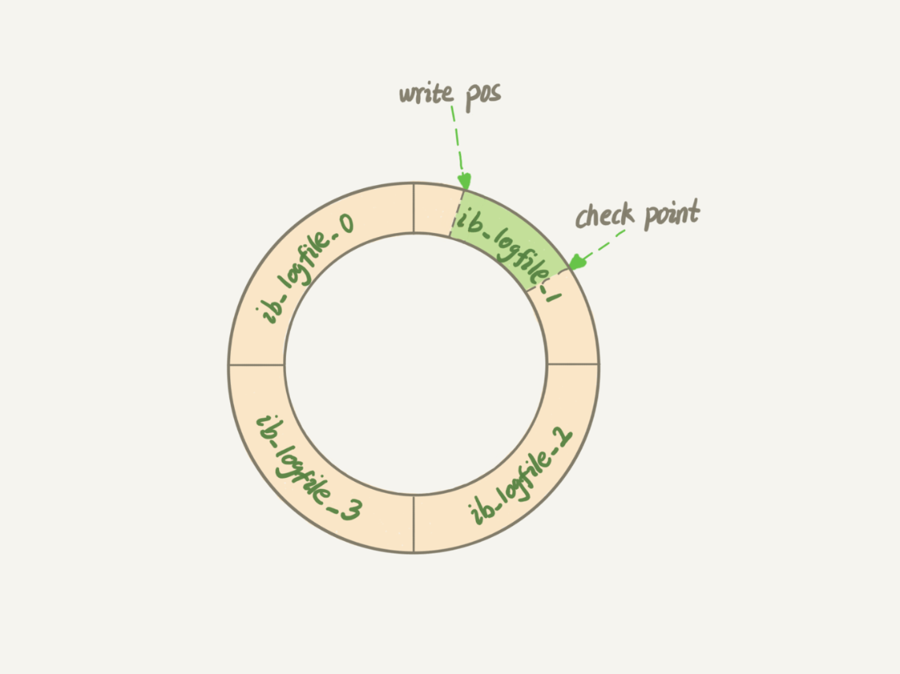

# MySQL数据库QA

> 作者: 潘深练
>
> 创建: 2022-03-31

## 架构

### MySQL的逻辑架构图
- 

### 功能模块
- MySQL的框架有几个组件, 各是什么作用? 
    - 连接器：负责跟客户端建立连接、获取权限、维持和管理连接。
    - 查询缓存：查询请求先访问缓存(key 是查询的语句，value 是查询的结果)。命中直接返回。不推荐使用缓存，更新会把缓存清除(关闭缓存：参数 query_cache_type 设置成 DEMAND)。
    - 分析器：对 SQL 语句做解析，判断sql是否正确。
    - 优化器：决定使用哪个索引，多表关联（join）的时候，决定各个表的连接顺序。
    - 执行器：执行语句，先判断用户有无查询权限，使用表定义的存储引擎。

- Server层和存储引擎层各是什么作用?
    - Server 层主要是功能层面，包括连接器、查询缓存、分析器、优化器、执行器等，涵盖 MySQL 的大多数核心服务功能，以及所有的内置函数（如日期、时间、数学和加密函数等），所有跨存储引擎的功能都在这一层实现，比如存储过程、触发器、视图等。
    - 存储引擎层主要是存储相关，负责数据的存储和提取。其架构模式是插件式的，支持 InnoDB、MyISAM、Memory 等多个存储引擎。现在最常用的存储引擎是 InnoDB，它从 MySQL 5.5.5 版本开始成为了默认存储引擎。

- you have an error in your SQL syntax 这个保存是在词法分析里还是在语法分析里报错?
    - 语法分析
    - 【延伸】分析器如果没有命中查询缓存，就会开始真正执行语句了。首先，MySQL 需要知道你要做什么，因此需要对 SQL 语句做解析。分析器先会做 `词法分析`。你输入的是由多个字符串和空格组成的一条 SQL 语句，MySQL 需要识别出里面的字符串分别是什么，代表什么。MySQL 从你输入的 `select` 这个关键字识别出来，这是一个查询语句。它也要把字符串 `T` 识别成 `表名 T`，把字符串 `ID` 识别成 `列 ID`。做完了这些识别以后，就要做 `语法分析`。根据词法分析的结果，语法分析器会根据语法规则，判断你输入的这个 SQL 语句是否满足 MySQL 语法。如果你的语句不对，就会收到 `You have an error in your SQL syntax` 的错误提醒。

- 对于表的操作权限验证在哪里进行?
    - 执行器和优化器。
    - 【详细】MySQL 通过分析器知道了你要做什么，通过优化器知道了该怎么做，于是就进入了执行器阶段，开始执行语句。开始执行的时候，要先判断一下你对这个表 T 有没有执行查询的权限，如果没有，就会返回没有权限的错误 (在工程实现上，如果命中查询缓存，会在查询缓存返回结果的时候，做权限验证。查询也会在优化器之前调用 `precheck` 验证权限)。如果有权限，就打开表继续执行。打开表的时候，执行器就会根据表的引擎定义，去使用这个引擎提供的接口，进行数据提取索要。

- 执行器的执行查询语句的流程是什么样的? 
    - 例如 SQL 语句 ： `select * from T where ID=10 ;` 
    - 1、调用 InnoDB 引擎接口取这个表的第一行，判断 ID 值是不是 10，如果不是则跳过，如果是则将这行存在结果集中；
    - 2、调用引擎接口取“下一行”，重复相同的判断逻辑，直到取到这个表的最后一行。
    - 3、执行器将上述遍历过程中所有满足条件的行组成的记录集作为结果集返回给客户端。

- MySQL的查询缓存是如何工作的？
    - MySQL 拿到一个查询请求后，会先到查询缓存看看，之前是不是执行过这条语句。之前执行过的语句及其结果可能会以 key-value 对的形式，被直接缓存在内存中。key 是查询的语句，value 是查询的结果。如果你的查询能够直接在这个缓存中找到 key，那么这个 value 就会被直接返回给客户端。
    - 如果语句不在查询缓存中，就会继续后面的执行阶段。执行完成后，执行结果会被存入查询缓存中。你可以看到，如果查询命中缓存，MySQL 不需要执行后面的复杂操作，就可以直接返回结果，这个效率会很高。

- 大多数情况下不建议使用查询缓存，为什么呢？
    - 因为查询缓存往往弊大于利。
    - 查询缓存的失效非常频繁，只要有对一个表的更新，这个表上所有的查询缓存都会被清空。因此很可能你费劲地把结果存起来，还没使用呢，就被一个更新全清空了。对于更新压力大的数据库来说，查询缓存的命中率会非常低。除非你的业务就是有一张静态表，很长时间才会更新一次。比如，一个系统配置表，那这张表上的查询才适合使用查询缓存。
    - 好在 MySQL 也提供了这种“按需使用”的方式。你可以将参数 query_cache_type 设置成 DEMAND，这样对于默认的 SQL 语句都不使用查询缓存。而对于你确定要使用查询缓存的语句，可以用 SQL_CACHE 显式指定，像下面这个语句一样：` select SQL_CACHE * from T where ID=10 ;`
    - 需要注意的是，MySQL 8.0 版本直接将查询缓存的整块功能删掉了，也就是说 8.0 开始彻底没有这个功能了。

- InnoDB 的 redo log 是什么？crash-safe 能力指什么？
    - `redo log` 是 `InnoDB` 引擎中的重做日志。`redo log` 是固定大小的，比如可以配置为一组 4 个文件，每个文件的大小是 1GB，那么总共就可以记录 4GB 的操作。从头开始写，写到末尾就又回到开头循环写，如下面这个图所示。 
    - 
    - `write pos` 是当前记录的位置，一边写一边后移，写到第 3 号文件末尾后就回到 0 号文件开头。`checkpoint` 是当前要擦除的位置，也是往后推移并且循环的，擦除记录前要把记录更新到数据文件。
    - `write pos` 和 `checkpoint` 之间的是空闲部分，可以用来记录新的操作。如果 `write pos` 追上 `checkpoint`，表示满了，这时候不能再执行新的更新，得停下来先擦掉一些记录，把 `checkpoint` 推进一下。
    - 有了 `redo log`，`InnoDB` 就可以保证即使数据库发生异常重启，之前提交的记录都不会丢失，这个能力称为 `crash-safe`。

- binlog 和 redo log 有什么关系？
    - 1、`redo log` 是 `InnoDB` 引擎特有的；binlog 是 MySQL 的 Server 层实现的，所有引擎都可以使用。
    - 2、`redo log` 是物理日志，记录的是“在某个数据页上做了什么修改”；`binlog` 是逻辑日志，记录的是这个语句的原始逻辑，比如 `update T set c=c+1 where ID=2;` 中 “给 ID=2 这一行的 c 字段加 1 ”。
    - 3、`redo log` 是循环写的，空间固定会用完；`binlog` 是可以追加写入的。“追加写”是指 `binlog` 文件写到一定大小后会切换到下一个，并不会覆盖以前的日志。
    - 4、`redolog`和`binlog`具有关联行，在恢复数据时，`redolog`用于恢复主机故障时的未更新的物理数据，`binlog`用于备份操作。每个阶段的log操作都是记录在磁盘的，在恢复数据时，`redolog` 状态为 **commit** 则说明`binlog`也成功，直接恢复数据；如果`redolog`是 **prepare**，则需要查询对应的`binlog`事务是否成功，决定是回滚还是执行。

- 为什么会有两份日志呢？
    - 因为最开始 MySQL 里并没有 `InnoDB` 引擎。MySQL 自带的引擎是 `MyISAM`，但是 `MyISAM` 没有 `crash-safe` 的能力，`binlog` 日志只能用于归档。而 InnoDB 是另一个公司以插件形式引入 MySQL 的，既然只依靠 binlog 是没有 `crash-safe` 能力的，所以 `InnoDB` 使用另外一套日志系统——也就是 `redo log` 来实现 `crash-safe` 能力。