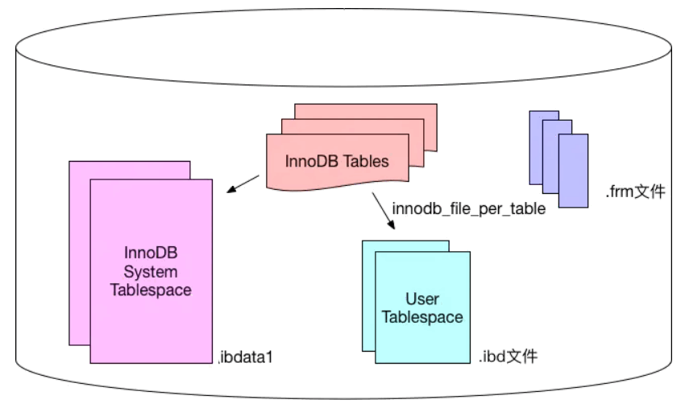

# MySQL数据库QA

> 作者: 潘深练
>
> 创建: 2022-03-31

## 〇、MySQL前言

### 0.1、MySQL起源和分支

MySQL 是最流行的关系型数据库软件之一，由于其体积小、速度快、开源免费、简单易用、维护成本低等，在集群架构中易于扩展、高可用，因此深受开发者和企业的欢迎。

MySQL发展历程如下：

MySQL主流分支如下图所示：

MySQL从最初的1.0、3.1到后来的8.0，发生了各种各样的变化。被Oracle收购后，MySQL的版本演化出了多个分支，除了需要付费的MySQL企业版本，还有很多MySQL社区版本。还有一条分支非常流行的开源分支版本叫Percona Server，它是MySQL的技术支持公司Percona推出的，也是在实际工作中经常碰到的。Percona Server在MySQL官方版本的基础上做了一些补丁和优化，同时推出了一些工具。另外一个非常不错的版本叫MariaDB，它是MySQL的公司被Oracle收购后，MySQL的创始人Monty先生，按原来的思路重新写的一套新数据库，同时也把 InnoDB 引擎作为主要存储引擎，也算 MySQL 的分支。

### 0.2、MySQL应用架构演变

网站在不同的并发访问量级和数据量级下，MySQL应用架构的演变过程。

用户请求 --> 应用层 --> 服务层 --> 存储层

#### 架构V1.0 - 单机单库

一个简单的小型网站或者应用背后的架构可以非常简单, 数据存储只需要一个MySQL Instance就能满足数据读取和写入需求（这里忽略掉了数据备份的实例），处于这个的阶段系统，一般会把所有的信息存到一个MySQL Instance里面。

#### V1.0 瓶颈

- 数据量太大，超出一台服务器承受
- 读写操作量太大，超出一台服务器承受
- 一台服务器挂了，应用也会挂掉（可用性差）

#### 架构V2.0 - 主从架构

V2.0架构主要解决架构V1.0下的 **高可用** 和 **读扩展** 问题，通过给Instance挂载从库解决读取的压力，主库宕机也可以通过主从切换保障高可用。在MySQL的场景下就是通过主从结构（双主结构也属于特殊的主从），主库抗写压力，通过从库来分担读压力，对于写少读多的应用，V2.0主从架构完全能够胜任。

#### V2.0瓶颈

- 数据量太大，超出一台服务器承受
- 写操作太大，超出一台M服务器承受

#### 架构V3.0 - 分库分表

对于V1.0和V2.0遇到 **写入瓶颈** 和 **存储瓶颈** 时，可以通过水平拆分来解决，水平拆分和垂直拆分有较大区别，垂直拆分拆完的结果，每一个实例都是拥有全部数据的，而水平拆分之后，任何实例都只有全量的1/n的数据。以下图所示，将Userinfo拆分为3个Sharding，每个Sharding持有总量的1/3数据，3个Sharding数据的总和等于一份完整数据。

#### V3.0挑战

- 数据如何路由成为一个关键问题， 一般可以采用范围拆分，List拆分、Hash拆分等。
- 如何保持数据的一致性也是个难题。

#### 架构V4.0 - 云数据库

云数据库（云计算）现在是各大IT公司内部作为 **节约成本** 的一个突破口，对于数据存储的MySQL来说，如何让其成为一个saas（Software as a Service）是关键点。MySQL作为一个saas服务，服务提供商负责解决 **可配置性**，**可扩展性**，**多用户存储结构设计** 等这些疑难问题。

## 一、MySQL架构原理

### 1.1、MYSQL体系架构

MySQL Server架构自顶向下大致可以分网络连接层、服务层、存储引擎层和系统文件层。

#### 1）、网络连接层

客户端连接器（Client Connectors）：提供与MySQL服务器建立的支持。目前几乎支持所有主流的服务端编程技术，例如常见的 Java、C、Python、.NET等，它们通过各自API技术与MySQL建立连接。

#### 2）、服务层（MySQL Server）

服务层是MySQL Server的核心，主要包含 **系统管理和控制工具**、**连接池**、**SQL接口**、**解析器**、**查询优化器**和**缓存**六个部分。

- **连接池（Connection Pool）**：负责存储和管理客户端与数据库的连接，一个线程负责管理一个连接。

- **系统管理和控制工具（Management Services & Utilities）**：例如备份恢复、安全管理、集群管理等

- **SQL接口（SQL Interface）**：用于接受客户端发送的各种SQL命令，并且返回用户需要查询的结果。比如DML、DDL、存储过程、视图、触发器等。

- **解析器（Parser）**：负责将请求的SQL解析生成一个"解析树"。然后根据一些MySQL规则进一步检查解析树是否合法。

- **查询优化器（Optimizer）**：当“解析树”通过解析器语法检查后，将交由优化器将其转化成执行计划，然后与存储引擎交互。

> 
> select uid,name from user where gender=1;
> 
> 选取--》投影--》联接 策略
> 
> 1）select先根据where语句进行选取，并不是查询出全部数据再过滤
> 
> 2）select查询根据uid和name进行属性投影，并不是取出所有字段
> 
> 3）将前面选取和投影联接起来最终生成查询结果
> 

- **缓存（Cache&Buffer）**： 缓存机制是由一系列小缓存组成的。比如表缓存，记录缓存，权限缓存，引擎缓存等。如果查询缓存有命中的查询结果，查询语句就可以直接去查询缓存中取数据。

#### 3）、存储引擎层（Pluggable Storage Engines）

存储引擎负责MySQL中数据的存储与提取，与底层系统文件进行交互。MySQL存储引擎是插件式的，服务器中的查询执行引擎通过接口与存储引擎进行通信，接口屏蔽了不同存储引擎之间的差异 。现在有很多种存储引擎，各有各的特点，最常见的是 **MyISAM** 和 **InnoDB**。

#### 4）、系统文件层（File System）

该层负责将数据库的数据和日志存储在文件系统之上，并完成与存储引擎的交互，是文件的物理存储层。主要包含日志文件，数据文件，配置文件，pid 文件，socket 文件等。

- **日志文件**  
    - 错误日志（Error log）
        - 默认开启，show variables like '%log_error%'
    - 通用查询日志（General query log）
        - 记录一般查询语句，show variables like '%general%';
    - 二进制日志（binary log）
        - 记录了对MySQL数据库执行的更改操作，并且记录了语句的发生时间、执行时长；但是它不
        - 记录select、show等不修改数据库的SQL。主要用于数据库恢复和主从复制。
        - show variables like '%log_bin%'; //是否开启
        - show variables like '%binlog%'; //参数查看
        - show binary logs;//查看日志文件
    - 慢查询日志（Slow query log）
        - 记录所有执行时间超时的查询SQL，默认是10秒。
        - show variables like '%slow_query%'; //是否开启
        - show variables like '%long_query_time%'; //时长

- **配置文件**
    - 用于存放MySQL所有的配置信息文件，比如my.cnf、my.ini等。

- **数据文件**
    - db.opt 文件：记录这个库的默认使用的字符集和校验规则。
    - frm 文件：存储与表相关的元数据（meta）信息，包括表结构的定义信息等，每一张表都会有一个frm 文件。
    - MYD 文件：MyISAM 存储引擎专用，存放 MyISAM 表的数据（data)，每一张表都会有一个.MYD 文件。
    - MYI 文件：MyISAM 存储引擎专用，存放 MyISAM 表的索引相关信息，每一张 MyISAM 表对应一个 .MYI 文件。
    - ibd文件和 IBDATA 文件：存放 InnoDB 的数据文件（包括索引）。InnoDB 存储引擎有两种表空间方式：独享表空间和共享表空间。独享表空间使用 .ibd 文件来存放数据，且每一张InnoDB 表对应一个 .ibd 文件。共享表空间使用 .ibdata 文件，所有表共同使用一个（或多个，自行配置）.ibdata 文件。
    - ibdata1 文件：系统表空间数据文件，存储表元数据、Undo日志等 。
    - ib_logfile0、ib_logfile1 文件：Redo log 日志文件。

- **pid 文件**
    - pid 文件是 mysqld 应用程序在 Unix/Linux 环境下的一个进程文件，和许多其他 Unix/Linux 服务端程序一样，它存放着自己的进程 id。

- **socket 文件**
    - socket 文件也是在 Unix/Linux 环境下才有的，用户在 Unix/Linux 环境下客户端连接可以不通过 TCP/IP 网络而直接使用 Unix Socket 来连接 MySQL。

### 1.2、MySQL的执行逻辑

#### 1）、MySQL组件QA

- MySQL的框架有几个组件, 各是什么作用? 
    - 连接器：负责跟客户端建立连接、获取权限、维持和管理连接。
    - 查询缓存：查询请求先访问缓存(key 是查询的语句，value 是查询的结果)。命中直接返回。不推荐使用缓存，更新会把缓存清除(关闭缓存：参数 query_cache_type 设置成 DEMAND)。
    - 分析器：对 SQL 语句做解析，判断sql是否正确。
    - 优化器：决定使用哪个索引，多表关联（join）的时候，决定各个表的连接顺序。
    - 执行器：执行语句，先判断用户有无查询权限，使用表定义的存储引擎。

- Server层和存储引擎层各是什么作用?
    - Server 层主要是功能层面，包括连接器、查询缓存、分析器、优化器、执行器等，涵盖 MySQL 的大多数核心服务功能，以及所有的内置函数（如日期、时间、数学和加密函数等），所有跨存储引擎的功能都在这一层实现，比如存储过程、触发器、视图等。
    - 存储引擎层主要是存储相关，负责数据的存储和提取。其架构模式是插件式的，支持 InnoDB、MyISAM、Memory 等多个存储引擎。现在最常用的存储引擎是 InnoDB，它从 MySQL 5.5.5 版本开始成为了默认存储引擎。

- you have an error in your SQL syntax 这个保存是在词法分析里还是在语法分析里报错?
    - 语法分析
    - 【延伸】分析器如果没有命中查询缓存，就会开始真正执行语句了。首先，MySQL 需要知道你要做什么，因此需要对 SQL 语句做解析。分析器先会做 `词法分析`。你输入的是由多个字符串和空格组成的一条 SQL 语句，MySQL 需要识别出里面的字符串分别是什么，代表什么。MySQL 从你输入的 `select` 这个关键字识别出来，这是一个查询语句。它也要把字符串 `T` 识别成 `表名 T`，把字符串 `ID` 识别成 `列 ID`。做完了这些识别以后，就要做 `语法分析`。根据词法分析的结果，语法分析器会根据语法规则，判断你输入的这个 SQL 语句是否满足 MySQL 语法。如果你的语句不对，就会收到 `You have an error in your SQL syntax` 的错误提醒。

- 对于表的操作权限验证在哪里进行?
    - 执行器和优化器。
    - 【详细】MySQL 通过分析器知道了你要做什么，通过优化器知道了该怎么做，于是就进入了执行器阶段，开始执行语句。开始执行的时候，要先判断一下你对这个表 T 有没有执行查询的权限，如果没有，就会返回没有权限的错误 (在工程实现上，如果命中查询缓存，会在查询缓存返回结果的时候，做权限验证。查询也会在优化器之前调用 `precheck` 验证权限)。如果有权限，就打开表继续执行。打开表的时候，执行器就会根据表的引擎定义，去使用这个引擎提供的接口，进行数据提取索要。

- 执行器的执行查询语句的流程是什么样的? 
    - 例如 SQL 语句 ： `select * from T where ID=10 ;` 
    - 1、调用 InnoDB 引擎接口取这个表的第一行，判断 ID 值是不是 10，如果不是则跳过，如果是则将这行存在结果集中；
    - 2、调用引擎接口取“下一行”，重复相同的判断逻辑，直到取到这个表的最后一行。
    - 3、执行器将上述遍历过程中所有满足条件的行组成的记录集作为结果集返回给客户端。

- MySQL的查询缓存是如何工作的？
    - MySQL 拿到一个查询请求后，会先到查询缓存看看，之前是不是执行过这条语句。之前执行过的语句及其结果可能会以 key-value 对的形式，被直接缓存在内存中。key 是查询的语句，value 是查询的结果。如果你的查询能够直接在这个缓存中找到 key，那么这个 value 就会被直接返回给客户端。
    - 如果语句不在查询缓存中，就会继续后面的执行阶段。执行完成后，执行结果会被存入查询缓存中。你可以看到，如果查询命中缓存，MySQL 不需要执行后面的复杂操作，就可以直接返回结果，这个效率会很高。

- 大多数情况下不建议使用查询缓存，为什么呢？
    - 因为查询缓存往往弊大于利。
    - 查询缓存的失效非常频繁，只要有对一个表的更新，这个表上所有的查询缓存都会被清空。因此很可能你费劲地把结果存起来，还没使用呢，就被一个更新全清空了。对于更新压力大的数据库来说，查询缓存的命中率会非常低。除非你的业务就是有一张静态表，很长时间才会更新一次。比如，一个系统配置表，那这张表上的查询才适合使用查询缓存。
    - 好在 MySQL 也提供了这种“按需使用”的方式。你可以将参数 query_cache_type 设置成 DEMAND，这样对于默认的 SQL 语句都不使用查询缓存。而对于你确定要使用查询缓存的语句，可以用 SQL_CACHE 显式指定，像下面这个语句一样：` select SQL_CACHE * from T where ID=10 ;`
    - 需要注意的是，MySQL 8.0 版本直接将查询缓存的整块功能删掉了，也就是说 8.0 开始彻底没有这个功能了。

- InnoDB 的 redo log 是什么？crash-safe 能力指什么？
    - `redo log` 是 `InnoDB` 引擎中的重做日志。`redo log` 是固定大小的，比如可以配置为一组 4 个文件，每个文件的大小是 1GB，那么总共就可以记录 4GB 的操作。从头开始写，写到末尾就又回到开头循环写，如下面这个图所示。 
    - 
    - `write pos` 是当前记录的位置，一边写一边后移，写到第 3 号文件末尾后就回到 0 号文件开头。`checkpoint` 是当前要擦除的位置，也是往后推移并且循环的，擦除记录前要把记录更新到数据文件。
    - `write pos` 和 `checkpoint` 之间的是空闲部分，可以用来记录新的操作。如果 `write pos` 追上 `checkpoint`，表示满了，这时候不能再执行新的更新，得停下来先擦掉一些记录，把 `checkpoint` 推进一下。
    - 有了 `redo log`，`InnoDB` 就可以保证即使数据库发生异常重启，之前提交的记录都不会丢失，这个能力称为 `crash-safe`。

- binlog 和 redo log 有什么关系？
    - 1、`redo log` 是 `InnoDB` 引擎特有的；binlog 是 MySQL 的 Server 层实现的，所有引擎都可以使用。
    - 2、`redo log` 是物理日志，记录的是“在某个数据页上做了什么修改”；`binlog` 是逻辑日志，记录的是这个语句的原始逻辑，比如 `update T set c=c+1 where ID=2;` 中 “给 ID=2 这一行的 c 字段加 1 ”。
    - 3、`redo log` 是循环写的，空间固定会用完；`binlog` 是可以追加写入的。“追加写”是指 `binlog` 文件写到一定大小后会切换到下一个，并不会覆盖以前的日志。
    - 4、`redolog`和`binlog`具有关联行，在恢复数据时，`redolog`用于恢复主机故障时的未更新的物理数据，`binlog`用于备份操作。每个阶段的log操作都是记录在磁盘的，在恢复数据时，`redolog` 状态为 **commit** 则说明`binlog`也成功，直接恢复数据；如果`redolog`是 **prepare**，则需要查询对应的`binlog`事务是否成功，决定是回滚还是执行。

- 为什么会有两份日志呢？
    - 因为最开始 MySQL 里并没有 `InnoDB` 引擎。MySQL 自带的引擎是 `MyISAM`，但是 `MyISAM` 没有 `crash-safe` 的能力，`binlog` 日志只能用于归档。而 InnoDB 是另一个公司以插件形式引入 MySQL 的，既然只依靠 binlog 是没有 `crash-safe` 能力的，所以 `InnoDB` 使用另外一套日志系统——也就是 `redo log` 来实现 `crash-safe` 能力。

### 1.3、MySQL运行机制

#### 1）、建立连接（Connectors&Connection Pool）

通过客户端/服务器通信协议与MySQL建立连接。MySQL 客户端与服务端的通信方式是 “ **半双工** ”。对于每一个 MySQL 的连接，时刻都有一个线程状态来标识这个连接正在做什么。

**通讯机制：**

- 全双工：能同时发送和接收数据，例如平时打电话。
- 半双工：指的某一时刻，要么发送数据，要么接收数据，不能同时。例如早期对讲机
- 单工：只能发送数据或只能接收数据。例如单行道

**线程状态：**

- show processlist; //查看用户正在运行的线程信息，root用户能查看所有线程，其他用户只能看自己的
    - id：线程ID，可以使用kill xx；
    - user：启动这个线程的用户
    - Host：发送请求的客户端的IP和端口号
    - db：当前命令在哪个库执行
    - Command：该线程正在执行的操作命令
        - Create DB：正在创建库操作
        - Drop DB：正在删除库操作
        - Execute：正在执行一个PreparedStatement
        - Close Stmt：正在关闭一个PreparedStatement
        - Query：正在执行一个语句
        - Sleep：正在等待客户端发送语句
        - Quit：正在退出
        - Shutdown：正在关闭服务器
    - Time：表示该线程处于当前状态的时间，单位是秒
    - State：线程状态
        - Updating：正在搜索匹配记录，进行修改
        - Sleeping：正在等待客户端发送新请求
        - Starting：正在执行请求处理
        - Checking table：正在检查数据表
        - Closing table : 正在将表中数据刷新到磁盘中
        - Locked：被其他查询锁住了记录
        - Sending Data：正在处理Select查询，同时将结果发送给客户端
    - Info：一般记录线程执行的语句，默认显示前100个字符。想查看完整的使用show full processlist;

#### 2）、查询缓存（Cache&Buffer）

这是MySQL的一个可优化查询的地方，如果开启了查询缓存且在查询缓存过程中查询到完全相同的SQL语句，则将查询结果直接返回给客户端；如果没有开启查询缓存或者没有查询到完全相同的 SQL 语句则会由解析器进行语法语义解析，并生成“解析树”。

- 缓存Select查询的结果和SQL语句
- 执行Select查询时，先查询缓存，判断是否存在可用的记录集，要求是否完全相同（包括参数值），这样才会匹配缓存数据命中。
- 即使开启查询缓存，以下SQL也不能缓存
    - 查询语句使用SQL_NO_CACHE
    - 查询的结果大于query_cache_limit设置
    - 查询中有一些不确定的参数，比如now()
- show variables like '%query_cache%'; //查看查询缓存是否启用，空间大小，限制等
- show status like 'Qcache%'; //查看更详细的缓存参数，可用缓存空间，缓存块，缓存多少等

#### 3）、解析器（Parser）

将客户端发送的SQL进行语法解析，生成"解析树"。**预处理器** 根据一些MySQL规则进一步检查“解析树”是否合法，例如这里将检查数据表和数据列是否存在，还会解析名字和别名，看看它们是否有歧义，最后生成新的“解析树”。

#### 4）、查询优化器（Optimizer）

根据“解析树”生成最优的执行计划。MySQL使用很多优化策略生成最优的 **执行计划**，可以分为两类：**静态优化**（编译时优化）、**动态优化**（运行时优化）。

- 等价变换策略
    - 5=5 and a>5 改成 a > 5
    - a < b and a=5 改成b>5 and a=5
    - 基于联合索引，调整条件位置等
- 优化count、min、max等函数
    - InnoDB引擎min函数只需要找索引最左边
    - InnoDB引擎max函数只需要找索引最右边
    - MyISAM引擎count(*)，不需要计算，直接返回
- 提前终止查询
    - 使用了limit查询，获取limit所需的数据，就不在继续遍历后面数据
- in的优化
    - MySQL对in查询，会先进行排序，再采用二分法查找数据。比如where id in (2,1,3)，变成 in (1,2,3)

#### 5）、查询执行引擎

查询执行引擎负责执行 SQL 语句，此时查询执行引擎会根据 SQL 语句中表的存储引擎类型，以及对应的API接口与底层存储引擎缓存或者物理文件的交互，得到查询结果并返回给客户端。若开启用查询缓存，这时会将SQL 语句和结果完整地保存到查询缓存（Cache&Buffer）中，以后若有相同的 SQL 语句执行则直接返回结果。

- 如果开启了查询缓存，先将查询结果做缓存操作
- 返回结果过多，采用增量模式返回

### 1.4、MySQL存储引擎

存储引擎在MySQL的体系架构中位于第三层，负责MySQL中的数据的存储和提取，是与文件打交道的子系统，它是根据MySQL提供的文件访问层抽象接口定制的一种文件访问机制，这种机制就叫作存储引擎。

使用 **show engines** 命令，就可以查看当前数据库支持的引擎信息。

**在5.5版本之前默认采用MyISAM存储引擎，从5.5开始采用InnoDB存储引擎。**

- InnoDB：**支持事务**，具有**提交**，**回滚**和**崩溃恢复**能力，**事务安全**
- MyISAM：不支持事务和外键，**访问速度快**
- Memory：利用内存创建表，访问速度非常快，因为数据在内存，而且默认使用Hash索引，但是一旦关闭，数据就会丢失
- Archive：归档类型引擎，仅能支持insert和select语句
- csv：以CSV文件进行数据存储，由于文件限制，所有列必须强制指定not null，另外CSV引擎也不支持索引和分区，适合做数据交换的中间表
- BlackHole: 黑洞，只进不出，进来消失，所有插入数据都不会保存
- Federated：可以访问远端MySQL数据库中的表。一个本地表，不保存数据，访问远程表内容。
- MRG_MyISAM：一组MyISAM表的组合，这些MyISAM表必须结构相同，Merge表本身没有数据，对Merge操作可以对一组MyISAM表进行操作。

#### 1)、InnoDB和MyISAM对比

InnoDB和MyISAM是使用MySQL时最常用的两种引擎类型，我们重点来看下两者区别。

- 事务和外键

InnoDB支持事务和外键，具有安全性和完整性，适合大量insert或update操作

MyISAM不支持事务和外键，它提供高速存储和检索，适合大量的select查询操作

- 锁机制

InnoDB支持行级锁，锁定指定记录。基于索引来加锁实现。

MyISAM支持表级锁，锁定整张表。

- 索引结构

InnoDB使用聚集索引（聚簇索引），索引和记录在一起存储，既缓存索引，也缓存记录。

MyISAM使用非聚集索引（非聚簇索引），索引和记录分开。

- 并发处理能力

MyISAM使用表锁，会导致写操作并发率低，读之间并不阻塞，读写阻塞。

InnoDB读写阻塞可以与隔离级别有关，可以采用 [多版本并发控制](https://baike.baidu.com/item/MVCC/6298019)（MVCC）来支持高并发

- 存储文件

InnoDB表对应两个文件，一个.frm表结构文件，一个.ibd数据文件。InnoDB表最大支持64TB；

MyISAM表对应三个文件，一个.frm表结构文件，一个MYD表数据文件，一个.MYI索引文件。从MySQL5.0开始默认限制是256TB。

- 适用场景
    - MyISAM
        - 不需要事务支持（不支持）
        - 并发相对较低（锁定机制问题）
        - 数据修改相对较少，以读为主
        - 数据一致性要求不高
    - InnoDB
        - 需要事务支持（具有较好的事务特性）
        - 行级锁定对高并发有很好的适应能力
        - 数据更新较为频繁的场景
        - 数据一致性要求较高
        - 硬件设备内存较大，可以利用InnoDB较好的缓存能力来提高内存利用率，减少磁盘IO
- 总结
    - 两种引擎该如何选择？
        - 是否需要事务？有，InnoDB
        - 是否存在并发修改？有，InnoDB
        - 是否追求快速查询，且数据修改少？是，MyISAM
        - 在绝大多数情况下，推荐使用InnoDB

- 扩展资料：各个存储引擎特性对比

#### 2)、InnoDB存储结构

从MySQL 5.5版本开始默认使用InnoDB作为引擎，它擅长处理事务，具有自动崩溃恢复的特性，在日常开发中使用非常广泛。下面是官方的InnoDB引擎架构图，主要分为内存结构和磁盘结构两大部分。

- **InnoDB内存结构**（内存结构主要包括Buffer Pool、Change Buffer、Adaptive Hash Index和Log Buffer四大组件）

    - Buffer Pool：缓冲池，简称BP。BP以Page页为单位，默认大小16K，BP的底层采用 **链表** 数据结构管理Page。在InnoDB访问表记录和索引时会在Page页中缓存，以后使用可以减少磁盘IO操作，提升效率。
        
        - Page管理机制

        Page根据状态可以分为三种类型：

            - free page ：空闲page，未被使用
            - clean page：被使用page，数据没有被修改过
            - dirty page：脏页，被使用page，数据被修改过，页中数据和磁盘的数据产生了不一致
        
        针对上述三种page类型，InnoDB通过三种链表结构来维护和管理
            
            - free list ：表示空闲缓冲区，管理free page
            - flush list：表示需要刷新到磁盘的缓冲区，管理dirty page，内部page按修改时间排序。脏页即存在于flush链表，也在LRU链表中，但是两种互不影响，LRU链表负责管理page的可用性和释放，而flush链表负责管理脏页的刷盘操作。
            - lru list：表示正在使用的缓冲区，管理clean page和dirty page，缓冲区以midpoint为基点，前面链表称为new列表区，存放经常访问的数据，占63%；后面的链表称为old列表区，存放使用较少数据，占37%。

        - 改进型LRU算法维护
            - 普通LRU：末尾淘汰法，新数据从链表头部加入，释放空间时从末尾淘汰
            - 改性LRU：链表分为new和old两个部分，加入元素时并不是从表头插入，而是从中间midpoint位置插入，如果数据很快被访问，那么page就会向new列表头部移动，如果数据没有被访问，会逐步向old尾部移动，等待淘汰。
            
            每当有新的数据需要使用buffer pool中的page时，InnoDb引擎会判断是否有空闲页，是否足够，如果有就将free page从free list列表删除，放入到LRU列表中。没有空闲页，就会根据LRU算法淘汰LRU链表默认的页，将内存空间释放分配给新的页。
        
        - Buffer Pool配置参数
            - show variables like '%innodb_page_size%'; //查看page页大小
            - show variables like '%innodb_old%'; //查看lru list中old列表参数
            - show variables like '%innodb_buffer%'; //查看buffer pool参数

            建议：将innodb_buffer_pool_size设置为总内存大小的60%-80%，innodb_buffer_pool_instances可以设置为多个，这样可以避免缓存争夺。

    - Change Buffer：写缓冲区，简称CB。在进行DML操作时，如果BP没有其相应的Page数据，并不会立刻将磁盘页加载到缓冲池，而是在CB记录缓冲变更，等未来数据被读取时，再将数据合并恢复到BP中
        - ChangeBuffer占用BufferPool空间，默认占25%，最大允许占50%，可以根据读写业务量来进行调整。参数innodb_change_buffer_max_size;
        - 当更新一条记录时，该记录在BufferPool存在，直接在BufferPool修改，一次内存操作。如果该记录在BufferPool不存在（没有命中），会直接在ChangeBuffer进行一次内存操作，不用再去磁盘查询数据，避免一次磁盘IO。当下次查询记录时，会先进性磁盘读取，然后再从ChangeBuffer中读取信息合并，最终载入BufferPool中。
        - 写缓冲区，仅适用于非唯一普通索引页，为什么？
            - 如果在索引设置唯一性，在进行修改时，InnoDB必须要做唯一性校验，因此必须查询磁盘，做一次IO操作。会直接将记录查询到BufferPool中，然后在缓冲池修改，不会在ChangeBuffer操作。
    
    - Adaptive Hash Index：自适应哈希索引，用于优化对BP数据的查询。InnoDB存储引擎会监控对表索引的查找，如果观察到建立哈希索引可以带来速度的提升，则建立哈希索引，所以称之为自适应。InnoDB存储引擎会自动根据访问的频率和模式来为某些页建立哈希索引。

    - Log Buffer：日志缓冲区，用来保存要写入磁盘上log文件（Redo/Undo）的数据，日志缓冲区的内容定期刷新到磁盘log文件中。日志缓冲区满时会自动将其刷新到磁盘，当遇到BLOB或多行更新的大事务操作时，增加日志缓冲区可以节省磁盘I/O。
        - LogBuffer主要是用于记录InnoDB引擎日志，在DML操作时会产生Redo和Undo日志。
        - LogBuffer空间满了，会自动写入磁盘。可以通过将innodb_log_buffer_size参数调大，减少磁盘IO频率
        - innodb_flush_log_at_trx_commit参数控制日志刷新行为，默认为1
            - 0 ： 每隔1秒写日志文件和刷盘操作（写日志文件LogBuffer--> **OS cache**，刷盘OScache-->磁盘文件），最多丢失1秒数据
            - 1 ： 事务提交，立刻写日志文件和刷盘，数据不丢失，但是会频繁IO操作
            - 2 ： 事务提交，立刻写日志文件，每隔1秒钟进行刷盘操作

- **InnoDB磁盘结构**（InnoDB磁盘主要包含Tablespaces，InnoDB Data Dictionary，Doublewrite Buffer、Redo Log
和Undo Logs。）

    - 表空间（Tablespaces）：用于存储表结构和数据。表空间又分为系统表空间、独立表空间、通用表空间、临时表空间、Undo表空间等多种类型；
        - 系统表空间（The System Tablespace）
        包含InnoDB数据字典，Doublewrite Buffer，Change Buffer，Undo Logs的存储区域。系统表空间也默认包含任何用户在系统表空间创建的表数据和索引数据。系统表空间是一个共享的表空间因为它是被多个表共享的。该空间的数据文件通过参数innodb_data_file_path控制，默认值是ibdata1:12M:autoextend(文件名为ibdata1、12MB、自动扩展)。
        - 独立表空间（File-Per-Table Tablespaces）
        默认开启，独立表空间是一个单表表空间，该表创建于自己的数据文件中，而非创建于系统表空间中。当innodb_file_per_table选项开启时，表将被创建于表空间中。否则，innodb将被创建于系统表空间中。每个表文件表空间由一个.ibd数据文件代表，该文件默认被创建于数据库目录中。表空间的表文件支持动态（dynamic）和压缩（commpressed）行格式。
        - 通用表空间（General Tablespaces）
        通用表空间为通过create tablespace语法创建的共享表空间。通用表空间可以创建于mysql数据目录外的其他表空间，其可以容纳多张表，且其支持所有的行格式。
        
        CREATE TABLESPACE ts1 ADD DATAFILE ts1.ibd Engine=InnoDB; //创建表空间ts1
        CREATE TABLE t1 (c1 INT PRIMARY KEY) TABLESPACE ts1; //将表添加到ts1表空间
        
        - 撤销表空间（Undo Tablespaces）
        撤销表空间由一个或多个包含Undo日志文件组成。在MySQL 5.7版本之前Undo占用的是System Tablespace共享区，从5.7开始将Undo从System Tablespace分离了出来。InnoDB使用的undo表空间由innodb_undo_tablespaces配置选项控制，默认为0。参数值为0表示使用系统表空间ibdata1;大于0表示使用undo表空间undo_001、undo_002等。
        - 临时表空间（Temporary Tablespaces）
        分为session temporary tablespaces 和global temporary tablespace两种。session temporary tablespaces 存储的是用户创建的临时表和磁盘内部的临时表。global temporary tablespace储存用户临时表的回滚段（rollback segments ）。mysql服务器正常关闭或异常终止时，临时表空间将被移除，每次启动时会被重新创建。
    - 数据字典（InnoDB Data Dictionary）
    InnoDB数据字典由内部系统表组成，这些表包含用于查找表、索引和表字段等对象的元数据。元数据物理上位于InnoDB系统表空间中。由于历史原因，数据字典元数据在一定程度上与InnoDB表元数据文件（.frm文件）中存储的信息重叠。
    - 双写缓冲区（Doublewrite Buffer）
    位于系统表空间，是一个存储区域。在BufferPage的page页刷新到磁盘真正的位置前，会先将数据存在Doublewrite 缓冲区。如果在page页写入过程中出现操作系统、存储子系统或mysqld进程崩溃，InnoDB可以在崩溃恢复期间从Doublewrite 缓冲区中找到页面的一个好备份。在大多数情况下，默认情况下启用双写缓冲区，要禁用Doublewrite 缓冲区，可以将innodb_doublewrite设置为0。使用Doublewrite 缓冲区时建议将innodb_flush_method设置为O_DIRECT。
        - MySQL的innodb_flush_method这个参数控制着innodb数据文件及redo log的打开、刷写模式。有三个值：fdatasync(默认)，O_DSYNC，O_DIRECT。设置O_DIRECT表示数据文件写入操作会通知操作系统不要缓存数据，也不要用预读，直接从InnodbBuffer写到磁盘文件。
        - 默认的fdatasync意思是先写入操作系统缓存，然后再调用fsync()函数去异步刷数据文件与redo log的缓存信息。
    - 重做日志（Redo Log）
    重做日志是一种基于磁盘的数据结构，用于在崩溃恢复期间更正不完整事务写入的数据。MySQL以循环方式写入重做日志文件，记录InnoDB中所有对Buffer Pool修改的日志。当出现实例故障（像断电），导致数据未能更新到数据文件，则数据库重启时须redo，重新把数据更新到数据文件。读写事务在执行的过程中，都会不断的产生redo log。默认情况下，重做日志在磁盘上由两个名为ib_logfile0和ib_logfile1的文件物理表示。
    - 撤销日志（Undo Logs）
    撤消日志是在事务开始之前保存的被修改数据的备份，用于例外情况时回滚事务。撤消日志属于逻辑日志，根据每行记录进行记录。撤消日志存在于系统表空间、撤消表空间和临时表空间中。

- **新版本结构演变**
    - 
    - MySQL 5.7 版本
        - 将 Undo日志表空间从共享表空间 ibdata 文件中分离出来，可以在安装 MySQL 时由用户自行指定文件大小和数量。
        - 增加了 temporary 临时表空间，里面存储着临时表或临时查询结果集的数据。
        - Buffer Pool 大小可以动态修改，无需重启数据库实例。
    - MySQL 8.0 版本
        - 将InnoDB表的数据字典和Undo都从共享表空间ibdata中彻底分离出来了，以前需要ibdata中数据字典与独立表空间ibd文件中数据字典一致才行，8.0版本就不需要了。
        - temporary 临时表空间也可以配置多个物理文件，而且均为 InnoDB 存储引擎并能创建索引，这样加快了处理的速度。
        - 用户可以像 Oracle 数据库那样设置一些表空间，每个表空间对应多个物理文件，每个表空间可以给多个表使用，但一个表只能存储在一个表空间中。
        - 将Doublewrite Buffer从共享表空间ibdata中也分离出来了。

#### 3)、InnoDB线程模型
#### 4)、InnoDB数据文件
#### 5)、Undo Log
#### 6)、Redo Log和Binlog

## 二、MySQL索引原理

### 2.1、索引类型

### 2.2、索引原理

### 2.3、索引分析与优化

### 2.4、查询优化

## 三、MySQL事务和锁

### 3.1、ACID特性

### 3.2、事务控制的演进

### 3.3、事务隔离级别

### 3.4、锁机制与实战

## 四、MySQL集群架构

### 4.1、集群架构设计

### 4.2、主从模式

### 4.3、双主模式

### 4.4、分库分表

## 五、分库分表实战及中间件

### 5.1、分库分表背景

### 5.2、ShardingSphere

### 5.3、MyCat

## 六、运维和第三方工具

### 6.1、Yearning 

### 6.2、canal

### 6.3、DataX

### 6.4、percona-toolkit

### 6.5、MySQLMTOP

### 6.6、ELK

### 6.7、Prometheus 