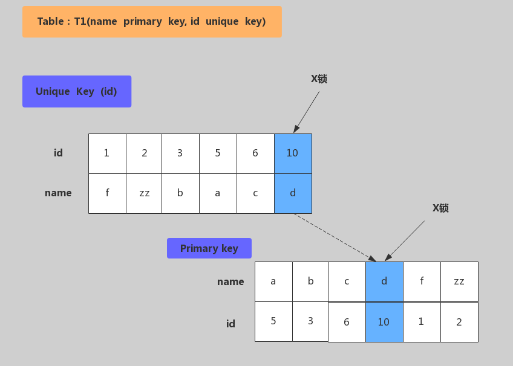
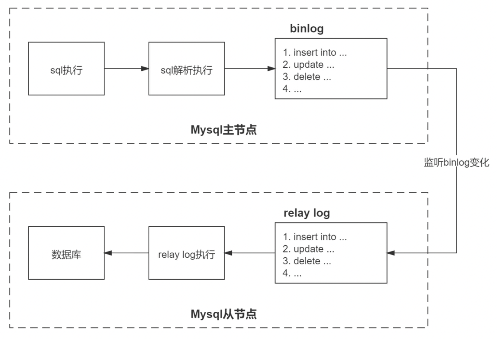
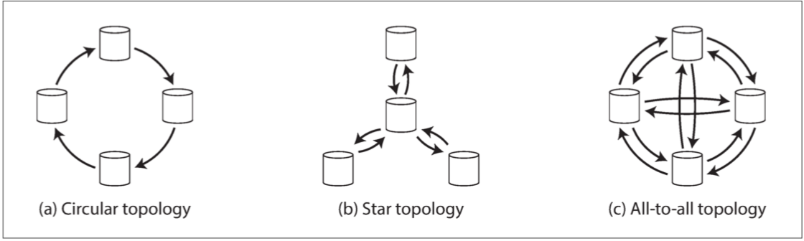

# MySQL数据库


> 作者: 潘深练
>
> 创建: 2022-03-31

- [官方文档 MySQL 8.0](https://dev.mysql.com/doc/refman/8.0/en/)
- [官方文档 MySQL 5.7](https://dev.mysql.com/doc/refman/5.7/en/)
- [官方文档 MySQL 5.6](https://dev.mysql.com/doc/refman/5.6/en/)
- [MySQL 8.0 发行说明](https://dev.mysql.com/doc/relnotes/mysql/8.0/en/)
- [MySQL 5.7 发行说明](https://dev.mysql.com/doc/relnotes/mysql/5.7/en/)
- [MySQL 5.6 发行说明](https://dev.mysql.com/doc/relnotes/mysql/5.6/en/)
- [掘金小册 - MySQL 是怎样运行的](https://juejin.cn/book/6844733769996304392)
- [极客时间 - MySQL 实战 45 讲](https://time.geekbang.org/column/intro/100020801)

## 〇、MySQL前言

### 0.1、MySQL起源和分支

MySQL 是最流行的关系型数据库软件之一，由于其体积小、速度快、开源免费、简单易用、维护成本低等，在集群架构中易于扩展、高可用，因此深受开发者和企业的欢迎。


MySQL发展历程如下：


MySQL主流分支如下图所示：


MySQL从最初的1.0、3.1到后来的8.0，发生了各种各样的变化。被Oracle收购后，MySQL的版本演化出了多个分支，除了需要付费的MySQL企业版本，还有很多MySQL社区版本。还有一条分支非常流行的开源分支版本叫Percona Server，它是MySQL的技术支持公司Percona推出的，也是在实际工作中经常碰到的。Percona Server在MySQL官方版本的基础上做了一些补丁和优化，同时推出了一些工具。另外一个非常不错的版本叫MariaDB，它是MySQL的公司被Oracle收购后，MySQL的创始人Monty先生，按原来的思路重新写的一套新数据库，同时也把 InnoDB 引擎作为主要存储引擎，也算 MySQL 的分支。

### 0.2、MySQL应用架构演变

网站在不同的并发访问量级和数据量级下，MySQL应用架构的演变过程。

用户请求 --> 应用层 --> 服务层 --> 存储层

#### 架构V1.0 - 单机单库

一个简单的小型网站或者应用背后的架构可以非常简单, 数据存储只需要一个MySQL Instance就能满足数据读取和写入需求（这里忽略掉了数据备份的实例），处于这个的阶段系统，一般会把所有的信息存到一个MySQL Instance里面。


#### V1.0 瓶颈

- 数据量太大，超出一台服务器承受
- 读写操作量太大，超出一台服务器承受
- 一台服务器挂了，应用也会挂掉（可用性差）

#### 架构V2.0 - 主从架构

V2.0架构主要解决架构V1.0下的 **高可用** 和 **读扩展** 问题，通过给Instance挂载从库解决读取的压力，主库宕机也可以通过主从切换保障高可用。在MySQL的场景下就是通过主从结构（双主结构也属于特殊的主从），主库抗写压力，通过从库来分担读压力，对于写少读多的应用，V2.0主从架构完全能够胜任。


#### V2.0瓶颈

- 数据量太大，超出一台服务器承受
- 写操作太大，超出一台M服务器承受

#### 架构V3.0 - 分库分表

对于V1.0和V2.0遇到 **写入瓶颈** 和 **存储瓶颈** 时，可以通过水平拆分来解决，水平拆分和垂直拆分有较大区别，垂直拆分拆完的结果，每一个实例都是拥有全部数据的，而水平拆分之后，任何实例都只有全量的1/n的数据。以下图所示，将Userinfo拆分为3个Sharding，每个Sharding持有总量的1/3数据，3个Sharding数据的总和等于一份完整数据。


#### V3.0挑战

- 数据如何路由成为一个关键问题， 一般可以采用范围拆分，List拆分、Hash拆分等。
- 如何保持数据的一致性也是个难题。


#### 架构V4.0 - 云数据库

云数据库（云计算）现在是各大IT公司内部作为 **节约成本** 的一个突破口，对于数据存储的MySQL来说，如何让其成为一个saas（Software as a Service）是关键点。MySQL作为一个saas服务，服务提供商负责解决 **可配置性**，**可扩展性**，**多用户存储结构设计** 等这些疑难问题。


## 一、MySQL架构原理

### 1.1、MYSQL体系架构


MySQL Server架构自顶向下大致可以分网络连接层、服务层、存储引擎层和系统文件层。

#### 1）、网络连接层

客户端连接器（Client Connectors）：提供与MySQL服务器建立的支持。目前几乎支持所有主流的服务端编程技术，例如常见的 Java、C、Python、.NET等，它们通过各自API技术与MySQL建立连接。

#### 2）、服务层（MySQL Server）

服务层是MySQL Server的核心，主要包含 **系统管理和控制工具**、**连接池**、**SQL接口**、**解析器**、**查询优化器**和**缓存**六个部分。

- **连接池（Connection Pool）**：负责存储和管理客户端与数据库的连接，一个线程负责管理一个连接。

- **系统管理和控制工具（Management Services & Utilities）**：例如备份恢复、安全管理、集群管理等

- **SQL接口（SQL Interface）**：用于接受客户端发送的各种SQL命令，并且返回用户需要查询的结果。比如DML、DDL、存储过程、视图、触发器等。

- **解析器（Parser）**：负责将请求的SQL解析生成一个"解析树"。然后根据一些MySQL规则进一步检查解析树是否合法。

- **查询优化器（Optimizer）**：当“解析树”通过解析器语法检查后，将交由优化器将其转化成执行计划，然后与存储引擎交互。

> 
> select uid,name from user where gender=1;
> 
> 选取--》投影--》联接 策略
> 
> 1）select先根据where语句进行选取，并不是查询出全部数据再过滤
> 
> 2）select查询根据uid和name进行属性投影，并不是取出所有字段
> 
> 3）将前面选取和投影联接起来最终生成查询结果
> 

- **缓存（Cache&Buffer）**： 缓存机制是由一系列小缓存组成的。比如表缓存，记录缓存，权限缓存，引擎缓存等。如果查询缓存有命中的查询结果，查询语句就可以直接去查询缓存中取数据。

#### 3）、存储引擎层（Pluggable Storage Engines）

存储引擎负责MySQL中数据的存储与提取，与底层系统文件进行交互。MySQL存储引擎是插件式的，服务器中的查询执行引擎通过接口与存储引擎进行通信，接口屏蔽了不同存储引擎之间的差异 。现在有很多种存储引擎，各有各的特点，最常见的是 **MyISAM** 和 **InnoDB**。

#### 4）、系统文件层（File System）

该层负责将数据库的数据和日志存储在文件系统之上，并完成与存储引擎的交互，是文件的物理存储层。主要包含日志文件，数据文件，配置文件，pid 文件，socket 文件等。

- **日志文件**  
    - 错误日志（Error log）
        - 默认开启，show variables like '%log_error%'
    - 通用查询日志（General query log）
        - 记录一般查询语句，show variables like '%general%';
    - 二进制日志（binary log）
        - 记录了对MySQL数据库执行的更改操作，并且记录了语句的发生时间、执行时长；但是它不
        - 记录select、show等不修改数据库的SQL。主要用于数据库恢复和主从复制。
        - show variables like '%log_bin%'; //是否开启
        - show variables like '%binlog%'; //参数查看
        - show binary logs;//查看日志文件
    - 慢查询日志（Slow query log）
        - 记录所有执行时间超时的查询SQL，默认是10秒。
        - show variables like '%slow_query%'; //是否开启
        - show variables like '%long_query_time%'; //时长

- **配置文件**
    - 用于存放MySQL所有的配置信息文件，比如my.cnf、my.ini等。

- **数据文件**
    - db.opt 文件：记录这个库的默认使用的字符集和校验规则。
    - frm 文件：存储与表相关的元数据（meta）信息，包括表结构的定义信息等，每一张表都会有一个frm 文件。
    - MYD 文件：MyISAM 存储引擎专用，存放 MyISAM 表的数据（data)，每一张表都会有一个.MYD 文件。
    - MYI 文件：MyISAM 存储引擎专用，存放 MyISAM 表的索引相关信息，每一张 MyISAM 表对应一个 .MYI 文件。
    - ibd文件和 IBDATA 文件：存放 InnoDB 的数据文件（包括索引）。InnoDB 存储引擎有两种表空间方式：独享表空间和共享表空间。独享表空间使用 .ibd 文件来存放数据，且每一张InnoDB 表对应一个 .ibd 文件。共享表空间使用 .ibdata 文件，所有表共同使用一个（或多个，自行配置）.ibdata 文件。
    - ibdata1 文件：系统表空间数据文件，存储表元数据、Undo日志等 。
    - ib_logfile0、ib_logfile1 文件：Redo log 日志文件。

- **pid 文件**
    - pid 文件是 mysqld 应用程序在 Unix/Linux 环境下的一个进程文件，和许多其他 Unix/Linux 服务端程序一样，它存放着自己的进程 id。

- **socket 文件**
    - socket 文件也是在 Unix/Linux 环境下才有的，用户在 Unix/Linux 环境下客户端连接可以不通过 TCP/IP 网络而直接使用 Unix Socket 来连接 MySQL。

### 1.2、MySQL的执行逻辑


#### 1）、MySQL组件QA

- MySQL的框架有几个组件, 各是什么作用? 
    - 连接器：负责跟客户端建立连接、获取权限、维持和管理连接。
    - 查询缓存：查询请求先访问缓存(key 是查询的语句，value 是查询的结果)。命中直接返回。不推荐使用缓存，更新会把缓存清除(关闭缓存：参数 query_cache_type 设置成 DEMAND)。
    - 分析器：对 SQL 语句做解析，判断sql是否正确。
    - 优化器：决定使用哪个索引，多表关联（join）的时候，决定各个表的连接顺序。
    - 执行器：执行语句，先判断用户有无查询权限，使用表定义的存储引擎。

- Server层和存储引擎层各是什么作用?
    - Server 层主要是功能层面，包括连接器、查询缓存、分析器、优化器、执行器等，涵盖 MySQL 的大多数核心服务功能，以及所有的内置函数（如日期、时间、数学和加密函数等），所有跨存储引擎的功能都在这一层实现，比如存储过程、触发器、视图等。
    - 存储引擎层主要是存储相关，负责数据的存储和提取。其架构模式是插件式的，支持 InnoDB、MyISAM、Memory 等多个存储引擎。现在最常用的存储引擎是 InnoDB，它从 MySQL 5.5.5 版本开始成为了默认存储引擎。

- you have an error in your SQL syntax 这个保存是在词法分析里还是在语法分析里报错?
    - 语法分析
    - 【延伸】分析器如果没有命中查询缓存，就会开始真正执行语句了。首先，MySQL 需要知道你要做什么，因此需要对 SQL 语句做解析。分析器先会做 `词法分析`。你输入的是由多个字符串和空格组成的一条 SQL 语句，MySQL 需要识别出里面的字符串分别是什么，代表什么。MySQL 从你输入的 `select` 这个关键字识别出来，这是一个查询语句。它也要把字符串 `T` 识别成 `表名 T`，把字符串 `ID` 识别成 `列 ID`。做完了这些识别以后，就要做 `语法分析`。根据词法分析的结果，语法分析器会根据语法规则，判断你输入的这个 SQL 语句是否满足 MySQL 语法。如果你的语句不对，就会收到 `You have an error in your SQL syntax` 的错误提醒。

- 对于表的操作权限验证在哪里进行?
    - 执行器和优化器。
    - 【详细】MySQL 通过分析器知道了你要做什么，通过优化器知道了该怎么做，于是就进入了执行器阶段，开始执行语句。开始执行的时候，要先判断一下你对这个表 T 有没有执行查询的权限，如果没有，就会返回没有权限的错误 (在工程实现上，如果命中查询缓存，会在查询缓存返回结果的时候，做权限验证。查询也会在优化器之前调用 `precheck` 验证权限)。如果有权限，就打开表继续执行。打开表的时候，执行器就会根据表的引擎定义，去使用这个引擎提供的接口，进行数据提取索要。

- 执行器的执行查询语句的流程是什么样的? 
    - 例如 SQL 语句 ： `select * from T where ID=10 ;` 
    - 1、调用 InnoDB 引擎接口取这个表的第一行，判断 ID 值是不是 10，如果不是则跳过，如果是则将这行存在结果集中；
    - 2、调用引擎接口取“下一行”，重复相同的判断逻辑，直到取到这个表的最后一行。
    - 3、执行器将上述遍历过程中所有满足条件的行组成的记录集作为结果集返回给客户端。

- MySQL的查询缓存是如何工作的？
    - MySQL 拿到一个查询请求后，会先到查询缓存看看，之前是不是执行过这条语句。之前执行过的语句及其结果可能会以 key-value 对的形式，被直接缓存在内存中。key 是查询的语句，value 是查询的结果。如果你的查询能够直接在这个缓存中找到 key，那么这个 value 就会被直接返回给客户端。
    - 如果语句不在查询缓存中，就会继续后面的执行阶段。执行完成后，执行结果会被存入查询缓存中。你可以看到，如果查询命中缓存，MySQL 不需要执行后面的复杂操作，就可以直接返回结果，这个效率会很高。

- 大多数情况下不建议使用查询缓存，为什么呢？
    - 因为查询缓存往往弊大于利。
    - 查询缓存的失效非常频繁，只要有对一个表的更新，这个表上所有的查询缓存都会被清空。因此很可能你费劲地把结果存起来，还没使用呢，就被一个更新全清空了。对于更新压力大的数据库来说，查询缓存的命中率会非常低。除非你的业务就是有一张静态表，很长时间才会更新一次。比如，一个系统配置表，那这张表上的查询才适合使用查询缓存。
    - 好在 MySQL 也提供了这种“按需使用”的方式。你可以将参数 query_cache_type 设置成 DEMAND，这样对于默认的 SQL 语句都不使用查询缓存。而对于你确定要使用查询缓存的语句，可以用 SQL_CACHE 显式指定，像下面这个语句一样：` select SQL_CACHE * from T where ID=10 ;`
    - 需要注意的是，MySQL 8.0 版本直接将查询缓存的整块功能删掉了，也就是说 8.0 开始彻底没有这个功能了。

- InnoDB 的 redo log 是什么？crash-safe 能力指什么？
    - `redo log` 是 `InnoDB` 引擎中的重做日志。`redo log` 是固定大小的，比如可以配置为一组 4 个文件，每个文件的大小是 1GB，那么总共就可以记录 4GB 的操作。从头开始写，写到末尾就又回到开头循环写，如下面这个图所示。 
    - 
    - `write pos` 是当前记录的位置，一边写一边后移，写到第 3 号文件末尾后就回到 0 号文件开头。`checkpoint` 是当前要擦除的位置，也是往后推移并且循环的，擦除记录前要把记录更新到数据文件。
    - `write pos` 和 `checkpoint` 之间的是空闲部分，可以用来记录新的操作。如果 `write pos` 追上 `checkpoint`，表示满了，这时候不能再执行新的更新，得停下来先擦掉一些记录，把 `checkpoint` 推进一下。
    - 有了 `redo log`，`InnoDB` 就可以保证即使数据库发生异常重启，之前提交的记录都不会丢失，这个能力称为 `crash-safe`。

- binlog 和 redo log 有什么关系？
    - 1、`redo log` 是 `InnoDB` 引擎特有的；binlog 是 MySQL 的 Server 层实现的，所有引擎都可以使用。
    - 2、`redo log` 是物理日志，记录的是“在某个数据页上做了什么修改”；`binlog` 是逻辑日志，记录的是这个语句的原始逻辑，比如 `update T set c=c+1 where ID=2;` 中 “给 ID=2 这一行的 c 字段加 1 ”。
    - 3、`redo log` 是循环写的，空间固定会用完；`binlog` 是可以追加写入的。“追加写”是指 `binlog` 文件写到一定大小后会切换到下一个，并不会覆盖以前的日志。
    - 4、`redolog`和`binlog`具有关联行，在恢复数据时，`redolog`用于恢复主机故障时的未更新的物理数据，`binlog`用于备份操作。每个阶段的log操作都是记录在磁盘的，在恢复数据时，`redolog` 状态为 **commit** 则说明`binlog`也成功，直接恢复数据；如果`redolog`是 **prepare**，则需要查询对应的`binlog`事务是否成功，决定是回滚还是执行。

- 为什么会有两份日志呢？
    - 因为最开始 MySQL 里并没有 `InnoDB` 引擎。MySQL 自带的引擎是 `MyISAM`，但是 `MyISAM` 没有 `crash-safe` 的能力，`binlog` 日志只能用于归档。而 InnoDB 是另一个公司以插件形式引入 MySQL 的，既然只依靠 binlog 是没有 `crash-safe` 能力的，所以 `InnoDB` 使用另外一套日志系统——也就是 `redo log` 来实现 `crash-safe` 能力。


### 1.3、MySQL运行机制


#### 1）、建立连接（Connectors&Connection Pool）

通过客户端/服务器通信协议与MySQL建立连接。MySQL 客户端与服务端的通信方式是 “ **半双工** ”。对于每一个 MySQL 的连接，时刻都有一个线程状态来标识这个连接正在做什么。

**通讯机制：**

- 全双工：能同时发送和接收数据，例如平时打电话。
- 半双工：指的某一时刻，要么发送数据，要么接收数据，不能同时。例如早期对讲机
- 单工：只能发送数据或只能接收数据。例如单行道

**线程状态：**

- show processlist; //查看用户正在运行的线程信息，root用户能查看所有线程，其他用户只能看自己的
    - id：线程ID，可以使用kill xx；
    - user：启动这个线程的用户
    - Host：发送请求的客户端的IP和端口号
    - db：当前命令在哪个库执行
    - Command：该线程正在执行的操作命令
        - Create DB：正在创建库操作
        - Drop DB：正在删除库操作
        - Execute：正在执行一个PreparedStatement
        - Close Stmt：正在关闭一个PreparedStatement
        - Query：正在执行一个语句
        - Sleep：正在等待客户端发送语句
        - Quit：正在退出
        - Shutdown：正在关闭服务器
    - Time：表示该线程处于当前状态的时间，单位是秒
    - State：线程状态
        - Updating：正在搜索匹配记录，进行修改
        - Sleeping：正在等待客户端发送新请求
        - Starting：正在执行请求处理
        - Checking table：正在检查数据表
        - Closing table : 正在将表中数据刷新到磁盘中
        - Locked：被其他查询锁住了记录
        - Sending Data：正在处理Select查询，同时将结果发送给客户端
    - Info：一般记录线程执行的语句，默认显示前100个字符。想查看完整的使用show full processlist;

#### 2）、查询缓存（Cache&Buffer）

这是MySQL的一个可优化查询的地方，如果开启了查询缓存且在查询缓存过程中查询到完全相同的SQL语句，则将查询结果直接返回给客户端；如果没有开启查询缓存或者没有查询到完全相同的 SQL 语句则会由解析器进行语法语义解析，并生成“解析树”。

- 缓存Select查询的结果和SQL语句
- 执行Select查询时，先查询缓存，判断是否存在可用的记录集，要求是否完全相同（包括参数值），这样才会匹配缓存数据命中。
- 即使开启查询缓存，以下SQL也不能缓存
    - 查询语句使用SQL_NO_CACHE
    - 查询的结果大于query_cache_limit设置
    - 查询中有一些不确定的参数，比如now()
- show variables like '%query_cache%'; //查看查询缓存是否启用，空间大小，限制等
- show status like 'Qcache%'; //查看更详细的缓存参数，可用缓存空间，缓存块，缓存多少等

#### 3）、解析器（Parser）

将客户端发送的SQL进行语法解析，生成"解析树"。**预处理器** 根据一些MySQL规则进一步检查“解析树”是否合法，例如这里将检查数据表和数据列是否存在，还会解析名字和别名，看看它们是否有歧义，最后生成新的“解析树”。


#### 4）、查询优化器（Optimizer）

根据“解析树”生成最优的执行计划。MySQL使用很多优化策略生成最优的 **执行计划**，可以分为两类：**静态优化**（编译时优化）、**动态优化**（运行时优化）。

- 等价变换策略
    - 5=5 and a>5 改成 a > 5
    - a < b and a=5 改成b>5 and a=5
    - 基于联合索引，调整条件位置等
- 优化count、min、max等函数
    - InnoDB引擎min函数只需要找索引最左边
    - InnoDB引擎max函数只需要找索引最右边
    - MyISAM引擎count(*)，不需要计算，直接返回
- 提前终止查询
    - 使用了limit查询，获取limit所需的数据，就不在继续遍历后面数据
- in的优化
    - MySQL对in查询，会先进行排序，再采用二分法查找数据。比如where id in (2,1,3)，变成 in (1,2,3)

#### 5）、查询执行引擎

查询执行引擎负责执行 SQL 语句，此时查询执行引擎会根据 SQL 语句中表的存储引擎类型，以及对应的API接口与底层存储引擎缓存或者物理文件的交互，得到查询结果并返回给客户端。若开启用查询缓存，这时会将SQL 语句和结果完整地保存到查询缓存（Cache&Buffer）中，以后若有相同的 SQL 语句执行则直接返回结果。

- 如果开启了查询缓存，先将查询结果做缓存操作
- 返回结果过多，采用增量模式返回

### 1.4、MySQL存储引擎

存储引擎在MySQL的体系架构中位于第三层，负责MySQL中的数据的存储和提取，是与文件打交道的子系统，它是根据MySQL提供的文件访问层抽象接口定制的一种文件访问机制，这种机制就叫作存储引擎。

使用 **show engines** 命令，就可以查看当前数据库支持的引擎信息。


**在5.5版本之前默认采用MyISAM存储引擎，从5.5开始采用InnoDB存储引擎。**

- InnoDB：**支持事务**，具有**提交**，**回滚**和**崩溃恢复**能力，**事务安全**
- MyISAM：不支持事务和外键，**访问速度快**
- Memory：利用内存创建表，访问速度非常快，因为数据在内存，而且默认使用Hash索引，但是一旦关闭，数据就会丢失
- Archive：归档类型引擎，仅能支持insert和select语句
- csv：以CSV文件进行数据存储，由于文件限制，所有列必须强制指定not null，另外CSV引擎也不支持索引和分区，适合做数据交换的中间表
- BlackHole: 黑洞，只进不出，进来消失，所有插入数据都不会保存
- Federated：可以访问远端MySQL数据库中的表。一个本地表，不保存数据，访问远程表内容。
- MRG_MyISAM：一组MyISAM表的组合，这些MyISAM表必须结构相同，Merge表本身没有数据，对Merge操作可以对一组MyISAM表进行操作。

#### 1)、InnoDB和MyISAM对比

InnoDB和MyISAM是使用MySQL时最常用的两种引擎类型，我们重点来看下两者区别。

- 事务和外键

InnoDB支持事务和外键，具有安全性和完整性，适合大量insert或update操作

MyISAM不支持事务和外键，它提供高速存储和检索，适合大量的select查询操作

- 锁机制

InnoDB支持行级锁，锁定指定记录。基于索引来加锁实现。

MyISAM支持表级锁，锁定整张表。

- 索引结构

InnoDB使用聚集索引（聚簇索引），索引和记录在一起存储，既缓存索引，也缓存记录。

MyISAM使用非聚集索引（非聚簇索引），索引和记录分开。

- 并发处理能力

MyISAM使用表锁，会导致写操作并发率低，读之间并不阻塞，读写阻塞。

InnoDB读写阻塞可以与隔离级别有关，可以采用 [多版本并发控制](https://baike.baidu.com/item/MVCC/6298019)（MVCC）来支持高并发

- 存储文件

InnoDB表对应两个文件，一个.frm表结构文件，一个.ibd数据文件。InnoDB表最大支持64TB；

MyISAM表对应三个文件，一个.frm表结构文件，一个MYD表数据文件，一个.MYI索引文件。从MySQL5.0开始默认限制是256TB。


- 适用场景
    - MyISAM
        - 不需要事务支持（不支持）
        - 并发相对较低（锁定机制问题）
        - 数据修改相对较少，以读为主
        - 数据一致性要求不高
    - InnoDB
        - 需要事务支持（具有较好的事务特性）
        - 行级锁定对高并发有很好的适应能力
        - 数据更新较为频繁的场景
        - 数据一致性要求较高
        - 硬件设备内存较大，可以利用InnoDB较好的缓存能力来提高内存利用率，减少磁盘IO
- 总结
    - 两种引擎该如何选择？
        - 是否需要事务？有，InnoDB
        - 是否存在并发修改？有，InnoDB
        - 是否追求快速查询，且数据修改少？是，MyISAM
        - 在绝大多数情况下，推荐使用InnoDB

- 扩展资料：各个存储引擎特性对比


#### 2)、InnoDB存储结构

从MySQL 5.5版本开始默认使用InnoDB作为引擎，它擅长处理事务，具有自动崩溃恢复的特性，在日常开发中使用非常广泛。下面是官方的InnoDB引擎架构图，主要分为内存结构和磁盘结构两大部分。


- **InnoDB内存结构**（内存结构主要包括Buffer Pool、Change Buffer、Adaptive Hash Index和Log Buffer四大组件）

    - Buffer Pool：缓冲池，简称BP。BP以Page页为单位，默认大小16K，BP的底层采用 **链表** 数据结构管理Page。在InnoDB访问表记录和索引时会在Page页中缓存，以后使用可以减少磁盘IO操作，提升效率。
        
        - Page管理机制

        Page根据状态可以分为三种类型：

            - free page ：空闲page，未被使用
            - clean page：被使用page，数据没有被修改过
            - dirty page：脏页，被使用page，数据被修改过，页中数据和磁盘的数据产生了不一致
        
        针对上述三种page类型，InnoDB通过三种链表结构来维护和管理
            
            - free list ：表示空闲缓冲区，管理free page
            - flush list：表示需要刷新到磁盘的缓冲区，管理dirty page，内部page按修改时间排序。脏页即存在于flush链表，也在LRU链表中，但是两种互不影响，LRU链表负责管理page的可用性和释放，而flush链表负责管理脏页的刷盘操作。
            - lru list：表示正在使用的缓冲区，管理clean page和dirty page，缓冲区以midpoint为基点，前面链表称为new列表区，存放经常访问的数据，占63%；后面的链表称为old列表区，存放使用较少数据，占37%。

        - 改进型LRU算法维护
            - 普通LRU：末尾淘汰法，新数据从链表头部加入，释放空间时从末尾淘汰
            - 改性LRU：链表分为new和old两个部分，加入元素时并不是从表头插入，而是从中间midpoint位置插入，如果数据很快被访问，那么page就会向new列表头部移动，如果数据没有被访问，会逐步向old尾部移动，等待淘汰。
            
            每当有新的数据需要使用buffer pool中的page时，InnoDb引擎会判断是否有空闲页，是否足够，如果有就将free page从free list列表删除，放入到LRU列表中。没有空闲页，就会根据LRU算法淘汰LRU链表默认的页，将内存空间释放分配给新的页。
        
        - Buffer Pool配置参数
            - show variables like '%innodb_page_size%'; //查看page页大小
            - show variables like '%innodb_old%'; //查看lru list中old列表参数
            - show variables like '%innodb_buffer%'; //查看buffer pool参数

            建议：将innodb_buffer_pool_size设置为总内存大小的60%-80%，innodb_buffer_pool_instances可以设置为多个，这样可以避免缓存争夺。

    - Change Buffer：写缓冲区，简称CB。在进行DML操作时，如果BP没有其相应的Page数据，并不会立刻将磁盘页加载到缓冲池，而是在CB记录缓冲变更，等未来数据被读取时，再将数据合并恢复到BP中
        - ChangeBuffer占用BufferPool空间，默认占25%，最大允许占50%，可以根据读写业务量来进行调整。参数innodb_change_buffer_max_size;
        - 当更新一条记录时，该记录在BufferPool存在，直接在BufferPool修改，一次内存操作。如果该记录在BufferPool不存在（没有命中），会直接在ChangeBuffer进行一次内存操作，不用再去磁盘查询数据，避免一次磁盘IO。当下次查询记录时，会先进性磁盘读取，然后再从ChangeBuffer中读取信息合并，最终载入BufferPool中。
        - 写缓冲区，仅适用于非唯一普通索引页，为什么？
            - 如果在索引设置唯一性，在进行修改时，InnoDB必须要做唯一性校验，因此必须查询磁盘，做一次IO操作。会直接将记录查询到BufferPool中，然后在缓冲池修改，不会在ChangeBuffer操作。
    
    - Adaptive Hash Index：自适应哈希索引，用于优化对BP数据的查询。InnoDB存储引擎会监控对表索引的查找，如果观察到建立哈希索引可以带来速度的提升，则建立哈希索引，所以称之为自适应。InnoDB存储引擎会自动根据访问的频率和模式来为某些页建立哈希索引。

    - Log Buffer：日志缓冲区，用来保存要写入磁盘上log文件（Redo/Undo）的数据，日志缓冲区的内容定期刷新到磁盘log文件中。日志缓冲区满时会自动将其刷新到磁盘，当遇到BLOB或多行更新的大事务操作时，增加日志缓冲区可以节省磁盘I/O。
        - LogBuffer主要是用于记录InnoDB引擎日志，在DML操作时会产生Redo和Undo日志。
        - LogBuffer空间满了，会自动写入磁盘。可以通过将innodb_log_buffer_size参数调大，减少磁盘IO频率
        - innodb_flush_log_at_trx_commit参数控制日志刷新行为，默认为1
            - 0 ： 每隔1秒写日志文件和刷盘操作（写日志文件LogBuffer--> **OS cache**，刷盘OScache-->磁盘文件），最多丢失1秒数据
            - 1 ： 事务提交，立刻写日志文件和刷盘，数据不丢失，但是会频繁IO操作
            - 2 ： 事务提交，立刻写日志文件，每隔1秒钟进行刷盘操作

- **InnoDB磁盘结构**（InnoDB磁盘主要包含Tablespaces，InnoDB Data Dictionary，Doublewrite Buffer、Redo Log
和Undo Logs。）

    - 表空间（Tablespaces）：用于存储表结构和数据。表空间又分为系统表空间、独立表空间、通用表空间、临时表空间、Undo表空间等多种类型；
        - 系统表空间（The System Tablespace）
        包含InnoDB数据字典，Doublewrite Buffer，Change Buffer，Undo Logs的存储区域。系统表空间也默认包含任何用户在系统表空间创建的表数据和索引数据。系统表空间是一个共享的表空间因为它是被多个表共享的。该空间的数据文件通过参数innodb_data_file_path控制，默认值是ibdata1:12M:autoextend(文件名为ibdata1、12MB、自动扩展)。
        - 独立表空间（File-Per-Table Tablespaces）
        默认开启，独立表空间是一个单表表空间，该表创建于自己的数据文件中，而非创建于系统表空间中。当innodb_file_per_table选项开启时，表将被创建于表空间中。否则，innodb将被创建于系统表空间中。每个表文件表空间由一个.ibd数据文件代表，该文件默认被创建于数据库目录中。表空间的表文件支持动态（dynamic）和压缩（commpressed）行格式。
        - 通用表空间（General Tablespaces）
        通用表空间为通过create tablespace语法创建的共享表空间。通用表空间可以创建于mysql数据目录外的其他表空间，其可以容纳多张表，且其支持所有的行格式。
        
        CREATE TABLESPACE ts1 ADD DATAFILE ts1.ibd Engine=InnoDB; //创建表空间ts1
        CREATE TABLE t1 (c1 INT PRIMARY KEY) TABLESPACE ts1; //将表添加到ts1表空间
        
        - 撤销表空间（Undo Tablespaces）
        撤销表空间由一个或多个包含Undo日志文件组成。在MySQL 5.7版本之前Undo占用的是System Tablespace共享区，从5.7开始将Undo从System Tablespace分离了出来。InnoDB使用的undo表空间由innodb_undo_tablespaces配置选项控制，默认为0。参数值为0表示使用系统表空间ibdata1;大于0表示使用undo表空间undo_001、undo_002等。
        - 临时表空间（Temporary Tablespaces）
        分为session temporary tablespaces 和global temporary tablespace两种。session temporary tablespaces 存储的是用户创建的临时表和磁盘内部的临时表。global temporary tablespace储存用户临时表的回滚段（rollback segments ）。mysql服务器正常关闭或异常终止时，临时表空间将被移除，每次启动时会被重新创建。
    - 数据字典（InnoDB Data Dictionary）
    InnoDB数据字典由内部系统表组成，这些表包含用于查找表、索引和表字段等对象的元数据。元数据物理上位于InnoDB系统表空间中。由于历史原因，数据字典元数据在一定程度上与InnoDB表元数据文件（.frm文件）中存储的信息重叠。
    - 双写缓冲区（Doublewrite Buffer）
    位于系统表空间，是一个存储区域。在BufferPage的page页刷新到磁盘真正的位置前，会先将数据存在Doublewrite 缓冲区。如果在page页写入过程中出现操作系统、存储子系统或mysqld进程崩溃，InnoDB可以在崩溃恢复期间从Doublewrite 缓冲区中找到页面的一个好备份。在大多数情况下，默认情况下启用双写缓冲区，要禁用Doublewrite 缓冲区，可以将innodb_doublewrite设置为0。使用Doublewrite 缓冲区时建议将innodb_flush_method设置为O_DIRECT。
        - MySQL的innodb_flush_method这个参数控制着innodb数据文件及redo log的打开、刷写模式。有三个值：fdatasync(默认)，O_DSYNC，O_DIRECT。设置O_DIRECT表示数据文件写入操作会通知操作系统不要缓存数据，也不要用预读，直接从InnodbBuffer写到磁盘文件。
        - 默认的fdatasync意思是先写入操作系统缓存，然后再调用fsync()函数去异步刷数据文件与redo log的缓存信息。
    - 重做日志（Redo Log）
    重做日志是一种基于磁盘的数据结构，用于在崩溃恢复期间更正不完整事务写入的数据。MySQL以循环方式写入重做日志文件，记录InnoDB中所有对Buffer Pool修改的日志。当出现实例故障（像断电），导致数据未能更新到数据文件，则数据库重启时须redo，重新把数据更新到数据文件。读写事务在执行的过程中，都会不断的产生redo log。默认情况下，重做日志在磁盘上由两个名为ib_logfile0和ib_logfile1的文件物理表示。
    - 撤销日志（Undo Logs）
    撤消日志是在事务开始之前保存的被修改数据的备份，用于例外情况时回滚事务。撤消日志属于逻辑日志，根据每行记录进行记录。撤消日志存在于系统表空间、撤消表空间和临时表空间中。

- **新版本结构演变**
    
    - MySQL 5.7 版本
        - 将 Undo日志表空间从共享表空间 ibdata 文件中分离出来，可以在安装 MySQL 时由用户自行指定文件大小和数量。
        - 增加了 temporary 临时表空间，里面存储着临时表或临时查询结果集的数据。
        - Buffer Pool 大小可以动态修改，无需重启数据库实例。
    - MySQL 8.0 版本
        - 将InnoDB表的数据字典和Undo都从共享表空间ibdata中彻底分离出来了，以前需要ibdata中数据字典与独立表空间ibd文件中数据字典一致才行，8.0版本就不需要了。
        - temporary 临时表空间也可以配置多个物理文件，而且均为 InnoDB 存储引擎并能创建索引，这样加快了处理的速度。
        - 用户可以像 Oracle 数据库那样设置一些表空间，每个表空间对应多个物理文件，每个表空间可以给多个表使用，但一个表只能存储在一个表空间中。
        - 将Doublewrite Buffer从共享表空间ibdata中也分离出来了。

#### 3)、InnoDB线程模型
    

- **IO Thread**
在InnoDB中使用了大量的AIO（Async IO）来做读写处理，这样可以极大提高数据库的性能。在InnoDB1.0版本之前共有4个IO Thread，分别是write，read，insert buffer和log thread，后来版本将read thread和write thread分别增大到了4个，一共有10个了。
    - read thread ： 负责读取操作，将数据从磁盘加载到缓存page页。4个
    - write thread：负责写操作，将缓存脏页刷新到磁盘。4个
    - log thread：负责将日志缓冲区内容刷新到磁盘。1个
    - insert buffer thread ：负责将写缓冲内容刷新到磁盘。1个

- **Purge Thread**
事务提交之后，其使用的undo日志将不再需要，因此需要Purge Thread回收已经分配的undo页。
show variables like '%innodb_purge_threads%';

- **Page Cleaner Thread**
作用是将脏数据刷新到磁盘，脏数据刷盘后相应的redo log也就可以覆盖，即可以同步数据，又能达到redo log循环使用的目的。会调用write thread线程处理。
show variables like '%innodb_page_cleaners%';

- **Master Thread**
Master thread是InnoDB的主线程，负责调度其他各线程，优先级最高。作用是将缓冲池中的数据异步刷新到磁盘 ，保证数据的一致性。包含：脏页的刷新（page cleaner thread）、undo页回收（purge thread）、redo日志刷新（log thread）、合并写缓冲等。内部有两个主处理，分别是每隔1秒和10秒处理。
    - 每1秒的操作：
        - 刷新日志缓冲区，刷到磁盘
        - 合并写缓冲区数据，根据IO读写压力来决定是否操作
        - 刷新脏页数据到磁盘，根据脏页比例达到75%才操作（innodb_max_dirty_pages_pct，innodb_io_capacity）

    - 每10秒的操作：
        - 刷新脏页数据到磁盘
        - 合并写缓冲区数据
        - 刷新日志缓冲区
        - 删除无用的undo页

#### 4)、InnoDB数据文件

- **InnoDB文件存储结构**

InnoDB数据文件存储结构：分为一个ibd数据文件-->Segment（段）-->Extent（区）-->Page（页）-->Row（行）
    - **Tablesapce**
    表空间，用于存储多个ibd数据文件，用于存储表的记录和索引。一个文件包含多个段。
    - **Segment**
    段，用于管理多个Extent，分为数据段（Leaf node segment）、索引段（Non-leaf nodesegment）、回滚段（Rollback segment）。一个表至少会有两个segment，一个管理数据，一个管理索引。每多创建一个索引，会多两个segment。
    - **Extent**
    区，一个区固定包含64个连续的页，大小为1M。当表空间不足，需要分配新的页资源，不会一页一页分，直接分配一个区。
    - **Page**
    页，用于存储多个Row行记录，大小为16K。包含很多种页类型，比如数据页，undo页，系统页，事务数据页，大的BLOB对象页。
    - **Row**
    行，包含了记录的字段值，事务ID（Trx id）、滚动指针（Roll pointer）、字段指针（Field pointers）等信息。

Page是文件最基本的单位，无论何种类型的page，都是由page header，page trailer和page body组成。如下图所示


- **InnoDB文件存储格式**
    - 通过 SHOW TABLE STATUS 命令
    

    一般情况下，如果row_format为REDUNDANT、COMPACT，文件格式为Antelope；如果row_format为DYNAMIC和COMPRESSED，文件格式为Barracuda。
        - 通过 information_schema 查看指定表的文件格式
        ```mysql
            select * from information_schema.innodb_sys_tables;
        ```

- **File文件格式（File-Format）**
在早期的InnoDB版本中，文件格式只有一种，随着InnoDB引擎的发展，出现了新文件格式，用于支持新的功能。目前InnoDB只支持两种文件格式：Antelope 和 Barracuda。
    - Antelope: 先前未命名的，最原始的InnoDB文件格式，它支持两种行格式：COMPACT和REDUNDANT，MySQL 5.6及其以前版本默认格式为Antelope。
    - Barracuda: 新的文件格式。它支持InnoDB的所有行格式，包括新的行格式：COMPRESSED和 DYNAMIC。
通过innodb_file_format 配置参数可以设置InnoDB文件格式，之前默认值为Antelope，5.7版本开始改为Barracuda。

- **Row行格式（Row_format）**
表的行格式决定了它的行是如何物理存储的，这反过来又会影响查询和DML操作的性能。如果在单个page页中容纳更多行，查询和索引查找可以更快地工作，缓冲池中所需的内存更少，写入更新时所需的I/O更少。


- InnoDB存储引擎支持四种行格式：REDUNDANT、COMPACT、DYNAMIC和COMPRESSED。
DYNAMIC和COMPRESSED新格式引入的功能有：**数据压缩**、**增强型长列数据的页外存储**和**大索引前缀**。每个表的数据分成若干页来存储，每个页中采用B树结构存储；如果某些字段信息过长，无法存储在B树节点中，这时候会被单独分配空间，此时被称为溢出页，该字段被称为页外列。
    - REDUNDANT 行格式
    使用REDUNDANT行格式，表会将变长列值的前768字节存储在B树节点的索引记录中，其余的存储在溢出页上。对于大于等于786字节的固定长度字段InnoDB会转换为变长字段，以便能够在页外存储。
    - COMPACT 行格式
    与REDUNDANT行格式相比，COMPACT行格式减少了约20%的行存储空间，但代价是增加了某些操作的CPU使用量。如果系统负载是受缓存命中率和磁盘速度限制，那么COMPACT格式可能更快。如果系统负载受到CPU速度的限制，那么COMPACT格式可能会慢一些。
    - DYNAMIC 行格式
    使用DYNAMIC行格式，InnoDB会将表中长可变长度的列值完全存储在页外，而索引记录只包含指向溢出页的20字节指针。大于或等于768字节的固定长度字段编码为可变长度字段。DYNAMIC行格式支持大索引前缀，最多可以为3072字节，可通过innodb_large_prefix参数控制。
    - COMPRESSED 行格式
    COMPRESSED行格式提供与DYNAMIC行格式相同的存储特性和功能，但增加了对表和索引数据压缩的支持。

在创建表和索引时，文件格式都被用于每个InnoDB表数据文件（其名称与*.ibd匹配）。修改文件格式的方法是重新创建表及其索引，最简单方法是对要修改的每个表使用以下命令：
    - ALTER TABLE 表名 ROW_FORMAT=格式类型; 

#### 5)、Undo Log    


- **Undo Log介绍**
    - Undo：意为撤销或取消，以撤销操作为目的，返回指定某个状态的操作。
    - Undo Log：数据库事务开始之前，会将要修改的记录存放到 Undo 日志里，当事务回滚时或者数据库崩溃时，可以利用 Undo 日志，撤销未提交事务对数据库产生的影响。
    - Undo Log产生和销毁：Undo Log在事务开始前产生；事务在提交时，并不会立刻删除undolog，innodb会将该事务对应的undo log放入到删除列表中，后面会通过后台线程purge thread进行回收处理。Undo Log属于逻辑日志，记录一个变化过程。例如执行一个delete，undolog会记录一个insert；执行一个update，undolog会记录一个相反的update。
    - Undo Log存储：undo log采用段的方式管理和记录。在innodb数据文件中包含一种rollback segment回滚段，内部包含1024个undo log segment。可以通过下面一组参数来控制Undo log存储。
    ```mysql
        show variables like '%innodb_undo%';
    ```

- **Undo Log作用**
    - 实现事务的原子性
        - Undo Log 是为了实现事务的原子性而出现的产物。事务处理过程中，如果出现了错误或者用户执行了 ROLLBACK 语句，MySQL 可以利用 Undo Log 中的备份将数据恢复到事务开始之前的状态。
    - 实现多版本并发控制（MVCC）
        - Undo Log 在 MySQL InnoDB 存储引擎中用来实现多版本并发控制。事务未提交之前，Undo Log 保存了未提交之前的版本数据，Undo Log 中的数据可作为数据旧版本快照供其他并发事务进行快照读。
        

    事务A手动开启事务，执行更新操作，首先会把更新命中的数据备份到 Undo Buffer 中。
    事务B手动开启事务，执行查询操作，会读取 Undo 日志数据返回，进行快照读

- **推荐阅读**
    - [知乎 - 《庖丁解InnoDB之Undo LOG》](https://zhuanlan.zhihu.com/p/427911093)

#### 6)、Redo Log和Binlog

Redo Log和Binlog是MySQL日志系统中非常重要的两种机制，也有很多相似之处，下面介绍下两者细节和区别。

redo log 里本质上记录的就是在对某个表空间的某个数据页的某个偏移量的地方修改了几个字节的值，具体修改的值是什么，他里面需要记录的就是：


- **Undo Log存储类型**
    - 日志类型
        - 物理日志，逻辑日志，物理日志更注重数据准确性（数据存储成本大），逻辑日志更注重空间利用（ran函数、时间类型等会产生不确定性）
    - 表空间ID
    - 数据页号
    - 数据页中的偏移量
    - 具体修改的数据

- **Redo Log日志**
    - Redo Log介绍
        - Redo：顾名思义就是重做。以恢复操作为目的，在数据库发生意外时重现操作。
        - Redo Log：指事务中修改的任何数据，将最新的数据备份存储的位置（Redo Log），被称为重做日志。
        - Redo Log 的生成和释放：随着事务操作的执行，就会生成Redo Log，在事务提交时会将产生Redo Log写入Log Buffer，并不是随着事务的提交就立刻写入磁盘文件。等事务操作的脏页写入到磁盘之后，Redo Log 的使命也就完成了，Redo Log占用的空间就可以重用（被覆盖写入）。
    - Redo Log工作原理
    Redo Log 是为了实现事务的持久性而出现的产物。防止在发生故障的时间点，尚有脏页未写入表的 IBD 文件中，在重启 MySQL 服务的时候，根据 Redo Log 进行重做，从而达到事务的未入磁盘数据进行持久化这一特性。
    
    - Redo Log写入机制
    Redo Log 文件内容是以顺序循环的方式写入文件，写满时则回溯到第一个文件，进行覆盖写。

    

    如图所示：
        - write pos 是当前记录的位置，一边写一边后移，写到最后一个文件末尾后就回到 0 号文件开头；
        - checkpoint 是当前要擦除的位置，也是往后推移并且循环的，擦除记录前要把记录更新到数据文件；

        write pos 和 checkpoint 之间还空着的部分，可以用来记录新的操作。如果 write pos 追上checkpoint，表示写满，这时候不能再执行新的更新，得停下来先擦掉一些记录，把 checkpoint推进一下。
    
    以上机制为 crash-safe ，Innodb 出现故障时的自动恢复机制。
    - Redo Log相关配置参数

    每个InnoDB存储引擎至少有1个重做日志文件组（group），每个文件组至少有2个重做日志文件，默认为ib_logfile0和ib_logfile1。可以通过下面一组参数控制Redo Log存储：
    
        - show variables like '%innodb_log%';
    Redo Buffer 持久化到 Redo Log 的策略，可通过 Innodb_flush_log_at_trx_commit 设置：
        - 0：每秒提交 Redo buffer ->OS cache -> flush cache to disk，可能丢失一秒内的事务数据。由后台Master线程每隔 1秒执行一次操作。
        - 1（默认值）：每次事务提交执行 Redo Buffer -> OS cache -> flush cache to disk，最安全，性能最差的方式。
        - 2：每次事务提交执行 Redo Buffer -> OS cache，然后由后台Master线程再每隔1秒执行OS cache -> flush cache to disk 的操作。
    一般建议选择取值2，因为 MySQL 挂了数据没有损失，整个服务器挂了才会损失1秒的事务提交数据。
    


- **Binlog日志**
    - Binlog记录模式
    Redo Log 是属于InnoDB引擎所特有的日志，而MySQL Server也有自己的日志，即 Binarylog（二进制日志），简称Binlog。Binlog是记录所有数据库表结构变更以及表数据修改的二进制日志，不会记录SELECT和SHOW这类操作。Binlog日志是以事件形式记录，还包含语句所执行的消耗时间。开启Binlog日志有以下两个最重要的使用场景。

        - 主从复制：在主库中开启Binlog功能，这样主库就可以把Binlog传递给从库，从库拿到Binlog后实现数据恢复达到主从数据一致性。
        - 数据恢复：通过mysqlbinlog工具来恢复数据。

        Binlog文件名默认为“主机名_binlog-序列号”格式，例如oak_binlog-000001，也可以在配置文件中指定名称。文件记录模式有STATEMENT、ROW和MIXED三种，具体含义如下。
        
        - ROW（row-based replication, RBR）：日志中会记录每一行数据被修改的情况，然后在slave端对相同的数据进行修改。
            - 优点：能清楚记录每一个行数据的修改细节，能完全实现主从数据同步和数据的恢复。
            - 缺点：批量操作，会产生大量的日志，尤其是alter table会让日志暴涨。
      
        - STATMENT（statement-based replication, SBR）：每一条被修改数据的SQL都会记录到master的Binlog中，slave在复制的时候SQL进程会解析成和原来master端执行过的相同的SQL再次执行。简称SQL语句复制。
            - 优点：日志量小，减少磁盘IO，提升存储和恢复速度
            - 缺点：在某些情况下会导致主从数据不一致，比如last_insert_id()、now()等函数。
      
        - MIXED（mixed-based replication, MBR）：以上两种模式的混合使用，一般会使用STATEMENT模式保存binlog，对于STATEMENT模式无法复制的操作使用ROW模式保存binlog，MySQL会根据执行的SQL语句选择写入模式。
    
    - Binlog文件结构
    MySQL的binlog文件中记录的是对数据库的各种修改操作，用来表示修改操作的数据结构是Logevent。不同的修改操作对应的不同的log event。比较常用的log event有：Query event、Row event、Xid event等。binlog文件的内容就是各种Log event的集合。
    Binlog文件中Log event结构如下图所示：
        
    - Binlog写入机制
        - 根据记录模式和操作触发event事件生成log event（事件触发执行机制）
        - 将事务执行过程中产生log event写入缓冲区，每个事务线程都有一个缓冲区
        Log Event保存在一个binlog_cache_mngr数据结构中，在该结构中有两个缓冲区，一个是stmt_cache，用于存放不支持事务的信息；另一个是trx_cache，用于存放支持事务的信息。
        - 事务在提交阶段会将产生的log event写入到外部binlog文件中。
        不同事务以串行方式将log event写入binlog文件中，所以一个事务包含的log event信息在binlog文件中是连续的，中间不会插入其他事务的log event。
    - Binlog文件操作
        - Binlog状态查看
            ```mysql
                show variables like 'log_bin';
            ```
        - 开启Binlog功能
            ```mysql
                mysql> set global log_bin=mysqllogbin;
                ERROR 1238 (HY000): Variable 'log_bin' is a read only variable
            ``` 
            需要修改my.cnf或my.ini配置文件，在[mysqld]下面增加log_bin=mysql_bin_log，重启MySQL服务。
            ```properties
                #log-bin=ON
                #log-bin-basename=mysqlbinlog
                binlog-format=ROW
                log-bin=mysqlbinlog
            ```
        - 使用show binlog events命令
            ```mysql
                show binary logs; //等价于show master logs;
                show master status;
                show binlog events;
                show binlog events in 'mysqlbinlog.000001';
            ```
        - 使用mysqlbinlog 命令
            ```mysql
                mysqlbinlog "文件名"
                mysqlbinlog "文件名" > "test.sql"
            ```
        - 使用 binlog 恢复数据
            ```mysql
                //按指定时间恢复
                mysqlbinlog --start-datetime="2020-04-25 18:00:00" --stop-
                datetime="2020-04-26 00:00:00" mysqlbinlog.000002 | mysql -uroot -p1234
                //按事件位置号恢复
                mysqlbinlog --start-position=154 --stop-position=957 mysqlbinlog.000002
                | mysql -uroot -p1234
            ```
            mysqldump：定期全部备份数据库数据。mysqlbinlog可以做增量备份和恢复操作。
        - 删除Binlog文件
        ```mysql
            purge binary logs to 'mysqlbinlog.000001'; //删除指定文件
            purge binary logs before '2020-04-28 00:00:00'; //删除指定时间之前的文件
            reset master; //清除所有文件
        ```
        可以通过设置expire_logs_days参数来启动自动清理功能。默认值为0表示没启用。设置为1表示超出1天binlog文件会自动删除掉。
    - Redo Log和Binlog区别
        - Redo Log是属于InnoDB引擎功能，Binlog是属于MySQL Server自带功能，并且是以二进制文件记录。
        - Redo Log属于物理日志，记录该数据页更新状态内容，Binlog是逻辑日志，记录更新过程。
        - Redo Log日志是循环写，日志空间大小是固定，Binlog是追加写入，写完一个写下一个，不会覆盖使用。
        - Redo Log作为服务器异常宕机后事务数据自动恢复使用，Binlog可以作为主从复制和数据恢复使用。Binlog没有自动crash-safe能力。

- **推荐阅读**
    - [知乎 - 《庖丁解InnoDB之REDO LOG》](https://zhuanlan.zhihu.com/p/109417488)

## 二、MySQL索引原理

### 2.1、索引类型

索引可以提升查询速度，会影响where查询，以及order by排序。MySQL索引类型如下：

- 从索引存储结构划分：B Tree索引、Hash索引、FULLTEXT全文索引、R Tree索引
- 从应用层次划分：普通索引、唯一索引、主键索引、复合索引
- 从索引键值类型划分：主键索引、辅助索引（二级索引）
- 从数据存储和索引键值逻辑关系划分：聚集索引（聚簇索引）、非聚集索引（非聚簇索引）

#### 1）、普通索引

这是最基本的索引类型，基于普通字段建立的索引，没有任何限制。

创建普通索引的方法如下：

- CREATE INDEX <索引的名字> ON tablename (字段名);
- ALTER TABLE tablename ADD INDEX [索引的名字] (字段名);
- CREATE TABLE tablename ( [...], INDEX [索引的名字] (字段名) );

#### 2）、唯一索引

与"普通索引"类似，不同的就是：索引字段的值必须唯一，但允许有空值 。在创建或修改表时追加唯一约束，就会自动创建对应的唯一索引。

创建唯一索引的方法如下：

- CREATE UNIQUE INDEX <索引的名字> ON tablename (字段名);
- ALTER TABLE tablename ADD UNIQUE INDEX [索引的名字] (字段名);
- CREATE TABLE tablename ( [...], UNIQUE [索引的名字] (字段名) ;

#### 3）、主键索引

它是一种特殊的唯一索引，不允许有空值。在创建或修改表时追加主键约束即可，每个表只能有一个主键。

创建主键索引的方法如下：

- CREATE TABLE tablename ( [...], PRIMARY KEY (字段名) );
- ALTER TABLE tablename ADD PRIMARY KEY (字段名);

#### 4）、复合索引

单一索引是指索引列为一列的情况，即新建索引的语句只实施在一列上；用户可以在多个列上建立索引，这种索引叫做组复合索引（组合索引）。复合索引可以代替多个单一索引，相比多个单一索引复合索引所需的开销更小。

索引同时有两个概念叫做窄索引和宽索引，窄索引是指索引列为1-2列的索引，宽索引也就是索引列超过2列的索引，设计索引的一个重要原则就是能用窄索引不用宽索引，因为窄索引往往比组合索引更有效。

创建组合索引的方法如下：

- CREATE INDEX <索引的名字> ON tablename (字段名1，字段名2...);
- ALTER TABLE tablename ADD INDEX [索引的名字] (字段名1，字段名2...);
- CREATE TABLE tablename ( [...], INDEX [索引的名字] (字段名1，字段名2...) );

复合索引使用注意事项：

- 何时使用复合索引，要根据where条件建索引，注意不要过多使用索引，过多使用会对更新操作效率有很大影响。
- 如果表已经建立了(col1，col2)，就没有必要再单独建立（col1）；如果现在有(col1)索引，如果查询需要col1和col2条件，可以建立(col1,col2)复合索引，对于查询有一定提高。


#### 5）、全文索引

查询操作在数据量比较少时，可以使用like模糊查询，但是对于大量的文本数据检索，效率很低。如果使用全文索引，查询速度会比like快很多倍。在MySQL 5.6 以前的版本，只有MyISAM存储引擎支持全文索引，从MySQL 5.6开始MyISAM和InnoDB存储引擎均支持。

创建全文索引的方法如下：

- CREATE FULLTEXT INDEX <索引的名字> ON tablename (字段名);
- ALTER TABLE tablename ADD FULLTEXT [索引的名字] (字段名);
- CREATE TABLE tablename ( [...], FULLTEXT KEY [索引的名字] (字段名) ;

和常用的like模糊查询不同，全文索引有自己的语法格式，使用 match 和 against 关键字，比如

```mysql
    select * from user where match(name) against('aaa');
```

全文索引使用注意事项：

- 全文索引必须在字符串、文本字段上建立。
- 全文索引字段值必须在最小字符和最大字符之间的才会有效。（innodb：3-84；myisam：4-84）
- 全文索引字段值要进行切词处理，按syntax字符进行切割，例如b+aaa，切分成b和aaa
- 全文索引匹配查询，默认使用的是等值匹配，例如a匹配a，不会匹配ab,ac。如果想匹配可以在布尔模式下搜索a*

```mysql
    select * from user where match(name) against('a*' in boolean mode);
```

### 2.2、索引原理

MySQL官方对索引定义：是存储引擎用于快速查找记录的一种数据结构。需要额外开辟空间和数据维护工作。

- 索引是物理数据页存储，在数据文件中（InnoDB，ibd文件），利用数据页(page)存储。
- 索引可以加快检索速度，但是同时也会降低增删改操作速度，索引维护需要代价。

索引涉及的理论知识：**二分查找法**、**Hash**和**B+Tree**。

#### 1）、二分查找法

二分查找法也叫作折半查找法，它是在有序数组中查找指定数据的搜索算法。它的优点是等值查询、范围查询性能优秀，缺点是更新数据、新增数据、删除数据维护成本高。

- 首先定位left和right两个指针
- 计算(left+right)/2
- 判断除2后索引位置值与目标值的大小比对
- 索引位置值大于目标值就-1，right移动；如果小于目标值就+1，left移动

举个例子，下面的有序数组有17 个值，查找的目标值是7，过程如下：

- 第一次查找


- 第二次查找


- 第三次查找


- 第四次查找


#### 2）、Hash结构

Hash底层实现是由Hash表来实现的，是根据键值 <key,value> 存储数据的结构。非常适合根据key查找value值，也就是单个key查询，或者说等值查询。其结构如下所示：


从上面结构可以看出，Hash索引可以方便的提供等值查询，但是对于范围查询就需要全表扫描了。

Hash索引在MySQL中Hash结构主要应用在Memory原生的Hash索引 、InnoDB自适应哈希索引。

InnoDB提供的自适应哈希索引功能强大，接下来重点描述下InnoDB自适应哈希索引。

InnoDB自适应哈希索引是为了提升查询效率，InnoDB存储引擎会监控表上各个索引页的查询，当InnoDB注意到某些索引值访问非常频繁时，会在内存中基于B+Tree索引再创建一个哈希索引，使得内存中的 B+Tree 索引具备哈希索引的功能，即能够快速定值访问频繁访问的索引页。

InnoDB自适应哈希索引：在使用Hash索引访问时，一次性查找就能定位数据，等值查询效率要优于B+Tree。

自适应哈希索引的建立使得InnoDB存储引擎能自动根据索引页访问的频率和模式自动地为某些热点页建立哈希索引来加速访问。另外InnoDB自适应哈希索引的功能，用户只能选择开启或关闭功能，无法进行人工干涉。

```mysql
    show engine innodb status \G;
    show variables like '%innodb_adaptive%';
```

#### 3）、B+Tree结构

MySQL数据库索引采用的是B+Tree结构，在B-Tree结构上做了优化改造。

- **B-Tree结构**
    - 索引值和data数据分布在整棵树结构中
    - 每个节点可以存放多个索引值及对应的data数据
    - 树节点中的多个索引值从左到右升序排列
    

    B树的搜索：从根节点开始，对节点内的索引值序列采用二分法查找，如果命中就结束查找。没有命中会进入子节点重复查找过程，直到所对应的的节点指针为空，或已经是叶子节点了才结束。

- **B+Tree结构**
    - 非叶子节点不存储data数据，只存储索引值，这样便于存储更多的索引值
    - 叶子节点包含了所有的索引值和data数据
    - 叶子节点用指针连接，提高区间的访问性能
    

    相比B树，B+树进行范围查找时，只需要查找定位两个节点的索引值，然后利用叶子节点的指针进行遍历即可。而B树需要遍历范围内所有的节点和数据，显然B+Tree效率高。

#### 4）、聚簇索引和辅助索引 

**聚簇索引和非聚簇索引**：B+Tree的叶子节点存放主键索引值和行记录就属于聚簇索引；如果索引值和行记录分开存放就属于非聚簇索引。

**主键索引和辅助索引**：B+Tree的叶子节点存放的是主键字段值就属于主键索引；如果存放的是非主键值就属于辅助索引（二级索引）。

在InnoDB引擎中，主键索引采用的就是聚簇索引结构存储。

- 聚簇索引（聚集索引）

聚簇索引是一种数据存储方式，InnoDB的聚簇索引就是按照主键顺序构建 B+Tree结构。B+Tree的叶子节点就是行记录，行记录和主键值紧凑地存储在一起。 这也意味着 InnoDB 的主键索引就是数据表本身，它按主键顺序存放了整张表的数据，占用的空间就是整个表数据量的大小。通常说的**主键索引**就是聚集索引。

InnoDB的表要求必须要有聚簇索引：

1. 如果表定义了主键，则主键索引就是聚簇索引
2. 如果表没有定义主键，则第一个非空unique列作为聚簇索引
3. 否则InnoDB会从建一个隐藏的row-id作为聚簇索引

- 辅助索引

InnoDB辅助索引，也叫作二级索引，是根据索引列构建 B+Tree结构。但在 B+Tree 的叶子节点中只存了索引列和主键的信息。二级索引占用的空间会比聚簇索引小很多， 通常创建辅助索引就是为了提升查询效率。一个表InnoDB只能创建一个聚簇索引，但可以创建多个辅助索引。


- 非聚簇索引

与InnoDB表存储不同，MyISAM数据表的索引文件和数据文件是分开的，被称为非聚簇索引结构。


### 2.3、索引分析与优化

#### 1）、EXPLAIN

MySQL 提供了一个 EXPLAIN 命令，它可以对 SELECT 语句进行分析，并输出 SELECT 执行的详细信息，供开发人员有针对性的优化。例如：

```mysql
    EXPLAIN SELECT * from user WHERE id < 3;
```
EXPLAIN 命令的输出内容大致如下：


- select_type
    - 表示查询的类型。常用的值如下：
        - SIMPLE ： 表示查询语句不包含子查询或union
        - PRIMARY：表示此查询是最外层的查询
        - UNION：表示此查询是UNION的第二个或后续的查询 
        - DEPENDENT UNION：UNION中的第二个或后续的查询语句，使用了外面查询结果
        - UNION RESULT：UNION的结果
        - SUBQUERY：SELECT子查询语句
        - DEPENDENT SUBQUERY：SELECT子查询语句依赖外层查询的结果。

最常见的查询类型是SIMPLE，表示我们的查询没有子查询也没用到UNION查询。

- type 
    - 表示存储引擎查询数据时采用的方式。比较重要的一个属性，通过它可以判断出查询是全表扫描还是基于索引的部分扫描。常用属性值如下，从上至下效率依次增强。
        - ALL：表示全表扫描，性能最差。
        - index：表示基于索引的全表扫描，先扫描索引再扫描全表数据。
        - range：表示使用索引范围查询。使用>、>=、<、<=、in等等。
        - ref：表示使用非唯一索引进行单值查询。
        - eq_ref：一般情况下出现在多表join查询，表示前面表的每一个记录，都只能匹配后面表的一行结果。
        - const：表示使用主键或唯一索引做等值查询，常量查询。
        - NULL：表示不用访问表，速度最快。

- possible_keys
    - 表示查询时能够使用到的索引。注意并不一定会真正使用，显示的是索引名称。

- key
    - 表示查询时真正使用到的索引，显示的是索引名称。

- rows
    - MySQL查询优化器会根据统计信息，估算SQL要查询到结果需要扫描多少行记录。原则上rows是越少效率越高，可以直观的了解到SQL效率高低。

- key_len
    - 表示查询使用了索引的字节数量。可以判断是否全部使用了组合索引。
    key_len的计算规则如下：
        - 字符串类型
            - 字符串长度跟字符集有关：latin1=1、gbk=2、utf8=3、utf8mb4=4
            - char(n)：n*字符集长度
            - varchar(n)：n * 字符集长度 + 2字节
        - 数值类型
            - TINYINT：1个字节
            - SMALLINT：2个字节
            - MEDIUMINT：3个字节
            - INT、FLOAT：4个字节
            - BIGINT、DOUBLE：8个字节
        - 时间类型
            - DATE：3个字节
            - TIMESTAMP：4个字节
            - DATETIME：8个字节
        - 字段属性
            - NULL属性占用1个字节，如果一个字段设置了NOT NULL，则没有此项。

- Extra
    - Extra表示很多额外的信息，各种操作会在Extra提示相关信息，常见几种如下：
        - Using where
            - 表示查询需要通过索引回表查询数据。
        - Using index
            - 表示查询需要通过索引，索引就可以满足所需数据。
        - Using filesort
            - 表示查询出来的结果需要额外排序，数据量小在内存，大的话在磁盘，因此有Using filesort 建议优化。
        - Using temprorary
            - 查询使用到了临时表，一般出现于去重、分组等操作。

#### 2）、回表查询

在之前介绍过，InnoDB索引有聚簇索引和辅助索引。聚簇索引的叶子节点存储行记录，InnoDB必须要有，且只有一个。辅助索引的叶子节点存储的是主键值和索引字段值，通过辅助索引无法直接定位行记录，通常情况下，需要扫码两遍索引树。先通过辅助索引定位主键值，然后再通过聚簇索引定位行记录，这就叫做**回表查询**，它的性能比扫一遍索引树低。

#### 3）、覆盖索引

在SQL-Server官网的介绍如下：


在MySQL官网，类似的说法出现在explain查询计划优化章节，即explain的输出结果Extra字段为Using index时，能够触发索引覆盖。


不管是SQL-Server官网，还是MySQL官网，都表达了：只需要在**一棵索引树**上就能获取SQL所需的**所有列数据**，**无需回表**，速度更快，这就叫做**索引覆盖**。

实现索引覆盖最常见的方法就是：
- 将被查询的字段，建立到组合索引。

#### 4）、最左前缀原则

复合索引使用时遵循最左前缀原则，最左前缀顾名思义，就是最左优先，即查询中使用到最左边的列，那么查询就会使用到索引，如果从索引的第二列开始查找，索引将失效。


#### 5）、LIKE查询

**面试题：MySQL在使用like模糊查询时，索引能不能起作用？**

回答：MySQL在使用Like模糊查询时，索引是可以被使用的，只有把%字符写在后面才会使用到索引。

select * from user where name like '%o%'; //不起作用

select * from user where name like 'o%'; //起作用

select * from user where name like '%o'; //不起作用

#### 6）、NULL查询

**面试题：如果MySQL表的某一列含有NULL值，那么包含该列的索引是否有效？**

对MySQL来说，NULL是一个特殊的值，从概念上讲，NULL意味着“一个未知值”，它的处理方式与其他值有些不同。比如：不能使用=，<，>这样的运算符，对NULL做算术运算的结果都是NULL，count时不会包括NULL行等，NULL比空字符串需要更多的存储空间等。

```text
“NULL columns require additional space in the row to record whether their values
are NULL. For MyISAM tables, each NULL column takes one bit extra, rounded up to
the nearest byte.”
```

NULL列需要增加额外空间来记录其值是否为NULL。对于MyISAM表，每一个 NULL 列额外占用一位，四舍五入到最接近的字节。


虽然MySQL可以在含有NULL的列上使用索引，但NULL和其他数据还是有区别的，不建议列上允许为NULL。最好设置NOT NULL，并给一个默认值，比如0和 ‘’ 空字符串等，如果是datetime类型，也可以设置系统当前时间或某个固定的特殊值，例如'1970-01-01 00:00:00'。


#### 7）、索引与排序

MySQL查询支持filesort和index两种方式的排序。

- filesort是先把结果查出，然后在缓存或磁盘进行排序操作，效率较低。
- 使用index是指利用索引自动实现排序，不需另做排序操作，效率会比较高。

filesort有两种排序算法：**双路排序**和**单路排序**。

- 双路排序：需要两次磁盘扫描读取，最终得到用户数据。第一次将排序字段读取出来，然后排序；第二次去读取其他字段数据。
- 单路排序：从磁盘查询所需的所有列数据，然后在内存排序将结果返回。如果查询数据超出缓存sort_buffer，会导致多次磁盘读取操作，并创建临时表，最后产生了多次IO，反而会增加负担。解决方案：少使用select *；增加sort_buffer_size容量和max_length_for_sort_data容量。

如果我们Explain分析SQL：

- 结果中Extra属性显示Using filesort，表示使用了filesort排序方式，需要优化。
- 如果Extra属性显示Using index时，表示覆盖索引，也表示所有操作在索引上完成，也可以使用index排序方式，建议大家尽可能采用覆盖索引。

**以下几种情况，会使用index方式的排序**

- ORDER BY 子句索引列组合满足索引最左前列

```mysql
    explain select id from user order by id; //对应(id)、(id,name)索引有效
```

- WHERE子句+ORDER BY子句索引列组合满足索引最左前列

```mysql
    explain select id from user where age=18 order by name; //对应(age,name)索引
```

**以下几种情况，会使用filesort方式的排序**

- 对索引列同时使用了ASC和DESC

```mysql
    explain select id from user order by age asc,name desc; //对应(age,name)索引
```

- WHERE子句和ORDER BY子句满足最左前缀，但where子句使用了范围查询（例如>、<、in等）

```mysql
    explain select id from user where age>10 order by name; //对应(age,name)索引
```

- ORDER BY或者WHERE+ORDER BY索引列没有满足索引最左前列

```mysql
    explain select id from user order by name;  //对应(age,name)索引
```

- 使用了不同的索引，MySQL每次只采用一个索引，ORDER BY涉及了两个索引

```mysql
    explain select id from user order by name,age; //对应(name)、(age)两个索引
```

- WHERE子句与ORDER BY子句，使用了不同的索引

```mysql
    explain select id from user where name='tom' order by age; //对应(name)、(age)索引
```

- WHERE子句或者ORDER BY子句中索引列使用了表达式，包括函数表达式

```mysql
    explain select id from user order by abs(age); //对应(age)索
```


### 2.4、查询优化

#### 1）、慢查询定位

- **开启慢查询日志**
    - 查看 MySQL 数据库是否开启了慢查询日志和慢查询日志文件的存储位置的命令如下：
    ```mysql
        SHOW VARIABLES LIKE 'slow_query_log%'
    ```
    - 通过如下命令开启慢查询日志：
    ```mysql
        SET global slow_query_log = ON;
        SET global slow_query_log_file = 'OAK-slow.log';
        SET global log_queries_not_using_indexes = ON;
        SET long_query_time = 10;
    ```
        - long_query_time：指定慢查询的阀值，单位秒。如果SQL执行时间超过阀值，就属于慢查询记录到日志文件中。
        - log_queries_not_using_indexes：表示会记录没有使用索引的查询SQL。前提是slow_query_log的值为ON，否则不会奏效。

- **查看慢查询日志**
    - 文本方式查看
        - 直接使用文本编辑器打开slow.log日志即可。
        
        - time：日志记录的时间
        - User@Host：执行的用户及主机
        - Query_time：执行的时间
        - Lock_time：锁表时间
        - Rows_sent：发送给请求方的记录数，结果数量
        - Rows_examined：语句扫描的记录条数
        - SET timestamp：语句执行的时间点
        - select....：执行的具体的SQL语句
    - 使用**mysqldumpslow**查看
        - MySQL 提供了一个慢查询日志分析工具mysqldumpslow，可以通过该工具分析慢查询日志内容。
        - 在 MySQL bin目录下执行下面命令可以查看该使用格式。    
        ```mysql
            perl mysqldumpslow.pl --help
        ```
        - 运行如下命令查看慢查询日志信息：
        ```mysql
            perl mysqldumpslow.pl -t 5 -s at C:\ProgramData\MySQL\Data\OAK-slow.log
        ```
        - 除了使用mysqldumpslow工具，也可以使用第三方分析工具，比如pt-query-digest、mysqlsla等。

#### 2）、慢查询优化

- **索引和慢查询**
    - 如何判断是否为慢查询？
        - MySQL判断一条语句是否为慢查询语句，主要依据SQL语句的执行时间，它把当前语句的执行时间跟 long_query_time 参数做比较，如果语句的执行时间 > long_query_time，就会把这条执行语句记录到慢查询日志里面。long_query_time 参数的默认值是 10s，该参数值可以根据自己的业务需要进行调整。
    - 如何判断是否应用了索引？
        - SQL语句是否使用了索引，可根据SQL语句执行过程中有没有用到表的索引，可通过 explain命令分析查看，检查结果中的 key 值，是否为NULL。
    - 应用了索引是否一定快？
        - 下面我们来看看下面语句的 explain 的结果，你觉得这条语句有用上索引吗？比如
        ```mysql
            select * from user where id>0;
        ```
        - 虽然使用了索引，但是还是从主键索引的最左边的叶节点开始向右扫描整个索引树，进行了全表扫描，此时索引就失去了意义。
        - 而像 select * from user where id = 2; 这样的语句，才是我们平时说的使用了索引。它表示的意思是，我们使用了索引的快速搜索功能，并且有效地减少了扫描行数。
    
    查询是否使用索引，只是表示一个SQL语句的执行过程；而是否为慢查询，是由它执行的时间决定的，也就是说**是否使用了索引和是否是慢查询两者之间没有必然的联系**。
    
    我们在使用索引时，不要只关注是否起作用，应该关心**索引是否减少了查询扫描的数据行数**，如果扫描行数减少了，效率才会得到提升。对于一个大表，不止要创建索引，还要考虑索引过滤性，过滤性好，执行速度才会快。

- **提高索引过滤性**
    - 假如有一个5000万记录的用户表，通过sex='男'索引过滤后，还需要定位3000万，SQL执行速度也不会很快。其实这个问题涉及到索引的过滤性，比如1万条记录利用索引过滤后定位10条、100条、1000条，那他们过滤性是不同的。索引过滤性与索引字段、表的数据量、表设计结构都有关系。
        - 下面我们看一个案例：
        ```mysql
            表：student
            字段：id,name,sex,age
            造数据：insert into student (name,sex,age) select name,sex,age from student;
            SQL案例：select * from student where age=18 and name like '张%';（全表扫描）
        ```
        - 优化1
        ```mysql
            alter table student add index(name); //追加name索引
        ```
        - 优化2
        ```mysql
            alter table student add index(age,name); //追加age,name索引
        ```
        - 优化3

        可以看到，index condition pushdown 优化的效果还是很不错的。再进一步优化，我们可以把名字的第一个字和年龄做一个联合索引，这里可以使用 MySQL 5.7 引入的虚拟列来实现。
        ```mysql
            //为user表添加first_name虚拟列，以及联合索引(first_name,age)
            alter table student 
            add first_name varchar(2) generated always as (left(name, 1)), add index(first_name, age);
            explain select * from student where first_name='张' and age=18;
        ```

- **慢查询原因总结**
    - 全表扫描：explain分析type属性all
    - 全索引扫描：explain分析type属性index
    - 索引过滤性不好：靠索引字段选型、数据量和状态、表设计
    - 频繁的回表查询开销：尽量少用select *，使用覆盖索引 

#### 3）、分页查询优化

- **一般性分页**
    - 一般的分页查询使用简单的 limit 子句就可以实现。limit格式如下：
    ```mysql
        SELECT * FROM 表名 LIMIT [offset,] rows
    ```
    - 第一个参数指定第一个返回记录行的偏移量，注意从0开始；
    - 第二个参数指定返回记录行的最大数目；
    - 如果只给定一个参数，它表示返回最大的记录行数目；

    **思考1：如果偏移量固定，返回记录量对执行时间有什么影响？**
    ```mysql
        select * from user limit 10000,1;
        select * from user limit 10000,10;
        select * from user limit 10000,100;
        select * from user limit 10000,1000;
        select * from user limit 10000,10000;
    ```
    结果：在查询记录时，返回记录量低于100条，查询时间基本没有变化，差距不大。随着查询记录量越大，所花费的时间也会越来越多。

    **思考2：如果查询偏移量变化，返回记录数固定对执行时间有什么影响？**
    ```mysql
        select * from user limit 1,100;
        select * from user limit 10,100;
        select * from user limit 100,100;
        select * from user limit 1000,100;
        select * from user limit 10000,100;
    ```
    结果：在查询记录时，如果查询记录量相同，偏移量超过100后就开始随着偏移量增大，查询时间急剧的增加。（这种分页查询机制，每次都会从数据库第一条记录开始扫描，越往后查询越慢，而且查询的数据越多，也会拖慢总查询速度。）

- **分页优化方案**

    **第一步：利用覆盖索引优化**
    ```mysql
        select * from user limit 10000,100;
        select id from user limit 10000,100;
    ```
    **第二步：利用子查询优化**
    ```mysql
        select * from user limit 10000,100;
        select * from user where id>= (select id from user limit 10000,1) limit 100;
    ```
    原因：使用了id做主键比较(id>=)，并且子查询使用了覆盖索引进行优化。

## 三、MySQL事务和锁

### 3.1、ACID特性

在关系型数据库管理系统中，一个逻辑工作单元要成为事务，必须满足这 4 个特性，即所谓的 ACID：

原子性（Atomicity）、一致性（Consistency）、隔离性（Isolation）和持久性（Durability）。


#### 1）、原子性

> redo log , undo log 保证

原子性：事务是一个原子操作单元，其对数据的修改，要么全都执行，要么全都不执行。

修改 ---> Buffer Pool修改 ---> 刷盘。可能会有下面两种情况：

- 事务提交了，如果此时Buffer Pool的脏页没有刷盘，如何保证修改的数据生效？ Redo
- 如果事务没提交，但是Buffer Pool的脏页刷盘了，如何保证不该存在的数据撤销？Undo

每一个写事务，都会修改BufferPool，从而产生相应的Redo/Undo日志，在Buffer Pool 中的页被刷到磁盘之前，这些日志信息都会先写入到日志文件中，如果 Buffer Pool 中的脏页没有刷成功，此时数据库挂了，那在数据库再次启动之后，可以通过 Redo 日志将其恢复出来，以保证脏页写的数据不会丢失。如果脏页刷新成功，此时数据库挂了，就需要通过Undo来实现了。


#### 2）、持久性

> redo log 保证

持久性：指的是一个事务一旦提交，它对数据库中数据的改变就应该是永久性的，后续的操作或故障不应该对其有任何影响，不会丢失。

如下图所示，一个“提交”动作触发的操作有：binlog落地、发送binlog、存储引擎提交、flush_logs，check_point、事务提交标记等。这些都是数据库保证其数据完整性、持久性的手段。


MySQL的持久性也与WAL技术相关，redo log在系统Crash重启之类的情况时，可以修复数据，从而保障事务的持久性。通过原子性可以保证逻辑上的持久性，通过存储引擎的数据刷盘可以保证物理上的持久性。

#### 3）、隔离性

> 两阶段加锁协议

隔离性：指的是一个事务的执行不能被其他事务干扰，即一个事务内部的操作及使用的数据对其他的并发事务是隔离的。

InnoDB 支持的隔离性有 4 种，隔离性从低到高分别为：读未提交、读提交、可重复读、可串行化。锁和多版本控制（MVCC）技术就是用于保障隔离性的（后面课程详解）。

#### 4）、一致性

> 约束保证

一致性：指的是事务开始之前和事务结束之后，数据库的完整性限制未被破坏。一致性包括两方面的内容，分别是约束一致性和数据一致性。

- 约束一致性：创建表结构时所指定的外键、Check、唯一索引等约束，可惜在 MySQL 中不支持Check 。
- 数据一致性：是一个综合性的规定，因为它是由原子性、持久性、隔离性共同保证的结果，而不是单单依赖于某一种技术。

一致性也可以理解为数据的完整性。数据的完整性是通过原子性、隔离性、持久性来保证的，而这3个特性又是通过 Redo/Undo 来保证的。逻辑上的一致性，包括唯一索引、外键约束、check 约束，这属于业务逻辑范畴。


ACID 及它们之间的关系如下图所示，4个特性中有3个与 WAL 有关系，都需要通过 Redo、Undo 日志来保证等。

WAL的全称为Write-Ahead Logging，先写日志，再写磁盘。**MySQL的 WAL 在 InnoDB 存储引擎中被称作 redo log 。**


#### 5）、总结

> 无论是关系型数据库、NoSQL、NewSQL 还是多模数据库，基本上要保证数据不丢，且一致，那么基本要靠 “WAL” 和 “二阶段提交确认” 来保证。

- WAL
    - 全称是 write ahead log，也就是 **更新数据之前先更新日志**。
- 二阶段提交确认
    - 保证日志和被确认数据的 **一致**。

- 推荐阅读
    - [博客园 - 《二阶段提交和三阶段提交》](https://www.cnblogs.com/heliusKing/p/12122145.html) （3PC相较于2PC而言，解决了协调者挂掉后参与者无限阻塞和单点问题，但是仍然无法解决网络分区问题）

### 3.2、事务控制的演进

#### 1）、并发事务

事务并发处理可能会带来一些问题，比如：更新丢失、脏读、不可重复读、幻读等。

- **更新丢失**
    - 当两个或多个事务更新同一行记录，会产生更新丢失现象。可以分为回滚覆盖和提交覆盖。
        - 回滚覆盖：一个事务回滚操作，把其他事务已提交的数据给覆盖了。
        - 提交覆盖：一个事务提交操作，把其他事务已提交的数据给覆盖了。
- **脏读**
    - 一个事务读取到了另一个事务修改但未提交的数据。
- **不可重复读**
    - 一个事务中多次读取同一行记录不一致，后面读取的跟前面读取的不一致。
    - 简而言之，指在数据库访问中，一个事务范围内两个相同的查询却返回了不同数据【内容】。
- **幻读**
    - 一个事务中多次按相同条件查询，结果不一致。后续查询的结果和面前查询结果不同，多了或少了几行记录。
    - 简而言之，指在数据库访问中，一个事务范围内两个相同的查询却返回了不同数据【记录数】。

#### 2）、排队

最简单的方法，就是完全顺序执行所有事务的数据库操作，不需要加锁，简单的说就是全局排队。序列化执行所有的事务单元，数据库某个时刻只处理一个事务操作，特点是强一致性，处理性能低。


#### 3）、排他锁

引入锁之后就可以支持并发处理事务，如果事务之间涉及到相同的数据项时，会使用排他锁，或叫互斥锁，先进入的事务独占数据项以后，其他事务被阻塞，等待前面的事务释放锁。


注意，在整个事务1结束之前，锁是不会被释放的，所以，事务2必须等到事务1结束之后开始。

#### 4）、读写锁

读和写操作：读读、写写、读写、写读。

读写锁就是进一步细化锁的颗粒度，区分读操作和写操作，让读和读之间不加锁，这样下面的两个事务就可以同时被执行了。


读写锁，可以让读和读并行，而读和写、写和读、写和写这几种之间还是要加排他锁。

#### 5）、MVCC

多版本控制MVCC，也就是Copy on Write的思想。MVCC除了支持读和读并行，还支持读和写、写和读的并行，但为了保证一致性，写和写是无法并行的。


在事务1开始写操作的时候会copy一个记录的**副本**，其他事务读操作会读取这个记录副本，因此不会影响其他事务对此记录的读取，实现写和读并行。

**MVCC概念**

MVCC（Multi Version Concurrency Control）被称为多版本控制，是指在数据库中为了实现高并发的数据访问，对数据进行多版本处理，并通过事务的可见性来保证事务能看到自己应该看到的数据版本。

多版本控制很巧妙地将稀缺资源的独占互斥转换为并发，大大提高了数据库的吞吐量及读写性能。如何生成的多版本？每次事务修改操作之前，都会在Undo日志中记录修改之前的数据状态和事务号，该备份记录可以用于其他事务的读取，也可以进行必要时的数据回滚。

**MVCC实现原理**

MVCC最大的好处是**读不加锁，读写不冲突**。在读多写少的系统应用中，读写不冲突是非常重要的，极大的提升系统的并发性能，这也是为什么现阶段几乎所有的关系型数据库都支持 MVCC 的原因，**不过目前MVCC只在 Read Commited 和 Repeatable Read 两种隔离级别下工作**。

在 MVCC 并发控制中，读操作可以分为两类: **快照读**（Snapshot Read）与**当前读** （Current Read）。

- 快照读：读取的是记录的快照版本（有可能是历史版本），不用加锁。（select）
- 当前读：读取的是记录的最新版本，并且当前读返回的记录，都会加锁，保证其他事务不会再并发修改这条记录。（select... for update 或lock in share mode，insert/delete/update）

为了让大家更直观地理解 MVCC 的实现原理，举一个记录更新的案例来讲解 MVCC 中多版本的实现。

假设 F1～F6 是表中字段的名字，1～6 是其对应的数据。后面三个隐含字段分别对应该行的隐含ID、事务号和回滚指针，如下图所示。


具体的更新过程如下：

假如一条数据是刚 INSERT 的，DB_ROW_ID 为 1，其他两个字段为空。当事务 1 更改该行的数据值时，会进行如下操作，如下图所示。


- 用排他锁锁定该行；记录 Redo log；
- 把该行修改前的值复制到 Undo log，即图中下面的行；
- 修改当前行的值，填写事务编号，使回滚指针指向 Undo log 中修改前的行。

接下来事务2操作，过程与事务 1 相同，此时 Undo log 中会有两行记录，并且通过回滚指针连在一起，通过当前记录的回滚指针回溯到该行创建时的初始内容，如下图所示。


MVCC已经实现了读读、读写、写读并发处理，如果想进一步解决写写冲突，可以采用下面两种方案：

- 乐观锁
- 悲观锁

### 3.3、事务隔离级别

#### 1）、隔离级别类型

前面提到的“更新丢失”、”脏读”、“不可重复读”和“幻读”等并发事务问题，其实都是数据库一致性问题，为了解决这些问题，MySQL数据库是通过事务隔离级别来解决的，数据库系统提供了以下 4 种事务隔离级别供用户选择。


- 读未提交

Read Uncommitted 读未提交：解决了回滚覆盖类型的更新丢失，但可能发生脏读现象，也就是可能读取到其他会话中未提交事务修改的数据。

- 已提交读

Read Committed 读已提交：只能读取到其他会话中已经提交的数据，解决了脏读。但可能发生不可重复读现象，也就是可能在一个事务中两次查询结果不一致。

- 可重复读

Repeatable Read 可重复读：解决了不可重复读，它确保同一事务的多个实例在并发读取数据时，会看到同样的数据行。不过理论上会出现幻读，简单的说幻读指的的当用户读取某一范围的数据行时，另一个事务又在该范围插入了新行，当用户在读取该范围的数据时会发现有新的幻影行。

- 可串行化

Serializable 串行化：所有的增删改查串行执行。它通过强制事务排序，解决相互冲突，从而解决幻度的问题。这个级别可能导致大量的超时现象的和锁竞争，效率低下。

数据库的事务隔离级别越高，并发问题就越小，但是并发处理能力越差（代价）。读未提交隔离级别最低，并发问题多，但是并发处理能力好。以后使用时，可以根据系统特点来选择一个合适的隔离级别，比如对不可重复读和幻读并不敏感，更多关心数据库并发处理能力，此时可以使用Read Commited隔离级别。

事务隔离级别，针对Innodb引擎，支持事务的功能。像MyISAM引擎没有关系。

**事务隔离级别和锁的关系**

- 1）事务隔离级别是SQL92定制的标准，相当于事务并发控制的整体解决方案，本质上是对锁和MVCC使用的封装，隐藏了底层细节。
- 2）锁是数据库实现并发控制的基础，事务隔离性是采用锁来实现，对相应操作加不同的锁，就可以防止其他事务同时对数据进行读写操作。
- 3）对用户来讲，首先选择使用隔离级别，当选用的隔离级别不能解决并发问题或需求时，才有必要在开发中手动的设置锁。

MySQL默认隔离级别：**可重复读**

Oracle、SQLServer默认隔离级别：**读已提交**

**一般使用时，建议采用默认隔离级别，然后存在的一些并发问题，可以通过悲观锁、乐观锁等实现处理。**

#### 2）、MySQL隔离级别控制

MySQL默认的事务隔离级别是Repeatable Read，查看MySQL当前数据库的事务隔离级别命令如下：

```mysql
show variables like 'tx_isolation';
```

或

```mysql
select @@tx_isolation;
```

设置事务隔离级别可以如下命令：

```mysql
set tx_isolation='READ-UNCOMMITTED';
set tx_isolation='READ-COMMITTED';
set tx_isolation='REPEATABLE-READ';
set tx_isolation='SERIALIZABLE';
```

### 3.4、锁机制与实战

#### 1）、锁分类

在 MySQL中锁有很多不同的分类。
- 从操作的粒度可分为表级锁、行级锁和页级锁。
    - 表级锁：每次操作锁住整张表。锁定粒度大，发生锁冲突的概率最高，并发度最低。应用在MyISAM、InnoDB、BDB 等存储引擎中。
    - 行级锁：每次操作锁住一行数据。锁定粒度最小，发生锁冲突的概率最低，并发度最高。应用在InnoDB 存储引擎中。
    - 页级锁：每次锁定相邻的一组记录，锁定粒度界于表锁和行锁之间，开销和加锁时间界于表锁和行锁之间，并发度一般。应用在BDB 存储引擎中。


- 从操作的类型可分为读锁和写锁。
    - 读锁（S锁）：共享锁，针对同一份数据，多个读操作可以同时进行而不会互相影响。
    - 写锁（X锁）：排他锁，当前写操作没有完成前，它会阻断其他写锁和读锁。

IS锁、IX锁：意向读锁、意向写锁，属于表级锁，S和X主要针对行级锁。在对表记录添加S或X锁之前，会先对表添加IS或IX锁。

S锁：事务A对记录添加了S锁，可以对记录进行读操作，不能做修改，其他事务可以对该记录追加S锁，但是不能追加X锁，需要追加X锁，需要等记录的S锁全部释放。

X锁：事务A对记录添加了X锁，可以对记录进行读和修改操作，其他事务不能对记录做读和修改操作。

- 从操作的性能可分为乐观锁和悲观锁。
    - 乐观锁：一般的实现方式是对记录数据版本进行比对，在数据更新提交的时候才会进行冲突检测，如果发现冲突了，则提示错误信息。
    - 悲观锁：在对一条数据修改的时候，为了避免同时被其他人修改，在修改数据之前先锁定，再修改的控制方式。共享锁和排他锁是悲观锁的不同实现，但都属于悲观锁范畴。

#### 2）、行锁原理

在InnoDB引擎中，我们可以使用行锁和表锁，其中行锁又分为共享锁和排他锁。**InnoDB行锁是通过对索引数据页上的记录加锁实现的**，主要实现算法有 3 种：Record Lock、Gap Lock 和 Next-key Lock。

- RecordLock锁：锁定单个行记录的锁。（记录锁，RC、RR隔离级别都支持）
- GapLock锁：间隙锁，锁定索引记录间隙，确保索引记录的间隙不变。（范围锁，RR隔离级别支持）
- Next-key Lock 锁：记录锁和间隙锁组合，同时锁住数据，并且锁住数据前后范围。（记录锁+范围锁，RR隔离级别支持）

在RR隔离级别，InnoDB对于记录加锁行为都是先采用Next-Key Lock，但是当SQL操作含有唯一索引时，Innodb会对Next-Key Lock进行优化，降级为RecordLock，仅锁住索引本身而非范围。

1. select ... from 语句：InnoDB引擎采用MVCC机制实现非阻塞读，所以对于普通的select语句，InnoDB不加锁
2. select ... from lock in share mode语句：追加了共享锁，InnoDB会使用Next-Key Lock锁进行处理，如果扫描发现唯一索引，可以降级为RecordLock锁。
3. select ... from for update语句：追加了排他锁，InnoDB会使用Next-Key Lock锁进行处理，如果扫描发现唯一索引，可以降级为RecordLock锁。
4. update ... where 语句：InnoDB会使用Next-Key Lock锁进行处理，如果扫描发现唯一索引，可以降级为RecordLock锁。
5. delete ... where 语句：InnoDB会使用Next-Key Lock锁进行处理，如果扫描发现唯一索引，可以降级为RecordLock锁。
6. insert语句：InnoDB会在将要插入的那一行设置一个排他的RecordLock锁。

下面以“update t1 set name=‘XX’ where id=10”操作为例，举例子分析下 InnoDB 对不同索引的加锁行为，以RR隔离级别为例。

- 主键加锁


加锁行为：仅在id=10的主键索引记录上加X锁。

- 唯一键加锁



加锁行为：现在唯一索引id上加X锁，然后在id=10的主键索引记录上加X锁。

- 非唯一键加锁


加锁行为：对满足id=10条件的记录和主键分别加X锁，然后在(6,c)-(10,b)、(10,b)-(10,d)、(10,d)-(11,f)范围分别加Gap Lock。

- 无索引加锁


加锁行为：表里所有行和间隙都会加X锁。（当没有索引时，会导致全表锁定，因为InnoDB引擎锁机制是基于索引实现的记录锁定）。

#### 3）、悲观锁

悲观锁（Pessimistic Locking），是指在数据处理过程，将数据处于锁定状态，一般使用数据库的锁机制实现。从广义上来讲，前面提到的行锁、表锁、读锁、写锁、共享锁、排他锁等，这些都属于悲观锁范畴。

- 表级锁

表级锁每次操作都锁住整张表，并发度最低。常用命令如下：

手动增加表锁

```mysql
lock table 表名称 read|write,表名称2 read|write;
```

查看表上加过的锁

```mysql
show open tables;
```

删除表锁

```mysql
unlock tables;
```

表级读锁：当前表追加read锁，当前连接和其他的连接都可以读操作；但是当前连接增删改操作会报错，其他连接增删改会被阻塞。

表级写锁：当前表追加write锁，当前连接可以对表做增删改查操作，其他连接对该表所有操作都被阻塞（包括查询）。

总结：表级读锁会阻塞写操作，但是不会阻塞读操作。而写锁则会把读和写操作都阻塞。

- 共享锁（行级锁-读锁）

共享锁又称为读锁，简称S锁。共享锁就是多个事务对于同一数据可以共享一把锁，都能访问到数据，但是只能读不能修改。使用共享锁的方法是在select ... lock in share mode，只适用查询语句。

总结：事务使用了共享锁（读锁），只能读取，不能修改，修改操作被阻塞。

- 排他锁（行级锁-写锁）

排他锁又称为写锁，简称X锁。排他锁就是不能与其他锁并存，如一个事务获取了一个数据行的排他锁，其他事务就不能对该行记录做其他操作，也不能获取该行的锁。

使用排他锁的方法是在SQL末尾加上for update，innodb引擎默认会在update，delete语句加上for update。行级锁的实现其实是依靠其对应的索引，所以如果操作没用到索引的查询，那么会锁住全表记录。

总结：事务使用了排他锁（写锁），当前事务可以读取和修改，其他事务不能修改，也不能获取记录锁（select... for update）。如果查询没有使用到索引，将会锁住整个表记录。

#### 4）、乐观锁

乐观锁是相对于悲观锁而言的，它不是数据库提供的功能，需要开发者自己去实现。在数据库操作时，想法很乐观，认为这次的操作不会导致冲突，因此在数据库操作时并不做任何的特殊处理，即不加锁，而是在进行事务提交时再去判断是否有冲突了。

乐观锁实现的关键点：**冲突的检测**。

悲观锁和乐观锁都可以解决事务写写并发，在应用中可以根据并发处理能力选择区分，比如对并发率要求高的选择乐观锁；对于并发率要求低的可以选择悲观锁。

- 乐观锁实现原理
    - 使用版本字段（version）
    先给数据表增加一个版本(version) 字段，每操作一次，将那条记录的版本号加 1。version是用来查看被读的记录有无变化，作用是防止记录在业务处理期间被其他事务修改。
    
    - 使用时间戳（Timestamp）
    与使用version版本字段相似，同样需要给在数据表增加一个字段，字段类型使用timestamp时间戳。也是在更新提交的时候检查当前数据库中数据的时间戳和自己更新前取到的时间戳进行对比，如果一致则提交更新，否则就是版本冲突，取消操作。

- 乐观锁案例
    下面我们使用下单过程作为案例，描述下乐观锁的使用。
    - 第一步：查询商品信息
    ```mysql
        select (quantity,version) from products where id=1;
    ```
    - 第二步：根据商品信息生成订单
    ```mysql
        insert into orders ...
        insert into items ...
    ```
    - 第三部：修改商品库存
    ```mysql
        update products 
           set quantity=quantity-1,version=version+1
         where id=1 and version=#{version};
    ```
    > 除了自己手动实现乐观锁之外，许多数据库访问框架也封装了乐观锁的实现，比如hibernate框架。MyBatis框架大家可以使用OptimisticLocker插件来扩展。


#### 5）、死锁与解决方案

下面介绍几种常见的死锁现象和解决方案：

- 一、表锁死锁
    - 产生原因：
    用户A访问表A（锁住了表A），然后又访问表B；另一个用户B访问表B（锁住了表B），然后企图访问表A；这时用户A由于用户B已经锁住表B，它必须等待用户B释放表B才能继续，同样用户B要等用户A释放表A才能继续，这就死锁就产生了。
    用户A--》A表（表锁）--》B表（表锁）
    用户B--》B表（表锁）--》A表（表锁）
    - 解决方案：
    这种死锁比较常见，是由于程序的BUG产生的，除了调整的程序的逻辑没有其它的办法。仔细分析程序的逻辑，对于数据库的多表操作时，尽量按照相同的顺序进行处理，尽量避免同时锁定两个资源，如操作A和B两张表时，总是按先A后B的顺序处理， 必须同时锁定两个资源时，要保证在任何时刻都应该按照相同的顺序来锁定资源。
- 二、行级锁死锁
    - 产生原因1：
    如果在事务中执行了一条没有索引条件的查询，引发全表扫描，把行级锁上升为全表记录锁定（等价于表级锁），多个这样的事务执行后，就很容易产生死锁和阻塞，最终应用系统会越来越慢，发生阻塞或死锁。
    - 解决方案1：
    SQL语句中不要使用太复杂的关联多表的查询；使用explain“执行计划"对SQL语句进行分析，对于有全表扫描和全表锁定的SQL语句，建立相应的索引进行优化。
    - 产生原因2：
    两个事务分别想拿到对方持有的锁，互相等待，于是产生死锁。
    
    - 解决方案2：
    在同一个事务中，尽可能做到一次锁定所需要的所有资源
    按照id对资源排序，然后按顺序进行处理
- 三、共享锁转换为排他锁
    - 产生原因：
    事务A 查询一条纪录，然后更新该条纪录；此时事务B 也更新该条纪录，这时事务B 的排他锁由于事务A 有共享锁，必须等A 释放共享锁后才可以获取，只能排队等待。事务A 再执行更新操作时，此处发生死锁，因为事务A 需要排他锁来做更新操作。但是，无法授予该锁请求，因为事务B 已经有一个排他锁请求，并且正在等待事务A 释放其共享锁。
    ```mysql
    事务A: select * from dept where deptno=1 lock in share mode; //共享锁,1
           update dept set dname='java' where deptno=1;//排他锁,3
    事务B: update dept set dname='Java' where deptno=1;//由于1有共享锁，没法获取排他锁，需等待，2
    ```
    - 解决方案：
        - 对于按钮等控件，点击立刻失效，不让用户重复点击，避免引发同时对同一条记录多次操作；
        - 使用乐观锁进行控制。乐观锁机制避免了长事务中的数据库加锁开销，大大提升了大并发量下的系统性能。需要注意的是，由于乐观锁机制是在我们的系统中实现，来自外部系统的用户更新操作不受我们系统的控制，因此可能会造成脏数据被更新到数据库中；
- 四、死锁排查
    MySQL提供了几个与锁有关的参数和命令，可以辅助我们优化锁操作，减少死锁发生。
    - 查看死锁日志
    通过show engine innodb status\G命令查看近期死锁日志信息。
    使用方法：1、查看近期死锁日志信息；2、使用explain查看下SQL执行计划
    - 查看锁状态变量
    通过show status like'innodb_row_lock%‘命令检查状态变量，分析系统中的行锁的争夺情况
        - Innodb_row_lock_current_waits：当前正在等待锁的数量
        - Innodb_row_lock_time：从系统启动到现在锁定总时间长度
        - Innodb_row_lock_time_avg： 每次等待锁的平均时间
        - Innodb_row_lock_time_max：从系统启动到现在等待最长的一次锁的时间
        - Innodb_row_lock_waits：系统启动后到现在总共等待的次数

    > 如果等待次数高，而且每次等待时间长，需要分析系统中为什么会有如此多的等待，然后着手定制优化。

## 四、MySQL集群架构

### 4.1、集群架构设计

`待补充`

### 4.2、主从模式



1、在主服务器将客户端对数据操作的指令传到master的服务端，服务端会根据事务的提交顺序写到二进制日志。

2、在有新的操作后，master会通知slave有新的数据变化。slave通过IO线程将master的二进制日志传到slave的中继日志中。

3、slave会将中继日志中的事件通过SQL线程在备库上执行。从而实现数据更新，直到追赶上master的数据。

4、在master上并行执行的sql语句，在存储到备库的中继日志后，只有一个SQL语句对中继日志中的事务进行串行执行。

5、在master与slave中的数据达到一致后，slave就会进入休眠状态，等待下一次的数据同步，下一次的数据同步有master通知slave。

- 存在的问题:
    - 主库宕机后，数据可能丢
    - 从库只有一个SQL Thread，主库写压力大，复制很可能延
- 解决方法:
    - 全/半同步复制---解决数据丢失的问题
    - 并行复制----解决从库复制延迟的问题，基于库
    - 

#### 4.2.1、主从模式-复制模式

- STATEMENT模式（SBR）
    - 记录每一条SQL修改每一条会修改数据的sql语句会记录到binlog中。
    - 优点：需要记录每一条 sql语句和每一行的数据变化，减少了binlog日志量，节约IO，提高性能。
    - 缺点：在某些情况下会导致 master-slave中的数据不一致(如sleep()函数， last_insert_id()，以及user-defined functions(udf)等会出现问题)

- ROW模式（RBR）
    - 仅记录修改的内容，不记录具体的SQL，不记录每条sql语句的上下文信息，仅需记录哪条数据被修改了，修改成什么样了。
    - 优点：而且不会出现某些特定情况下的存储过程、或function、或trigger的调用和触发无法被正确复制的问题。
    - 缺点：是会产生大量的日志，尤其是altertable的时候会让日志暴涨。

- MIXED模式（MBR）
    - 以上两种模式的混合使用，一般的复制使用STATEMENT模式保存binlog，对于STATEMENT模式无法复制的操作使用ROW模式保存binlog，MySQL会根据执行的SQL语句选择日志保存方式。

#### 4.2.2、主从模式-不同的复制架构

- 主从模式
    - 
- 主从多级模式
    - 
- 主主模式
    - 
    - 互为主从，例如异地，多主，需解决写入冲突
- 多主模式
    -  

### 4.3、分区模式 

- 分库
    - 
- 分表
    - 
    - 根据键的范围分区
    - 根据键的散列分区
- 分库分表中间件 
    -  


## 五、分库分表实战及中间件

### 5.1、分库分表背景

### 5.2、ShardingSphere

### 5.3、MyCat


## 六、运维和第三方工具

### 6.1、Yearning 


#### 6.1.1、简介

Yearning 面向中小型企业的轻量级MySQL SQL语句审核平台.提供查询审计，SQL审核等多种功能.

使用文档：[https://guide.yearning.io/](https://guide.yearning.io/)

项目地址：[https://github.com/cookieY/Yearning](https://github.com/cookieY/Yearning)

#### 6.1.2、对比工具Archery

一站式的 SQL 审核查询平台

使用文档：[https://archerydms.com/](https://archerydms.com/)

项目地址：[https://github.com/hhyo/Archery](https://github.com/hhyo/Archery)


### 6.2、canal

### 6.3、DataX

### 6.4、percona-toolkit

### 6.5、MySQLMTOP

### 6.6、ELK

### 6.7、Prometheus 


## 七、MySQL性能优化

**数据库优化维度有四个：**

硬件升级、系统配置、表结构设计、SQL语句及索引。


**优化选择：**

- 优化成本：硬件升级 > 系统配置 > 表结构设计 > SQL语句及索引。
- 优化效果：硬件升级 < 系统配置 < 表结构设计 < SQL语句及索引。

### 7.1、系统配置优化

#### 1)、保证从内存中读取数据

MySQL会在内存中保存一定的数据，通过LRU算法将不常访问的数据保存在硬盘文件中。尽可能的扩大内存中的数据量，将数据保存在内存中，从内存中读取数据，可以提升MySQL性能。扩大innodb_buffer_pool_size，能够全然从内存中读取数据。最大限度降低磁盘操作。确定innodb_buffer_pool_size 足够大的方法：

```mysql
mysql> show global status like 'innodb_buffer_pool_pages_%';
+----------------------------------+-------+
| Variable_name          | Value |
+----------------------------------+-------+
| Innodb_buffer_pool_pages_data  | 8190 |
| Innodb_buffer_pool_pages_dirty  | 0   |
| Innodb_buffer_pool_pages_flushed | 12646 |
| Innodb_buffer_pool_pages_free  | 0   |  0 表示已经被用光
| Innodb_buffer_pool_pages_misc  | 1   |
| Innodb_buffer_pool_pages_total  | 8191 |
+----------------------------------+-------+
```

innodb_buffer_pool_size默认为128M，理论上可以扩大到内存的3/4或4/5。

修改 my.cnf

innodb_buffer_pool_size = 750M

如果是专用的MySQL Server可以禁用SWAP

```mysql
#查看swap
cat /proc/swaps 
Filename                Type      Size  Used  Priority
/dev/sda2                partition    1048572 0    -1
#关闭所有交换设备和文件.
swapoff -a
```

#### 2)、数据预热

默认情况，仅仅有某条数据被读取一次，才会缓存在 innodb_buffer_pool。所以，数据库刚刚启动，须要进行数据预热，将磁盘上的全部数据缓存到内存中。数据预热能够提高读取速度。

1、对于InnoDB数据库，进行数据预热的脚本是:

```mysql

SELECT DISTINCT
 CONCAT('SELECT ',ndxcollist,' FROM ',db,'.',tb,
  ' ORDER BY ',ndxcollist,';') SelectQueryToLoadCache
  FROM
 (
    SELECT
     engine,table_schema db,table_name tb,
     index_name,GROUP_CONCAT(column_name ORDER BY seq_in_index)
ndxcollist
    FROM
   (
      SELECT
       B.engine,A.table_schema,A.table_name,
       A.index_name,A.column_name,A.seq_in_index
      FROM
       information_schema.statistics A INNER JOIN
       (
          SELECT engine,table_schema,table_name
          FROM information_schema.tables WHERE
            engine='InnoDB'
       ) B USING (table_schema,table_name)
      WHERE B.table_schema NOT IN ('information_schema','mysql')
      ORDER BY table_schema,table_name,index_name,seq_in_index
   ) A
    GROUP BY table_schema,table_name,index_name
 ) AA
ORDER BY db,tb;

```

将该脚本保存为：loadtomem.sql

2、执行命令：

```mysql
mysql -uroot -proot -AN < /root/loadtomem.sql > /root/loadtomem.sql
```

3、在需要数据预热时，比如重启数据库

执行命令：

```mysql
mysql -uroot < /root/loadtomem.sql > /dev/null 2>&1 
```

#### 3)、降低磁盘写入次数

- 增大redolog，减少落盘次数

innodb_log_file_size 设置为 0.25 * innodb_buffer_pool_size

- 通用查询日志、慢查询日志可以不开 ，bin-log开

生产中不开通用查询日志，遇到性能问题开慢查询日志

- 写redolog策略 innodb_flush_log_at_trx_commit设置为0或2

如果不涉及非常高的安全性 (金融系统)，或者基础架构足够安全，或者事务都非常小，都能够用 0 或者 2 来减少磁盘操作。

#### 4)、提高磁盘读写性能

使用SSD或者内存磁盘

### 7.2、表结构设计优化 

#### 1)、设计中间表

设计**中间表**，一般针对于统计分析功能，或者实时性不高的需求（OLTP、OLAP）

#### 2)、设计冗余字段

为减少关联查询，创建合理的**冗余字段**（创建冗余字段还需要注意数据一致性问题）

#### 3)、拆表

对于**字段太多**的大表，考虑拆表（比如一个表有100多个字段）

对于表中**经常不被使用的字段**或者存储**数据比较多**的字段，考虑拆表

#### 4)、主键优化

每张表建议都要有一个主键（主键索引），而且主键类型最好是int类型，建议自增主键（不考虑分布式系统的情况下 雪花算法）。

#### 5)、字段的设计

数据库中的表越小，在它上面执行的查询也就会越快。

因此，在创建表的时候，为了获得更好的性能，我们可以将表中**字段的宽度**设得尽可能小。

尽量把字段设置为 **NOTNULL**，这样在将来执行查询的时候，数据库不用去**比较NULL**值。

对于某些文本字段，例如 “省份” 或者 “性别” ，我们可以将它们定义为 ENUM 类型。因为在 MySQL 中，ENUM 类型被当作**数值型**数据来处理，而数值型数据被处理起来的速度要比文本类型快得多。这样，我们又可以提高数据库的性能。

能用数字的用数值类型 sex 1 0

### 7.3、SQL语句及索引优化

设计一个表：tbiguser

```mysql
create table tbiguser(
 id int primary key auto_increment,
 nickname varchar(255),
 loginname varchar(255),
 age int ,
 sex char(1),
 status int,
 address varchar(255)
);
```

向该表中写入10000000条数据

```mysql
CREATE PROCEDURE test_insert()
BEGIN DECLARE i INT DEFAULT 1;
WHILE i<=10000000
DO
insert into tbiguser
VALUES(null,concat('zy',i),concat('zhaoyun',i),23,'1',1,'beijing'); SET i=i+1;
END WHILE ;
commit;
END;
```

执行该存储过程

可以插入10000000条数据


```mysql
mysql> select count(*) from tbiguser;
+----------+
| count(*) |
+----------+
| 10000000 |
+----------+
```

#### 1）、EXPLAIN查看索引使用情况

使用【慢查询日志】功能，去获取所有查询时间比较长的SQL语句 3秒-5秒

使用explain查看有问题的SQL的执行计划，重点查看索引使用情况

```mysql
mysql> explain select * from tbiguser where loginname='zhaoyun1' and
nickname='zy1';
+----+-------------+----------+------+---------------+--------------+---------+-------+------+------------------------------------+
| id | select_type | table  | type | possible_keys | key     | key_len |ref  | rows | Extra               |
+----+-------------+----------+------+---------------+--------------+---------+-------+------+------------------------------------+
|  1 | SIMPLE   | tbiguser | ref | idx_nickname | idx_nickname | 768   |const |   1 | Using index condition; Using where |
+----+-------------+----------+------+---------------+--------------+---------+-------+------+------------------------------------+
1 row in set (0.00 sec)
```

- type列，连接类型。一个好的SQL语句至少要达到range级别。杜绝出现all级别。 index

- key列，使用到的索引名。如果没有选择索引，值是NULL。可以采取强制索引方式。

- key_len列，索引长度。

- rows列，扫描行数。该值是个预估值。

- extra列，详细说明。注意，常见的不太友好的值，如下：Using filesort，Using temporary 。

常见的索引：

- where 字段 、组合索引 （最左前缀） 、 索引下推 （非选择行不加锁） 、覆盖索引（不回表）

- on 两边、排序 、分组统计


#### 2）、SQL语句中IN包含的值不应过多

MySQL对于IN做了相应的优化，即将IN中的常量全部存储在一个数组里面，而且这个数组是排好序的。但是如果数值较多，产生的消耗也是比较大的。

#### 3）、SELECT语句务必指明字段名称

SELECT * 增加很多不必要的消耗（CPU、IO、内存、网络带宽）；减少了使用覆盖索引的可能性；当表结构发生改变时，前端也需要更新。所以要求直接在select后面接上字段名。

```mysql

mysql> explain select * from tbiguser ;
+----+-------------+----------+------+---------------+------+---------+------+---------+-------+
| id | select_type | table  | type | possible_keys | key | key_len | ref |rows  | Extra |
+----+-------------+----------+------+---------------+------+---------+------+---------+-------+
|  1 | SIMPLE   | tbiguser | ALL | NULL     | NULL | NULL  | NULL |9754360 | NULL |
+----+-------------+----------+------+---------------+------+---------+------+---------+-------+
1 row in set (0.00 sec)
mysql> explain select id,nickname from tbiguser ;

+----+-------------+----------+-------+---------------+--------------+---------+------+---------+-------------+
| id | select_type | table  | type | possible_keys | key     | key_len |ref | rows  | Extra    |
+----+-------------+----------+-------+---------------+--------------+---------+------+---------+-------------+
|  1 | SIMPLE   | tbiguser | index | NULL     | idx_nickname | 768   |NULL | 9754360 | Using index |
+----+-------------+----------+-------+---------------+--------------+---------+------+---------+-------------+
1 row in set (0.00 sec)

```

#### 4）、当只需要一条数据的时候，使用limit 1

limit 是可以停止全表扫描的

```mysql
mysql> select * from tbiguser limit 1;
+----+----------+-----------+------+------+--------+---------+
| id | nickname | loginname | age | sex | status | address |
+----+----------+-----------+------+------+--------+---------+
|  1 | zy1   | zhaoyun1 |  23 | 1  |    1 | beijing |
+----+----------+-----------+------+------+--------+---------+
1 row in set (0.00 sec)
mysql> explain select * from tbiguser limit 1;
+----+-------------+----------+------+---------------+------+---------+------+---------+-------+
| id | select_type | table  | type | possible_keys | key | key_len | ref |rows  | Extra |
+----+-------------+----------+------+---------------+------+---------+------+---------+-------+
|  1 | SIMPLE   | tbiguser | ALL | NULL     | NULL | NULL  | NULL |9754360 | NULL |
+----+-------------+----------+------+---------------+------+---------+------+---------+-------+
1 row in set (0.00 sec)
```

#### 5）、排序字段加索引

```mysql
mysql> explain select * from tbiguser where loginname = 'zhaoyun9999999' order by id ; 
+----+-------------+----------+-------+---------------+---------+---------+------+---------+-------------+
| id | select_type | table  | type | possible_keys | key   | key_len | ref| rows  | Extra    |
+----+-------------+----------+-------+---------------+---------+---------+------+---------+-------------+
|  1 | SIMPLE   | tbiguser | index | NULL     | PRIMARY | 4    | NULL| 9754360 | Using where |
+----+-------------+----------+-------+---------------+---------+---------+------+---------+-------------+
1 row in set (0.01 sec)

mysql> explain select * from tbiguser where loginname = 'zhaoyun9999999' order by loginname ;
+----+-------------+----------+------+---------------+------+---------+------+---------+-------------+
| id | select_type | table  | type | possible_keys | key | key_len | ref |rows  | Extra    |
+----+-------------+----------+------+---------------+------+---------+------+---------+-------------+
|  1 | SIMPLE   | tbiguser | ALL | NULL     | NULL | NULL  | NULL |9754360 | Using where |
+----+-------------+----------+------+---------------+------+---------+------+---------+-------------+
1 row in set (0.00 sec)

```

#### 6）、如果限制条件中其他字段没有索引，尽量少用or

or两边的字段中，如果有一个不是索引字段，会造成该查询不走索引的情况。

```mysql
mysql> explain select * from tbiguser where nickname='zy1' or loginname='zhaoyun3';
+----+-------------+----------+------+---------------+------+---------+------+---------+-------------+
| id | select_type | table  | type | possible_keys | key | key_len | ref |rows  | Extra    |
+----+-------------+----------+------+---------------+------+---------+------+---------+-------------+
|  1 | SIMPLE   | tbiguser | ALL | idx_nickname | NULL | NULL  | NULL |9754360 | Using where |
+----+-------------+----------+------+---------------+------+---------+------+---------+-------------+
1 row in set (0.00 sec)
```

#### 7）、尽量用union all代替union

union和union all的差异主要是前者需要将结果集合并后再进行唯一性过滤操作，这就会涉及到排序，增加大量的CPU运算，加大资源消耗及延迟。当然，union all的前提条件是两个结果集没有重复数据。

#### 8）、不使用ORDER BY RAND()

ORDER BY RAND() 不走索引

```mysql
mysql> select * from tbiguser order by rand() limit 10;
+---------+-----------+----------------+------+------+--------+---------+
| id   | nickname | loginname   | age | sex | status | address |
+---------+-----------+----------------+------+------+--------+---------+
| 4446412 | zy4126412 | zhaoyun4216412 |  23 | 1  |    1 | beijing |
| 4338012 | zy4338012 | zhaoyun4338012 |  23 | 1  |    1 | beijing |
| 4275017 | zy4275017 | zhaoyun4275017 |  23 | 1  |    1 | beijing |
| 8572779 | zy8572779 | zhaoyun8572779 |  23 | 1  |    1 | beijing |
| 2500546 | zy2500546 | zhaoyun2500546 |  23 | 1  |    1 | beijing |
| 5906410 | zy5906410 | zhaoyun5906410 |  23 | 1  |    1 | beijing |
| 3347200 | zy3347200 | zhaoyun3347200 |  23 | 1  |    1 | beijing |
| 4737955 | zy4737955 | zhaoyun4737955 |  23 | 1  |    1 | beijing |
| 9120355 | zy9120355 | zhaoyun9120355 |  23 | 1  |    1 | beijing |
| 2564477 | zy2564477 | zhaoyun2564477 |  23 | 1  |    1 | beijing |
+---------+-----------+----------------+-----+----+------+---------+
10 rows in set (10.86 sec)
mysql> select * from tbiguser t1 join (select rand()*(select max(id) from
tbiguser) nid ) t2 on t1.id>t2.nid  limit 10;        

+---------+-----------+----------------+------+------+--------+---------+-------------------+
| id   | nickname | loginname   | age | sex | status | address | nid       |
+---------+-----------+----------------+------+------+--------+---------+-------------------+
| 6580156 | zy6580156 | zhaoyun6580156 |  23 | 1  |    1 | beijing |6580155.591089424 |
| 6580157 | zy6580157 | zhaoyun6580157 |  23 | 1  |    1 | beijing |6580155.591089424 |
| 6580158 | zy6580158 | zhaoyun6580158 |  23 | 1  |    1 | beijing |6580155.591089424 |
| 6580159 | zy6580159 | zhaoyun6580159 |  23 | 1  |    1 | beijing |6580155.591089424 |
| 6580160 | zy6580160 | zhaoyun6580160 |  23 | 1  |    1 | beijing |6580155.591089424 |
| 6580161 | zy6580161 | zhaoyun6580161 |  23 | 1  |    1 | beijing |6580155.591089424 |
| 6580162 | zy6580162 | zhaoyun6580162 |  23 | 1  |    1 | beijing |6580155.591089424 |
| 6580163 | zy6580163 | zhaoyun6580163 |  23 | 1  |    1 | beijing |6580155.591089424 |
| 6580164 | zy6580164 | zhaoyun6580164 |  23 | 1  |    1 | beijing |6580155.591089424 |
| 6580165 | zy6580165 | zhaoyun6580165 |  23 | 1  |    1 | beijing |6580155.591089424 |
+---------+-----------+----------------+------+------+--------+---------+-------------------+
10 rows in set (0.01 sec)
```

#### 9）、区分in和exists、not in和not exists

区分in和exists主要是造成了驱动顺序的改变（这是性能变化的关键），如果是exists，那么以外层表为驱动表，先被访问，如果是IN，那么先执行子查询。所以IN适合于外表大而内表小的情况；EXISTS适合于外表小而内表大的情况。

关于not in和not exists，推荐使用not exists，不仅仅是效率问题，not in可能存在逻辑问题。如何高效的写出一个替代not exists的SQL语句？

原SQL语句：

```mysql
select colname … from A表 where a.id not in (select b.id from B表)
```

高效的SQL语句：

```mysql
select colname … from A表 Left join B表 on where a.id = b.id where b.id is null
```

#### 10）、使用合理的分页方式以提高分页的效率

分页使用 limit m,n 尽量让 m 小利用主键的定位，可以减小m的值

```mysql
mysql> select * from tbiguser limit 9999998, 2;
+----------+------------+-----------------+------+------+--------+---------+
| id    | nickname  | loginname    | age | sex | status | address |
+----------+------------+-----------------+------+------+--------+---------+
|  9999999 | zy9999999 | zhaoyun9999999 |  23 | 1  |    1 | beijing |
| 10000000 | zy10000000 | zhaoyun10000000 |  23 | 1  |    1 | beijing |
+----------+------------+-----------------+------+------+--------+---------+
2 rows in set (4.72 sec)
mysql> select * from tbiguser where id>9999998 limit 2;
+----------+------------+-----------------+------+------+--------+---------+
| id    | nickname  | loginname    | age | sex | status | address |
+----------+------------+-----------------+------+------+--------+---------+
|  9999999 | zy9999999 | zhaoyun9999999 |  23 | 1  |    1 | beijing |
| 10000000 | zy10000000 | zhaoyun10000000 |  23 | 1  |    1 | beijing |
+----------+------------+-----------------+------+------+--------+---------+
2 rows in set (0.00 sec)
```

#### 11）、分段查询

一些用户选择页面中，可能一些用户选择的范围过大，造成查询缓慢。主要的原因是扫描行数过多。这个时候可以通过程序，分段进行查询，循环遍历，将结果合并处理进行展示。

#### 12）、不建议使用%前缀模糊查询

例如LIKE“%name”或者LIKE“%name%”，这种查询会导致索引失效而进行全表扫描。但是可以使用LIKE“name%”。

那么如何解决这个问题呢，答案：使用全文索引或ES全文检索

#### 13）、避免在where子句中对字段进行表达式操作

```mysql
select user_id,user_project from user_base where age*2=36;
```

中对字段就行了算术运算，这会造成引擎放弃使用索引，建议改成：

```mysql
select user_id,user_project from user_base where age=36/2;
```

#### 14）、避免隐式类型转换

where子句中出现column字段的类型和传入的参数类型不一致的时候发生的类型转换，建议先确定where中的参数类型。 where age='18'

#### 15）、对于联合索引来说，要遵守最左前缀法则

举列来说索引含有字段id、name、school，可以直接用id字段，也可以id、name这样的顺序，但是name;school都无法使用这个索引。所以在创建联合索引的时候一定要注意索引字段顺序，常用的查询字段放在最前面。

#### 16）、必要时可以使用force index来强制查询走某个索引

有的时候MySQL优化器采取它认为合适的索引来检索SQL语句，但是可能它所采用的索引并不是我们想要的。这时就可以采用forceindex来强制优化器使用我们制定的索引。

#### 17）、注意范围查询语句

对于联合索引来说，如果存在范围查询，比如between、>、<等条件时，会造成后面的索引字段失效。

#### 18）、使用JOIN优化

★★★★★ 推荐关联阅读：**官方文档** >>> [JOIN 子句](https://dev.mysql.com/doc/refman/5.7/en/join.html)
 
LEFT JOIN A表为驱动表，INNER JOIN MySQL会自动找出那个数据少的表作用驱动表，RIGHT JOIN B表为驱动表。

**注意：**

1. MySQL中没有full join，可以用以下方式来解决：

```mysql
select * from A left join B on B.name = A.namewhere B.name is null union all
select * from B;
```

2. 尽量使用inner join，避免left join：

参与联合查询的表至少为2张表，一般都存在大小之分。如果连接方式是inner join，在没有其他过滤条件的情况下MySQL会自动选择小表作为驱动表，但是left join在驱动表的选择上遵循的是左边驱动右边的原则，即left join左边的表名为驱动表。

3. 合理利用索引：

被驱动表的索引字段作为on的限制字段。

4. 利用小表去驱动大表：


从原理图能够直观的看出如果能够减少驱动表的话，减少嵌套循环中的循环次数，以减少 IO总量及CPU运算的次数。

### 7.4、MySQL开发规约

我们知道各大公司都有自己的MySQL开发规约，我们以阿里为例，阿里的MySQL开发规约如下：

#### 1)、建表规约

1. 【强制】表达是与否概念的字段，必须使用 is_xxx 的方式命名，数据类型是 unsigned tinyint（1 表示是，0 表示否）。

    - 说明：任何字段如果为非负数，必须是 unsigned。
    - 注意：POJO 类中的任何布尔类型的变量，都不要加 is 前缀，所以，需要在设置从 is_xxx 到 Xxx 的映射关系。数据库表示是与否的值，使用 tinyint 类型，坚持 is_xxx 的命名方式是为了明确其取值含义与取值范围。
    - 正例：表达逻辑删除的字段名 is_deleted，1 表示删除，0 表示未删除。

2. 【强制】表名、字段名必须使用小写字母或数字，禁止出现数字开头，禁止两个下划线中间只出现数字。数据库字段名的修改代价很大，因为无法进行预发布，所以字段名称需要慎重考虑。

    - 说明：MySQL 在 Windows 下不区分大小写，但在 Linux 下默认是区分大小写。因此，数据库名、表名、字段名，都不允许出现任何大写字母，避免节外生枝。
    - 正例：aliyun_admin，rdc_config，level3_name
    - 反例：AliyunAdmin，rdcConfig，level_3_name

3. 【强制】表名不使用复数名词。

    - 说明：表名应该仅仅表示表里面的实体内容，不应该表示实体数量，对应于 DO 类名也是单数形式，符合表达习惯。

4. 【强制】禁用保留字，如 desc、range、match、delayed 等，请参考 MySQL 官方保留字。

5. 【强制】主键索引名为 pk字段名；唯一索引名为 uk字段名；普通索引名则为 idx_字段名。

    - 说明：pk_ 即 primary key；uk_ 即 unique key；idx_ 即 index 的简称。

6. 【强制】小数类型为 decimal，禁止使用 float 和 double。

    - 说明：float 和 double 在存储的时候，存在精度损失的问题，很可能在值的比较时，得到不正确的结果。如果存储的数据范围超过 decimal 的范围，建议将数据拆成整数和小数分开存储。

7. 【强制】如果存储的字符串长度几乎相等，使用 char 定长字符串类型。

8. 【强制】varchar 是可变长字符串，不预先分配存储空间，长度不要超过 5000，如果存储长度大于此值，定义字段类型为 text，独立出来一张表，用主键来对应，避免影响其它字段索引效率。

9. 【强制】表必备三字段：id, gmt_create, gmt_modified。

    - 说明：其中 id 必为主键，类型为 bigint unsigned、单表时自增、步长为 1。gmt_create,gmt_modified 的类型均为 datetime 类型，前者现在时表示主动创建，后者过去分词表示被动更新。

10. 【推荐】表的命名最好是加上“业务名称_表的作用”。
  
    - 正例：alipay_task / force_project / trade_config

11. 【推荐】库名与应用名称尽量一致。

12. 【推荐】如果修改字段含义或对字段表示的状态追加时，需要及时更新字段注释。

13. 【推荐】字段允许适当冗余，以提高查询性能，但必须考虑数据一致。冗余字段应遵循：

    - A. 不是频繁修改的字段。
    - B. 不是 varchar 超长字段，更不能是 text 字段。
    - 正例：商品类目名称使用频率高，字段长度短，名称基本一成不变，可在相关联的表中冗余存储类目名称，避免关联查询。

14. 【推荐】单表行数超过 500 万行或者单表容量超过 2GB，才推荐进行分库分表。

    - 说明：如果预计三年后的数据量根本达不到这个级别，请不要在创建表时就分库分表。

15. 【参考】合适的字符存储长度，不但节约数据库表空间、节约索引存储，更重要的是提升检索速度。

    - 正例：如下表，其中无符号值可以避免误存负数，且扩大了表示范围。


#### 2)、索引规约

1. 【强制】业务上具有唯一特性的字段，即使是多个字段的组合，也必须建成唯一索引。

    - 说明：不要以为唯一索引影响了 insert 速度，这个速度损耗可以忽略，但提高查找速度是明显的；另外，即 使在应用层做了非常完善的校验控制，只要没有唯一索引，根据墨菲定律，必然有脏数据产生。

2. 【强制】三个表以上禁止 join。需要 join 的字段，数据类型必须绝对一致；多表关联查询时，保证被关联的字段需要有索引。

    - 说明：即使双表 join 也要注意表索引、SQL 性能。

3. 【强制】在 varchar 字段上建立索引时，必须指定索引长度，没必要对全字段建立索引，根据实际文本区分度决定索引长度即可。

    - 说明：索引的长度与区分度是一对矛盾体，一般对字符串类型数据，长度为 20 的索引，区分度会高达 90%以上，可以使用 count(distinct left(列名, 索引长度))/count(*)的区分度来确定。

4. 【强制】页面搜索严禁左模糊或者全模糊，如果需要请走搜索引擎来解决。

    - 说明：索引文件具有 B-Tree 的最左前缀匹配特性，如果左边的值未确定，那么无法使用此索引。

5. 【推荐】如果有 order by 的场景，请注意利用索引的有序性。order by 最后的字段是组合索引的一部分，并且放在索引组合顺序的最后，避免出现 file_sort 的情况，影响查询性能。
    
    - 正例：where a=? and b=? order by c; 索引：a_b_c
    - 反例：索引中有范围查找，那么索引有序性无法利用，如：WHERE a>10 ORDER BY b; 索引a_b 无法排序。

6. 【推荐】利用覆盖索引来进行查询操作，避免回表。

    - 说明：如果一本书需要知道第 11 章是什么标题，会翻开第 11 章对应的那一页吗？目录浏览一下就好，这个目录就是起到覆盖索引的作用。
    - 正例：能够建立索引的种类分为主键索引、唯一索引、普通索引三种，而覆盖索引只是一种查询的一种效果，用 explain 的结果，extra 列会出现：using index。

7. 【推荐】利用延迟关联或者子查询优化超多分页场景。
    
    - 说明：MySQL 并不是跳过 offset 行，而是取 offset+N 行，然后返回放弃前 offset 行，返回N 行，那当 offset 特别大的时候，效率就非常的低下，要么控制返回的总页数，要么对超过特定阈值的页数进行 SQL 改写。
    - 正例：先快速定位需要获取的 id 段，然后再关联： 
    ```mysql
    SELECT a.* FROM 表 1 a, (select id from 表 1 where 条件 LIMIT 100000,20 ) b where a.id=b.id
    ```

8. 【推荐】SQL 性能优化的目标：至少要达到 range 级别，要求是 ref 级别，如果可以是 consts最好。

    - 说明：
        - 1）consts 单表中最多只有一个匹配行（主键或者唯一索引），在优化阶段即可读取到数据。
        - 2）ref 指的是使用普通的索引（normal index）。
        - 3）range 对索引进行范围检索。
    - 反例：explain 表的结果，type=index，索引物理文件全扫描，速度非常慢，这个 index 级别比较 range 还低，与全表扫描是小巫见大巫。

9. 【推荐】建组合索引的时候，区分度最高的在最左边
    
    - 正例：如果 where a=? and b=? ，如果 a 列的几乎接近于唯一值，那么只需要单建 idx_a索引即可。
    - 说明：存在非等号和等号混合时，在建索引时，请把等号条件的列前置。如：where c>? andd=? 那么即使 c 的区分度更高，也必须把 d 放在索引的最前列，即索引 idx_d_c。

10. 【推荐】防止因字段类型不同造成的隐式转换，导致索引失效。

11. 【参考】创建索引时避免有如下极端误解

    - 1）宁滥勿缺。认为一个查询就需要建一个索引。
    - 2）宁缺勿滥。认为索引会消耗空间、严重拖慢更新和新增速度。
    - 3）抵制惟一索引。认为业务的惟一性一律需要在应用层通过“先查后插”方式解决。

#### 3)、SQL 语句

1. 【强制】不要使用 count(列名)或 count(常量)来替代 count()，count()是 SQL92 定义的标准统计行数的语法， 跟数据库无关，跟 NULL 和非 NULL 无关。
    
    - 说明：count(*)会统计值为 NULL 的行，而 count(列名)不会统计此列为 NULL 值的行。

2. 【强制】count(distinct col) 计算该列除 NULL 之外的不重复行数，注意 count(distinct col1, col2)如果其中一 列全为 NULL，那么即使另一列有不同的值，也返回为 0。

3. 【强制】当某一列的值全是 NULL 时，count(col)的返回结果为 0，但 sum(col)的返回结果为NULL，因此使用 sum()时需注意 NPE (Null Pointer Exception)问题。

    - 正例：可以使用如下方式来避免 sum 的 NPE 问题：SELECT IF(ISNULL(SUM(g)),0,SUM(g))FROM table;

4. 【强制】使用 ISNULL()来判断是否为 NULL 值。

    - 说明：NULL 与任何值的直接比较都为 NULL。
        - 1） NULL<>NULL 的返回结果是 NULL，而不是 false。
        - 2） NULL=NULL 的返回结果是 NULL，而不是 true。
        - 3） NULL<>1 的返回结果是 NULL，而不是 true。

5. 【强制】在代码中写分页查询逻辑时，若 count 为 0 应直接返回，避免执行后面的分页语句。

6. 【强制】不得使用外键与级联，一切外键概念必须在应用层解决。

    - 说明：以学生和成绩的关系为例，学生表中的 student_id是主键，那么成绩表中的 student_id则为外键。如果更新学生表中的 student_id，同时触发成绩表中的 student_id 更新，即为级联更新。外键与级联更新适用于单机低并发，不适合分布式、高并发集群；级联更新是强阻塞，存在数据库更新风暴的风险；外键影响数据库的插入速度。

7. 【强制】禁止使用存储过程，存储过程难以调试和扩展，更没有移植性。

8. 【强制】数据订正（特别是删除、修改记录操作）时，要先 select，避免出现误删除，确认无误才能执行更新 语句。

9. 【推荐】in 操作能避免则避免，若实在避免不了，需要仔细评估 in 后边的集合元素数量，控制在 1000 个之内。

10. 【参考】如果有国际化需要，所有的字符存储与表示，均以 utf-8 编码，注意字符统计函数的区别。

    - 说明：
        - SELECT LENGTH("轻松工作")； 返回为 12
        - SELECT CHARACTER_LENGTH("轻松工作")； 返回为 4
        - 如果需要存储表情，那么选择 utf8mb4 来进行存储，注意它与 utf-8 编码的区别。

11. 【参考】TRUNCATE TABLE 比 DELETE 速度快，且使用的系统和事务日志资源少，但 TRUNCATE无事务且不 触发 trigger，有可能造成事故，故不建议在开发代码中使用此语句。

    - 说明：TRUNCATE TABLE 在功能上与不带 WHERE 子句的 DELETE 语句相同

#### 4)、ORM映射

1. 【强制】在表查询中，一律不要使用 * 作为查询的字段列表，需要哪些字段必须明确写明。

    - 说明：
        - 1）增加查询分析器解析成本。
        - 2）增减字段容易与 resultMap 配置不一致。
        - 3）无用字段增加网络消耗，尤其是 text 类型的字段。

2. 【强制】POJO 类的布尔属性不能加 is，而数据库字段必须加 is_，要求在 resultMap 中进行字段与属性之间的映射。

    - 说明：参见定义 POJO 类以及数据库字段定义规定，在中增加映射，是必须的。在 MyBatis Generator 生成的代码中，需要进行对应的修改。

3. 【强制】不要用 resultClass 当返回参数，即使所有类属性名与数据库字段一一对应，也需要定义；反过来，每一个表也必然有一个 POJO 类与之对应。
  
    - 说明：配置映射关系，使字段与 DO 类解耦，方便维护。

4. 【强制】sql.xml 配置参数使用：#{}，#param# 不要使用${} 此种方式容易出现 SQL 注入。

5. 【强制】iBATIS 自带的 queryForList(String statementName,int start,int size)不推荐使用。

    - 说明：其实现方式是在数据库取到statementName对应的SQL语句的所有记录，再通过subList取 start,size 的子集合。

    - 正例：
    ```java
    Map<String, Object> map = new HashMap<>();
    map.put("start", start);
    map.put("size", size);
    ```

6. 【强制】不允许直接拿 HashMap 与 Hashtable 作为查询结果集的输出。

    - 说明：resultClass=”Hashtable”，会置入字段名和属性值，但是值的类型不可控。

7. 【强制】更新数据表记录时，必须同时更新记录对应的 gmt_modified 字段值为当前时间。

8. 【推荐】不要写一个大而全的数据更新接口。传入为 POJO 类，不管是不是自己的目标更新字段，都进行 update table set c1=value1,c2=value2,c3=value3; 这是不对的。执行 SQL时，不要更新无改动的字段，一是易出错；二是效率低；三是增加 binlog 存储。

9. 【参考】@Transactional 事务不要滥用。事务会影响数据库的 QPS，另外使用事务的地方需要考虑各方面的回滚方案，包括缓存回滚、搜索引擎回滚、消息补偿、统计修正等。

10. 【参考】中的 compareValue 是与属性值对比的常量，一般是数字，表示相等时带上此条件；表示不为空且不为 null 时执行；表示不为 null 值时执行。


### 7.5、复杂SQL优化实战

**优化案例**

前面用过的tbiguser表有10000000条记录

创建tuser1表和tuser2表，并初始化若干的数据。

```mysql
create table tuser1(
 id int primary key auto_increment,
 name varchar(255),
 address varchar(255)
);
create table tuser2(
 id int primary key auto_increment,
 name varchar(255),
 address varchar(255)
);
mysql> select * from tuser1 ;
+----+----------+-----------+
| id | name   | address  |
+----+----------+-----------+
| 1 | zhangfei | tianjin  |
| 2 | zhaoyun | tianjin  |
| 3 | diaochan | guangzhou |
| 4 | diaochan | xianggang |
| 5 | diaochan | hebei   |
| 6 | diaochan | dongbei  |
| 7 | diaochan | dongbei  |
| 8 | diaochan | dongbei  |
| 9 | diaochan | dongbei  |
| 10 | diaochan | dongbei  |
| 11 | 1    | 1     |
| 12 | 1    | 1     |
| 13 | 1    | 1     |
| 14 | 1    | 1     |
| 15 | 1    | 1     |
| 16 | 1    | 1     |
| 17 | 1    | 1     |
| 18 | 1    | 1     |
| 19 | 1    | 1     |
| 20 | 1    | 1     |
+----+----------+-----------+
20 rows in set (0.00 sec)
mysql> select * from tuser2;
+----+----------+-----------+
| id | name   | address  |
+----+----------+-----------+
| 1 | zhangfei | shanghai |
| 2 | zhaoyun | shanghai |
| 3 | diaochan | guangzhou |
| 4 | diaochan | xianggang |
| 5 | diaochan | hebei   |
| 6 | diaochan | dongbei  |
| 7 | diaochan | dongbei  |
| 8 | diaochan | dongbei  |
| 9 | diaochan | dongbei  |
| 10 | diaochan | dongbei  |
| 11 | 1    | 1     |
| 12 | 1    | 1     |
| 13 | 1    | 1     |
| 14 | 1    | 1     |
| 15 | 1    | 1     |
| 16 | 1    | 1     |
| 17 | 1    | 1     |
| 18 | 1    | 1     |
| 19 | 1    | 1     |
| 20 | 1    | 1     |
+----+----------+-----------+
20 rows in set (0.00 sec)
```

可以看到tuser1和tuser2表有重复的数据。

需求：tbiguser表按照地区分组统计求和，要求是在tuser1表和tuser2表中出现过的地区按照需求写出SQL：

```mysql
mysql>  select  count(id) num , address from tbiguser  where address in (select
distinct address from tuser1)  group by address  union  select  count(id) num ,
address from tbiguser  where address in (select distinct address from tuser2)
 group by address ;  
+-----+----------+
| num | address |
+-----+----------+
| 105 | tianjin |
| 100 | shanghai |
+-----+----------+
2 rows in set (14.43 sec)
```

通过explain可以看到：

```mysql
mysql> explain select  count(id) num , address from tbiguser  where address in
(select distinct address from tuser1)  group by address  union  select
 count(id) num , address from tbiguser  where address in (select distinct
address from tuser2)  group by address ;
+----+--------------+-------------+------+---------------+------+---------+------+---------+----------------------------------------------------+
| id | select_type | table    | type | possible_keys | key | key_len | ref| rows  | Extra                       |
+----+--------------+-------------+------+---------------+------+---------+------+---------+----------------------------------------------------+
|  1 | PRIMARY   | <subquery2> | ALL | NULL     | NULL | NULL  | NULL|   NULL | Using temporary; Using filesort          |
|  1 | PRIMARY   | tbiguser  | ALL | NULL     | NULL | NULL  | NULL| 9754360 | Using where; Using join buffer (Block Nested Loop) |
|  2 | MATERIALIZED | tuser1   | ALL | NULL     | NULL | NULL  | NULL|    20 | NULL                        |
|  3 | UNION    | <subquery4> | ALL | NULL     | NULL | NULL  | NULL|   NULL | Using temporary; Using filesort          |
|  3 | UNION    | tbiguser  | ALL | NULL     | NULL | NULL  | NULL| 9754360 | Using where; Using join buffer (Block Nested Loop) |
|  4 | MATERIALIZED | tuser2   | ALL | NULL     | NULL | NULL  | NULL|    20 | NULL                        |
| NULL | UNION RESULT | <union1,3> | ALL | NULL     | NULL | NULL  |NULL |   NULL | Using temporary                  |
+----+--------------+-------------+------+---------------+------+---------+------+---------+----------------------------------------------------+
7 rows in set (0.00 sec)
```

- type:为ALL 说明没有索引，全表扫描
- Using temporary：说明使用了临时表
- Using filesort ：说明使用了文件排序
- Using where：没有索引下推，在Server层进行了全表扫描和过滤
- Using join buffer(Block Nested Loop)：关联没有索引，有关联优化

> 第一次优化：给address加索引

```mysql
--给address加索引
alter table tbiguser add index idx_addr(address);
alter table tuser1 add index idx_addr(address); 
alter table tuser2 add index idx_addr(address); 
--再次运行SQL
select  count(id) num , address from tbiguser  where address in (select
distinct address from tuser1)  group by address  union  select  count(id) num ,
address from tbiguser  where address in (select distinct address from tuser2)
 group by address ;
+-----+----------+
| num | address |
+-----+----------+
| 105 | tianjin |
| 100 | shanghai |
+-----+----------+
2 rows in set (13.61 sec)
--查看执行计划
mysql> explain select  count(id) num , address from tbiguser  where address in
(select distinct address from tuser1)  group by address  union  select
 count(id) num , address from tbiguser  where address in (select distinct
address from tuser2)  group by address ;
+----+--------------+-------------+--------+---------------+------------+---------+-----------------------+---------+--------------------------+
| id | select_type | table    | type  | possible_keys | key    |key_len | ref          | rows  | Extra          |
+----+--------------+-------------+--------+---------------+------------+---------+-----------------------+---------+--------------------------+
|  1 | PRIMARY   | tbiguser  | index | idx_addr   | idx_addr  | 768  | NULL         | 9754360 | Using where; Using index |
|  1 | PRIMARY   | <subquery2> | eq_ref | <auto_key>  | <auto_key> | 768  | demo.tbiguser.address |    1 | NULL           |
|  2 | MATERIALIZED | tuser1   | index | idx_addr   | idx_addr  | 768  | NULL         |    20 | Using index       |
|  3 | UNION    | tbiguser  | index | idx_addr   | idx_addr  | 768  | NULL         | 9754360 | Using where; Using index |
|  3 | UNION    | <subquery4> | eq_ref | <auto_key>  | <auto_key> | 768  | demo.tbiguser.address |    1 | NULL           |
|  4 | MATERIALIZED | tuser2   | index | idx_addr   | idx_addr  | 768  | NULL         |    20 | Using index       |
| NULL | UNION RESULT | <union1,3> | ALL  | NULL     | NULL    | NULL | NULL         |   NULL | Using temporary     |
+----+--------------+-------------+--------+---------------+------------+---------+-----------------------+---------+--------------------------+
```

- type：index ，说明用到了索引 ： 覆盖索引
- Using temporary ：有临时表
- Using where ：没有索引下推，在Server层进行了全表扫描和过滤

> 第二次优化：union 修改为 or

```mysql

--修改sql
select  count(id) num , address from tbiguser  where address in (select distinct
address from tuser1) or address in (select distinct address from tuser2) group
by address order by address; 
+-----+----------+
| num | address |
+-----+----------+
| 100 | shanghai |
| 105 | tianjin |
+-----+----------+
2 rows in set (3.54 sec)

--运行执行计划
explain  select  count(id) num , address from tbiguser  where address in (select
distinct address from tuser1) or address in (select distinct address from
tuser2) group by address order by address; 
+----+-------------+----------+-------+---------------+----------+---------+------+---------+--------------------------+
| id | select_type | table  | type | possible_keys | key   | key_len | ref| rows  | Extra          |
+----+-------------+----------+-------+---------------+----------+---------+------+---------+--------------------------+
|  1 | PRIMARY   | tbiguser | index | idx_addr   | idx_addr | 768   |NULL | 9754360 | Using where; Using index |
|  3 | SUBQUERY  | tuser2  | index | idx_addr   | idx_addr | 768   |NULL |    20 | Using index       |
|  2 | SUBQUERY  | tuser1  | index | idx_addr   | idx_addr | 768   |NULL |    20 | Using index       |
+----+-------------+----------+-------+---------------+----------+---------+------+---------+--------------------------+
3 rows in set (0.00 sec)
```

- type：index
- 没有了临时表

> 第三次优化：使用,关联（内关联）查询

从前面的执行计划可以看出，索引只是使用了覆盖索引，rows=9754360， 说明还是几乎扫描了全表的行

利用address索引，先过滤数据

```mysql
mysql> select distinct b.* from tuser1 a,tbiguser b where a.address=b.address;
+-----+----------+------------+------+------+--------+---------+
| id | nickname | loginname | age | sex | status | address |
+-----+----------+------------+------+------+--------+---------+
| 101 | zy101  | zhaoyun101 |  23 | 1  |    1 | tianjin |
| 102 | zy102  | zhaoyun102 |  23 | 1  |    1 | tianjin |
| 103 | zy103  | zhaoyun103 |  23 | 1  |    1 | tianjin |
| 104 | zy104  | zhaoyun104 |  23 | 1  |    1 | tianjin |
| 105 | zy105  | zhaoyun105 |  23 | 1  |    1 | tianjin |
| 106 | zy106  | zhaoyun106 |  23 | 1  |    1 | tianjin |
| 107 | zy107  | zhaoyun107 |  23 | 1  |    1 | tianjin |
| 108 | zy108  | zhaoyun108 |  23 | 1  |    1 | tianjin |
| 109 | zy109  | zhaoyun109 |  23 | 1  |    1 | tianjin |
| 110 | zy110  | zhaoyun110 |  23 | 1  |    1 | tianjin |
| 111 | zy111  | zhaoyun111 |  23 | 1  |    1 | tianjin |
| 112 | zy112  | zhaoyun112 |  23 | 1  |    1 | tianjin |
| 113 | zy113  | zhaoyun113 |  23 | 1  |    1 | tianjin |
| 114 | zy114  | zhaoyun114 |  23 | 1  |    1 | tianjin |
| 115 | zy115  | zhaoyun115 |  23 | 1  |    1 | tianjin |
| 116 | zy116  | zhaoyun116 |  23 | 1  |    1 | tianjin |
| 117 | zy117  | zhaoyun117 |  23 | 1  |    1 | tianjin |
| 118 | zy118  | zhaoyun118 |  23 | 1  |    1 | tianjin |
| 119 | zy119  | zhaoyun119 |  23 | 1  |    1 | tianjin |
| 120 | zy120  | zhaoyun120 |  23 | 1  |    1 | tianjin |
| 121 | zy121  | zhaoyun121 |  23 | 1  |    1 | tianjin |
| 122 | zy122  | zhaoyun122 |  23 | 1  |    1 | tianjin |
| 123 | zy123  | zhaoyun123 |  23 | 1  |    1 | tianjin |
| 124 | zy124  | zhaoyun124 |  23 | 1  |    1 | tianjin |
| 125 | zy125  | zhaoyun125 |  23 | 1  |    1 | tianjin |
| 126 | zy126  | zhaoyun126 |  23 | 1  |    1 | tianjin |
| 127 | zy127  | zhaoyun127 |  23 | 1  |    1 | tianjin |
| 128 | zy128  | zhaoyun128 |  23 | 1  |    1 | tianjin |
| 129 | zy129  | zhaoyun129 |  23 | 1  |    1 | tianjin |
| 130 | zy130  | zhaoyun130 |  23 | 1  |    1 | tianjin |
| 131 | zy131  | zhaoyun131 |  23 | 1  |    1 | tianjin |
| 132 | zy132  | zhaoyun132 |  23 | 1  |    1 | tianjin |
| 133 | zy133  | zhaoyun133 |  23 | 1  |    1 | tianjin |
| 134 | zy134  | zhaoyun134 |  23 | 1  |    1 | tianjin |
| 135 | zy135  | zhaoyun135 |  23 | 1  |    1 | tianjin |
| 136 | zy136  | zhaoyun136 |  23 | 1  |    1 | tianjin |
| 137 | zy137  | zhaoyun137 |  23 | 1  |    1 | tianjin |
| 138 | zy138  | zhaoyun138 |  23 | 1  |    1 | tianjin |
| 139 | zy139  | zhaoyun139 |  23 | 1  |    1 | tianjin |
| 140 | zy140  | zhaoyun140 |  23 | 1  |    1 | tianjin |
| 141 | zy141  | zhaoyun141 |  23 | 1  |    1 | tianjin |
| 142 | zy142  | zhaoyun142 |  23 | 1  |    1 | tianjin |
| 143 | zy143  | zhaoyun143 |  23 | 1  |    1 | tianjin |
| 144 | zy144  | zhaoyun144 |  23 | 1  |    1 | tianjin |
| 145 | zy145  | zhaoyun145 |  23 | 1  |    1 | tianjin |
| 146 | zy146  | zhaoyun146 |  23 | 1  |    1 | tianjin |
| 147 | zy147  | zhaoyun147 |  23 | 1  |    1 | tianjin |
| 148 | zy148  | zhaoyun148 |  23 | 1  |    1 | tianjin |
| 149 | zy149  | zhaoyun149 |  23 | 1  |    1 | tianjin |
| 150 | zy150  | zhaoyun150 |  23 | 1  |    1 | tianjin |
| 151 | zy151  | zhaoyun151 |  23 | 1  |    1 | tianjin |
| 152 | zy152  | zhaoyun152 |  23 | 1  |    1 | tianjin |
| 153 | zy153  | zhaoyun153 |  23 | 1  |    1 | tianjin |
| 154 | zy154  | zhaoyun154 |  23 | 1  |    1 | tianjin |
| 155 | zy155  | zhaoyun155 |  23 | 1  |    1 | tianjin |
| 156 | zy156  | zhaoyun156 |  23 | 1  |    1 | tianjin |
| 157 | zy157  | zhaoyun157 |  23 | 1  |    1 | tianjin |
| 158 | zy158  | zhaoyun158 |  23 | 1  |    1 | tianjin |
| 159 | zy159  | zhaoyun159 |  23 | 1  |    1 | tianjin |
| 160 | zy160  | zhaoyun160 |  23 | 1  |    1 | tianjin |
| 161 | zy161  | zhaoyun161 |  23 | 1  |    1 | tianjin |
| 162 | zy162  | zhaoyun162 |  23 | 1  |    1 | tianjin |
| 163 | zy163  | zhaoyun163 |  23 | 1  |    1 | tianjin |
| 164 | zy164  | zhaoyun164 |  23 | 1  |    1 | tianjin |
| 165 | zy165  | zhaoyun165 |  23 | 1  |    1 | tianjin |
| 166 | zy166  | zhaoyun166 |  23 | 1  |    1 | tianjin |
| 167 | zy167  | zhaoyun167 |  23 | 1  |    1 | tianjin |
| 168 | zy168  | zhaoyun168 |  23 | 1  |    1 | tianjin |
| 169 | zy169  | zhaoyun169 |  23 | 1  |    1 | tianjin |
| 170 | zy170  | zhaoyun170 |  23 | 1  |    1 | tianjin |
| 171 | zy171  | zhaoyun171 |  23 | 1  |    1 | tianjin |
| 172 | zy172  | zhaoyun172 |  23 | 1  |    1 | tianjin |
| 173 | zy173  | zhaoyun173 |  23 | 1  |    1 | tianjin |
| 174 | zy174  | zhaoyun174 |  23 | 1  |    1 | tianjin |
| 175 | zy175  | zhaoyun175 |  23 | 1  |    1 | tianjin |
| 176 | zy176  | zhaoyun176 |  23 | 1  |    1 | tianjin |
| 177 | zy177  | zhaoyun177 |  23 | 1  |    1 | tianjin |
| 178 | zy178  | zhaoyun178 |  23 | 1  |    1 | tianjin |
| 179 | zy179  | zhaoyun179 |  23 | 1  |    1 | tianjin |
| 180 | zy180  | zhaoyun180 |  23 | 1  |    1 | tianjin |
| 181 | zy181  | zhaoyun181 |  23 | 1  |    1 | tianjin |
| 182 | zy182  | zhaoyun182 |  23 | 1  |    1 | tianjin |
| 183 | zy183  | zhaoyun183 |  23 | 1  |    1 | tianjin |
| 184 | zy184  | zhaoyun184 |  23 | 1  |    1 | tianjin |
| 185 | zy185  | zhaoyun185 |  23 | 1  |    1 | tianjin |
| 186 | zy186  | zhaoyun186 |  23 | 1  |    1 | tianjin |
| 187 | zy187  | zhaoyun187 |  23 | 1  |    1 | tianjin |
| 188 | zy188  | zhaoyun188 |  23 | 1  |    1 | tianjin |
| 189 | zy189  | zhaoyun189 |  23 | 1  |    1 | tianjin |
| 190 | zy190  | zhaoyun190 |  23 | 1  |    1 | tianjin |
| 191 | zy191  | zhaoyun191 |  23 | 1  |    1 | tianjin |
| 192 | zy192  | zhaoyun192 |  23 | 1  |    1 | tianjin |
| 193 | zy193  | zhaoyun193 |  23 | 1  |    1 | tianjin |
| 194 | zy194  | zhaoyun194 |  23 | 1  |    1 | tianjin |
| 195 | zy195  | zhaoyun195 |  23 | 1  |    1 | tianjin |
| 196 | zy196  | zhaoyun196 |  23 | 1  |    1 | tianjin |
| 197 | zy197  | zhaoyun197 |  23 | 1  |    1 | tianjin |
| 198 | zy198  | zhaoyun198 |  23 | 1  |    1 | tianjin |
| 199 | zy199  | zhaoyun199 |  23 | 1  |    1 | tianjin |
| 200 | zy200  | zhaoyun200 |  23 | 1  |    1 | tianjin |
| 201 | zy201  | zhaoyun201 |  23 | 1  |    1 | tianjin |
| 202 | zy202  | zhaoyun202 |  23 | 1  |    1 | tianjin |
| 203 | zy203  | zhaoyun203 |  23 | 1  |    1 | tianjin |
| 204 | zy204  | zhaoyun204 |  23 | 1  |    1 | tianjin |
| 205 | zy205  | zhaoyun205 |  23 | 1  |    1 | tianjin |
+-----+----------+------------+------+------+--------+---------+
105 rows in set (0.00 sec)

--查看执行计划
mysql> explain select distinct b.* from tuser1 a,tbiguser b where a.address=b.address;
+----+-------------+-------+-------+---------------+----------+---------+----------------+---------+-------------------------------------------+
| id | select_type | table | type | possible_keys | key   | key_len | ref     | rows  | Extra                   |
+----+-------------+-------+-------+---------------+----------+---------+----------------+---------+-------------------------------------------+
|  1 | SIMPLE   | a   | index | idx_addr   | idx_addr | 768   | NULL     |    20 | Using where; Using index; Using temporary |
|  1 | SIMPLE   | b   | ref  | idx_addr   | idx_addr | 768   |demo.a.address | 2438590 | NULL                   |
+----+-------------+-------+-------+---------------+----------+---------+----------------+---------+-------------------------------------------+
2 rows in set (0.00 sec)
```

- type：ref
- rows：2438590
- 说明使用了address索引做关联

> 同理：tuser2 相似优化

```mysql 
mysql> select distinct b.* from tuser2 a,tbiguser b where a.address=b.address;

+-----+----------+------------+------+------+--------+----------+
| id | nickname | loginname | age | sex | status | address |
+-----+----------+------------+------+------+--------+----------+
|  1 | zy1   | zhaoyun1  |  23 | 1  |    1 | shanghai |
|  2 | zy2   | zhaoyun2  |  23 | 1  |    1 | shanghai |
|  3 | zy3   | zhaoyun3  |  23 | 1  |    1 | shanghai |
|  4 | zy4   | zhaoyun4  |  23 | 1  |    1 | shanghai |
|  5 | zy5   | zhaoyun5  |  23 | 1  |    1 | shanghai |
|  6 | zy6   | zhaoyun6  |  23 | 1  |    1 | shanghai |
|  7 | zy7   | zhaoyun7  |  23 | 1  |    1 | shanghai |
|  8 | zy8   | zhaoyun8  |  23 | 1  |    1 | shanghai |
|  9 | zy9   | zhaoyun9  |  23 | 1  |    1 | shanghai |
|  10 | zy10   | zhaoyun10 |  23 | 1  |    1 | shanghai |
|  11 | zy11   | zhaoyun11 |  23 | 1  |    1 | shanghai |
|  12 | zy12   | zhaoyun12 |  23 | 1  |    1 | shanghai |
|  13 | zy13   | zhaoyun13 |  23 | 1  |    1 | shanghai |
|  14 | zy14   | zhaoyun14 |  23 | 1  |    1 | shanghai |
|  15 | zy15   | zhaoyun15 |  23 | 1  |    1 | shanghai |
|  16 | zy16   | zhaoyun16 |  23 | 1  |    1 | shanghai |
|  17 | zy17   | zhaoyun17 |  23 | 1  |    1 | shanghai |
|  18 | zy18   | zhaoyun18 |  23 | 1  |    1 | shanghai |
|  19 | zy19   | zhaoyun19 |  23 | 1  |    1 | shanghai |
|  20 | zy20   | zhaoyun20 |  23 | 1  |    1 | shanghai |
|  21 | zy21   | zhaoyun21 |  23 | 1  |    1 | shanghai |
|  22 | zy22   | zhaoyun22 |  23 | 1  |    1 | shanghai |
|  23 | zy23   | zhaoyun23 |  23 | 1  |    1 | shanghai |
|  24 | zy24   | zhaoyun24 |  23 | 1  |    1 | shanghai |
|  25 | zy25   | zhaoyun25 |  23 | 1  |    1 | shanghai |
|  26 | zy26   | zhaoyun26 |  23 | 1  |    1 | shanghai |
|  27 | zy27   | zhaoyun27 |  23 | 1  |    1 | shanghai |
|  28 | zy28   | zhaoyun28 |  23 | 1  |    1 | shanghai |
|  29 | zy29   | zhaoyun29 |  23 | 1  |    1 | shanghai |
|  30 | zy30   | zhaoyun30 |  23 | 1  |    1 | shanghai |
|  31 | zy31   | zhaoyun31 |  23 | 1  |    1 | shanghai |
|  32 | zy32   | zhaoyun32 |  23 | 1  |    1 | shanghai |
|  33 | zy33   | zhaoyun33 |  23 | 1  |    1 | shanghai |
|  34 | zy34   | zhaoyun34 |  23 | 1  |    1 | shanghai |
|  35 | zy35   | zhaoyun35 |  23 | 1  |    1 | shanghai |
|  36 | zy36   | zhaoyun36 |  23 | 1  |    1 | shanghai |
|  37 | zy37   | zhaoyun37 |  23 | 1  |    1 | shanghai |
|  38 | zy38   | zhaoyun38 |  23 | 1  |    1 | shanghai |
|  39 | zy39   | zhaoyun39 |  23 | 1  |    1 | shanghai |
|  40 | zy40   | zhaoyun40 |  23 | 1  |    1 | shanghai |
|  41 | zy41   | zhaoyun41 |  23 | 1  |    1 | shanghai |
|  42 | zy42   | zhaoyun42 |  23 | 1  |    1 | shanghai |
|  43 | zy43   | zhaoyun43 |  23 | 1  |    1 | shanghai |
|  44 | zy44   | zhaoyun44 |  23 | 1  |    1 | shanghai |
|  45 | zy45   | zhaoyun45 |  23 | 1  |    1 | shanghai |
|  46 | zy46   | zhaoyun46 |  23 | 1  |    1 | shanghai |
|  47 | zy47   | zhaoyun47 |  23 | 1  |    1 | shanghai |
|  48 | zy48   | zhaoyun48 |  23 | 1  |    1 | shanghai |
|  49 | zy49   | zhaoyun49 |  23 | 1  |    1 | shanghai |
|  50 | zy50   | zhaoyun50 |  23 | 1  |    1 | shanghai |
|  51 | zy51   | zhaoyun51 |  23 | 1  |    1 | shanghai |
|  52 | zy52   | zhaoyun52 |  23 | 1  |    1 | shanghai |
|  53 | zy53   | zhaoyun53 |  23 | 1  |    1 | shanghai |
|  54 | zy54   | zhaoyun54 |  23 | 1  |    1 | shanghai |
|  55 | zy55   | zhaoyun55 |  23 | 1  |    1 | shanghai |
|  56 | zy56   | zhaoyun56 |  23 | 1  |    1 | shanghai |
|  57 | zy57   | zhaoyun57 |  23 | 1  |    1 | shanghai |
|  58 | zy58   | zhaoyun58 |  23 | 1  |    1 | shanghai |
|  59 | zy59   | zhaoyun59 |  23 | 1  |    1 | shanghai |
|  60 | zy60   | zhaoyun60 |  23 | 1  |    1 | shanghai |
|  61 | zy61   | zhaoyun61 |  23 | 1  |    1 | shanghai |
|  62 | zy62   | zhaoyun62 |  23 | 1  |    1 | shanghai |
|  63 | zy63   | zhaoyun63 |  23 | 1  |    1 | shanghai |
|  64 | zy64   | zhaoyun64 |  23 | 1  |    1 | shanghai |
|  65 | zy65   | zhaoyun65 |  23 | 1  |    1 | shanghai |
|  66 | zy66   | zhaoyun66 |  23 | 1  |    1 | shanghai |
|  67 | zy67   | zhaoyun67 |  23 | 1  |    1 | shanghai |
|  68 | zy68   | zhaoyun68 |  23 | 1  |    1 | shanghai |
|  69 | zy69   | zhaoyun69 |  23 | 1  |    1 | shanghai |
|  70 | zy70   | zhaoyun70 |  23 | 1  |    1 | shanghai |
|  71 | zy71   | zhaoyun71 |  23 | 1  |    1 | shanghai |
|  72 | zy72   | zhaoyun72 |  23 | 1  |    1 | shanghai |
|  73 | zy73   | zhaoyun73 |  23 | 1  |    1 | shanghai |
|  74 | zy74   | zhaoyun74 |  23 | 1  |    1 | shanghai |
|  75 | zy75   | zhaoyun75 |  23 | 1  |    1 | shanghai |
|  76 | zy76   | zhaoyun76 |  23 | 1  |    1 | shanghai |
|  77 | zy77   | zhaoyun77 |  23 | 1  |    1 | shanghai |
|  78 | zy78   | zhaoyun78 |  23 | 1  |    1 | shanghai |
|  79 | zy79   | zhaoyun79 |  23 | 1  |    1 | shanghai |
|  80 | zy80   | zhaoyun80 |  23 | 1  |    1 | shanghai |
|  81 | zy81   | zhaoyun81 |  23 | 1  |    1 | shanghai |
|  82 | zy82   | zhaoyun82 |  23 | 1  |    1 | shanghai |
|  83 | zy83   | zhaoyun83 |  23 | 1  |    1 | shanghai |
|  84 | zy84   | zhaoyun84 |  23 | 1  |    1 | shanghai |
|  85 | zy85   | zhaoyun85 |  23 | 1  |    1 | shanghai |
|  86 | zy86   | zhaoyun86 |  23 | 1  |    1 | shanghai |
|  87 | zy87   | zhaoyun87 |  23 | 1  |    1 | shanghai |
|  88 | zy88   | zhaoyun88 |  23 | 1  |    1 | shanghai |
|  89 | zy89   | zhaoyun89 |  23 | 1  |    1 | shanghai |
|  90 | zy90   | zhaoyun90 |  23 | 1  |    1 | shanghai |
|  91 | zy91   | zhaoyun91 |  23 | 1  |    1 | shanghai |
|  92 | zy92   | zhaoyun92 |  23 | 1  |    1 | shanghai |
|  93 | zy93   | zhaoyun93 |  23 | 1  |    1 | shanghai |
|  94 | zy94   | zhaoyun94 |  23 | 1  |    1 | shanghai |
|  95 | zy95   | zhaoyun95 |  23 | 1  |    1 | shanghai |
|  96 | zy96   | zhaoyun96 |  23 | 1  |    1 | shanghai |
|  97 | zy97   | zhaoyun97 |  23 | 1  |    1 | shanghai |
|  98 | zy98   | zhaoyun98 |  23 | 1  |    1 | shanghai |
|  99 | zy99   | zhaoyun99 |  23 | 1  |    1 | shanghai |
| 100 | zy100  | zhaoyun100 |  23 | 1  |    1 | shanghai |
+-----+----------+------------+------+------+--------+----------+
100 rows in set (0.00 sec)

--查看执行计划
mysql> explain select distinct b.* from tuser2 a,tbiguser b where
a.address=b.address;
+----+-------------+-------+-------+---------------+----------+---------+----------------+---------+-------------------------------------------+
| id | select_type | table | type | possible_keys | key   | key_len | ref     | rows  | Extra                   |
+----+-------------+-------+-------+---------------+----------+---------+----------------+---------+-------------------------------------------+
|  1 | SIMPLE   | a   | index | idx_addr   | idx_addr | 768   | NULL     |    20 | Using where; Using index; Using temporary |
|  1 | SIMPLE   | b   | ref  | idx_addr   | idx_addr | 768   |demo.a.address | 2438590 | NULL                   |
+----+-------------+-------+-------+---------------+----------+---------+----------------+---------+-------------------------------------------+
2 rows in set (0.00 sec)

```

- type：ref
- rows：2438590
- 说明使用了address索引做关联

> 合并结果集后再分组求和

```mysql
select count(x.id),x.address
from
(select distinct b.* from tuser1 a,tbiguser b where a.address=b.address union
all select distinct b.* from tuser2 a,tbiguser b where a.address=b.address) x
group by x.address;
+-------------+----------+
| count(x.id) | address |
+-------------+----------+
|     100 | shanghai |
|     105 | tianjin |
+-------------+----------+
2 rows in set (0.00 sec)
--查看执行计划
mysql> explain select count(x.id),x.address
    -> from
    -> (select distinct b.* from tuser1 a,tbiguser b where a.address=b.address
       union all select distinct b.* from tuser2 a,tbiguser b where
       a.address=b.address) x group by x.address;
+----+--------------+------------+-------+---------------+----------+---------+----------------+----------+-------------------------------------------+
| id | select_type | table   | type | possible_keys | key   | key_len |ref      | rows   | Extra                   |
+----+--------------+------------+-------+---------------+----------+---------+----------------+----------+-------------------------------------------+
|  1 | PRIMARY   | <derived2> | ALL  | NULL     | NULL   | NULL  |NULL      | 97543600 | Using temporary; Using filesort      |
|  2 | DERIVED   | a     | index | idx_addr   | idx_addr | 768   |NULL      |    20 | Using where; Using index; Using temporary |
|  2 | DERIVED   | b     | ref  | idx_addr   | idx_addr | 768   |demo.a.address |  2438590 | Distinct                 |
|  3 | UNION    | a     | index | idx_addr   | idx_addr | 768   |NULL      |    20 | Using where; Using index; Using temporary |
|  3 | UNION    | b     | ref  | idx_addr   | idx_addr | 768   |demo.a.address |  2438590 | Distinct                 |
| NULL | UNION RESULT | <union2,3> | ALL  | NULL     | NULL   | NULL | NULL      |   NULL | Using temporary              |
+----+--------------+------------+-------+---------------+----------+---------+----------------+----------+-------------------------------------------+
6 rows in set (0.00 sec)
```

- DERIVED：派生表

> 最终优化：将派生表写成视图

```mysql
--创建视图
create view v_tuser as select distinct b.* from tuser1 a,tbiguser b where
a.address=b.address union all select distinct b.* from tuser2 a,tbiguser b where
a.address=b.address;
--执行SQL
select count(id) cont ,address from v_tuser group by address order by address;
+------+----------+
| cont | address |
+------+----------+
|  100 | shanghai |
|  105 | tianjin |
+------+----------+
2 rows in set (0.00 sec)
```

**优化结果：从最初的将近14秒优化到不到1秒。**

> 优化总结：

- 开启慢查询日志，定位运行慢的SQL语句
- 利用explain执行计划，查看SQL执行情况
- 关注索引使用情况：type
- 关注Rows：行扫描
- 关注Extra：没有信息最好
- 加索引后，查看索引使用情况，index只是覆盖索引，并不算很好的使用索引
- 如果有关联尽量将索引用到eq_ref或ref级别
- 复杂SQL可以做成视图，视图在MySQL内部有优化，而且开发也比较友好
- 对于复杂的SQL要逐一分析，找到比较费时的SQL语句片段进行优化

## 八、推荐阅读

- [《MySQL 实战 45 讲》](https://time.geekbang.org/column/intro/100020801?tab=catalog) 林晓斌 网名丁奇，腾讯云数据库负责人
- [《MySQL 是怎样运行的：从根儿上理解 MySQL》](https://juejin.cn/book/6844733769996304392/) 小孩子4919 公众号 『我们都是小青蛙』

## QA

### 1、kafka的索引通过二分法索引到数据，mysql的页槽也采用了二分查找的方式。为什么kafka不直接在消息上进行二分查找？而mysql不直接在数据上二分查找？而是都通过索引先进行二分查找再寻至具体消息或数据，是不是多此一举？

- 因为 kafka 实际消息和 mysql 实际数据的体积大、寻址范围大，**二分查找需要把数据加载到内存中**，如果直接在数据上做二分查找，那么需要加载的数据特别多，对内存造成压力，另外寻址范围增大，对磁盘的读取也不友好，所以用索引二分。

### 2、mysql 体系架构与内部执行过程？

- 
- 
- 客户端与 Mysql 的连接器建立连接，通过分析器 -> 优化器 -> 执行器最终返回一个执行结果。优化器会根据一些成本的计算，然后去决定具体走哪个索引或者是连表的一些顺序，最终会生成一个执行计划。执行器会根据这个执行计划，去调用存储引擎层的 API 接口。然后存储引擎层它是一个可插拔的设计，不同的存储引擎会去实现一套统一的 API 接口，就可以自由的去更换，上层无感知，相当于 Mysql 内部的服务层和存储层是解耦的。

### 3、mysql常见的存储引擎有哪些？分别适用什么场景？

- 常用的有 InnoDB,MyISAM,Memory。在5.5版本之前默认采用MyISAM存储引擎，从5.5开始采用InnoDB存储引擎。
    - InnoDB：是事务型的存储引擎，一般对业务有可靠性要求的，基本都使用 InnoDB，它本身是具有提交，回滚和崩溃恢复能力，事务安全，适合大量insert或update操作。
    - MyISAM：它是一种 OLAP 的存储引擎，适合读多写少的需求场景，访问速度快，它提供高速存储和检索，适合大量的select查询操作，但是不支持事务和外键。例如数仓中 t+1 聚合的一些只读数据，就适合用 myisam 存储引擎。
    - Memory：利用内存创建表，访问速度非常快，因为数据在内存，而且默认使用Hash索引，但是一旦关闭，数据就会丢失。

### 4、innoDB 和 MyISAM 的锁机制、索引结构和并发处理能力有啥区别？

- 锁机制
    - InnoDB支持行级锁，锁定指定记录。基于索引来加锁实现。
    - MyISAM支持表级锁，锁定整张表。
- 索引结构
    - InnoDB使用聚集索引（在索引中直接保存行数据），索引和记录在一起存储，既缓存索引，也缓存记录。
    - MyISAM使用非聚集索引（仅存储索引中的数据的引用），索引和记录分开。
- 并发处理能力
    - InnoDB读写阻塞可以与隔离级别有关，可以采用 多版本并发控制（MVCC）来支持高并发 
    - MyISAM使用表锁，会导致写操作并发率低，读之间并不阻塞，读写阻塞。

### 5、在只读场景中，MyISAM 为何比 innoDB 更快？

- 主要在 3 方面：
    - 1、索引与回表问题
        - MyISAM 的 **数据存储方式** 使用非聚集索引（主键索引也是非聚簇索引），MYISAM 存储的数据是具体记录行的地址，直接定位到文件offset，查询的时候不需要回表。而 InnoDB 是聚集索引，其他非主键索引都是普通索引（普通索引、二级索引、辅助索引是同个东西），普通索引叶子节点不像主键索引存储了整行数据，而是索引（key）存储了列值，而索引值（value）存储了主键值，查询的时候需要回表，因此一般我们使用普通索引进行查询时， myisam 定位记录行更快。
        - 
    - 2、事务 MVCC 维护问题
        - 同时查询的时候，由于innodb支持事务，所以会有 mvvc 的一个比较。这个过程会损耗性能。
    - 3、行锁与表锁问题
        - 锁的一个损耗，innodb锁支持行锁，在检查锁的时候不仅检查表锁，还要看行锁。

### 6、innodb 的架构理解？


- 
- 从MySQL 5.5版本开始默认使用InnoDB作为引擎，它擅长处理事务，具有自动崩溃恢复的特性，在日常开发中使用非常广泛。InnoDB 引擎架构，主要分为 **内存** 结构和 **磁盘** 结构两大部分。
    - Buffer Pool：缓冲池，简称BP。BP以Page页为单位，默认大小16K，BP的底层采用 **链表** 数据结构管理Page。**在InnoDB访问表记录和索引时会在 Page 页中缓存，以后使用可以减少磁盘IO操作**，提升效率。
    - Change Buffer：写缓冲区，简称CB。在进行DML操作时，如果 Buffer Pool 没有其相应的缓存页数据，并不会立刻将磁盘页加载到缓冲池，而是在CB记录缓冲变更，等未来数据被读取时，再将数据合并恢复到BP中。（ChangeBuffer占用BufferPool空间，默认占25%，最大允许占50%，可以根据读写业务量来进行调整。参数innodb_change_buffer_max_size）
    - Log Buffer：日志缓冲区，用来保存要写入磁盘上log文件（Redo/Undo）的数据，日志缓冲区的内容定期刷新到磁盘log文件中。日志缓冲区满时会自动将其刷新到磁盘，当遇到BLOB或多行更新的大事务操作时，增加日志缓冲区可以节省磁盘I/O。
        - LogBuffer主要是用于记录InnoDB引擎日志，在DML操作时会产生Redo和Undo日志。LogBuffer空间满了，会自动写入磁盘。可以通过将innodb_log_buffer_size参数调大，减少磁盘IO频率 innodb_flush_log_at_trx_commit参数控制日志刷新行为，默认为1
            - 0 ： 每隔1秒写日志文件和刷盘操作（写日志文件LogBuffer--> OS cache，刷盘OScache-->磁盘文件），最多丢失1秒数据
            - 1 ： 事务提交，立刻写日志文件和刷盘，数据不丢失，但是会频繁IO操作
            - 2 ： 事务提交，立刻写日志文件，每隔1秒钟进行刷盘操作

### 7、InnoDB 的 redo log 是什么？crash-safe 能力指什么？

- `redo log` 是 `InnoDB` 引擎中的重做日志。`redo log` 是固定大小的，比如可以配置为一组 4 个文件，每个文件的大小是 1GB，那么总共就可以记录 4GB 的操作。从头开始写，写到末尾就又回到开头循环写，如下面这个图所示。 
- 
- `write pos` 是当前记录的位置，一边写一边后移，写到第 3 号文件末尾后就回到 0 号文件开头。`checkpoint` 是当前要擦除的位置，也是往后推移并且循环的，擦除记录前要把记录更新到数据文件。
- `write pos` 和 `checkpoint` 之间的是空闲部分，可以用来记录新的操作。如果 `write pos` 追上 `checkpoint`，表示满了，这时候不能再执行新的更新，得停下来先擦掉一些记录，把 `checkpoint` 推进一下。
- 有了 `redo log`，`InnoDB` 就可以保证即使数据库发生异常重启，之前提交的记录都不会丢失，这个能力称为 `crash-safe`。

### 8、binlog 和 redo log 有什么关系？

- 1、`redo log` 是 `InnoDB` 引擎特有的；binlog 是 MySQL 的 Server 层实现的，所有引擎都可以使用。
- 2、`redo log` 是物理日志，记录的是“在某个数据页上做了什么修改”；`binlog` 是逻辑日志，记录的是这个语句的原始逻辑，比如 `update T set c=c+1 where ID=2;` 中 “给 ID=2 这一行的 c 字段加 1 ”。
- 3、`redo log` 是循环写的，空间固定会用完；`binlog` 是可以追加写入的。“追加写”是指 `binlog` 文件写到一定大小后会切换到下一个，并不会覆盖以前的日志。
- 4、`redolog`和`binlog`具有关联行，在恢复数据时，`redo log`用于恢复主机故障时的未更新的物理数据，`binlog`用于备份操作。每个阶段的log操作都是记录在磁盘的，在恢复数据时，`redolog` 状态为 **commit** 则说明`binlog`也成功，直接恢复数据；如果`redolog`是 **prepare**，则需要查询对应的`binlog`事务是否成功，决定是回滚还是执行。


- [《redo、undo、buffer pool、binlog，谁先谁后，有点儿乱？》](https://mp.weixin.qq.com/s/wcJ2KisSaMnfP4nH5NYaQA)


### 9、什么是两阶段提交？

- 概念理解
    - 二阶段提交为分布式事务的常见解决方案，也是为了保证数据一致性。
    - 在讲解两阶段提交之前，需要对MySQL中的binlog、redo log和undo log有一定的了解。两者的适用场景不同，binlog适用于维护集群内数据的一致性（备份），redo log用于崩溃恢复，undo log相对于前面两种日志更好理解些，就是为了回滚事务用的。
- 过程
    - InnoDB引擎更新一条指定数据的过程如下：
    - 
    - 可以看到，InnoDB 在写 redo log 时，并不是一次性写完的，而有两个阶段，Prepare与Commit阶段，这就是"两阶段提交"的含义
- 为什么要写redo log，不写redo log的话，根本就不会出现“两阶段提交”的麻烦事啊？
    - 先说结论：**在于崩溃恢复**。
    - MySQL为了提升性能，引入了BufferPool缓冲池。查询数据时，先从BufferPool中查询，查询不到则从磁盘加载在BufferPool。
    - 每次对数据的更新，也不总是实时刷新到磁盘，而是先同步到BufferPool中，涉及到的数据页就会变成脏页。同时会启动后台线程，异步地将脏页刷新到磁盘中，来完成BufferPool与磁盘的数据同步。如果在某个时间，MySQL突然崩溃，则内存中的BufferPool就会丢失，剩余未同步的数据就会直接消失。
    - 虽然在更新BufferPool后，也写入了binlog中，但binlog并不具备crash-safe的能力。因为崩溃可能发生在写binlog后，刷脏前。在主从同步的情况下，从节点会拿到多出来的一条binlog。所以server层的binlog是不支持崩溃恢复的，只是支持误删数据恢复。InnoDB考虑到这一点，自己实现了redo log。
- 为什么要写两次redo log，写一次不行吗？
    - redo log与binlog都写一次的话，也就是存在以下两种情况：
        - 1、先写binlog，再写redo log：当前事务提交后，写入binlog成功，之后主节点崩溃。在主节点重启后，由于没有写入redo log，因此不会恢复该条数据。而从节点依据binlog在本地回放后，会相对于主节点多出来一条数据，从而产生主从不一致。
        - 2、先写redo log，再写binlog：当前事务提交后，写入redo log成功，之后主节点崩溃。在主节点重启后，主节点利用redo log进行恢复，就会相对于从节点多出来一条数据，造成主从数据不一致。
    因此，只写一次redo log与binlog，无法保证主节点崩溃恢复与从节点本地回放数据的一致性。
- 在两阶段提交的情况下，是怎么实现崩溃恢复的呢？
    - 首先比较重要的一点是，在写入redo log时，会顺便记录XID，即当前事务id。在写入binlog时，也会写入XID。因此存在以下三种情况：
        - 1、如果在写入redo log之前崩溃，那么此时redo log与binlog中都没有，是一致的情况，崩溃也无所谓。
        - 2、如果在写入redo log prepare阶段后立马崩溃，之后会在崩恢复时，由于redo log没有被标记为commit。于是拿着redo log中的XID去bin log中查找，此时肯定是找不到的，那么执行回滚操作。
        - 3、如果在写入bin log后立马崩溃，在恢复时，由redo log中的XID可以找到对应的bin log，这个时候直接提交即可。
    总的来说，在崩溃恢复后，只要redo log不是处于commit阶段，那么就拿着redo log中的XID去binlog中寻找，找得到就提交，否则就回滚。在这样的机制下，两阶段提交能在崩溃恢复时，能够对提交中断的事务进行补偿，来确保redo log与binlog的数据一致性。
- 更多参考
    - [51CTO - 《聊聊 MySQL 事务二阶段提交》- 操盛春](https://www.51cto.com/article/714882.html)
    - [CSDN -《redolog 和 binlog 刷盘参数与时机》](https://blog.csdn.net/qq_43490312/article/details/125932864)

### 10、系统突然宕机，很多脏页没有刷到磁盘，如何恢复这些数据至磁盘？

- 崩溃恢复，基本使用 redo log 来恢复，而 redo log 借助 LSN 相关记录值完成恢复。
    - 1、mysql (innodb) 根据 redo log中的各种 LSN 值，来确定恢复的起点和终点。LSN 是 log sequence number(日志序列号)的缩写，用于记录日志序号，它是一个不断递增的 unsigned long 类型的整数。LSN的初始值是8704，也就是说LSN从8704开始递增。每一组由Mini-Transaction 生成的 redo log都有一个唯一的LSN值与其对应，LSN 值越小，说明 redo 日志产生的越早。通过LSN，可以具体的定位到其在redo log文件中的位置。
    - 2、LSN 有三个比较重要的 lsn 指针，第一个是更新指针，就是 redo log buffer 中写入的一个最新值的位置。第二个是刷盘指针，是 redo log buffer 中已经刷到磁盘的值的位置。第三个是脏页的刷盘指针。在崩溃时就是脏页刷盘指针之后所有数据查出来，这些 redo log 对应的脏页就需要去我们的磁盘里面找到这些页，把它们全部再加载进缓存，加载进缓存之后再通过 redo log 重放这些之前的修改，这样子就可以让这些之前的缓存页又重新变回脏页，变到一个崩溃恢复前的状态。最后我们再根据事务状态来决定到底是提交还是回滚，这样就可以恢复我们之前的所有数据了。
    - 3、注意：redo log 中的数据，以哈希表的形式将一个页面下的放到哈希表的一个槽中。之后就可以遍历哈希表，因为对同一个页面进行修改的 redo log 都放在了一个槽里，所以可以一次性将一个页面修复好（避免了很多读取页面的随机 IO）。并且通过各种机制，避免无谓的页面修复，比如已经刷新的页面，进而提升崩溃恢复的速度。

- 关于 redo log 与数据崩溃恢复推荐阅读：
    - [MySQL 5.7 - 《14.6.6 Redo Log》](https://dev.mysql.com/doc/refman/5.7/en/innodb-redo-log.html)
    - [TAOBAO - 《MySQL · 引擎特性 · InnoDB redo log漫游》](http://mysql.taobao.org/monthly/2015/05/01/)
    - [CSDN - 《redo log知多少》](https://blog.csdn.net/qq_39654841/article/details/127290721)  [备份地址1](https://baijiahao.baidu.com/s?id=1743739435652850608)

### 11、事务隔离级别如何理解？ 

”脏读”、“更新丢失”、“不可重复读”和“幻读” 等并发事务问题，其实都是数据库 **一致性问题**。

为了解决这些问题，MySQL数据库是通过 **事务隔离级别** 来解决的，数据库系统提供了以下 4 种事务隔离级别供用户选择。


- 读未提交

Read Uncommitted 读未提交：解决了回滚覆盖类型的更新丢失，但可能发生 **脏读** 现象，也就是可能读取到其他会话中未提交事务修改的数据。

- 已提交读【解决脏读】

Read Committed 读已提交：只能读取到其他会话中已经提交的数据，解决了脏读。但可能发生 **不可重复读** 现象，也就是可能在一个事务中两次查询结果不一致。

- 可重复读【解决不可重复读】

Repeatable Read 可重复读：解决了不可重复读，它确保同一事务的多个实例在并发读取数据时，会看到同样的数据行。不过理论上会出现 **幻读**，简单的说幻读指的的当用户读取某一范围的数据行时，另一个事务又在该范围插入了新行，当用户在读取该范围的数据时会发现有新的幻影行。

- 可串行化【解决幻读】

Serializable 串行化：所有的增删改查串行执行。它通过强制事务排序，解决相互冲突，从而解决幻度的问题。这个级别可能导致大量的超时现象的和锁竞争，效率低下。

数据库的事务隔离级别越高，并发问题就越小，但是并发处理能力越差（代价）。读未提交隔离级别最低，并发问题多，但是并发处理能力好。以后使用时，可以根据系统特点来选择一个合适的隔离级别，比如对不可重复读和幻读并不敏感，更多关心数据库并发处理能力，此时可以使用Read Commited隔离级别。

事务隔离级别，针对Innodb引擎，支持事务的功能。像MyISAM引擎没有关系。

**事务隔离级别和锁的关系**

- 1）事务隔离级别是SQL92定制的标准，相当于事务并发控制的整体解决方案，本质上是对锁和MVCC使用的封装，隐藏了底层细节。
- 2）锁是数据库实现并发控制的基础，事务隔离性是采用锁来实现，对相应操作加不同的锁，就可以防止其他事务同时对数据进行读写操作。
- 3）对用户来讲，首先选择使用隔离级别，当选用的隔离级别不能解决并发问题或需求时，才有必要在开发中手动的设置锁。

MySQL默认隔离级别：**可重复读**

Oracle、SQLServer默认隔离级别：**读已提交**

**一般使用时，建议采用默认隔离级别，然后存在的一些并发问题，可以通过悲观锁、乐观锁等实现处理。**

### 12、哪些场景下会产生死锁？如何解决？ 

- 参考上文：[《三、MySQL事务和锁 / 3.4、锁机制与实战 / 5）、死锁与解决方案》](../zh-cn/08-qa-mysql?id=_5%ef%bc%89%e3%80%81%e6%ad%bb%e9%94%81%e4%b8%8e%e8%a7%a3%e5%86%b3%e6%96%b9%e6%a1%88)

### 13、MVCC 的原理？

`待补充`

- 读视图
- 事务ID
- ...

### 14、MySQL 的调优方案？

- 首先考虑业务上是否能够优化（百度深翻页问题、双十一预售问题），实在不行，再考虑对 Mysql 进行调优。
- 分库分表
- 读写分离
- Redis缓存
- 连接池优化
- 表设计
    - 字段冗余
- 代码开发规范
    - 长事务拆短事务
    - 减少锁粒度
- ...
- 参考上文：[《七、MySQL性能优化》](../zh-cn/08-qa-mysql?id=七、mysql性能优化)

### 15、如果表字段设计冗余了，如何解决更新问题？

冗余设计主要是为了查询效率，但同时会提高写入更新的复杂度，此时就需要进行取舍，冗余更新也是一种 **写扩散** 的设计思路，实现简单又能提高效率，但是既浪费空间也带来写复杂度，不过可以采用 **CDC** 的思想。

> CDC 是 change data capture，即变化数据捕捉。是数据库进行备份的一种方式，常用于大量数据的备份工作。分为入侵式的和非入侵式的备份方法，入侵式的有基于触发器备份、基于时间戳备份、基于快照备份，非入侵式的备份方法是基于日志的备份。mysql 基于日志的 CDC 就是要开启mysql binary log。

- 更新方案
    - 可以通过 canal （作为从节点）监听解析 MySQL 数据库增量日志，并提供增量数据订阅和消费（kafka），因此，有更新需求的表字段，可以订阅即可！
    - 
- canal原理
    - MySQL主备复制原理
        - MySQL master 将数据变更写入二进制日志( binary log, 其中记录叫做二进制日志事件binary log events，可以通过 show binlog events 进行查看)
        - MySQL slave 将 master 的 binary log events 拷贝到它的中继日志(relay log)
        - MySQL slave 重放 relay log 中事件，将数据变更反映它自己的数据
    - canal 工作原理
        - **canal 模拟 MySQL slave 的交互协议，伪装自己为 MySQL slave ，向 MySQL master 发送 dump 协议**
        - MySQL master 收到 dump 请求，开始推送 binary log 给 slave (即 canal )
        - canal 解析 binary log 对象(原始为 byte 流)

### 16、主键为什么尽量使用自增id？

- 在使用 innodb 存储引擎时，数据存储方式是聚簇索引，主键在 B+Tree 上是顺序插入，假如主键 id 不是自增的，那会出现中间插入的情况，这样一来会由于中间页满了之后，导致页分裂，影响插入效率。

### 17、MVCC 能解决幻读吗？

- 背景
    - 幻读
        - 简单的说幻读指的的当用户读取某一范围的数据行时，另一个事务又在该范围插入了新行，当用户在读取该范围的数据时会发现有新的幻影行。
    - 在 MVCC 并发控制中，读操作可以分为两类: 快照读（Snapshot Read）与当前读 （Current Read）。
        - 快照读：读取的是记录的快照版本（有可能是历史版本），不用加锁。（select）
        - 当前读：读取的是记录的最新版本，并且当前读返回的记录，都会加锁，保证其他事务不会再并发修改这条记录。（select... for update 或lock in share mode，insert/delete/update）
    - 目前MVCC只在 Read Commited 和 Repeatable Read 两种隔离级别下工作。
        - 读已提交 --- 每次读取数据前都生成一个读视图（ReadView）
        - 可重复读 --- 在第一次读取数据时生成一个读视图（ReadView）
- 结论
    - 由于在可重复读隔离级别下，才会产生幻读，所以说的是【可重复读隔离级别】
        - MVCC解决的是在不加读锁和写锁情况下读操作的幻读问题，原理也就是事务开启时维护一个唯一视图贯穿事务始终，不加锁的读操作始终读的是这个视图，也因此解决了幻读问题。例如你多次 select 都没有加锁（ for update 或 lock is share mode ）
        - MVCC解决不了，加锁读操作的幻读问题，因为加锁读属于当前读，即读取最新快照，此时在InnoDB中使用临间锁解决。例如你多次 select 都加锁（ for update 或 lock is share mode ）

### 18、mysql 如何保证主从一致？

- 先说答案: 当然是靠 `binlog`，binlog 在 MySQL 的各种高可用方案上扮演了重要角色，是所有 MySQL 高可用方案的基础，在这之上演化出了诸如 **多节点、半同步、MySQL group replication** 等相对复杂的方案。

- 详细讲解见 [极客 - 《MySQL 实战 45 讲》/ 24 | MySQL是怎么保证主备一致的？](https://time.geekbang.org/column/article/76446)

