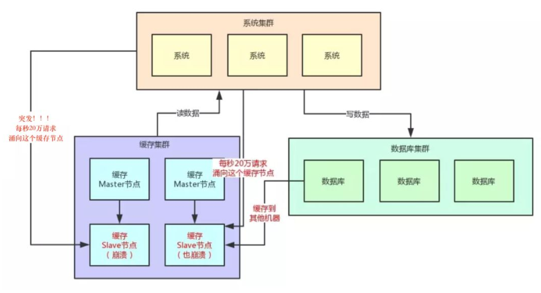
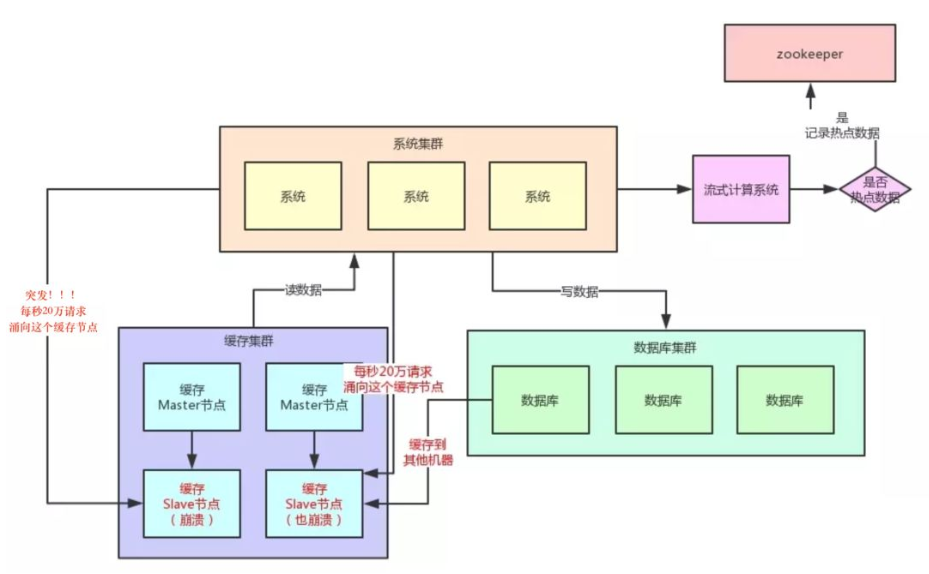

# Redis


> 作者: 潘深练
>
> 创建: 2022-04-21

## 文档 

[Redis入门小册](http://redis.panshenlian.com/)

## QA

### 1、Redis为什么要持久化？
- Redis是内存数据库，宕机后数据会消失。
- Redis重启后快速恢复数据，要提供持久化机制
- Redis持久化是为了快速的恢复数据 **而不是为了存储数据**
- Redis有两种持久化方式：AOF（append only file），RDB（Redis DataBase）
- 注意：Redis持久化不保证数据的完整性。
- 当Redis用作DB时，DB数据要完整，所以一定要有一个完整的数据源（文件、mysql）
- 在系统启动时，从这个完整的数据源中将数据load到Redis中
- 数据量较小，不易改变，比如：字典库（xml、Table）
- 通过info命令可以查看关于持久化的信息
```conf
# Persistence
loading:0
rdb_changes_since_last_save:1
rdb_bgsave_in_progress:0
rdb_last_save_time:1589363051
rdb_last_bgsave_status:ok
rdb_last_bgsave_time_sec:-1
rdb_current_bgsave_time_sec:-1
rdb_last_cow_size:0
aof_enabled:1
aof_rewrite_in_progress:0
aof_rewrite_scheduled:0
aof_last_rewrite_time_sec:-1
aof_current_rewrite_time_sec:-1
aof_last_bgrewrite_status:ok
aof_last_write_status:ok
aof_last_cow_size:0
aof_current_size:58
aof_base_size:0
aof_pending_rewrite:0
aof_buffer_length:0
aof_rewrite_buffer_length:0
aof_pending_bio_fsync:0
aof_delayed_fsync:0
```

### 2、Redis在不同应用场景下如何选择持久化方案？

- 场景一：作为内存数据库
    - 开启 rdb+aof >>> 数据不容易丢，但性能低（RDB子进程fork持久化数据时间过长，主线程堵塞等问题）
    - 当然如果有原始数据源（mysql），每次启动时都从原始数据源（mysql）中初始化 ，则不用开启持久化 （数据量较小）
- 场景二：作为缓存服务器
    - 开启 rdb >>> 数据安全性一般，容易丢数据，但性能高
    - 开启 aof >>> 数据安全性高，丢数据概率低，每秒或每次命令保存一次
- 场景三：追求极致性能
    - 不开启持久化方案 >>> 必须有原始数据源（例如mysql），每次重启或故障后可以恢复数据


### 3、RedisObject数据类型与数据结构

Type/Encoding | SDS | LinkedList | ZipList | Dict | SkipList | IntSet
----           | ----| ----  | ----  | ----  | ----  | ---- 
String         | ✔️ | —— | —— | —— | —— | —— 
List           | —— | ✔️ | ✔️ | —— | —— | —— 
Hash           | —— | —— | ✔️ | ✔️ | —— | ——  
Sorted Set     | —— | —— | ✔️ | —— | ✔️ | ——  
Set            | —— | —— | —— | ✔️ | —— | ✔️ 

**普通类型：**

- SkipList
    - 特点
        - 每层都是一个有序链表
        - 查找次数近似于层数（1/2），理想模型趋近二分法
        - 底层包含所有元素
        - 空间复杂度 O(n) 扩充了一倍
    - 优势
        - 可以快速查找到需要的节点 O(logn)，近似二分法
        - 可以在O(1)的时间复杂度下，快速获得跳跃表的头节点、尾结点、长度和高度
    - 应用场景
        - 有序集合的实现
- Dict
    - 特点
        - 数组
            - 使用数组作为存储数据的容器，采用头指针+偏移量的方式能够以O(1)的时间复杂度定位到数据所在的内存地址
        - Hash
            - Hash（散列），作用是把任意长度的输入通过散列算法转换成固定类型、固定长度的散列值。
            - Hash冲突
        - 字典扩容
        - 渐进式rehash
    - 实现
        - 字典(dict)
        - Hash表(dictht)
        - Hash表节点(dictEntry)
    - 应用场景
        - 主数据库的K-V数据存储
        - 散列表对象（Hash）、集合对象（Set）
        - 哨兵模式中的主从节点管理
- ZipList
    - 应用场景
        - sorted-set和hash元素个数少且是小整数或短字符串（直接使用）
        - list用快速链表(quicklist)数据结构存储，而**快速链表是双向列表与压缩列表的组合**。（间接使用）
- IntSet
    - 应用场景
        - 可以保存类型为 int16_t、int32_t 或者 int64_t 的整数值，并且保证集合（Set）中不会出现重复元素
- QuickList
    - 特点
        - 快速列表（quicklist）是 Redis 底层重要的数据结构，是列表的底层实现
        - 快速列表（quicklist）是一个双向链表（adlist），链表中的每个节点（quicklistNode）是一个压缩列表（ziplist）
    - 数据压缩
        - quicklist 每个节点的实际数据存储结构为 ziplist，这种结构的优势在于节省存储空间。为了进一步降低 ziplist 的存储空间，还可以对 ziplist 进行压缩。**Redis 采用的压缩算法是 LZF**。其基本思想是：数据与前面重复的记录重复位置及长度，不重复的记录原始数据。
    - 应用场景
        - 列表(List)的底层实现、发布与订阅、慢查询、监视器等功能

**特殊类型：**

- Bitmap
- Geospatial
- Stream
    - 特点
        - 流对象（stream）主要由：消息、生产者、消费者和消费组构成
        - 流对象（stream）的底层主要使用了 listpack（紧凑列表）和 Rax 树（基数树）

- HyperLogLogs

## 4、缓存穿透、雪崩、击穿

- 缓存穿透
    - 现象
        - **Key不存在**。在高并发下查询key不存在的数据，会穿过缓存查询数据库。导致数据库压力过大而宕机。
    - 解决方案
        - 对查询结果为空的情况也进行缓存，缓存时间（ttl）设置短一点，或者该key对应的数据insert了之后清理缓存（缓存太多空值占用了更多的空间）
        - 使用布隆过滤器。在缓存之前在加一层布隆过滤器，在查询的时候先去布隆过滤器查询 key 是否存在，如果不存在就直接返回，存在再查缓存和DB。

- 缓存雪崩
    - 现象
        - **大量缓存失效**。当缓存服务器重启或者大量缓存集中在某一个时间段失效，这样在失效的时候，也会给后端系统(比如DB)带来很大压力。
        - 例如：突然间大量的key失效了或redis重启，大量访问数据库，数据库崩溃
    - 解决方案
        - key的失效期分散开，不同的key设置不同的有效期（固定失效期+随机失效期）
        - 设置二级缓存（数据不一定一致）
        - 高可用（脏读）

- 缓存击穿
    - 现象
        - **热Key过期**。对于一些设置了过期时间的key，如果这些key可能会在某些时间点被超高并发地访问，是一种非常“热点”的数据。这个时候，需要考虑一个问题：缓存被“击穿”的问题，这个和缓存雪崩的区别在于这里针对某一key缓存，前者则是很多key。
        - 缓存在某个时间点过期的时候，恰好在这个时间点对这个Key有大量的并发请求过来，这些请求发现缓存过期一般都会从后端DB加载数据并回设到缓存，这个时候大并发的请求可能会瞬间把后端DB压垮。
    - 解决方案
        - 不设超时时间，volatile-lru 但会造成写一致问题。当数据库数据发生更新时，缓存中的数据不会及时更新，这样会造成数据库中的数据与缓存中的数据的不一致，应用会从缓存中读取到脏数据。可采用 **延时双删** 策略处理。
        - 用分布式锁控制访问的线程：使用redis的setnx互斥锁先进行判断，这样其他线程就处于等待状态，保证不会有大并发操作去操作数据库。

## 5、为什么要进行延迟双删？

- 什么是延迟双删？
    - 延迟双删策略是分布式系统中数据库存储和缓存数据保持一致性的常用策略，但它不是强一致。其实不管哪种方案，都避免不了Redis存在脏数据的问题，只能减轻这个问题，要想彻底解决，得要用到同步锁和对应的业务逻辑层面解决。
- 为什么要进行延迟双删？
    - 一般我们在更新数据库数据时，需要同步redis中缓存的数据，所以存在两种方法：
        - 第一种方案：先执行update操作，再执行缓存清除。
        - 第二种方案：先执行缓存清除，再执行update操作。
    - 这两种方案的弊端是当存在并发请求时，很容易出现以下问题：
        - 第一种方案：当请求1执行update操作后，还未来得及进行缓存清除，此时请求2查询到并使用了redis中的旧数据。
        - 第二种方案：当请求1执行清除缓存后，还未进行update操作，此时请求2进行查询到了旧数据并写入了redis。
- 如何实现延迟双删？
    - 所以此时我们需要使用第三种方案：**先进行缓存清除，再执行update，最后（延迟N秒）再执行缓存清除**。
- 需要注意的点
    - 上述中（延迟N秒）的时间要大于一次写操作（写入DB）的时间，一般为3-5秒。、
    - 原因：如果延迟时间小于写入redis的时间，会导致请求1清除了缓存，但是请求2缓存还未写入的尴尬。。。
    - 当然，一般写入的时间会远小于5秒
- 延时小结
    - 延迟双删用比较简洁的方式实现 mysql 和 redis 数据最终一致性，但它不是强一致。
    - 延迟，是因为 mysql 和 redis 主从节点数据同步不是实时的，所以需要等待一段时间，去增强它们的数据一致性。
    - 延迟是指当前请求逻辑处理延时，而不是当前线程或进程睡眠延迟。
    - mysql 和 redis 数据一致性是一个复杂的课题，通常是多种策略同时使用，例如：延迟双删、redis 过期淘汰、通过路由策略串行处理同类型数据、分布式锁等等。

## 6、如何防止HotKey击溃系统？

- Hot Key
    - 当有大量的请求(几十万)访问某个Redis某个key时，由于流量集中达到网络上限，从而导致这个redis的服务器宕机。造成缓存击穿，接下来对这个key的访问将直接访问数据库造成数据库崩溃，或者访问数据库回填Redis再访问Redis，继续崩溃。
    - 
- 如何发现 Hot key？
    - 1、预估热key，比如秒杀的商品、火爆的新闻等
    - 2、在客户端进行统计，实现简单，加一行代码即可
    - 3、如果是Proxy，比如Codis，可以在Proxy端收集
    - 4、利用Redis自带的命令，monitor、hotkeys。但是执行缓慢（不要用）
    - 5、利用基于大数据领域的流式计算技术来进行实时数据访问次数的统计，比如 Storm、Spark、Streaming、Flink，这些技术都是可以的。发现热点数据后可以写到zookeeper中
    - 
- 如何处理 Hot Key？
    - 1、变分布式缓存为本地缓存
        - 发现热key后，把缓存数据取出后，直接加载到本地缓存中。可以采用 Ehcache、Guava Cache 都可以，这样系统在访问热key数据时就可以直接访问自己的缓存了。（数据不要求时时一致）
    - 2、在每个Redis主节点上备份热key数据，这样在读取时可以采用随机读取的方式，将访问压力负载到每个Redis上。
    - 3、利用对热点数据访问的限流熔断保护措施
        - 每个系统实例每秒最多请求缓存集群读操作不超过 400 次，一超过就可以熔断掉，不让请求缓存集群，直接返回一个空白信息，然后用户稍后会自行再次重新刷新页面之类的。（首页不行，系统友好性差）通过系统层自己直接加限流熔断保护措施，可以很好的保护后面的缓存集群。

## 7、如何防止BigKey击溃系统？

- 大key指的是存储的值（Value）非常大，常见场景：
    - 热门话题下的讨论
    - 大V的粉丝列表
    - 序列化后的图片
    - 没有及时处理的垃圾数据
- 大key的影响：
    - 大key会大量占用内存，在集群中无法均衡
    - Redis的性能下降，主从复制异常
    - 在主动删除或过期删除时会操作时间过长而引起服务阻塞
- 如何发现大key：
    - 1、redis-cli --bigkeys命令。可以找到某个实例5种数据类型(String、hash、list、set、zset)的最大key。但如果Redis 的key比较多，执行该命令会比较慢
    - 2、获取生产Redis的rdb文件，通过rdbtools分析rdb生成csv文件，再导入MySQL或其他数据库中进行分析统计，根据size_in_bytes统计bigkey
- 大key的处理：
    - 优化big key的原则就是string减少字符串长度，list、hash、set、zset等减少成员数。
        - 1、string类型的big key，尽量不要存入Redis中，可以使用文档型数据库MongoDB或缓存到CDN上。如果必须用Redis存储，最好单独存储，不要和其他的key一起存储。采用一主一从或多从。
        - 2、单个简单的key存储的value很大，可以尝试将对象分拆成几个key-value， 使用mget获取值，这样分拆的意义在于分拆单次操作的压力，将操作压力平摊到多次操作中，降低对redis的IO影响。
        - 3、hash， set，zset，list 中存储过多的元素，可以将这些元素分拆。（常见）
        ```text 
            以hash类型举例来说，对于field过多的场景，可以根据field进行hash取模，生成一个新的key，例如
            原来的
            hash_key:{filed1:value, filed2:value, filed3:value ...}，可以hash取模后形成如下
            key:value形式
            hash_key:1:{filed1:value}
            hash_key:2:{filed2:value}
            hash_key:3:{filed3:value}
            ...
            取模后，将原先单个key分成多个key，每个key filed个数为原先的1/N
        ```
        - 4、删除大key时不要使用del,因为del是阻塞命令，删除时会影响性能。
        - 5、使用 lazy delete (unlink命令)
            - 删除指定的key(s),若key不存在则该key被跳过。但是，相比DEL会产生阻塞，该命令会在另一个线程中回收内存，因此它是非阻塞的。 这也是该命令名字的由来：仅将keys从key空间中删除，真正的数据删除会在后续异步操作。
            ```text
                redis> SET key1 "Hello"
                "OK"
                redis> SET key2 "World"
                "OK"
                redis> UNLINK key1 key2 key3
                (integer) 2
            ```

## 8、缓存与数据库一致性问题？

- 缓存更新策略
    - 利用Redis的缓存淘汰策略被动更新 LRU 、LFU
    - 利用TTL被动更新
    - 在更新数据库时主动更新 （延时双删）
    - 异步更新（异步回刷），定时任务，数据不保证时时一致，不穿DB
- 不同策略之间的优缺点

策略 | 一致性 | 维护成本
---- | ---- | ----
利用Redis的缓存淘汰策略被动更新 | 最差 | 最低
利用TTL被动更新 | 较差 | 较低
异步更新（异步回刷），定时任务 | 较灵活 | 较高
在更新数据库时主动更新 （延时双删） | 教强 | 最高


## 9、关于分布式锁？

- 方案一：SETNX + EXPIRE
    - 方案实现
        - 先用setnx来抢锁，如果抢到之后，再用expire给锁设置一个过期时间，防止锁忘记了释放。
        - SETNX 是SET IF NOT EXISTS的简写.日常命令格式是SETNX key value，如果 key不存在，则SETNX成功返回1，如果这个key已经存在了，则返回0。
        ```java
            if（jedis.setnx(key_resource_id,lock_value) == 1）{ //加锁
                expire（key_resource_id，100）; //设置过期时间
                try {
                    do something  //业务请求
                }catch(){
            }
            finally {
                jedis.del(key_resource_id); //释放锁
                }
            }
        ```
    - 存在问题
        - setnx 和 expire 两个命令分开了，不是原子操作。如果执行完 setnx 加锁，正要执行 expire 设置过期时间时，进程 crash 或者要重启维护了，那么这个锁就丢失了（锁得不到释放），别的线程永远获取不到锁。
- 方案二：SETNX + value值是（系统时间+过期时间）
    - 方案实现
        - 为了解决方案一中【发生异常锁得不到释放的场景】，有小伙伴认为，可以把过期时间放到setnx的value值里面。如果加锁失败，再拿出value值校验一下即可。加锁代码如下：
        ```java
            long expires = System.currentTimeMillis() + expireTime; //系统时间+设置的过期时间
            String expiresStr = String.valueOf(expires);
            
            // 如果当前锁不存在，返回加锁成功
            if (jedis.setnx(key_resource_id, expiresStr) == 1) {
                    return true;
            } 
            // 如果锁已经存在，获取锁的过期时间
            String currentValueStr = jedis.get(key_resource_id);
            
            // 如果获取到的过期时间，小于系统当前时间，表示已经过期
            if (currentValueStr != null && Long.parseLong(currentValueStr) < System.currentTimeMillis()) {
            
                // 锁已过期，获取上一个锁的过期时间，并设置现在锁的过期时间（不了解redis的getSet命令的小伙伴，可以去官网看下哈）
                String oldValueStr = jedis.getSet(key_resource_id, expiresStr);
                
                if (oldValueStr != null && oldValueStr.equals(currentValueStr)) {
                    // 考虑多线程并发的情况，只有一个线程的设置值和当前值相同，它才可以加锁
                    return true;
                }
            }
                    
            //其他情况，均返回加锁失败
            return false;
            }
        ```
    - 存在问题
        - 过期时间是客户端自己生成的（System.currentTimeMillis()是当前系统的时间），必须要求分布式环境下，每个客户端的时间必须同步。
        - 如果锁过期的时候，并发多个客户端同时请求过来，都执行jedis.getSet()，最终只能有一个客户端加锁成功，但是该客户端锁的过期时间，可能被别的客户端覆盖
        - 该锁没有保存持有者的唯一标识，可能被别的客户端释放/解锁。
- 方案三：使用Lua脚本(包含SETNX + EXPIRE两条指令)
    - 方案实现
        - 我们还可以使用Lua脚本来保证原子性（包含setnx和expire两条指令），lua脚本如下：
        ```java
            if redis.call('setnx',KEYS[1],ARGV[1]) == 1 then
                redis.call('expire',KEYS[1],ARGV[2])
            else
                return 0
            end;
        ```
        - 加锁代码如下：
        ```java
            String lua_scripts = "if redis.call('setnx',KEYS[1],ARGV[1]) == 1 then" +
                " redis.call('expire',KEYS[1],ARGV[2]) return 1 else return 0 end";   
            Object result = jedis.eval(
                lua_scripts, 
                Collections.singletonList(key_resource_id), Collections.singletonList(values));
            //判断是否成功
            return result.equals(1L);
        ``` 
- 方案四：SET的扩展命令（SET EX PX NX）
    - 方案实现
        - 除了使用，使用Lua脚本，保证SETNX + EXPIRE两条指令的原子性，我们还可以巧用Redis的SET指令扩展参数！（SET key value[EX seconds][PX milliseconds][NX|XX]），它也是原子性的！
        ```java
            SET key value[EX seconds][PX milliseconds][NX|XX]

            NX :表示key不存在的时候，才能set成功，也即保证只有第一个客户端请求才能获得锁，而其他客户端请求只能等其释放锁，才能获取。
            EX seconds :设定key的过期时间，时间单位是秒。
            PX milliseconds: 设定key的过期时间，单位为毫秒
            XX: 仅当key存在时设置值
        ```
        - 伪代码demo如下：
        ```java
            if（jedis.set(key_resource_id, lock_value, "NX", "EX", 100s) == 1）{ //加锁
                try {
                    do something  // 业务处理
                }catch(){
                    do somthing   // 异常处理
                } finally {
                    jedis.del(key_resource_id); // 释放锁
                }
            }
        ```
    - 存在问题
        - 问题一：「锁过期释放了，业务还没执行完」。假设线程a获取锁成功，一直在执行临界区的代码。但是100s过去后，它还没执行完。但是，这时候锁已经过期了，此时线程b又请求过来。显然线程b就可以获得锁成功，也开始执行临界区的代码。那么问题就来了，临界区的业务代码都不是严格串行执行的啦。
        - 问题二：「锁被别的线程误删」。假设线程a执行完后，去释放锁。但是它不知道当前的锁可能是线程b持有的（线程a去释放锁时，有可能过期时间已经到了，此时线程b进来占有了锁）。那线程a就把线程b的锁释放掉了，但是线程b临界区业务代码可能都还没执行完呢。
- 方案五：SET EX PX NX  + 校验唯一随机值,再释放锁
    - 方案实现
        - 既然锁可能被别的线程误删，那我们给value值设置一个标记当前线程唯一的随机数，在删除的时候，校验一下，不就OK了嘛。伪代码如下：
        ```java
            if（jedis.set(key_resource_id, uni_request_id, "NX", "EX", 100s) == 1）{ //加锁
                try {
                    do something  //业务处理
                }catch(){
                    do somthing   // 异常处理
                }finally {
                    //判断是不是当前线程加的锁,是才释放
                    if (uni_request_id.equals(jedis.get(key_resource_id))) {
                        jedis.del(lockKey); //释放锁
                    }
                }
            }
        ```
    - 存在问题
        - 「判断是不是当前线程加的锁」和「释放锁」不是一个原子操作。如果调用jedis.del()释放锁的时候，可能这把锁已经不属于当前客户端，会解除他人加的锁。
- 方案六: Redisson框架
- 方案七：多机实现的分布式锁Redlock
- 方案八：乐观锁watch实现 

# 10、缓存穿透与布隆过滤器的冲突思考？

- 问题描述：
    - 使用缓存中间件时，需要考虑缓存穿透问题，简单来说就是缓存key不存在，流量直接打到数据库。面对这个问题，一般有几种应对方案：一是存储空值key，二是使用布隆过滤器，或其它。而针对使用布隆过滤器的方案，除了准确度问题之外，我有另外一个担忧：就是由于使用布隆过滤器需要预先加载所有key进行标记存在与否，因此如果key特别多，那预热的动作将会导致两个问题，一个是预热过程耗时长，二是预热key太多导致空间损耗。这种担忧合理吗？

- 回答：
    - 关于预热时间过程耗时长，确实是个问题，但是可以通过异步预热方式来规避对主流程的影响，或通过额外独立服务进程（多线程）来加速预热。
    - 关于预热key太多导致空间损耗问题，恰恰不是问题，因为布隆过滤器就是为了解决白名单key太多导致的空间占用的，简而言之，布隆过滤器（也可以选择布谷鸟过滤器，精确度较高/误判率较低）就是为了节省空间，由一组bitset和一组hash函数（算法组成），是一种空间效率极高的概率型算法和数据结构，主要用来判断一个元素是否在集合中存在，布隆过滤器摘要在低网络开销和低内存要求方面提供了最佳性能。但是需要考虑过滤器的更新/删除问题，如果数据量小可以考虑定时全量刷新，如果数据量大则只能是考虑区间更新 ( hashmap<key区段， 布隆过滤器>，全量覆盖某一个区段 )，这样一来就导致另一个问题那就是误删数据，所以误删数据问题加上布隆过滤器本身的误判率问题，还是会持续穿透数据库，所以一般推荐使用 “布隆过滤器 + 误判集合（缓存不存在存储空值key）”的组合策略来应对缓存穿透问题。


