# 工作流之思考与选型

> 作者: 潘深练
>
> 创建: 2023-04-05
>
> 版权声明：自由转载-非商用-非衍生-保持署名（[创意共享3.0许可证](https://creativecommons.org/licenses/by-nc-nd/3.0/deed.zh)）

## 一、业务背景

一直以来，技术方案的诞生起初都是为了解决某个具体的业务问题，所以没有实际业务背景支撑的技术解决方案往往缺乏说服力。

### 1.1、现存问题

许多企业在做信息化的过程中，规划设计 **工作业务流程** 时总会遭遇许多挑战，例如：

- 灵活度不足，追求自由
- 反应力迟缓，追求高效
- 透明度模糊，追求清晰
- 安全性缺失，追求管控
- More

### 1.2、基本诉求

所以针对不同的挑战，一般我们可以梳理出对应的解决思路或策略：

- 例如灵活度不足，我们会思考 **流程的逻辑控制和可编排性** ===> 多变规划、灵活建模
- 例如反应力迟缓，我们会思考 **节点功能的自由度** =========> 督办机制、通知策略
- 例如透明度模糊，我们会思考 **流转状态的持久化和可视化** ===> 实时进度、状态变更、可追溯性
- 例如安全性缺失，我们会思考 **管控用户组别权限** =========> 数据安全、隔离管控（文档、信息、任务）

### 1.3、技术方案聚焦

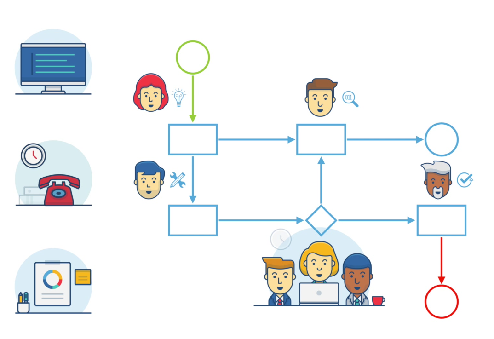

经过调研：

- 成熟度高且完整性强的 **工作流** 综合方案
- 单点能力强轻量级的 **流程编排** 技术方案

这两类作为候选方案，能适配解决业务中的痛点问题，基本合理。

### 1.4、工作流常见分类

针对不同的信息化需求与数据特征，基本有三种常见的工作流类型：

- 工作流，一般是我们通常认为的工作审批流
- 流程编排，一般指任务执行（调度）框架
- 数据处理流程编排，一般应用在大数据处理编排场景

1. **工作流**
    - 基本上都是 **bpmn** 为基础，当然目前基本是以 bpmn2.0 为标准，对 **用户权限**，**审批**，**复杂流程** 流转比较亲和，譬如配置组织关系、审批人以及邮件通知等，
    - 例如：jBPM，Activity，Flowble，Camunda 等

2. **流程编排**
    - 一般对 **接口** 和 **数据** 比较亲和，数据计算处理流转到下一个处理节点，或者 **服务调用的依赖**，与 **具体语言** 或者某种 **协议** 结合，譬如远程 `rpc` 调用一个 `java rpc` 接口或者 `http` 接口等
    - 例如：PowerJob 的 DAG（拓扑依赖）、淘宝的 tmf （重量级）、kstry（轻量）等

3. **数据处理流程编排**
    - 对 **大数据组件** 比较亲和，hadoop 离线计算、流式计算等数据管道的编排问题，譬如整合 hadoop 集群链接，自动读数据等

> 亲和，字面意思是亲近和合，我逐渐喜欢使用这个词应用到技术领域，以此来表达不同技术方案之间的适配度与包容性。

其实，每一种工作流类型（或其适配的应用场景），都能有扩展机制，理论上任何技术方案都可以扩展到其他技术方案的规模，或集成其他其他技术方案的能力，例如一个日志框架 log4j ，他想要做的话，也可以演化成一个 kafka，只不过各自有追求的技术深度与方向，所以构建出越来越专业的极具技术壁垒的解决方案。

本文其实我希望探讨的是 **工作审批流** 类型的解决方案，以下做出直观对比。

## 二、开源工作流引擎

### 2.1、众工作流

- 稳健强大的老牌工作流 + 标准实现多
	- jBPM
	- Activiti
	- Flowable
	- Camunda 

- 基础建模的轻量工作流 + 标准实现少
	- Osworkflow
	- Shark
	- Apache ODE
	- JFlow（国产）
	- ProcessMaker
	- SWF
	- Bonita BPM
	- OpenWebFlow
	- Snaker

> 基于现有的业务诉求以及未来发展的可能性，基本我们更倾向于选择稳健强大的老牌工作流。

### 2.2、历史背景

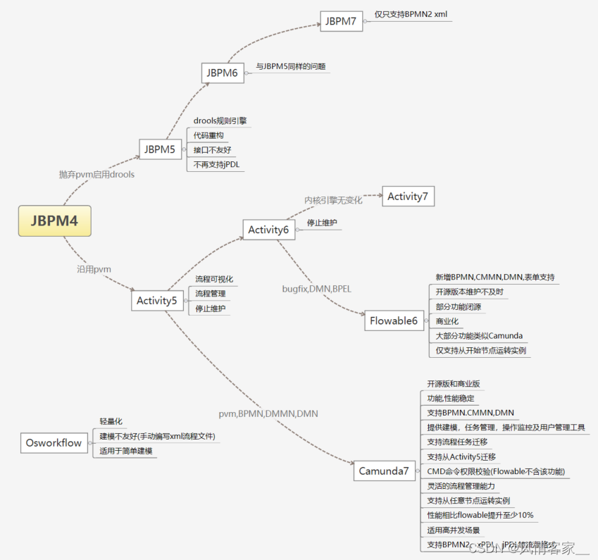

- jBPM4（2009）
  - jBPM5（2010）
    - jBPM6（2016）
      - **jBPM7**（2020）
  - Activiti5（2010）
    - Activiti6（2015）
      - **Avtiviti7**（2020）
      - Flowable6（2016） 
        - **Flowable6.5.x**（2020） 
    - Camunda7（2013） 
      - **Camunda7.14.x**（2020）

### 2.3、名称解释

技术方案发展到一定程度必然会产生许多标准，譬如 Java 领域的 J2EE ，所以工作流也一样，从一开始百家争鸣（bpmn1.0、jpdl、bpel、xpdl、bpml）到目前 bpmn2.0 一家独大，所以关于以下业务流程的相关名称解释，可以在前期接触时大致了解，点到为止，后续逐步应用实战以后，再做深入研究。

- **业务流程管理**
  - BPM （Business Process Management，业务流程管理）
- **工作流标准/规范**
  - BPMN （Business Process Modeling Notation，业务流程建模与标注）
  - JPDL（JBoss jBPM Process Definition Language，过程定义语言）
  - BPEL（Business Process Execution Language，业务过程执行语言）
  - XPDL（XML Process Definition Language，XML 过程定义语言）
  - BPML（Business Process Modeling Language，业务流程建模语言）
- **建模符号/决策结构**
  - DMN（Decision Model and Notation，决策模型符号）
  - CMMN（Case Management Model and Notation，图形化管理模型符号）
- **接口规范/拓展性能**
  - PVM （Process Virtual Machine，流程虚拟机）

> 各工作流标准实现

|维度    | jBPM 7   | Activiti 7   | Flowable 6     | Camunda 7 |
|-         |-            | -            |-                |-        |
|BPMN 1.x | × | √ | √ | √ |
|JPDL | × | √ | √ | √ |
|BPEL | - | - | - | - |
|XPDL | × | √ | √ | √ |
|BPMN 2.0 | ★ | ★ | ★ | ★ |
|**CMMN** （状态建模） | × | × | √ | × |
|**DMN** （多决策） | × | × | √（6.4之前不稳定） | √ |
|PVM | × | × | × | √ （Activiti 5） |

> BPMN、CMMN、DMN 三个标准都是由 OMG 提出的，多数机构认为 DMN 和 CMMN 是工作流发展趋势。

#### process-on ，基于 bpmn 标准的简单实现

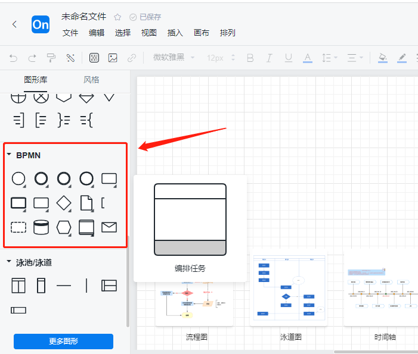

#### Activiti ，基于 bpmn 标准的丰富实现

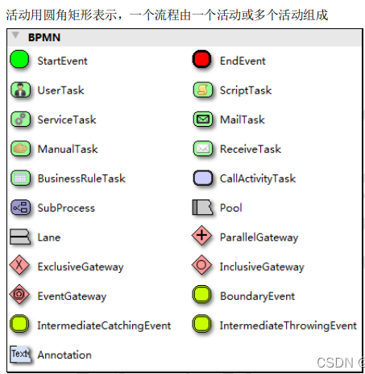

#### WorkFlow，展示一个基础流程

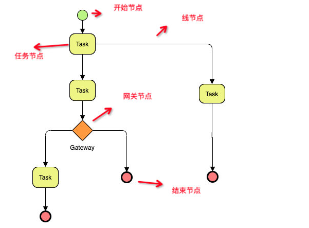

### 2.4、产品对比

> 社区

|维度    | jBPM     | Activiti     | Flowable       | Camunda |
|-         |-            | -            |-                |-        |
|最新版本 | 7.73.0 | 7.9.x | 6.8.1 | 7.18.0 |
|GitHub Fork  | 1.2k | 6.9k | 2.3k    | 1.3k |
|GitHub Star | 1.5k | 9.3k | 6.2k | 3.2k |
|开源情况 | 持续开源 | Activiti7 维护 +  企业版 | 持续开源 + 商业版 | 持续开源 + 商业版 |
|源码活跃度 | ★★★ | ★★★ | ★★★ | ★★★★ |
|源码地址 | [github](https://github.com/kiegroup/jbpm) | [github](https://github.com/Activiti/Activiti)  | [github](https://github.com/flowable/flowable-engine)  | [github](https://github.com/camunda/camunda-bpm-platform)  |

社区： **Activiti > Flowable > Camunda > jBPM**

> 趋势与流行度（百度指数）

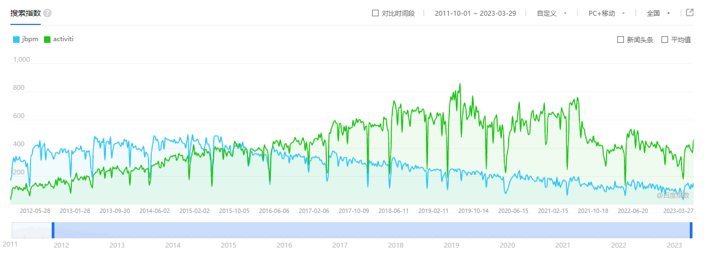

趋势与流行度： **Activiti > jBPM > Camunda > Flowable**

> 各工作流功能对比

|维度    | jBPM 7   | Activiti 7   | Flowable 6     | Camunda 7 |
|-         |-            | -            |-                |-        |
|会签 | √ | √ | √ | √ |
|加签 | - | ×（拓展实现） | √ | √ |
|减签 | - | ×（拓展实现） | √ | √ |
|回退 | - | ×（拓展实现） | √ | √（跳转） |
|驳回 | √ | ×（拓展实现） | √ | √（跳转） |
|自定义流转 | - | ×（拓展实现） | × | √ |
|动态表单 | - | √（内置+外置） | √（内置+外置） | √ |
|多实例 | √ | √ | √ | √ |
|事务子流程 | √ | √ | √ | √ |
|版本迁移 | × | × | × | √ （Activiti 5） |

功能： **Camunda > Flowable > jBPM > Activiti**

> 兼容性及二次开发

|维度    | jBPM 7   | Activiti 7   | Flowable 6     | Camunda 7 |
|-         |-            | -            |-                |-        |
|开发基础 | Drools Flow | jBPM4 | Activiti 5 & 6 | Activiti 5 |
|引擎核心 | Drools | 去除PVM | 去除PVM | PVM，迁移上有优势 |
|直接支持的脚本 | - | JUEL、groovy | JUEL、groovy | python、ruby、groovy、JUEL |
|Spring Boot | √ | √ | √ | √ |
|Spring Cloud | √ | √ | √ | √ |
|持久化框架 | Hibernate | JPA + Mybatis | JPA + Mybatis | JPA + Mybatis |
|架构 | Kie | spring boot 2+ | spring boot 1.5+ | spring boot 2+ |
|事务管理 | Bitronix，基于JTA事务管理 | Spring事务控制 | Spring事务控制 | Spring事务控制 |
|分布式事务 | Bitronix，基于JTA事务管理 | - | - | 补偿机制，SAGA 模式 |
|二次开发难度 | 较难 | 一般 | 一般 | 一般 |
|开发手册 | [jbpm](https://docs.jboss.org/jbpm/release/7.40.0.Final/jbpm-docs/html_single/) | [activiti](https://activiti.gitbook.io/activiti-7-developers-guide/) | [flowable](https://documentation.flowable.com/latest/forms/start-intro/) | [camunda-en](https://docs.camunda.org/manual/7.13/user-guide/) [camunda-ch](http://camunda-cn.shaochenfeng.com/) |
|运行模式 | - | 独立运行和内嵌 | - | 独立运行和内嵌 |
|设计器 | Eclipse，Web | 集成 idea Eclipse，Web | 自提供，Eclipse，Web | 自提供，Eclipse |
|建模工具 | - | Activiti-Modeler | Flowable-Modeler | bpmn-js ， Camunda Provider |
|集成接口 | 消息通讯 | SOAP、Mule、RESTful | SOAP、Mule、RESTful | SOAP、Mule、RESTful |
|内部服务通讯 | 基于Apache Mina异步通讯 | Service间通过API调用 | Service间通过API调用 | Service间通过API调用 |

现有的工作流解决方案，基本都有对应的前段设计器，简单列举：

- **mxGraph** 

开源技术，基于 mxGraph 实现的较为出名的产品有：processOn ，draw.io 

- **bpmn-js**

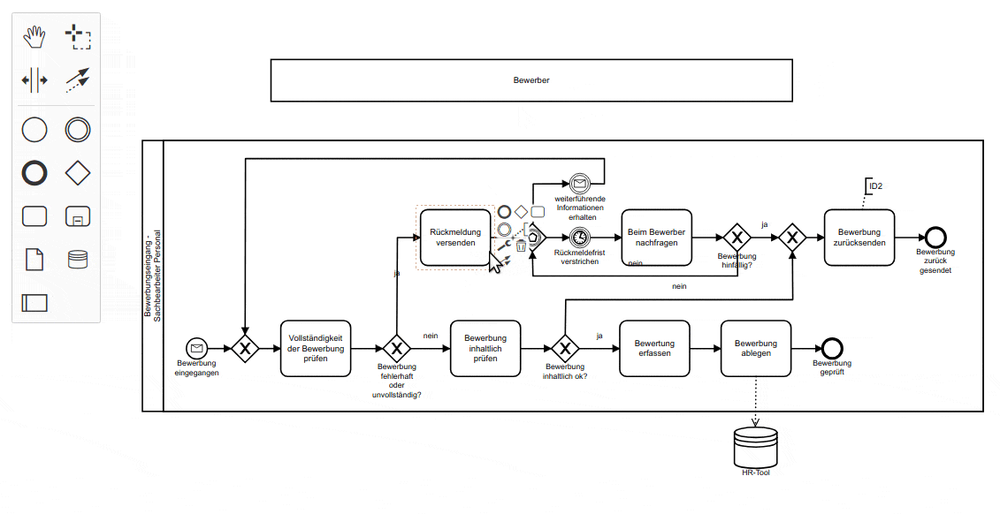

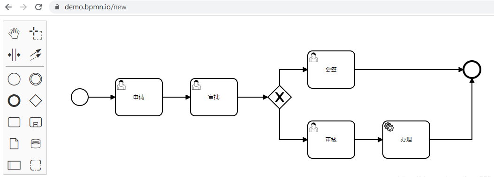

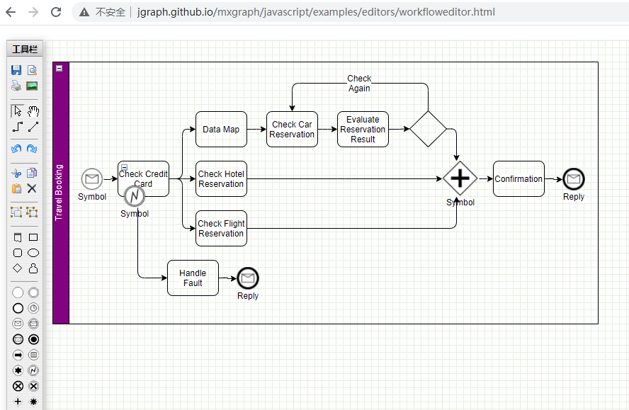

- **Activiti-Modeler**

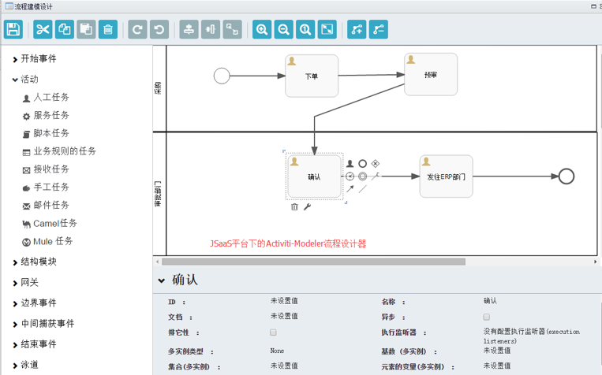

- **Flowable-Modeler**

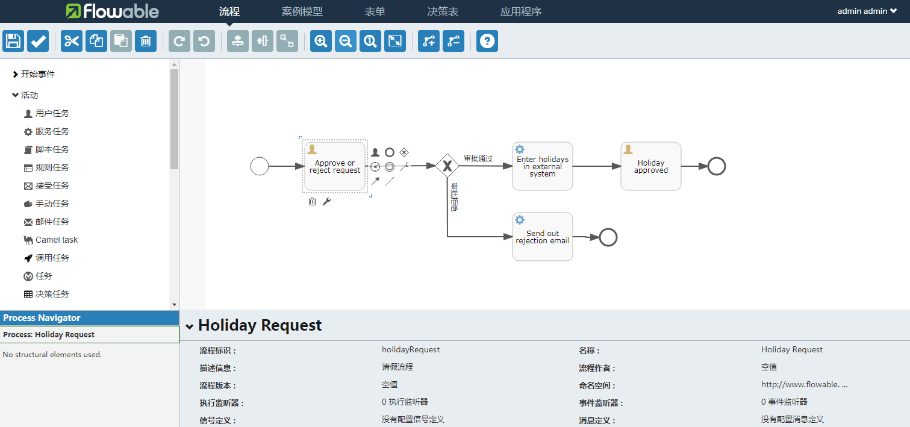

> 未来拓展性

|维度    | jBPM 7   | Activiti 7   | Flowable 6     | Camunda 7 |
|-         |-            | -            |-                |-        |
|历史数据处理（NoSql） | - | - | √ | √（只提供了解决方案） |
|支持数据库 | Mysql，postgre | Oracle、SQL Server、MySQL | Oracle、SQL Server、MySQL、postgre | Oracle、SQL Server、MySQL、postgre |
|集群部署 | √ | √ | √（6.5版本支持） | √ |
|云原生 | Kogito | 自研 | - | - |
|RoadMap | 工具 | 云原生 | 工具 | 工具 |
|官网 | [jbpm](https://www.jbpm.org/) | [activiti](https://www.activiti.org/) | [flowable](https://www.flowable.org/) | [camunda](https://camunda.com/) |

### 2.5、总结

社区活跃： **Activiti > Flowable > Camunda > jBPM**

搜索趋势： **Activiti > jBPM > Camunda > Flowable**

功能齐全： **Camunda > Flowable > jBPM >  Activiti**

开发维护： **Camunda > Flowable > Activiti >  jBPM**

> 基于基础对比，得分从低至高为 1、2、3、4  

| 工作流 | 维度得分 | 优势 | 不足 |
| - | - | - | - |
| jBPM | 1+3+2+1=7 | 与其他开源框架（如 Drools 和 JBoss）集成紧，支持多种工作流模式 | 缺少对业务规则的支持，对于大规模部署，性能存在问题，技术栈架构不匹配，缺乏可扩展性。 |
| Activiti   | 4+4+1+2=11 | 易于使用和上手，配置和部署简单，社区活跃，文档和学习资源丰富 | 功能不齐全，缺乏可扩展性和可定制性配置，部署复杂度高，不支持多租户 |
| Flowable  | 3+1+3+3=10 | 高度可扩展性和可定制性，功能强大，支持多种工作流模式，对于事件驱动架构的支持很好 | 缺少对历史数据的完整性和可扩展性支持，对于复杂工作流程容易出现性能问题，缺乏对定时任务和事件的支持 |
| Camunda  | 2+2+4+4=12 | 功能强大，支持复杂的工作流场景，灵活性高，允许自定义的扩展和集成，提供了全面的管理和监控功能 | 学习曲线陡峭，使用和配置相对困难，文档和社区暂未完全成熟，缺乏对多租户环境的完整支持 |

站在技术调研的角度，可能产出的技术选型方案更多倾向于技术考量，例如以上列出的技术、社区、趋势等维度，主要关注 **开发成本、维护成本、拓展性能** 等。

但是最终落实方案，肯定需要结合业务的实际诉求以及企业愿意承担的成本，这个我们更多是指 **功能匹配度与实际效益** 。

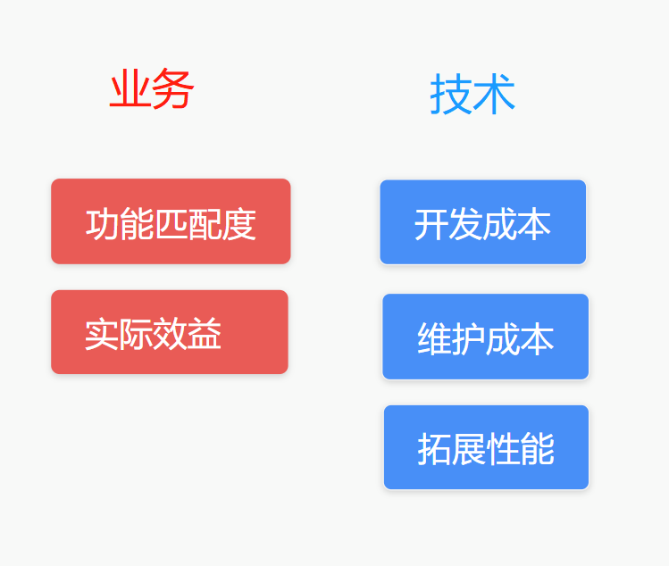

## 三、参考

### 3.1、文章

- [《工作流之大局势(2006版)》](http://www.uml.org.cn/erp/200606213.htm)

- [《BPM之大局势（2008版）》](https://blog.csdn.net/hongbo781202/article/details/3445960?spm=1001.2014.3001.5501)

- [《纵观jBPM：从jBPM3到jBPM5以及Activiti5》](https://www.infoq.cn/article/rh-jbpm5-activiti5/)

- [《工作流引擎Activiti使用总结》](http://www.uml.org.cn/soa/201512312.asp?artid=17107)

- [《工作流选型专项，Camunda or flowable or?》](https://www.cnblogs.com/garfieldcgf/p/13469519.html)

- [《常见的工作流引擎(osworkflow、jbpm、activiti、flowable、camunda)比较》](https://zhuanlan.zhihu.com/p/592105369)

- [《亿级异构任务调度框架设计与实践》](https://mp.weixin.qq.com/s/9WIZIf-7yApfCZSMuD9CWQ)

### 3.2、官网

- [org - jBPM](https://www.jbpm.org/)
- [org - Activiti](https://www.activiti.org/)
- [org - Flowable](https://www.flowable.org/)
- [com - Camunda](https://camunda.com/)

### 3.3、开源社区

- [github - jBPM](https://github.com/kiegroup/jbpm)
- [github - Activiti](https://github.com/Activiti/Activiti)
- [github - Flowable](https://github.com/flowable/flowable-engine)
- [github - Camunda](https://github.com/camunda/camunda-bpm-platform)

### 3.4、搜索工具

- [搜索引擎 - 百度](https://www.baidu.com/)
- [AI机器人 - ChatGPT3.5](https://openprompt.co/)

（结束）