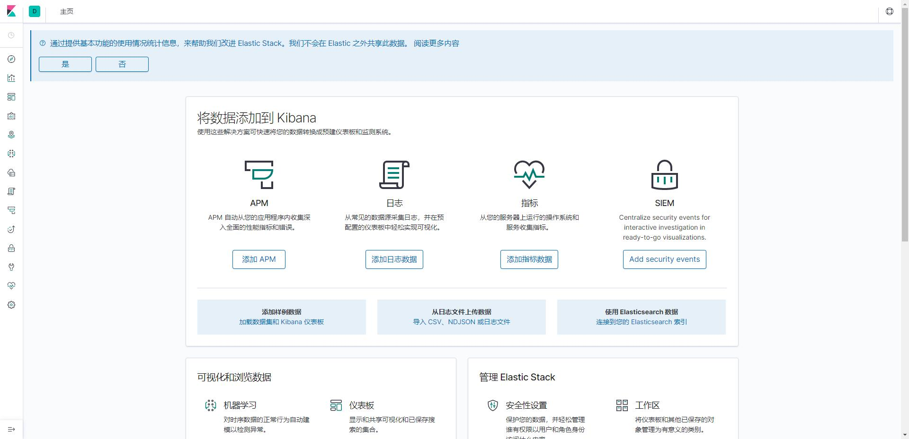

# Kibana


> 作者: 潘深练
>
> 创建: 2022-07-20

## 一、Kibana


## 二、QA

### 2.1、kibana 服务配置 nginx 代理之后 502，为何?


#### 折腾背景

- 第一，kibana 服务，首先基于 es 服务，所以是先启动 es 服务，再启动 kibana 服务
- 第二，es 服务和 kibana 服务，都是根据官方或民间（网络）的通用安装启动方式部署，并且通过 http://ip:port 均可正常访问
    - es 服务： http://172.16.222.88:9002
    - kibana 服务： http://172.16.222.88:50002
    - 以上 `172.16.222.88` 为我阿里云服务器内网 ip

以上两点是前提，在此之上，我希望通过配置 nginx 反向代理，以域名方式访问，目的有二：

- 一来为安全性，屏蔽了端口向外暴露
- 二来为便利性，基于域名地址访问

#### 初试配置

所以我着手配置，按照常规的配置方式 kibana.yam 如下

```yml
server.port: 50002
server.host: "0.0.0.0"
elasticsearch.hosts: ["http://172.16.222.88:9002"]
```

其中我将 `kibana` 之端口设置为 50002 ，而 `http://172.16.222.88:9002` 则是内网之 es 服务，已正常启动并且可访问。再之，nginx.conf 代理配置如下

```conf
upstream kibana {     
    server 172.16.222.88:50002 weight=1 max_fails=3 fail_timeout=60s;      
}

server {
      listen 80;
      server_name kibana.psl.com; 

      location / {      
        proxy_pass http://kibana;
        proxy_redirect off;
        proxy_next_upstream http_502 http_504 error timeout invalid_header;
        proxy_set_header Host $host:$server_port;  
        proxy_set_header REMOTE-HOST $remote_addr;
        proxy_set_header X-Real-IP $remote_addr;
        proxy_set_header X-Remote-IP $http_x_forwarded_for;  
        proxy_set_header X-Forwarded-For $proxy_add_x_forwarded_for;  
        proxy_set_header X-Forwarded-Proto $scheme;
        client_max_body_size   100m;
        client_body_buffer_size   128k;
        proxy_connect_timeout   60;
        proxy_send_timeout   60;
        proxy_read_timeout   60;
        proxy_buffer_size   16k;
        proxy_buffers   4 32k;
        proxy_busy_buffers_size   64k;
        proxy_temp_file_write_size  64k;
      }
	
      error_page   500 502 503 504  /50x.html;
      location = /50x.html {
            root   html;
      }
    }
```

以上配置当然均在 `http{}` 之内，好的，至此，我初步配置完成，重启 nginx 

```shell
./nginx -t
./nginx -s reload
```
#### 奇怪现象

奇怪的现象出现，通过 `http://172.16.222.88:50002` 依旧能正常访问 kibana，但是通过 `http://kibana.psl.com` 竟然出现 502

此间我查阅了众多网络资料，有很多说辞：

- 其一，认为 nginx 服务器未配置允许 webserver 访问，帖子详如： [Nginx Kibana: Bad gateway 502](https://discuss.elastic.co/t/nginx-kibana-bad-gateway-502/248392)

```shell
setsebool httpd_can_network_connect on -P
```

- 其二，认为需要为 kibana 配置代理访问，网络帖子许多，我列出配置项目即可，kibana.yml 内配置如下：

```yml
server.basePath: "/elk"
server.rewriteBasePath: true
```

#### 无果

但是以上方案我尝试过后，均未能解决 502 问题

#### 奇异果

最终我尝试把 ip 修改为 `localhost` 或 `127.0.0.1` 

```conf
    upstream kibana {     
      server 127.0.0.1:50002 weight=1 max_fails=3 fail_timeout=60s;      
    }
```


发现 502 竟然消失了，得以正常访问  `http://kibana.psl.com` 



但觉困扰，暂未研究其原由，待后续有时间再查验其中。
