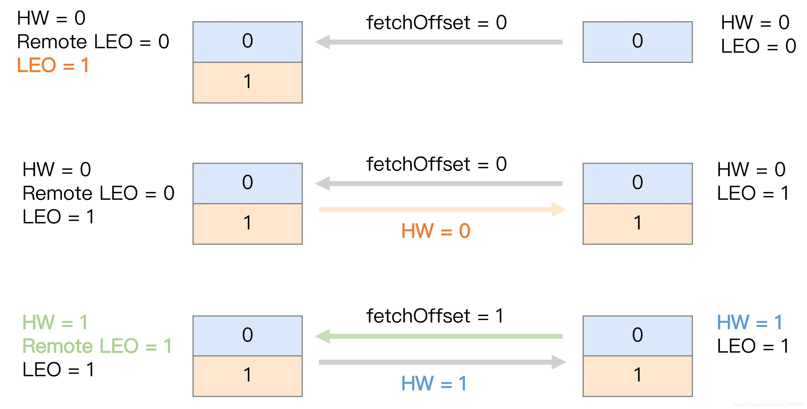

# 消息中间件与常见问题


> 作者: 潘深练
>
> 创建: 2022-05-28

## 一、脑图概览

<iframe id="embed_dom" name="embed_dom" frameborder="0" 
    style="display: block;width: 100%;height: 500px;" 
    src="https://www.processon.com/embed/628892f9f346fb4244d0672c"></iframe>


## 二、消息中间件

### 2.1、介绍

在单个系统中，一些业务处理可以顺序依次的进行。而涉及到跨系统（有时候系统内部亦然）的时候，会产生比较复杂数据交互（也可以理解为消息传递）的需求，这些数据的交互传递方式，可以是同步也可以是异步的。

**在异步传递数据的情况下，往往需要一个载体，来临时存储与分发消息。在此基础上，专门针对消息接收、存储、转发而设计与开发出来的专业应用程序，都可以理解为消息队列中间件**。


> 基本思想

利用 **高效可靠** 的消息传递机制进行 **异步** 的数据传输（**最终一致性**）。

### 2.2、发展阶段


第一阶段为了解决 **异构系统的通信问题**，基本方案是消息总线

第二阶段 **制定标准** 防止重复造轮子，诞生 ActiveMQ、RabbitMQ 等；

第三阶段流量爆发，演变出 **可伸缩** 方案，Kafka、RocketMQ 等；

第四阶段 IoT、云计算、云原生引领下，衍生更多如 MQTT 协议 等。

> 基本就是增长带来了演化与复杂度，从最初的解决异构问题到如今万物互联等复杂场景。

**异构 ---> 标准化、灵活路由 ---> 可伸缩 ---> 万物互联/衍生数据/流式计算 ...**

应用场景、影响范围越来越大，架构演化、技术复杂度越来越大。


**天平失衡，初心倾斜，从应用定义演化到云原生更多层次！**


### 2.3、应用场景

#### 1、系统解耦

- 解耦是消息队列要解决的 **最本质问题**。

- 将不同性质的业务进行隔离切分，提升性能，主附流程分层，按照重要性进行隔离，减少异常影响。

#### 2、异步通信

- 可以用于业务系统内部的异步通信，也可以用于分布式系统信息交互。

- 基于消息队列的异步调用能够显著降低前端业务的响应时间，提高吞吐量。


#### 3、流量削峰

- 间歇性突刺流量分散处理，减少系统压力，提升系统可用性。

- 基于消息队列还能实现削峰填谷，把慢服务分离到后置链路，提升整个业务链路的性能


#### 4、分布式事务一致性

- RocketMQ 提供的事务消息功能可以处理分布式事务一致性（如电商订单场景）。

- 当然，也可以使用分布式事务中间件，例如 Seata 等

#### 5、消息顺序收发

- 这是最基础的功能，先进先出，消息队列必备。


#### 6、延时消息

- 延迟触发的业务场景，如下单后延迟取消未支付订单等。

#### 7、大数据处理

- 日志处理，kafka。


#### 8、分布式缓存同步

- 消费 MySQL 的 binlog 日志进行缓存同步，或者业务变动直接推送到 MQ 消费。


### 2.5、可靠性保证

我们可以从以下几方面来保证消息的可靠性：

#### 1. 异常捕获

客户端代码中的异常捕获(try/catch)，包括生产者和消费者


#### 2. 事务机制

AMQP/RabbitMQ 的事务机制


#### 3. 发送端确认机制

RabbitMQ后来引入了一种轻量量级的方式，叫发送方确认(publisher confirm)机制。生产者将信道设置成confirm(确认)模式，一旦信道进入confirm 模式，所有在该信道上⾯面发布的消息都会被指派一个唯一的ID(从1 开始)，一旦消息被投递到所有匹配的队列之后（如果消息和队列是持久化的，那么确认消息会在消息持久化后发出），RabbitMQ 就会发送一个确认(Basic.Ack)给生产者(包含消息的唯一ID)，这样生产者就知道消息已经正确送达了。


RabbitMQ 回传给生产者的确认消息中的deliveryTag 字段包含了确认消息的序号，另外，通过设置channel.basicAck方法中的multiple参数，表示到这个序号之前的所有消息是否都已经得到了处理了。生产者投递消息后并不需要一直阻塞着，可以继续投递下一条消息并通过回调方式处理理ACK响应。如果 RabbitMQ 因为自身内部错误导致消息丢失等异常情况发生，就会响应一条nack(Basic.Nack)命令，生产者应用程序同样可以在回调方法中处理理该 nack 命令。

```java

Connection connection = factory.newConnection();
Channel channel = connection.createChannel();

//    Publisher Confirms ---- 1
channel.confirmSelect();

channel.exchangeDeclare(EX_PUBLISHER_CONFIRMS, BuiltinExchangeType.DIRECT);
channel.queueDeclare(QUEUE_PUBLISHER_CONFIRMS, false, false, false, null);
channel.queueBind(QUEUE_PUBLISHER_CONFIRMS, EX_PUBLISHER_CONFIRMS,QUEUE_PUBLISHER_CONFIRMS);
String message = "hello";
channel.basicPublish(EX_PUBLISHER_CONFIRMS, QUEUE_PUBLISHER_CONFIRMS, null,
message.getBytes());
try {
    
   //    Publisher Confirms ---- 2
  channel.waitForConfirmsOrDie(5_000);

  System.out.println("消息被确认：message = " + message);
} catch (IOException e) {
  e.printStackTrace();
  System.err.println("消息被拒绝！ message = " + message);
} catch (InterruptedException e) {
  e.printStackTrace();
  System.err.println("在不是Publisher Confirms的通道上使用该方法");
} catch (TimeoutException e) {
  e.printStackTrace();
  System.err.println("等待消息确认超时！ message = " + message);
}
```

waitForConfirm方法有个重载的，可以自定义timeout超时时间，超时后会抛TimeoutException。类似的有几个waitForConfirmsOrDie方法，Broker端在返回nack(Basic.Nack)之后该方法会抛出java.io.IOException。需要根据异常类型来做区别处理理， TimeoutException超时是属于第三状态（无法确定成功还是失败），而返回Basic.Nack抛出IOException这种是明确的失败。上面的代码主要只是演示confirm机制，实际上还是同步阻塞模式的，性能并不不是太好。

实际上，我们也可以通过“批处理理”的方式来改善整体的性能（即批量量发送消息后仅调用一次waitForConfirms方法）。正常情况下这种批量处理的方式效率会高很多，但是如果发生了超时或者nack（失败）后那就需要批量量重发消息或者通知上游业务批量回滚（因为我们只知道这个批次中有消息没投递成功，而并不知道具体是那条消息投递失败了，所以很难针对性处理），如此看来，批量重发消息肯定会造成部分消息重复。另外，我们可以通过异步回调的方式来处理Broker的响应。

addConfirmListener 方法可以添加ConfirmListener 这个回调接口，这个 ConfirmListener 接口包含两个方法:handleAck 和handleNack，分别用来处理 RabbitMQ 回传的 Basic.Ack 和 Basic.Nack。


#### 4. 消息持久化机制

持久化是提高RabbitMQ可靠性的基础，否则当RabbitMQ遇到异常时（如：重启、断电、停机等）数据将会丢失。主要从以下几个方面来保障消息的持久性：

1. Exchange的持久化。通过定义时设置durable 参数为ture来保证Exchange相关的元数据不不丢失。

2. Queue的持久化。也是通过定义时设置durable 参数为ture来保证Queue相关的元数据不不丢失。

3. 消息的持久化。通过将消息的投递模式 (BasicProperties 中的 deliveryMode 属性)设置为 2 即可实现消息的持久化，保证消息自身不丢失。


RabbitMQ中的持久化消息都需要写入磁盘（当系统内存不不足时，非持久化的消息也会被刷盘处理理），这些处理理动作都是在“持久层”中完成的。持久层是一个逻辑上的概念，实际包含两个部分：

1. 队列索引(rabbit_queue_index)，rabbit_queue_index 负责维护Queue中消息的信息，包括消息的存储位置、是否已交给消费者、是否已被消费及Ack确认等，每个Queue都有与之对应的rabbit_queue_index。

2. 消息存储(rabbit_msg_store)，rabbit_msg_store 以键值对的形式存储消息，它被所有队列列共享，在每个节点中有且只有一个。

下图中，

HOSTNAME/msg_stores/vhosts/$VHostId 这个路路径下包含 queues、msg_store_persistent、msg_store_transient 这 3 个目录，这是实际存储消息的位置。其中queues目录中保存着rabbit_queue_index相关的数据，而msg_store_persistent保存着持久化消息数据，msg_store_transient保存着⾮非持久化相关的数据。

另外，RabbitMQ通过配置queue_index_embed_msgs_below可以根据消息大小决定存储位置，默认queue_index_embed_msgs_below是4096字节(包含消息体、属性及headers)，小于该值的消息存在rabbit_queue_index中。


#### 5. 消费者确认机制

如何保证消息被消费者成功消费？

前面我们讲了生产者发送确认机制和消息的持久化存储机制，然而这依然无法完全保证整个过程的可靠性，因为如果消息被消费过程中业务处理失败了但是消息却已经出列了（被标记为已消费了），我们又没有任何重试，那结果跟消息丢失没什么分别。

RabbitMQ在消费端会有Ack机制，即消费端消费消息后需要发送Ack确认报文给Broker端，告知自己是否已消费完成，否则可能会一直重发消息直到消息过期（AUTO模式）。这也是我们之前一直在讲的“最终一致性”、“可恢复性” 的基础。

一般而言，我们有如下处理手段：

1. 采用NONE模式，消费的过程中自行捕获异常，引发异常后直接记录日志并落到异常恢复表，再通过后台定时任务扫描异常恢复表尝试做重试动作。如果业务不自行处理则有丢失数据的风险

2. 采用AUTO（自动Ack）模式，不主动捕获异常，当消费过程中出现异常时会将消息放回Queue中，然后消息会被重新分配到其他消费者节点（如果没有则还是选择当前节点）重新被消费，默认会一直重发消息并直到消费完成返回Ack或者一直到过期

3. 采用MANUAL（手动Ack）模式，消费者自行控制流程并手动调用channel相关的方法返回Ack

```java

/**
  * NONE模式，则只要收到消息后就立即确认（消息出列，标记已消费），有丢失数据的风险
  * AUTO模式，看情况确认，如果此时消费者抛出异常则消息会返回到队列中
  * MANUAL模式，需要显式的调用当前channel的basicAck方法
  * @param channel
  * @param deliveryTag
  * @param message
  */
  @RabbitListener(queues = "lagou.topic.queue", ackMode = "AUTO")
  public void handleMessageTopic(
        Channel channel, @Header(AmqpHeaders.DELIVERY_TAG) long deliveryTag, @Payload byte[]message) {

    System.out.println("RabbitListener消费消息，消息内容：" + newString((message)));

    try {
      // 手动ack，deliveryTag表示消息的唯一标志，multiple表示是否是批量确认
      channel.basicAck(deliveryTag, false);
     
      // 手动nack，告诉broker消费者处理失败，最后一个参数表示是否需要将消息重新入列
      channel.basicNack(deliveryTag, false, true);
     
      // 手动拒绝消息。第二个参数表示是否重新入列
      channel.basicReject(deliveryTag, true);
   } catch (IOException e) {
      e.printStackTrace();
   }
 }

```

上面是通过在消费端直接配置指定ackMode，在一些比较老的spring项目中一般是通过xml方式去定义、声明和配置的，不管是XML还是注解，相关配置、属性这些其实都是大同小异，触类旁通。然后需要注意的是channel.basicAck这几个手工Ack确认的方法。

SpringBoot项目中支持如下的一些配置：


```properties
#最大重试次数
spring.rabbitmq.listener.simple.retry.max-attempts=5
#是否开启消费者重试（为false时关闭消费者重试，意思不是“不重试”，而是一直收到消息直到jack
确认或者一直到超时）
spring.rabbitmq.listener.simple.retry.enabled=true
#重试间隔时间（单位毫秒）
spring.rabbitmq.listener.simple.retry.initial-interval=5000
# 重试超过最大次数后是否拒绝
spring.rabbitmq.listener.simple.default-requeue-rejected=false
#ack模式
spring.rabbitmq.listener.simple.acknowledge-mode=manual
```

本小节的内容总结起来就如图所示，本质上就是“请求/应答”确认模式


**springboot完整案例**

1. pom.xml

```xml
<dependency>
  <groupId>org.springframework.boot</groupId>
  <artifactId>spring-boot-starter-amqp</artifactId>
</dependency>
<dependency>
  <groupId>org.springframework.boot</groupId>
  <artifactId>spring-boot-starter-web</artifactId>
</dependency>
```

2. application.properties

```properties
spring.application.name=consumer_ack
spring.rabbitmq.host=node1

spring.rabbitmq.virtual-host=/
spring.rabbitmq.username=root
spring.rabbitmq.password=123456
spring.rabbitmq.port=5672
#最大重试次数
spring.rabbitmq.listener.simple.retry.max-attempts=5
#是否开启消费者重试（为false时关闭消费者重试，
# 意思不是“不重试”，而是一直收到消息直到jack确认或者一直到超时）
spring.rabbitmq.listener.simple.retry.enabled=true
#重试间隔时间（单位毫秒）
spring.rabbitmq.listener.simple.retry.initial-interval=5000
# 重试超过最大次数后是否拒绝
spring.rabbitmq.listener.simple.default-requeue-rejected=false
#ack模式
spring.rabbitmq.listener.simple.acknowledge-mode=manual

```

3. 主入口类

```java
package com.lagou.rabbitmq.demo;
import org.springframework.amqp.core.Message;
import org.springframework.amqp.core.MessageProperties;
import org.springframework.amqp.rabbit.core.RabbitTemplate;
import org.springframework.beans.factory.annotation.Autowired;
import org.springframework.boot.ApplicationRunner;
import org.springframework.boot.SpringApplication;
import org.springframework.boot.autoconfigure.SpringBootApplication;
import org.springframework.context.annotation.Bean;

@SpringBootApplication
public class RabbitmqDemo {
  @Autowired
  private RabbitTemplate rabbitTemplate;
  public static void main(String[] args) {
    SpringApplication.run(RabbitmqDemo.class, args);
 }
  @Bean
  public ApplicationRunner runner() {
    return args -> {
      Thread.sleep(5000);
      for (int i = 0; i < 10; i++) {
        MessageProperties props = new MessageProperties();
        props.setDeliveryTag(i);
        Message message = new Message(("消息：" +i).getBytes("utf-8"), props);
//      this.rabbitTemplate.convertAndSend("ex.biz","biz", "消息：" + i);

        this.rabbitTemplate.convertAndSend("ex.biz", "biz",message);
     }
   };
 }
}

```

4. RabbitConfig

```java
package com.lagou.rabbitmq.demo.config;
import org.springframework.amqp.core.*;
import org.springframework.context.annotation.Bean;
import org.springframework.context.annotation.Configuration;
@Configuration
public class RabbitConfig {
  @Bean
  public Queue queue() {
    return new Queue("q.biz", false, false, false, null);
 }
  @Bean
  public Exchange exchange() {
    return new DirectExchange("ex.biz", false, false, null);
 }
  @Bean
  public Binding binding() {
    return
BindingBuilder.bind(queue()).to(exchange()).with("biz").noargs();
 }
}
```

5. MessageListener


```java
package com.lagou.rabbitmq.demo.listener;
import com.rabbitmq.client.Channel;
import org.springframework.amqp.rabbit.annotation.RabbitListener;
import org.springframework.amqp.support.AmqpHeaders;
import org.springframework.messaging.handler.annotation.Header;
import org.springframework.messaging.handler.annotation.Payload;
import org.springframework.stereotype.Component;
import java.io.IOException;
import java.util.Random;
//@Component
public class MessageListener {
    private Random random = new Random();
  /**
  * NONE模式，则只要收到消息后就立即确认（消息出列，标记已消费），有丢失数据
的风险
  * AUTO模式，看情况确认，如果此时消费者抛出异常则消息会返回到队列中
  * MANUAL模式，需要显式的调用当前channel的basicAck方法
  * @param channel
  * @param deliveryTag
  * @param message
  */
//  @RabbitListener(queues = "q.biz", ackMode = "AUTO")
  @RabbitListener(queues = "q.biz", ackMode = "MANUAL")
//  @RabbitListener(queues = "q.biz", ackMode = "NONE")
  public void handleMessageTopic(Channel channel,
@Header(AmqpHeaders.DELIVERY_TAG) long deliveryTag, @Payload String
message) {
    System.out.println("RabbitListener消费消息，消息内容：" +
message);
    try {
      if (random.nextInt(10) % 3 != 0) {
//        // 手动nack，告诉broker消费者处理失败，最后一个参数表示是
否需要将消息重新入列
//        channel.basicNack(deliveryTag, false, true);
        // 手动拒绝消息。第二个参数表示是否重新入列
        channel.basicReject(deliveryTag, true);
     } else {
        // 手动ack，deliveryTag表示消息的唯一标志，multiple表示是
否是批量确认
        channel.basicAck(deliveryTag, false);
        System.err.println("已确认消息：" + message);
     }
   } catch (IOException e) {
      e.printStackTrace();
   }
 }
}

```


6. BizController

```java

package com.lagou.rabbitmq.demo.controller;
import com.rabbitmq.client.Channel;
import com.rabbitmq.client.GetResponse;
import org.springframework.amqp.rabbit.core.ChannelCallback;
import org.springframework.amqp.rabbit.core.RabbitTemplate;
import org.springframework.beans.factory.annotation.Autowired;
import org.springframework.web.bind.annotation.RequestMapping;
import org.springframework.web.bind.annotation.RestController;

import java.util.Random;
@RestController
public class BizController {
  @Autowired
  private RabbitTemplate rabbitTemplate;
  private Random random = new Random();
  @RequestMapping("/biz")
  public String getBizMessage() {
    String message = rabbitTemplate.execute(new ChannelCallback<String>() {
      @Override
      public String doInRabbit(Channel channel) throws Exception {

        final GetResponse getResponse = channel.basicGet("q.biz", false);
        if (getResponse == null) return "你已消费完所有的消息";
        String message = new String(getResponse.getBody(),"utf-8");
        if (random.nextInt(10) % 3 == 0) {
            channel.basicAck(getResponse.getEnvelope().getDeliveryTag(),false);
            return "已确认的消息：" + message;
       } else {
          // 拒收一条消息
          channel.basicReject(getResponse.getEnvelope().getDeliveryTag(),true);
          // 可以拒收多条消息 
          channel.basicNack(getResponse.getEnvelope().getDeliveryTag(),false, true);
          return "拒绝的消息：" + message;
       }
     }
   });
    return message;
 }
}

```


#### 6. 消费端限流


在电商的秒杀活动中，活动一开始会有大量并发写请求到达服务端，需要对消息进行削峰处理，如何削峰？


当消息投递速度远快于消费速度时，随着时间积累就会出现“消息积压”。消息中间件本身是具备一定的缓冲能力的，但这个能力是有容量限制的，如果长期运行并没有任何处理，最终会导致Broker崩溃，而分布式系统的故障往往会发生上下游传递，连锁反应那就会很悲剧...

下面我将从多个角度介绍QoS与限流，防止上面的悲剧发生。

1. RabbitMQ 可以对内存和磁盘使用量设置阈值，当达到阈值后，生产者将被阻塞(block)，直到对应项指标恢复正常。全局上可以防止超大流量、消息积压等导致的Broker被压垮。当内存受限或磁盘可用空间受限的时候，服务器都会暂时阻止连接，服务器将暂停从发布消息的已连接客户端的套接字读取数据。连接心跳监视也将被禁用。所有网络连接将在rabbitmqctl和管理插件中显示为“已阻止”，这意味着它们尚未尝试发布，因此可以继续或被阻止，这意味着它们已发布，现在已暂停。兼容的客户端被阻止时将收到通知。

在/etc/rabbitmq/rabbitmq.conf中配置磁盘可用空间大小：


2. RabbitMQ 还默认提供了一种基于credit flow 的流控机制，面向每一个连接进行流控。当单个队列达到最大流速时，或者多个队列达到总流速时，都会触发流控。触发单个链接的流控可能是因为connection、channel、queue的某一个过程处于flow状态，这些状态都可以从监控平台看到。


3. RabbitMQ中有一种QoS保证机制，可以限制Channel上接收到的未被Ack的消息数量，如果超过这个数量限制RabbitMQ将不会再往消费端推送消息。这是一种流控手段，可以防止大量消息瞬时从Broker送达消费端造成消费端巨大压力（甚至压垮消费端）。比较值得注意的是QoS机制仅对于消费端推模式有效，对拉模式无效。而且不支持NONE Ack模式。执行channel.basicConsume 方法之前通过 channel.basicQoS 方法可以设置该数量。消息的发送是异步的，消息的确认也是异步的。在消费者消费慢的时候，可以设置Qos的prefetchCount，它表示broker在向消费者发送消息的时候，一旦发送了prefetchCount个消息而没有一个消息确认的时候，就停止发送。消费者确认一个，broker就发送一个，确认两个就发送两个。换句话说，消费者确认多少，broker就发送多少，消费者等待处理的个数永
远限制在prefetchCount个。

如果对于每个消息都发送确认，增加了网络流量，此时可以批量确认消息。如果设置了multiple为true，消费者在确认的时候，比如说id是8的消息确认了，则在8之前的所有消息都确认了。

生产者往往是希望自己产生的消息能快速投递出去，而当消息投递太快且超过了下游的消费速度时就容易出现消息积压/堆积，所以，从上游来讲我们应该在生产端应用程序中也可以加入限流、应急开关等控制手段，避免超过Broker端的极限承载能力或者压垮下游消费者。

再看看下游，我们期望下游消费端能尽快消费完消息，而且还要防止瞬时大量消息压垮消费端（推模式），我们期望消费端处理速度是最快、最稳定而且还相对均匀（比较理想化）。

**提升下游应用的吞吐量和缩短消费过程的耗时**，优化主要以下几种方式：

1. 优化应用程序的性能，缩短响应时间（需要时间）
2. 增加消费者节点实例（成本增加，而且底层数据库操作这些也可能是瓶颈）
3. 调整并发消费的线程数（线程数并非越大越好，需要大量压测调优至合理值）


```java

@Bean
  public RabbitListenerContainerFactory rabbitListenerContainerFactory(
    ConnectionFactory connectionFactory) {

    // SimpleRabbitListenerContainerFactory发现消息中有content_type有text就会默认将其
    // 转换为String类型的，没有content_type都按byte[]类型

    SimpleRabbitListenerContainerFactory factory = new SimpleRabbitListenerContainerFactory();
    factory.setConnectionFactory(connectionFactory);

    // 设置并发线程数
    factory.setConcurrentConsumers(10);

    // 设置最大并发线程数
    factory.setMaxConcurrentConsumers(20);
    return factory;
 }

```

#### 7. 消息可靠性保障

在讲高级特性的时候几乎已经都涉及到了，这里简单回顾总结下：

1. 消息传输保障
2. 各种限流、应急手段
3. 业务层面的一些容错、补偿、异常重试等手段

**消息可靠传输** 一般是业务系统接入消息中间件时首要考虑的问题，一般消息中间件的 **消息传输保障** 分为三个层级：

1. At most once：最多一次。消息可能会丢失，但绝不会重复传输
2. At least once：最少一次。消息绝不会丢失，但可能会重复传输
3. Exactly once：恰好一次。每条消息肯定会被传输一次且仅传输一次 RabbitMQ 支持其中的“最多一次”和“最少一次”。

其中“**最少一次**”投递实现需要考虑以下这个几个方面的内容：

1. 消息生产者需要开启事务机制或者publisher confirm 机制，以确保消息可以可靠地传输到 RabbitMQ 中。
2. 消息生产者需要配合使用 mandatory 参数或者备份交换器来确保消息能够从交换器路由到队列中，进而能够保存下来而不会被丢弃。
3. 消息和队列都需要进行持久化处理，以确保RabbitMQ 服务器在遇到异常情况时不会造成消息丢失。
4. 消费者在消费消息的同时需要将autoAck 设置为false，然后通过手动确认的方式去确认已经正确消费的消息，以避免在消费端引起不必要的消息丢失。

“**最多一次**”的方式就无须考虑以上那些方面，生产者随意发送，消费者随意消费，不过这样很难确
保消息不会丢失。（估计有不少公司的业务系统都是这样的，想想都觉得可怕）

“**恰好一次**”是RabbitMQ 目前无法保障的。

考虑这样一种情况，消费者在消费完一条消息之后向RabbitMQ 发送确认Basic.Ack 命令，此时由于网络断开或者其他原因造成RabbitMQ 并没有收到这个确认命令，那么RabbitMQ 不会将此条消息标记删除。在重新建立连接之后，消费者还是会消费到这一条消息，这就造成了重复消费。

再考虑一种情况，生产者在使用publisher confirm机制的时候，发送完一条消息等待RabbitMQ返回确认通知，此时网络断开，生产者捕获到异常情况，为了确保消息可靠性选择重新发送，这样RabbitMQ 中就有两条同样的消息，在消费的时候消费者就会重复消费。

**消息幂等性处理**

刚刚我们讲到，追求高性能就无法保证消息的顺序，而追求可靠性那么就可能产生重复消息，从而导致重复消费...

真是应证了那句老话：**做架构就是权衡取舍**。

RabbitMQ 层面有实现“去重机制”来保证“恰好一次”吗？答案是并没有。而且这个在目前主流的消息中间件都没有实现。

借用淘宝沈洵的一句话：**最好的解决办法就是不去解决**。

当为了在基础的分布式中间件中实现某种相对不太通用的功能，需要牺牲到性能、可靠性、扩展性时，并且会额外增加很多复杂度，最简单的办法就是交给业务自己去处理。事实证明，很多业务场景下是可以容忍重复消息的。

例如：操作日志收集，而对一些金融类的业务则要求比较严苛。

一般解决重复消息的办法是，在消费端让我们消费消息的操作具备幂等性。

幂等性问题并不是消息系统独有，而是（分布式）系统中普遍存在的问题。例如：RPC框架调用超后会重试，HTTP请求会重复发起（用户手抖多点了几下按钮）


**幂等（Idempotence）**是一个数学上的概念，它是这样定义的：

如果一个函数f(x) 满足：`f(f(x)) = f(x)`，则函数f(x) 满足幂等性。这个概念被拓展到计算机领域，被用来描述一个操作、方法或者服务。

一个幂等操作的特点是，其任意多次执行所产生的影响均与一次执行的影响相同。一个幂等的方法，使用同样的参数，对它进行多次调用和一次调用，对系统产生的影响是一样的。对于幂等的方法，不用担心重复执行会对系统造成任何改变。

举个简单的例子（在不考虑并发问题的情况下）：

```sql
select * from xx where id=1
delete from xx where id=1
```

这两条sql语句就是天然幂等的，它本身的重复执行并不会引起什么改变。而update就要看情况的，

```sql
update xxx set amount = 100 where id =1 
```

这条语句执行1次和100次都是一样的结果（最终余额都还是100），所以它是满足幂等性的。

而

```sql
update xxx set amount = amount + 100 where id =1
```

它就不满足幂等性的。


**业界对于幂等性的一些常见做法**：

1. 借助数据库唯一索引，重复插入直接报错，事务回滚。还是举经典的转账的例子，为了保证不重复扣款或者重复加钱，我们这边维护一张“资金变动流水表”，里面至少需要交易单号、变动账户、变动金额等3个字段。我们选择交易单号和变动账户做联合唯一索引（单号是上游生成的可保证唯一性），这样如果同一笔交易发生重复请求时就会直接报索引冲突，事务直接回滚。现实中，数据库唯一索引的方式通常做为兜底保证；

2. 前置检查机制。这个很容易理解，并且有几种实现办法。还是引用上面转账的例子，当我在执行更改账户余额这个动作之前，我得先检查下资金变动流水表（或者Tair中）中是否已经存在这笔交易相关的记录了， select * from xxx where accountNumber=xxx and orderId=yyy ，如果已经存在，那么直接返回，否则执行正常的更新余额的动作。为了防止并发问题，我们通常需要借助“ **排他锁** ”来完成。在支付宝有一条铁律叫：**一锁、二判、三操作**。当然，我们也可以使用 **乐观锁** 或 **CAS机制**，**乐观锁** 一般会使用扩展一个版本号字段做判断条件.

3. 唯一Id机制，比较通用的方式。对于每条消息我们都可以生成唯一Id，消费前判断Tair中是否存在（MsgId做Tair排他锁的key），消费成功后将状态写入Tair中，这样就可以防止重复消费了。

对于接口请求类的幂等性保证要相对更复杂，我们通常要求上游请求时传递一个类GUID的请求号（或TOKEN），如果我们发现已经存在了并且上一次请求处理结果是成功状态的（有时候上游的重试请求是正常诉求，我们不能将上一次异常/失败的处理结果返回或者直接提示“请求异常”，如果这样重试就变得没意义了）则不继续往下执行，直接返回“重复请求”的提示和上次的处理结果（上游通常是由于请求超时等未知情况才发起重试的，所以直接返回上次请求的处理结果就好了）。如果请求ID都不存在或者上次处理结果是失败/异常的，那就继续处理流程，并最终记录最终的处理结果。这个请求序号由上游自己生成，上游通常需要根据请求参数、时间间隔等因子来生成请求ID。同样也需要利用这个请求ID做分布式锁的KEY实现排他。


### 2.6、可靠性分析 

在使用任何消息中间件的过程中，难免会出现消息丢失等异常情况，这个时候就需要有一个良好的机制来 **跟踪记录消息的过程** （轨迹溯源），帮助我们排查问题。

在RabbitMQ 中可以使用 **Firehose** 功能来实现消息追踪，Firehose 可以记录每一次发送或者消费消息的记录，方便RabbitMQ 的使用者进行调试、排错等。

**Firehose** 的原理是将生产者投递给RabbitMQ 的消息，或者RabbitMQ 投递给消费者的消息按照指定的格式发送到默认的交换器上。这个默认的交换器的名称为 amq.rabbitmq.trace ，它是一个topic 类型的交换器。发送到这个交换器上的消息的路由键为 publish.{exchangename} 和 deliver.{queuename} 。其中 exchangename 和 queuename 为交换器和队列的名称，分别对应生产者投递到交换器的消息和消费者从队列中获取的消息。

开启Firehose命令：

```shell
rabbitmqctl trace_on [-p vhost]
```

其中[-p vhost]是可选参数，用来指定虚拟主机vhost。

对应的关闭命令为：

```shell 
rabbitmqctl trace_off [-p vhost] 
```

**Firehose** 默认情况下处于关闭状态，并且Firehose 的状态是**非持久化**的，会在RabbitMQ服务重启的时候还原成默认的状态。Firehose 开启之后多少会 ****影响RabbitMQ 整体服务性能****，因为它会引起额外的消息生成、路由和存储。

**rabbitmq_tracing** 插件相当于Firehose 的GUI 版本，它同样能跟踪RabbitMQ 中消息的流入流出情况。rabbitmq_tracing 插件同样会对流入流出的消息进行封装，然后将封装后的 **消息日志存入相应的 trace 文件中**。

可以使用

```shell
rabbitmq-plugins enable rabbitmq_tracing 
```

命令来 **启动rabbitmq_ tracing 插件**

使用

```shell
rabbitmq-plugins disable rabbitmq_tracing
```

命令 **关闭该插件。**


Name表示rabbitmq_tracing的一个条目的名称，Format可以选择Text或JSON，连接的用户名写 root，密码写123456。

Pattern：发布的消息：publish.<exname>

Pattern：消费的消息：deliver.<queuename>


### 2.7、TTL机制


在京东下单，订单创建成功，等待支付，一般会给30分钟的时间，开始倒计时。如果在这段时间内用户没有支付，则默认订单取消。

该如何实现？

- 定期轮询（数据库等）
    - 用户下单成功，将订单信息放入数据库，同时将支付状态放入数据库，用户付款更改数据库状态。定期轮询数据库支付状态，如果超过30分钟就将该订单取消。
    - 优点：设计实现简单
    - 缺点：需要对数据库进行大量的IO操作，效率低下。
- Timer

```java
SimpleDateFormat simpleDateFormat = new SimpleDateFormat("HH:mm:ss");

Timer timer = new Timer();

TimerTask timerTask = new TimerTask() {
  @Override
  public void run() {
    System.out.println("用户没有付款，交易取消：" +
    simpleDateFormat.format(new Date(System.currentTimeMillis())));
    timer.cancel();
  }
};

System.out.println("等待用户付款：" + simpleDateFormat.format(new Date(System.currentTimeMillis())));

// 10秒后执行timerTask
timer.schedule(timerTask, 10 * 1000);
```
- 缺点：
    - Timers没有持久化机制.
    - Timers不灵活 (只可以设置开始时间和重复间隔，对等待支付貌似够用)
    - Timers不能利用线程池，一个timer一个线程
    - Timers没有真正的管理计划

- ScheduledExecutorService

```java
SimpleDateFormat format = new SimpleDateFormat("HH:mm:ss");
// 线程工厂
ThreadFactory factory = Executors.defaultThreadFactory();
// 使用线程池
ScheduledExecutorService service = new
ScheduledThreadPoolExecutor(10, factory);
System.out.println("开始等待用户付款10秒：" + format.format(new
Date()));
service.schedule(new Runnable() {
  @Override
  public void run() {
    System.out.println("用户未付款，交易取消：" +
format.format(new Date()));
 }//  等待10s  单位秒
}, 10, TimeUnit.SECONDS);
```

- 优点：
    - 可以多线程执行，一定程度上避免任务间互相影响，单个任务异常不影响其它任务。
- 局限：
    - 在高并发的情况下，不建议使用定时任务去做，因为太浪费服务器性能，不建议。

- RabbitMQ
    - **使用TTL**
- Quartz
- Redis Zset
- JCronTab
- SchedulerX

TTL，Time to Live 的简称，即过期时间。

RabbitMQ 可以对消息和队列两个维度来设置TTL。

**任何消息中间件的容量和堆积能力都是有限的，如果有一些消息总是不被消费掉，那么需要有一种过期的机制来做兜底**。

目前有两种方法可以设置消息的TTL。

1. 通过Queue属性设置，队列中所有消息都有相同的过期时间。
2. 对消息自身进行单独设置，每条消息的TTL 可以不同。

如果两种方法一起使用，则消息的TTL 以两者之间较小数值为准。通常来讲，消息在队列中的生存时间一旦超过设置的TTL 值时，就会变成“死信”(Dead Message)，消费者默认就无法再收到该消息。当然，“死信”也是可以被取出来消费的，下一小节我们会讲解。

原生API案例

```java
try(Connection connection = factory.newConnection();
Channel channel = connection.createChannel()) {
  // 创建队列（实际上使用的是AMQP default这个direct类型的交换器）
  // 设置队列属性
  Map<String, Object> arguments = new HashMap<>();
  // 设置队列的TTL
  arguments.put("x-message-ttl", 30000);
  // 设置队列的空闲存活时间（如该队列根本没有消费者，一直没有使用，队列可以存活多久）
  arguments.put("x-expires", 10000);
  channel.queueDeclare(QUEUE_NAME, false, false, false, arguments);
  for (int i = 0; i < 1000000; i++) {
    String message = "Hello World!" + i;
    channel.basicPublish(
        "",
        QUEUE_NAME,
        new
AMQP.BasicProperties().builder().expiration("30000").build(),
        message.getBytes()
   );
    System.out.println(" [X] Sent '" + message + "'");
 }
} catch (TimeoutException e) {
  e.printStackTrace();
} catch (IOException e) {
  e.printStackTrace();
}
```

此外，还可以通过命令行方式设置全局TTL，执行如下命令：

```shell
rabbitmqctl set_policy TTL ".*" '{"message-ttl":30000}' --apply-to queues
```

还可以通过restful api方式设置，这里不做过多介绍。

**默认规则：**

1. 如果不设置TTL，则表示此消息不会过期；
2. 如果TTL设置为0，则表示除非此时可以直接将消息投递到消费者，否则该消息会被立即丢弃；

注意理解 message-ttl 、 x-expires 这两个参数的区别，有不同的含义。但是这两个参数属性都

遵循上面的默认规则。一般TTL相关的参数单位都是 **毫秒**（ms）

**springboot案例**

1. pom.xml添加依赖

```xml
<dependencies>
    <dependency>
      <groupId>org.springframework.boot</groupId>
      <artifactId>spring-boot-starter-amqp</artifactId>
    </dependency>
    <dependency>
      <groupId>org.springframework.boot</groupId>
      <artifactId>spring-boot-starter-web</artifactId>
    </dependency>
    <dependency>
      <groupId>org.springframework.boot</groupId>
      <artifactId>spring-boot-starter-test</artifactId>
      <scope>test</scope>
      <exclusions>
        <exclusion>
          <groupId>org.junit.vintage</groupId>
          <artifactId>junit-vintage-engine</artifactId>
        </exclusion>
      </exclusions>
    </dependency>
    <dependency>
      <groupId>org.springframework.amqp</groupId>
      <artifactId>spring-rabbit-test</artifactId>
      <scope>test</scope>
    </dependency>
  </dependencies>
```

2. application.properties添加rabbitmq连接信息

```properties
spring.application.name=ttl
spring.rabbitmq.host=node1
spring.rabbitmq.virtual-host=/
spring.rabbitmq.username=root
spring.rabbitmq.password=123456
spring.rabbitmq.port=5672
```

3. 主入口类

```java
package com.lagou.rabbitmq.demo;
import org.springframework.boot.SpringApplication;
import
org.springframework.boot.autoconfigure.SpringBootApplication;
@SpringBootApplication
public class RabbitmqDemo {
  public static void main(String[] args) {
    SpringApplication.run(RabbitmqDemo07.class, args);
 }
}
```

4. RabbitConfig类

```java
package com.lagou.rabbitmq.demo.config;
import org.springframework.amqp.core.*;
import org.springframework.context.annotation.Bean;
import org.springframework.context.annotation.Configuration;
import java.util.HashMap;
import java.util.Map;
@Configuration
public class RabbitConfig {
  @Bean
  public Queue queueTTLWaiting() {
    Map<String, Object> props = new HashMap<>();
    // 对于该队列中的消息，设置都等待10s
    props.put("x-message-ttl", 10000);
    Queue queue = new Queue("q.pay.ttl-waiting", false, false,
false, props);
    return queue;
 }
  @Bean
  public Queue queueWaiting() {
    Queue queue = new Queue("q.pay.waiting", false, false,
false);
    return queue;
}
  @Bean
  public Exchange exchangeTTLWaiting() {
    DirectExchange exchange = new DirectExchange("ex.pay.ttl-
waiting", false, false);
    return exchange;
 }
  /**
  * 该交换器使用的时候，需要给每个消息设置有效期
  * @return
  */
  @Bean
  public Exchange exchangeWaiting() {
    DirectExchange exchange = new
DirectExchange("ex.pay.waiting", false, false);
    return exchange;
 }
  @Bean
  public Binding bindingTTLWaiting() {
    return
BindingBuilder.bind(queueTTLWaiting()).to(exchangeTTLWaiting()).wit
h("pay.ttl-waiting").noargs();
 }
  @Bean
  public Binding bindingWaiting() {
    return
BindingBuilder.bind(queueWaiting()).to(exchangeWaiting()).with("pay
.waiting").noargs();
 }
}

```

5. PayController类

```java
package com.lagou.rabbitmq.demo.controller;
import org.springframework.amqp.core.AmqpTemplate;
import org.springframework.amqp.core.Message;
import org.springframework.amqp.core.MessageProperties;
import org.springframework.beans.factory.annotation.Autowired;
import org.springframework.web.bind.annotation.RequestMapping;
import org.springframework.web.bind.annotation.RestController;
import java.io.UnsupportedEncodingException;
import java.util.HashMap;
import java.util.Map;
@RestController
public class PayController {
  @Autowired
private AmqpTemplate rabbitTemplate;
  @RequestMapping("/pay/queuettl")
  public String sendMessage() {
    rabbitTemplate.convertAndSend("ex.pay.ttl-waiting",
"pay.ttl-waiting", "发送了TTL-WAITING-MESSAGE");
    return "queue-ttl-ok";
 }
  @RequestMapping("/pay/msgttl")
  public String sendTTLMessage() throws
UnsupportedEncodingException {
    MessageProperties properties = new MessageProperties();
    properties.setExpiration("5000");
    Message message = new Message("发送了WAITING-
MESSAGE".getBytes("utf-8"), properties);
    rabbitTemplate.convertAndSend("ex.pay.waiting",
"pay.waiting", message);
    return "msg-ttl-ok";
 }
}
```


### 2.8、死信队列


用户下单，调用订单服务，然后订单服务调用派单系统通知外卖人员送单，这时候订单系统与派单系统采用 MQ 异步通讯。

在定义业务队列时可以考虑指定一个 死信交换机，并绑定一个死信队列。当消息变成死信时，该消息就会被发送到该死信队列上，这样方便我们查看消息失败的原因。

DLX，全称为Dead-Letter-Exchange，死信交换器。消息在一个队列中变成死信（Dead Letter）之后，被重新发送到一个特殊的交换器（DLX）中，同时，绑定DLX的队列就称为“**死信队列**”。

以下几种情况导致消息变为死信：

1. 消息被拒绝（Basic.Reject/Basic.Nack），并且设置requeue参数为false；
2. 消息过期；
3. 队列达到最大长度。

对于RabbitMQ 来说，DLX 是一个非常有用的特性。它可以处理异常情况下，消息不能够被消费者正确消费(消费者调用了Basic.Nack 或者Basic.Reject)而被置入死信队列中的情况，后续分析程序可以通过消费这个死信队列中的内容来分析当时所遇到的异常情况，进而可以改善和优化系统。

**原生API案例**

```java
try (Connection connection = factory.newConnection();
  Channel channel = connection.createChannel()) {
  // 定义一个死信交换器（也是一个普通的交换器）
  channel.exchangeDeclare("exchange.dlx", "direct", true);
  // 定义一个正常业务的交换器
  channel.exchangeDeclare("exchange.biz", "fanout", true);
  Map<String, Object> arguments = new HashMap<>();
  // 设置队列TTL
  arguments.put("x-message-ttl", 10000);
  // 设置该队列所关联的死信交换器（当队列消息TTL到期后依然没有消费，则加入死信队列）
  arguments.put("x-dead-letter-exchange", "exchange.dlx");
  // 设置该队列所关联的死信交换器的routingKey，如果没有特殊指定，使用原队列的
routingKey
  arguments.put("x-dead-letter-routing-key", "routing.key.dlx.test");
  channel.queueDeclare("queue.biz", true, false, false, arguments);
  channel.queueBind("queue.biz", "exchange.biz", "");
  channel.queueDeclare("queue.dlx", true, false, false, null);
  // 死信队列和死信交换器
  channel.queueBind("queue.dlx", "exchange.dlx", "routing.key.dlx.test");
  channel.basicPublish("exchange.biz", "",
      MessageProperties.PERSISTENT_TEXT_PLAIN,
"dlx.test".getBytes());
} catch (Exception e) {
  e.printStackTrace();
}
```

**springboot案例**

1. pom.xml添加依赖

```xml
<dependencies> 
<dependency>
      <groupId>org.springframework.boot</groupId>
      <artifactId>spring-boot-starter-amqp</artifactId>
    </dependency>
    <dependency>
      <groupId>org.springframework.boot</groupId>
      <artifactId>spring-boot-starter-web</artifactId>
    </dependency>
    <dependency>
      <groupId>org.springframework.boot</groupId>
      <artifactId>spring-boot-starter-test</artifactId>
      <scope>test</scope>
      <exclusions>
        <exclusion>
          <groupId>org.junit.vintage</groupId>
          <artifactId>junit-vintage-engine</artifactId>
        </exclusion>
      </exclusions>
    </dependency>
    <dependency>
      <groupId>org.springframework.amqp</groupId>
      <artifactId>spring-rabbit-test</artifactId>
      <scope>test</scope>
    </dependency>
  </dependencies>
```

2. application.properties添加RabbitMQ连接信息


```properties
spring.application.name=dlx
spring.rabbitmq.host=node1
spring.rabbitmq.virtual-host=/
spring.rabbitmq.username=root
spring.rabbitmq.password=123456
spring.rabbitmq.port=5672
```

3. 主入口类：

```java
package com.lagou.rabbitmq.demo;
import org.springframework.boot.SpringApplication;
import
org.springframework.boot.autoconfigure.SpringBootApplication;
@SpringBootApplication
public class RabbitmqDemo {
  public static void main(String[] args) {
    SpringApplication.run(RabbitmqDemo08.class, args);
 }
}
```

4. RabbitConfig类:

```java

package com.lagou.rabbitmq.demo.config;
import org.springframework.amqp.core.*;
import org.springframework.context.annotation.Bean;
import org.springframework.context.annotation.Configuration;
import java.util.HashMap;
import java.util.Map;

@Configuration
public class RabbitConfig {
  @Bean
  public Queue queue() {
    Map<String, Object> props = new HashMap<>();
    // 消息的生存时间 10s
    props.put("x-message-ttl", 10000);
    // 设置该队列所关联的死信交换器（当队列消息TTL到期后依然没有消费，则加入死信队列）
    props.put("x-dead-letter-exchange", "ex.go.dlx");
    // 设置该队列所关联的死信交换器的routingKey，如果没有特殊指定，使用原队列的routingKey
    props.put("x-dead-letter-routing-key", "go.dlx");
    Queue queue = new Queue("q.go", true, false, false, props);
    return queue;
 }
  @Bean
  public Queue queueDlx() {
    Queue queue = new Queue("q.go.dlx", true, false, false);
    return queue;
 }
  @Bean
  public Exchange exchange() {
    DirectExchange exchange = new DirectExchange("ex.go", true,false, null);
    return exchange;
 }
  /**
  * 死信交换器
  * @return
  */
  @Bean
  public Exchange exchangeDlx() {
    DirectExchange exchange = new DirectExchange("ex.go.dlx",true, false, null);
    return exchange;
 }
  @Bean
  public Binding binding() {
    return BindingBuilder.bind(queue()).to(exchange()).with("go").noargs();
 }
  /**
  * 死信交换器绑定死信队列
  * @return
  */
  @Bean
  public Binding bindingDlx() {
    return BindingBuilder.bind(queueDlx()).to(exchangeDlx()).with("go.dlx").noargs();
 }
}

```

5. GoController类：

```java
package com.lagou.rabbitmq.demo.controller;
import org.springframework.amqp.core.AmqpTemplate;
import org.springframework.beans.factory.annotation.Autowired;
import org.springframework.web.bind.annotation.RequestMapping;
import org.springframework.web.bind.annotation.RestController;

@RestController
public class GoController {
  @Autowired
  private AmqpTemplate rabbitTemplate;
  @RequestMapping("/go")
  public String distributeGo() {
    rabbitTemplate.convertAndSend("ex.go", "go", "送单到石景山x小区，请在10秒内接受任务");
    return "任务已经下发，等待送单。。。";
 }
  @RequestMapping("/notgo")
  public String getAccumulatedTask() {
    String notGo = (String)rabbitTemplate.receiveAndConvert("q.go.dlx");
    return notGo;
 }
}
```

> 问题：死信队列阻塞问题

死信队列这种处理方式会出现一个问题：

​由于是一个队列，遵循先进先出原则，且每次检查只会判断第一个消息是否过期，不会每一个都判断，所以会出现长时间过期的消息会阻塞短时间过期的消息的情况，也就无法实现同一队列中多种超时时间间隔延时执行。

**解决方法**

- 可以根据不同的过期时间，设置不同的消息队列。
- 这个也仅针对过期时间类型仅为几种的情况，若间隔时间每一个都不一样，且无规律，则无法通过rabbitmq的死信队列实现，需要使用其他的方式，例如延迟队列等。


**这种方式也仅适用于过期时间一致的队列。**

### 2.9、延迟队列

**延迟消息** 是指的消息发送出去后并不想立即就被消费，而是需要等（指定的）一段时间后才触发消费。


例如下面的业务场景：在支付宝上面买电影票，锁定了一个座位后系统默认会帮你保留15分钟时间，如果15分钟后还没付款那么不好意思系统会自动把座位释放掉。怎么实现类似的功能呢？

1. 可以用定时任务每分钟扫一次，发现有占座超过15分钟还没付款的就释放掉。但是这样做很低效，很多时候做的都是些无用功；
2. 可以用分布式锁、分布式缓存的被动过期时间，15分钟过期后锁也释放了，缓存key也不存在了；
3. 还可以用延迟队列，锁座成功后会发送1条延迟消息，这条消息15分钟后才会被消费，消费的过程就是检查这个座位是否已经是“已付款”状态;

你在公司的协同办公系统上面预约了一个会议，邀请汪产品和陈序员今晚22点准时参加会有。系统还比较智能，除了默认发会议邀请的邮件告知参会者以外，到了今晚21:45分的时候（提前15分钟）就会通知提醒参会人员做好参会准备，会议马上开始...


同样的，这也可以通过轮询“会议预定表”来实现，比如我每分钟跑一次定时任务看看当前有哪些会议即将开始了。当然也可以通过延迟消息来实现，预定会议以后系统投递一条延迟消息，而这条消息比较特殊不会立马被消费，而是延迟到指定时间后再触发消费动作（发通知提醒参会人准备）。不过遗憾的是，在AMQP协议和RabbitMQ中都没有相关的规定和实现。不过，我们似乎可以借助上一小节介绍的“死信队列”来变相的实现。

可以使用 **rabbitmq_delayed_message_exchange** 插件实现。

**这里和TTL方式有个很大的不同就是TTL存放消息在死信队列(delayqueue)里，而基于插件存放消息在延时交换机里(x-delayed-message exchange)。**


1. 生产者将消息(msg)和路由键(routekey)发送指定的延时交换机(exchange)上
2. 延时交换机(exchange)存储消息等待消息到期根据路由键(routekey)找到绑定自己的队列(queue)并把消息给它
3. 队列(queue)再把消息发送给监听它的消费者(customer）


1. 下载插件


下载地址：https://github.com/rabbitmq/rabbitmq-delayed-message-exchange/releases


2. 安装插件


将插件拷贝到rabbitmq-server的安装路径：/usr/lib/rabbitmq/lib/rabbitmq_server-3.8.4/plugins


3. 启用插件

```shell

rabbitmq-plugins list
rabbitmq-plugins enable rabbitmq_delayed_message_exchange

```

4. 重启rabbitmq-server

```shell
systemctl restart rabbitmq-server 
```

5. 编写代码，首先是SpringBootApplication主入口类

```java
package com.lagou.rabbitmq.demo;
import org.springframework.boot.SpringApplication;
import org.springframework.boot.autoconfigure.SpringBootApplication;
@SpringBootApplication
public class RabbitmqDemo {
  public static void main(String[] args) {
    SpringApplication.run(RabbitmqDemo.class, args);
 }
}
```

RabbitMQ的对象配置

```java
package com.lagou.rabbitmq.demo.config;
import org.springframework.amqp.core.*;
import org.springframework.context.annotation.Bean;
import org.springframework.context.annotation.Configuration;
import java.util.HashMap;
import java.util.Map;
@Configuration
public class RabbitConfig {
  @Bean
  public Queue queue() {
    Queue queue = new Queue("q.delayed", false, false, false,
null);
    return queue;
 }
  @Bean
  public Exchange exchange() {
    Map<String, Object> props = new HashMap<>();
props.put("x-delayed-type", ExchangeTypes.FANOUT);
    Exchange exchange = new CustomExchange("ex.delayed", "x-
delayed-message", true, false, props);
    return exchange;
 }
  @Bean
  public Binding binding() {
    return
BindingBuilder.bind(queue()).to(exchange()).with("key.delayed").noa
rgs();
 }
}


```

使用推消息模式接收延迟队列的广播

```java
package com.lagou.rabbitmq.demo.listener;
import com.rabbitmq.client.Channel;
import org.springframework.amqp.core.Message;
import org.springframework.amqp.rabbit.annotation.RabbitListener;
import org.springframework.stereotype.Component;
import java.io.IOException;
@Component
public class MeetingListener {
  @RabbitListener(queues = "q.delayed")
  public void broadcastMeetingAlarm(Message message, Channel
channel) throws IOException {
    System.err.println("提醒：5秒后：" + new
String(message.getBody(), "utf-8"));
  
 channel.basicAck(message.getMessageProperties().getDeliveryTag(),
false);
 }
}
```

开发RestController，用于向延迟队列发送消息，并指定延迟的时长

```java
package com.lagou.rabbitmq.demo.controller;
import org.springframework.amqp.core.AmqpTemplate;
import org.springframework.amqp.core.Message;
import org.springframework.amqp.core.MessageProperties;
import org.springframework.beans.factory.annotation.Autowired;
import org.springframework.web.bind.annotation.PathVariable;
import org.springframework.web.bind.annotation.RequestMapping;
import org.springframework.web.bind.annotation.RestController;
import java.io.UnsupportedEncodingException;

@RestController
public class PublishController {
  @Autowired
  private AmqpTemplate rabbitTemplate;
  @RequestMapping("/prepare/{seconds}")
  public String toMeeting(@PathVariable Integer seconds) throws  UnsupportedEncodingException {
    // RabbitMQ只会检查队列头部的消息是否过期，如果过期就放到死信队列
    // 假如第一个过期时间很长，10s，第二个消息3s，则系统先看第一个消息，等到第一个消息过期，放到DLX
    // 此时才会检查第二个消息，但实际上此时第二个消息早已经过期了，但是并没有先于第一个消息放到DLX。
    // 插件rabbitmq_delayed_message_exchange帮我们搞定这个。
    MessageProperties properties = new MessageProperties();
    properties.setHeader("x-delay", (seconds - 10) * 1000);
    Message message = new Message((seconds + "秒后召开销售部门会议。").getBytes("utf-8"), properties);
//   如果不设置message的properties，也可以使用下述方法设置x-delay属性的值
//    rabbitTemplate.convertAndSend("ex.delayed","key.delayed", message, msg -> {
//      // 使用定制的属性x-delay设置过期时间，也就是提前5s提醒
//      // 当消息转换完，设置消息头字段
//      msg.getMessageProperties().setHeader("x-delay",(seconds - 5) * 1000);
//      return msg;
//    });
    rabbitTemplate.convertAndSend("ex.delayed", "key.delayed",message);
    return "已经定好闹钟了，到时提前告诉大家";
 }
}
```

application.properties中添加rabbitmq的配置


```properties
spring.application.name=delayedqueue
spring.rabbitmq.host=node1
spring.rabbitmq.virtual-host=/
spring.rabbitmq.username=root
spring.rabbitmq.password=123456
spring.rabbitmq.port=5672
```

pom.xml添加依赖：

```xml

<dependencies>
    <dependency>
      <groupId>org.springframework.boot</groupId>
      <artifactId>spring-boot-starter-amqp</artifactId>
    </dependency>
    <dependency>
      <groupId>org.springframework.boot</groupId>
      <artifactId>spring-boot-starter-web</artifactId>
</dependency>
    <dependency>
      <groupId>org.springframework.boot</groupId>
      <artifactId>spring-boot-starter-test</artifactId>
      <scope>test</scope>
      <exclusions>
        <exclusion>
          <groupId>org.junit.vintage</groupId>
          <artifactId>junit-vintage-engine</artifactId>
        </exclusion>
      </exclusions>
    </dependency>
    <dependency>
      <groupId>org.springframework.amqp</groupId>
      <artifactId>spring-rabbit-test</artifactId>
      <scope>test</scope>
    </dependency>
  </dependencies>
```

6. 结果：按照时长倒序发送请求，结果时间先到的先消费。


> 以上策略详细见 rabbitMQ pdf 大厂收藏版
 


## 三、消息中间件选型

在传统金融机构、银行、政府机构等有一些老系统还在使用 IBM 等厂商提供的商用 MQ 产品。

当前业界比较流行的开源消息中间件包括：

- ActiveMQ
- RabbitMQ
- RocketMQ
- Kafka
- ZeroMQ

其中应用最为广泛的要数 **RabbitMQ、RocketMQ、Kafka** 这三款。

Redis 在某种程度上也可以是实现类似 “Queue” 和 “Pub/Sub” 的机制，严格意义上不算消息中间件。

### 3.1、选取原则

- 首先，产品应该是 **开源** 的。开源意味着如果队列使用中遇到bug，可以很快修改，而不用等待开发者的更新。
- 其次，产品必须是近几年比较 **流行** 的，要有一个活跃的社区。这样遇到问题很快就可以找到解决方法。同时流行也意味着bug较少。流行的产品一般跟周边系统兼容性比较好。
- 最后，作为消息队列，要具备以下几个特性：
    - 1、消息传输的 **可靠性**：保证消息不会丢失。
    - 2、支持 **集群**，包括横向扩展，单点故障都可以解决。
    - 3、**性能** 要好，要能够满足业务的性能需求。

### 3.2、RabbitMQ

RabbitMQ 开始是用在电信业务的可靠通信的，也是少有的几款支持 AMQP 协议的产品之一。

**优点：**

1. 轻量级，快速，部署使用方便
2. 支持灵活的路由配置。RabbitMQ 中，在生产者和队列之间有一个交换器模块。根据配置的路由规则，生产者发送的消息可以发送到不同的队列中。路由规则很灵活，还可以自己实现。
3. RabbitMQ 的客户端支持大多数的编程语言。

**缺点：**

1. 如果有大量消息堆积在队列中，性能会急剧下降
2. RabbitMQ 的性能在 Kafka 和 RocketMQ 中是最差的，每秒处理几万到几十万的消息。如果应用要求高的性能，不要选择RabbitMQ。
3. RabbitMQ 是 Erlang 开发的，功能扩展和二次开发代价很高。


### 3.3、Kafka

- **核心问题定义（核心解决什么问题）**
    - 1、日志持久化（日志的写堆积）
    - 2、顺序性
    - 3、结合1、2两点进行语义分析（不同应用场景）


- **体系结构**
    - 
    - 高版本不使用 zookeeper（作为 Controller-状态存储[Zab]）而自我实现（Raft）。


- **Controller角色作用**
    - 
    - 
    - 主题管理
    - 分区重分配
    - Preferred leader选举
    - 集群成员管理（Broker上下线）
    - 数据服务(比如ISR,in-sync replicaset)

- **Kafka避免脑裂**
    - 
    - 
    - 集群中有两个Controller,可能会一起发出相互冲突的事件，这会导致脑裂。可能会导致严重的不一致。所以需要一种方法来区分谁是集群的最新Controller。**Kafka是通过使用epoch number来处理**，epoch number只是一个单调递增的数。第一次选择控制器时，epoch number值为1。如果再次选择新控制器，epoch number为2，依次单调递增。
    - 参考 Raft 演示： http://raft.github.io/raftscope/index.html (任期递增，防止重复选主，避免脑裂)

- **网络通信模型（NIO）**
    - 
    - 
    - **1-n-m 的设计主要根据组件不同流程的阻塞程度，进行线程分组设计**

- **存储结构（保证消费者活性）**
    - 简单来说就是快，顺序读写就是比随机快。
    - 
    - 
    - SATA RAID-5阵列磁盘的线性写速度可以达到几百M/s，而随机写的速度只能是100多KB/s，线性写的速度是随机写的上千倍
    - 
    - 
    - 
    - 创建索引，当然是为了查询，为了给消费者使用，每个索引文件分段，索引偏移量是跳跃的
    - 索引文件是异步创建的，异步刷盘
    - **虽然 .log 文件没有对齐（消息没法对齐），但是 .index 索引文件可以对齐，只存储起始下标与偏移量，可以存储数组结构，通过二分法寻址**，另外内存有限，不想把消息数据也加到索引进行二分查找，因为二分查找需要都加入内存去读写，确实消耗了内存。
    - 
    - 

- **高吞吐量（活性）**
    - 
    - **kafka的高吞吐量保证，除了以上选择的存储结构和网络模型之外，还有以下几个核心设计：**
    - 1、客户端合并发送
    - 2、消息顺序追加写日志
    - 3、PageCache （低于4k使用也缓存，可以批量提交，通过时间或统一量级进行刷盘）
    - 4、Zero-Copy （高于4k使用mmap，走内存映射物理地址，跳过用户态到内核态的复制流程）
    - 5、批量压缩
    - 6、异步提交
    - 7、分区写

- **几个概念**
    - **AR**(Assigned Replicas)：分区的所有副本。
    - **ISR**(In-Sync Replicas)：所有与leader副本保持一定程度同步的副本（包括 leader 副本在内），这个落后多少是可配置的。只有ISR中的副本才有可能成为leader。
    - **OSR**(Out-of-Sync Replicas)：相对已leader副本同步滞后过多的副本（不包括leader）。
    - **HW**(High Watermark)：高水位，标识特定的偏移量，消费者只能消费到这个偏移量之前的消息。
    - **LEO**(Log End Offset)：标识当前日志文件中下一条待写入消息offset。


- **分布式特性（可靠性）**
    - **可靠性问题，最简单的方式都是靠副本（冗余）和二阶段提交（生产者的二阶段提交/消费者的二阶段提交），解决可靠性问题。**
    - 
    - 写在 leader 节点，再同步到 follower 节点（含controller节点）

- **High Watermark**
    - 
    - leader broker上保存了一套follower副本的LEO以及它自己的LEO。当尝试确定分区HW时，它会选出所有满足条件的副本，比较它们的LEO(当然也包括leader自己的LEO)，并选择最小的LEO值作为HW值.
    - consumer无法消费分区下leader副本中位移值大于分区HW的任何消息。这里需要特别注意分区HW就是leader副本的HW值
    - 
    - 
    - 故障处理：HW、LEO

- **Ack应答节点**
    - 

- **传输一致性语义**
    - 
    - 
    - **broker会故障、消费者会重启、生产者会重启...因此会有很多传输一致性问题**
    - 1.**至少一次语义**：【重试，消息可能会重复被消费】（kafka已实现，满足这个，做幂等处理即可）
    - 2.至多一次语义：【不重试，消息可能会没有被消费】
    - 3.精确一次语义：【生产者有重试机制，且发送的消息只会被消费一次】（kafka能实现，但成本太高）
    - 
    - **重复消费**
    - 
    - **消息丢失**
    - 
    - **二阶段提交保证**
    - 


Kafka 的可靠性，稳定性和功能特性基本满足大多数的应用场景。

跟周边系统的兼容性是数一数二的，尤其是大数据和流计算领域，几乎所有相关的开源软件都支持 Kafka。

Kafka 高效，可伸缩，消息持久化。支持分区、副本和容错。

Kafka 是 Scala 和 Java 开发的，对 **批处理** 和 **异步处理** 做了大量的设计，因此 Kafka 可以得到非常高的性能。它的异步消息的发送和接收是三个中最好的，但是跟 RocketMQ 拉不开数量级，每秒处理几十万的消息。

如果是异步消息，并且开启了压缩，Kafka 最终可以达到每秒处理 2000w 消息的级别。

**但是由于是异步的和批处理的，延迟也会高，不适合电商场景。**


### 3.4、RocketMQ

**RocketMQ 诞生于 Kafka 之后，在系统架构、网络模型、数据存储，基本上都大同小异，主要体现 2 处显著差异**：

1. 架构设计方面，引入 nameServer （注册中心），是 AP 的保障高可用，也 **简化了运维**，不必担心像引入 zk 之后的脑裂问题，而 kafka 最初引入 zk 是 cp 的 
2. 数据存储方面，提高了数据存储的写堆积性能 
3. 线程模型方面，kafka 是 1-n-m ，而 rockectmq 则为 1-n-m1-m2 的验证与存储分离开了（数据是否共享一份存储）

**相较于 kafka 这 3 方面的改进，其实也是阿里内部应对 topic 特别多、同时需要集中化运维的痛点场景挑战。**

**优点：**

RocketMQ 是一个开源的消息队列，使用 java 实现。借鉴了 Kafka 的设计并做了很多改进。

RocketMQ 主要用于 **有序，事务，流计算，消息推送，日志流处理，binlog分发** 等场景。经过了历次的双11考验，性能，稳定性可可靠性没的说。

RocketMQ 几乎具备了消息队列应该具备的所有特性和功能。

java 开发，阅读源代码、扩展、二次开发很方便。

对电商领域的响应延迟做了很多优化。在大多数情况下，响应在毫秒级。如果应用很关注响应时间，可以使用RocketMQ。
性能比RabbitMQ高一个数量级，每秒处理几十万的消息。

**缺点：**

跟周边系统的整合和兼容不是很好。（已在陆续优化与支持）


### 3.5、Pulsar

Apache Pulsar 

- **架构设计**
    - 
    - **计算存储分离**，消息解析、鉴权机制、计算连接等交给 broker （无状态，随意平滑拓展），数据存储交给 bookie
 
 

### 3.6、选型对比

| 维度                  | RabbitMQ    | RocketMQ                             | Kafka                        |
| ----                  | ----        | ----                                 | ----                         | 
| 单机吞吐量            | 1w 量级      | 10w 量级                             | 10w 量级                      |
| 开发语言              | Erlang       | Java                                 | Java 和 Scala                |
| 消息延迟              | 微秒         | 毫秒                                 | 毫秒                          |
| 消息丢失              | 可能性很低   | 参数优化后可以0丢失                    | 参数优化后可以0丢失           |
| 消费模式              | 推拉         | 推拉                                  | 拉取                         |
| 主题数量对吞吐量的影响 | \            | 几百上千个主题会对吞吐量有一个小的影响  | 几十上百个主题会极大影响吞吐量 |
| 可用性                | 高（主从）   | 很高（主从）                           | 很高（分布式）                |


## 四、JMS 规范

### 4.1、JMS经典模式详解

JMS 即 Java 消息服务（Java Message Service）应用程序接口，是一个 Java 平台中关于面向消息中间件（MOM，Message oriented Middleware）的 API，用于在两个应用程序之间，或分布式系统中发送消息，进行异步通信。与具体平台无关的 API，绝大多数MOM提供商都支持。

它类似于 JDBC(Java Database Connectivity)。

#### 4.1.1、JMS消息

消息是 JMS 中的一种类型对象，由两部分组成：报文头和消息主体。

报文头包括消息头字段和消息头属性。字段是 JMS 协议规定的字段，属性可以由用户按需添加。 

JMS 报文头全部字段：

| 字段名称  | 含义 | 
| ----     | ---- |
| JMSDestination | JMSDestination 字段包含了消息要发送到的目的地。 |
| JMSDeliveryMode | JMSDeliveryMode 字段包含了消息在发送的时候指定的投递模式。 |
| JMSMessageID | 该字段包含了服务器发送的每个消息的唯一标识。 |
| JMSTimestamp | 该字段包含了消息封装完成要发往服务器的时间。不是真正向服务器发送的时间，因为真正的发送时间，可能会由于事务或客户端消息排队而延后。 |
| JMSCorrelationID | 客户端使用该字段的值与另一条消息关联。一个典型的场景是使用该字段，将响应消息与请求消息关联。JMSCorrelationID 可以包含如下值：1、服务器规定的消息ID；2、应用指定的字符串；3、服务器原生的 byte[] 值 |
| JMSReplyTo | 该字段包含了在客户端发送消息的时候指定的Destination。即对该消息的响应应该发送到该字段指定的 Destination 。设置了该字段值的消息一般期望收到一个响应。 |
| JMSRedelivered | 如果这个字段是true，则告知消费者应用这条消息已经发送过了，消费端应用应该小心别重复处理了。 |
| JMSType | 消息发送的时候用于标识该消息的类型。具体有哪些类型，由 JMS 实现厂商决定。 |
| JMSExpiration | 发送消息时，其到期时间将计算为send方法上指定的生存时间值与当前 GMT 值之和。 从send方法返回时，消息的 JMSExpiration 标头字段包含此值。 收到消息后，其JMSExpiration 标头字段包含相同的值。 |
| JMSPriority | JMS 定义了一个十级优先级值，最低优先级为 0，最高优先级为 9。 此外，客户端应将优先级 0-4 视为正常优先级，将优先级 5-9 视为快速优先级。JMS 不需要服务器严格执行消息的优先级排序； 但是，它应该尽力在普通消息之前传递加急消息。 |

消息主体则携带着应用程序的数据或有效负载。

根据有效负载的类型来划分，可以将消息分为几种类型：

1. 简单文本(TextMessage)
2. 可序列化的对象(ObjectMessage)
3. 属性集合(MapMessage)
4. 字节流(BytesMessage)
5. 原始值流(StreamMessage)
6. 无有效负载的消息(Message)。


#### 4.1.2、体系架构

JMS由以下元素组成：

1. JMS供应商产品

JMS 接口的一个实现。该产品可以是 Java 的 JMS 实现，也可以是非 Java 的面向消息中间件的适配器。

2. JMS Client

生产或消费基于消息的 Java 的应用程序或对象。

3. JMS Producer

创建并发送消息的JMS客户。

4. JMS Consumer

接收消息的 JMS 客户。

5. JMS Message

包括可以在 JMS 客户之间传递的数据的对象

6. JMS Queue

缓存消息的容器。消息的接受顺序并不一定要与消息的发送顺序相同。消息被消费后将从队列中移除。

7. JMS Topic

Pub/Sub模式。


#### 4.1.3、对象模型

1. ConnectionFactory 接口（连接工厂）

用户用来创建到 JMS 提供者的连接的被管对象。JMS 客户通过可移植的接口访问连接，这样当下层的实现改变时，代码不需要进行修改。管理员在 JNDI 名字空间中配置连接工厂，这样，JMS 客户才能够查找到它们。根据消息类型的不同，用户将使用队列连接工厂，或者主题连接工厂。

2. Connection 接口（连接）

连接代表了应用程序和消息服务器之间的通信链路。在获得了连接工厂后，就可以创建一个与 JMS 提供者的连接。根据不同的连接类型，连接允许用户创建会话，以发送和接收队列和主题到目标。

3. Destination 接口（目标）

目标是一个包装了消息目标标识符的被管对象，消息目标是指消息发布和接收的地点，或者是队列，或者是主题。JMS 管理员创建这些对象，然后用户通过 JNDI 发现它们。和连接工厂一样，管理员可以创建两种类型的目标，点对点模型的队列，以及发布者/订阅者模型的主题。

4. Session 接口（会话）

表示一个单线程的上下文，用于发送和接收消息。由于会话是单线程的，所以消息是连续的，就是说消息是按照发送的顺序一个一个接收的。会话的好处是它支持事务。如果用户选择了事务支持，会话上下文将保存一组消息，直到事务被提交才发送这些消息。在提交事务之前，用户可以使用回滚操作取消这些消息。一个会话允许用户创建消息，生产者来发送消息，消费者来接收消息。

5. MessageConsumer 接口（消息消费者）

由会话创建的对象，用于接收发送到目标的消息。消费者可以同步地（阻塞模式），或（非阻塞）接收队列和主题类型的消息。

6. MessageProducer 接口（消息生产者）

由会话创建的对象，用于发送消息到目标。用户可以创建某个目标的发送者，也可以创建一个通用的发送者，在发送消息时指定目标。

7. Message 接口（消息）

是在消费者和生产者之间传送的对象，也就是说从一个应用程序传送到另一个应用程序。一个消息有三个主要部分：


- 消息头（必须）：包含用于识别和为消息寻找路由的操作设置。
- 一组消息属性（可选）：包含额外的属性，支持其他提供者和用户的兼容。可以创建定制的字段和过滤器（消息选择器）。
- 一个消息体（可选）：允许用户创建五种类型的消息（文本消息，映射消息，字节消息，流消息和对象消息）。


#### 4.1.4、模式

Java 消息服务应用程序结构支持两种模式：**点对点也叫队列模式** 和 **发布/订阅模式**。


1. 在点对点或队列模型下

一个生产者向一个特定的队列发布消息，一个消费者从该队列中读取消息。这里，生产者知道消费者的队列，并直接将消息发送到消费者的队列，概括为：

- 一条消息只有一个消费者获得
- 生产者无需在接收者消费该消息期间处于运行状态，接收者也同样无需在消息发送时处于运行状态。
- 每一个成功处理的消息要么自动确认，要么由接收者手动确认。


2. 发布/订阅模式

- 支持向一个特定的主题发布消息。
- 0或多个订阅者可能对接收特定消息主题的消息感兴趣。
- 发布者和订阅者彼此不知道对方。
- 多个消费者可以获得消息

在发布者和订阅者之间存在时间依赖性。

- 发布者需要建立一个主题，以便客户能够订阅。
- 订阅者必须保持持续的活动状态以接收消息，否则会丢失未上线时的消息。
- 对于持久订阅，订阅者未连接时发布的消息将在订阅者重连时重发。


#### 4.1.5、传递方式

JMS 有两种传递消息的方式。

标记为 NON_PERSISTENT 的消息最多投递一次，而标记为 PERSISTENT 的消息将使用暂存后再转送的机理投递。

如果一个 JMS 服务下线，持久性消息不会丢失，等该服务恢复时再传递。默认的消息传递方式是非持久性的。使用非持久性消息可能降低内务和需要的存储器，当不需要接收所有消息时使用。

#### 4.1.6、供应商

开源软件：

1. Apache ActiveMQ
2. RabbitMQ
3. RocketMQ
4. JBoss 社区所研发的 HornetQ
5. Joram
6. Coridan的MantaRay
7. The OpenJMS Group的OpenJMS

专有的供应商包括：

1. BEA的BEA WebLogic Server JMS
2. TIBCO Software的EMS
3. GigaSpaces Technologies的GigaSpaces
4. Softwired 2006的iBus
5. IONA Technologies的IONA JMS
6. SeeBeyond的IQManager（2005年8月被Sun Microsystems并购）
7. webMethods的JMS+-
8. my-channels的Nirvana
9. Sonic Software的SonicMQ
10. SwiftMQ的SwiftMQ
11. IBM的WebSphere MQ


### 4.2、JMS在应用集群中的问题

生产中应用基本上都是以集群部署的。

在 Queue 模式下，消息的消费没有什么问题，因为不同节点的相同应用会 **抢占式** 地消费消息，这样还能分摊负载。

如果使用 Topic 广播模式？对于一个消息，不同节点的相同应用都会收到该消息，进行相应的操作，这样就 **重复消费** 了。。。


> 如何避免重复消费问题？

- 方案一：选择 Queue 模式，创建多个一样的 Queue，每个应用消费自己的 Queue。
    - 弊端：浪费空间，生产者还需要关注下游到底有几个消费者，违反了“解耦”的初衷。

- 方案二：选择 Topic 模式，在业务上做散列，或者通过分布式锁等方式来实现不同节点间的竞争。
    - 弊端：对业务侵入较大，不是优雅的解决方法。

ActiveMQ 通过 “虚拟主题” 解决了这个问题。

生产中似乎需要结合这两种模式：**即不同节点的相同应用间存在竞争，会部分消费（P2P），而不同的应用都需要消费到全量的消息（Topic）模式。这样就可以避免重复消费。**

JMS规范文档(jms-1_1-fr-spec.pdf)下载地址：

[https://download.oracle.com/otndocs/jcp/7195-jms-1.1-fr-spec-oth-JSpec/](https://download.oracle.com/otndocs/jcp/7195-jms-1.1-fr-spec-oth-JSpec/)

JMS 是 J2EE 平台的标准消息传递 API 。它可以在商业和开源实现中使用。每个实现都包括一个 JMS 服务器，一个 JMS 客户端库，以及用于管理消息传递系统的其他特定于实现的组件。 JMS 提供程序可以是消息传递服务的独立实现，也可以是非 JMS 消息传递系统的桥梁。

JMS 客户端 API 是标准化的，因此 JMS 应用程序可在供应商的实现之间移植。但是：

1. 底层消息传递实现未指定，因此 JMS 实现之间没有互操作性。除非存在桥接技术，否则想要共享消息传递的 Java 应用程序必须全部使用相同的JMS实现。

2. 如果没有供应商特定的JMS客户端库来启用互操作性，则非 Java 应用程序将无法访问 JMS。

3. AMQP 0-9-1 是一种消息传递协议，而不是像 JMS 这样的 API 。任何实现该协议的客户端都可以访问支持 AMQP 0-9-1 的代理。

4. 协议级的互操作性允许以任何编程语言编写且在任何操作系统上运行的 AMQP 0-9-1 客户端都可以参与消息传递系统，而无需桥接不兼容的服务器实现。

## 五、AMQP 协议

AMQP 协议文档下载地址：

[https://www.amqp.org/sites/amqp.org/files/amqp0-9-1.zip](https://www.amqp.org/sites/amqp.org/files/amqp0-9-1.zip)

`待补充`

## 六、常见问题

### 6.1、消息中间件如何做生产幂等（考虑成本）？

也就是消除消息的重复消费问题（消费幂等），核心思路是使用 **唯一标识**，来标记某条消息是否已经处理过。

- 唯一标识（考虑存储成本/性能/准确率）
    - 解决方案：
        - **一、基本数据库方案**
            - 1、使用数据库自增主键，或者唯一键来保证数据不会重复变动；
            - 2、使用中间状态，以及状态变动有序性来判断业务是否已经被处理；
            - 3、利用一张日志表来记录已经处理成功的消息的 ID，如果新到的消息 ID 已经在日志表中，那么就不再处理这条消息；
            - 4、或者消息唯一标识，在 Redis 等 NoSQL 中维护一个处理缓存，判断是否已经处理过；
            - 5、如果消费者业务流程比较长，则需要开发者自己保证整个业务消费逻辑中数据处理的事务性。
        - **二、更优数据结构方案**
            - 1、索引树
            - 2、bitmap
            - 3、布隆过滤器
            - 4、布谷鸟过滤器

### 6.2、消息中间件如何保障消息全局有序？

- 1、无论 rocketMQ 还是 Kafka ，最简单的保障消息全局有序的办法就是只设置一个分区或一个队列，但是这种方式有个缺点，那就是性能瓶颈
- 2、如果需要多分区或多队列，那么需要生产者（们）打标，由于生产者们在不同节点，所以需要有一个中心化服务，进而生产者们通过添加 **全局序列号** 或 **全局时钟** 达成共识，但必然会带来复杂度，成本也高。 
- 3、最后一个就是业务自己仲裁，根据消息体识别判断先后顺序
- 拓展：研究参考 Baidu-Spanner / Google-TureTime(全局一致性) 实现思路

### 6.3、消息中间件有哪些故障模型的存在？

思路：首先要清楚故障模型关系到可靠性，保障可靠性其实就是控制它的故障模型，所以需要枚举出可能造成故障的环节有哪些？然后把他们归一下类，就成故障模型了。

- 人为故障
- 网络故障
- 硬件故障（内存磁盘故障）
- 拜占庭故障
- more

### 6.4、消息中间件做故障转移（解决方案）有几种方法？各有什么优劣？

思路：针对第3点中归类的故障模型，就可以思考解决方案，故障模型和解决方案是1对多的关系，先有故障模型，才有的这些方案。

- 解决【人为故障】靠制度
- 解决【网络故障】靠重试（重试便要思考幂等问题）
- 解决【硬件故障（内存磁盘故障）】靠副本（副本就要考虑持久化问题）/冗余
- 解决【拜占庭故障】可以靠共识算法
- more

延伸理解：**设计系统时**也是一样的思路，先把故障模型列出来，在思考解决方案，解决方案罗列巨细了，**系统可靠性**也就有了基本保障。因为故障模型是可靠性问题的定义。

延伸学习：[《拜占庭将军问题是什么？区块链如何防范恶意节点？-哔哩哔哩】》](https://b23.tv/IiBLmSI)


## 参考

- [《云原生时代消息中间件的演进路线 | 阿里中间件》](https://mp.weixin.qq.com/s/1e-ceBDrNinttYt6HmeMXw)

- [《消息中间件应用的常见问题与方案｜得物技术》](https://mp.weixin.qq.com/s/60V3eoV_jFxBwsK6NiHM-g)

- [《下一代消息平台 Pulsar 到底是什么》](https://juejin.cn/post/6920028494848573448)

- [《架构决策之消息中间件MQ系列六-Pulsar》](https://blog.csdn.net/tcy83/article/details/106731392)


