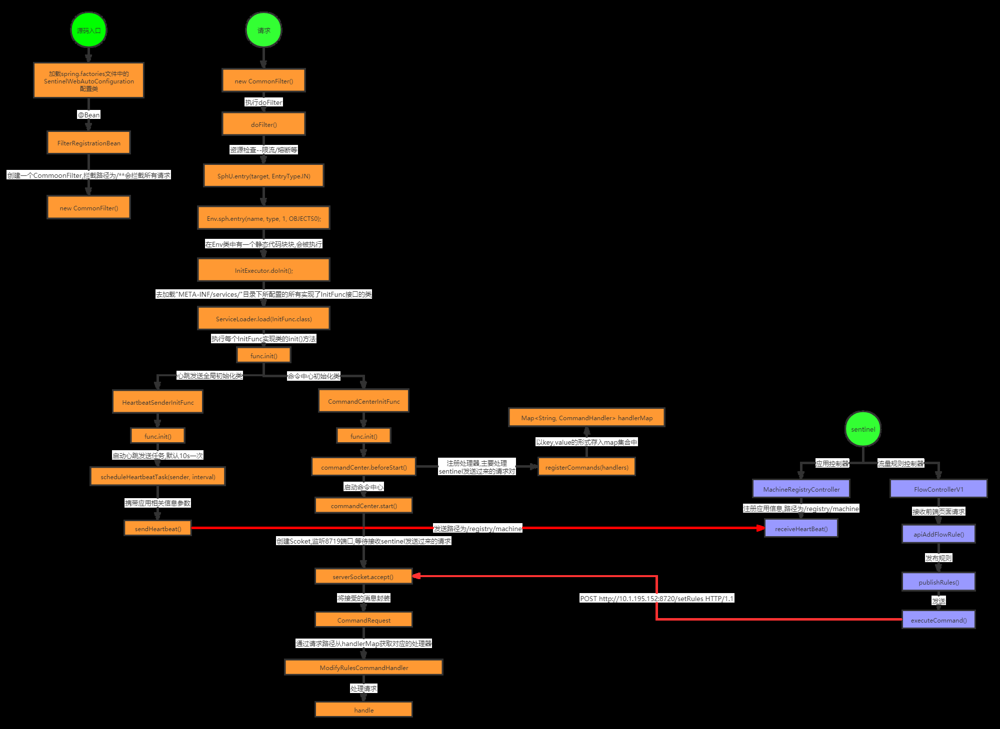
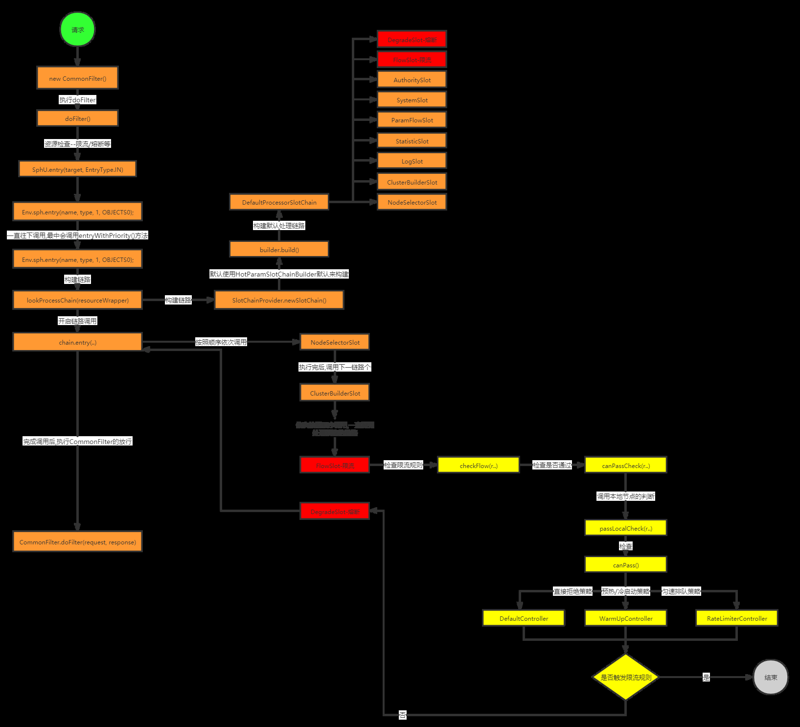
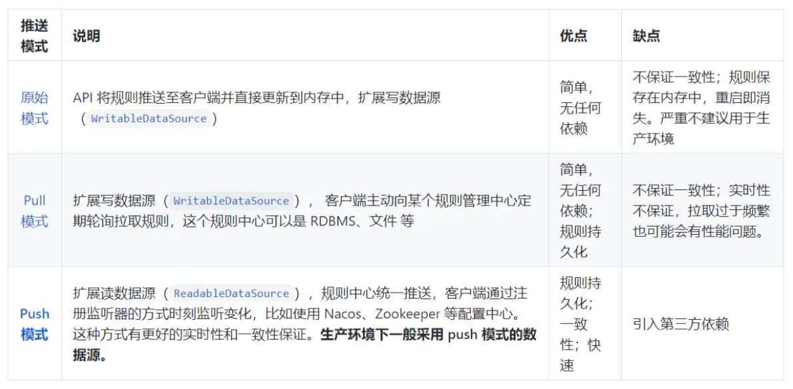

# Sentinel


> 作者: 潘深练
>
> 创建: 2023-02-08

## 一、sentinel源码

```shell
https://github.com/alibaba/Sentinel/releases
```

### 1.1、工程启动

进入到sentinel-dashboard模块下，启动该模块下的
com.alibaba.csp.sentinel.dashboard.DashboardApplication类

## 二、sentinel项目结构

- sentinel-core 核心模块，限流、降级、系统保护等都在这里实现
- sentinel-dashboard 控制台模块，可以对连接上的sentinel客户端实现可视化的管理
- sentinel-transport 传输模块，提供了基本的监控服务端和客户端的API接口，以及一些基于不同库的实现
- sentinel-extension 扩展模块，主要对DataSource进行了部分扩展实现
- sentinel-adapter 适配器模块，主要实现了对一些常见框架的适配
- sentinel-demo 样例模块，可参考怎么使用sentinel进行限流、降级等
- sentinel-benchmark 基准测试模块，对核心代码的精确性提供基准测试

## 三、sentinel原理

### 3.1、客户端服务注册

#### 3.1.1、客户端服务注册流程分析



### 3.2、客户端请求处理

#### 3.2.1、客户端请求处理流程分析


### 3.3、限流处理

#### 3.3.1、限流流程分析




## 四、sentinel存储

### 4.1、客户端存储

HashMap

### 4.2、服务端存储

在 Sentinel-Dashboard 中配置规则是存储在内存之中，重启应用就会丢失，所以实际生产环境中需要配置规则的持久化实现。

Sentinel 提供多种不同的数据源来持久化规则配置，包括 file，redis、nacos、zk、apollo。

当然如果正在尝试使用 Spring Cloud Alibaba 组件，并且也上了 Nacos 作为项目的注册中心与配置中心，可以考虑用 Nacos 来作为 Sentinel 规则的远程配置中心。

- Sentinel-Dashboard持久化

这就需要涉及到 Sentinel Dashboard 的规则管理及推送功能：集中管理和推送规则。sentinel-core 提供 API 和扩展接口来接收信息。开发者需要根据自己的环境，选取一个可靠的推送规则方式；同时，规则最好在控制台中集中管理。

而规则管理推送主要有以下三种模式：



## 参考

- [Sentinel1.8.0配置持久化到Nacos（基于push模式）](https://www.jianshu.com/p/9a6cf8634805)

