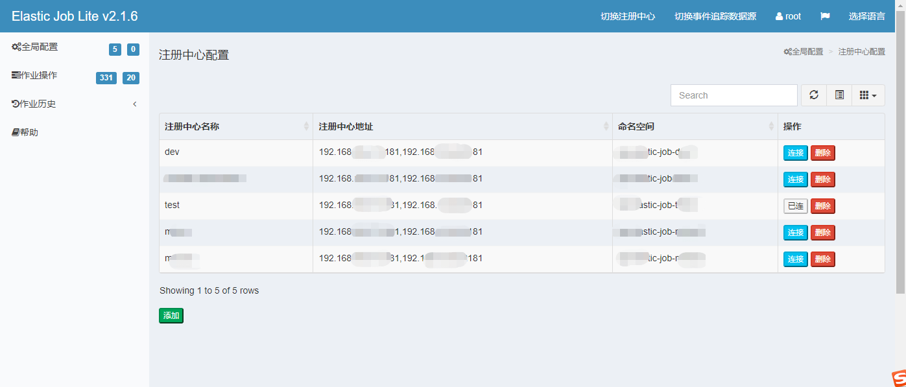

# 任务调度之思考与选型

> 作者: 潘深练
>
> 更新: 2023-05-14
>
> 版权声明：自由转载-非商用-非衍生-保持署名（[创意共享3.0许可证](https://creativecommons.org/licenses/by-nc-nd/3.0/deed.zh)）

## 一、业务背景

### 1.1、现存问题

部分企业使用 Elastic-Job 作为任务调度框架，支撑各业务条线完成多项任务调度工作，在定时任务、常驻任务及一次性任务方面表现良好，但 Elastic-Job 存在以下几点问题：

- **节点重启缺少智能上下载能力**

在 Elastic-job 服务节点重启时，为避免执行中的任务意外终止，造成数据丢失或数据不一致，目前是在节点重启前，检查节点避开执行中的任务，再安全重启，以确保数据完整性和一致性。

- **任务调度缺少监控观测面板**

整个任务执行生命周期，缺少对应的执行历史记录、运行日志以及监控大盘，有符合观测预期的方案吗？

### 1.2、基本诉求

- 节点优雅升级
- 增加观测面板

## 二、任务调度框架

### 2.1、候选方案

- Quartz 
- Elastic-Job
- XXL-Job
- SchedulerX 2.0
- PowerJob

### 2.2、产品对比

> 社区

| 维度       | Quartz                                     | Elastic-Job                                         | XXL-Job                            | SchedulerX 2.0                              | PowerJob                             |
| ---------- | ------------------------------------------ | --------------------------------------------------- | ---------------------------------- | ------------------------------------------- | ------------------------------------ |
| 诞生年份   | 2001年                                     | 2014年                                              | 2015年                             | 2017年                                      | 2018年                               |
| 开源时间   | 2002年                                     | 2015年                                              | 2016年                             | -                                           | 2019年                               |
| 历史背景   | 任务调度框架祖宗                           | 基于 Quartz                                         | 个人自研架构孵化                   | 阿里内部基于 Akka 的自研项目                | 阿里实习生基于SchedulerX 升级        |
| 产品定义   | 第 1 代                                    | 第 2 代                                             | 第 2 代                            | 第 3 代                                     | 第 3 代                              |
| 开源情况   | 持续开源                                   | 持续开源                                            | 持续开源                           | **商业付费**                                | 持续开源                             |
| 最新版本   | 2.3.2                                      | 3.0.3                                               | 2.4.0                              | 6.8.1                                       | 4.3.2                                |
| GithubFork | 1.8k                                       | 3.3k                                                | 10k                                | -                                           | 0.9k                                 |
| GithubStar | 5.5k                                       | 7.9k                                                | 24k                                | -                                           | 5.2k                                 |
| 社区活性   | ★★★                                        | ★★★                                                 | ★★★★★                              | -                                           | ★★                                   |
| 流行度     | 较高，业界标准                             | 一般，特定应用场景                                  | 较高，国内主流                     | 低，未广泛应用                              | 低，未广泛应用                       |
| 源码地址   | [点击查看](https://github.com/quartz-scheduler/quartz) | [点击查看](https://github.com/apache/shardingsphere-elasticjob) | [点击查看](https://github.com/xuxueli/xxl-job) | [点击查看](https://help.aliyun.com/product/147760.html) | [点击查看](https://github.com/PowerJob/PowerJob) |

社区与流行度： **XXL-Job > Elastic-Job > Quartz > PowerJob > SchedulerX 2.0**

> 功能

| 维度         | Quartz                         | Elastic-Job         | XXL-Job                                                      | SchedulerX 2.0                                               | PowerJob                                         |
| ------------ | ------------------------------ | ------------------- | ------------------------------------------------------------ | ------------------------------------------------------------ | ------------------------------------------------ |
| 任务类型     | 内置 Java                      | 内置 Java、Shell    | 内置 Java、GLUE Java、Shell、Python、PHP、Node.js            | 内置 Java、外置 Java（FatJar）、Shell、Python、PHP、Node.js、Go、自定义 | 内置 Java、外置 Java（容器）、Shell、Python      |
| 定时调度     | Cron                           | Cron                | Cron                                                         | Cron、固定频率、固定延迟、OpenAPI                            | Cron、固定频率、固定延迟、OpenAPI                |
| 任务编排     | ×                              | ×                   | ×                                                            | √ （DAG）                                                    | √（图形化）                                      |
| 分布式跑批   | ×                              | 静态分片            | 分片广播 & 动态分片                                          | MapReduce 动态分片                                           | MapReduce 动态分片                               |
| 历史记录     | ×                              | √                   | √                                                            | √                                                            | √（操作记录）                                    |
| 运行日志     | ×                              | √                   | √                                                            | √                                                            | √                                                |
| 监控大盘     | ×                              | ×                   | √                                                            | √                                                            | √                                                |
| 运维能力     | ×                              | 启用、禁用任务      | 启用、禁用任务、手动运行任务、停止任务                       | 启用、禁用任务、手动运行任务、停止任务、标记成功、重刷历史数据 | 启用、禁用任务、手动运行任务、停止任务、导入任务 |
| 报警监控     | ×                              | 邮件                | 邮件                                                         | 邮件、Webhook、短信、电话                                    | 邮件，提供接口允许开发者扩展                     |
| 调度方式性能 | 每次调度通过DB抢锁，有性能瓶颈 | ZooKeeper是性能瓶颈 | 基于数据库锁，有性能瓶颈，同时由Master节点调度，Master节点压力大 | 可水平扩展，支持海量任务调度                                 | 无锁化设计，性能强劲无上限（官方）               |
| 可视化       | ☆                              | ★                   | ★★★★                                                         | ☆☆☆☆☆                                                        | ★★                                               |
| 可运维       | ☆                              | ★★                  | ★★★                                                          | ☆☆☆☆☆                                                        | ★★★                                              |
| 高可用       | ★★                             | ★★★                 | ★★★                                                          | ☆☆☆☆☆                                                        | ☆☆☆☆                                             |

功能：**SchedulerX 2.0 > PowerJob > XXL-Job > Elastic-Job > Quartz**

> 界面概览

- Elastic-Job

- XXL-Job

- SchedulerX 2.0

- PowerJob

观测：**SchedulerX 2.0 > XXL-Job > PowerJob > Elastic-Job > Quartz**

> 兼容性及二次开发

| 维度         | Quartz                                         | Elastic-Job                                                  | XXL-Job                          | SchedulerX 2.0                              | PowerJob                                      |
| ------------ | ---------------------------------------------- | ------------------------------------------------------------ | -------------------------------- | ------------------------------------------- | --------------------------------------------- |
| 开发语言     | Java                                           | Java                                                         | Java                             | Java、Python、Shell                         | Java                                          |
| Spring 版本  | 3+                                             | 3+                                                           | 3+                               | 4+                                          | 4+                                            |
| 持久化框架   | Hibernate、JPA                                 | Mybatis                                                      | Mybatis                          | Mybatis                                     | Mybatis                                       |
| 二次开发难度 | 较高                                           | 一般                                                         | 一般                             | 一般                                        | 一般                                          |
| 网络通信模型 | RMI、JMS                                       | Zookeeper、Mesos                                             | HTTP、RPC                        | HTTP、RPC                                   | HTTP、RPC                                     |
| 开发手册     | [点击查看](http://www.quartz-scheduler.org/documentation/) | [点击查看](https://shardingsphere.apache.org/elasticjob/current/en/overview/) | [点击查看](https://www.xuxueli.com/xxl-job/) | [点击查看](https://help.aliyun.com/product/147760.html) | [点击查看](https://www.yuque.com/powerjob/guidence/intro) |

> 未来拓展性

| 维度     | Quartz                           | Elastic-Job                                       | XXL-Job                                                      | SchedulerX 2.0                                               | PowerJob                                                     |
| -------- | -------------------------------- | ------------------------------------------------- | ------------------------------------------------------------ | ------------------------------------------------------------ | ------------------------------------------------------------ |
|          |                                  |                                                   |                                                              |                                                              |                                                              |
| 应用场景 | 中小型                           | 中小型                                            | 中小型                                                       | 中大型                                                       | “中大型”                                                     |
| 系统依赖 | 关系型数据库                     | 关系型数据库                                      | MySQL                                                        | ***人民币***                                                 | 任意Spring Data Jpa支持的关系型数据库（MySQL推荐 8+）        |
| 集群部署 | √                                | √                                                 | √                                                            | 云平台                                                       | √                                                            |
| 云原生   | ×                                | √                                                 | √                                                            | 云平台                                                       | √                                                            |
| RoadMap  | -                                | 支持其他注册中心，DAG，故障转移，作业生命周期增强 | 支持其他数据库，DAG，增强告警，安全强化，任务日志重构，分片能力增强 | -                                                            | 故障转移，Metrics监控，任务自定义间隔重试，优化手工注册应用，管理注册应用列表，添加用户权限体系 |
| 官网     | [点击查看](http://www.quartz-scheduler.org/) | [点击查看](https://shardingsphere.apache.org/elasticjob/)     | [点击查看](https://www.xuxueli.com/xxl-job/)                             | [点击查看](https://help.aliyun.com/product/147760.html)                  | [点击查看](http://www.powerjob.tech/)                                    |
| 体验地址 | -                                | -                                                 | -                                                            | 访问地址：[点击查看](https://schedulerx2.console.aliyun.com/cn-hangzhou/Overview)  账号密码：注册 | 访问地址：[点击查看](http://try.powerjob.tech/)  应用名称：powerjob-worker-samples 登入密码：powerjob123 |

### 2.3、总结

社区活跃：**XXL-Job > Elastic-Job > Quartz > PowerJob > SchedulerX 2.0**

功能性能：**SchedulerX 2.0 > PowerJob > XXL-Job > Elastic-Job > Quartz**

运维观测：**SchedulerX 2.0 > XXL-Job > PowerJob > Elastic-Job > Quartz**

开发维护：**SchedulerX 2.0 > XXL-Job > PowerJob > Elastic-Job > Quartz**

| 综合排名 | 工作流         | 维度得分   | 优势                                                         | 不足                                                         |
| -------- | -------------- | ---------- | ------------------------------------------------------------ | ------------------------------------------------------------ |
| 1        | XXL-Job        | 5+3+4+4=16 | 性能稳定，社区成熟，文档详尽，可视化友好，易集成扩展         | 只支持 MySQL，没有 DAG，无 Metrics 监控功能，告警能力弱，能力相对较少 |
| 2        | SchedulerX 2.0 | 1+5+5+5=16 | 功能强大，跨语言跨平台，性能佳，可视化运维体系完善，兼容 Elastic-Job，XXL-Job 等 | **付费** ，应用效果未知                                      |
| 3        | PowerJob       | 2+4+3+3=12 | 功能丰富，可扩展性高，性能较好                               | 故障转移一般，无 Metrics 监控功能，注册应用手工维护，无用户权限体系，文档一般，社区活跃度较低，可视化一般 |
| 4        | Elastic-Job    | 4+2+2+2=10 | 易集成，可扩展性高、弹性调度、生态开放 SPI 机制              | 注册中心只支持 ZK，没有 DAG，故障转移缺乏，作业生命周期管理弱，功能相对较少，社区活跃度一般，运维可视化差 |
| 5        | Quartz         | 3+1+1+1=6  | 可靠稳定，社区活跃                                           | 缺少可视化，扩展侵入性大，调度与执行层耦合，抢占式分布式应用弱 |

- **2.4.1、节点优雅升级** 

  - 背景：节点关机不优雅，导致执行中的任务意外中断，造成数据丢失或数据不一致
    - 情况1：节点强制关机。
      - 解决方案：使用 springboot 或 springcloud 优雅关机，等待任务执行完成再进行节点关机重启，具体参考 : [spring-boot-graceful-shutdown](https://github.com/timpeeters/spring-boot-graceful-shutdown) （本质是监听等待线程）===> ***具体实施方案需要再调研仔细***
    - 情况2：节点故障。
      - 解决方案：根据具体使用的任务调度框架，通过日志、数据库等进行一致性保证（本质就是二阶段提交），同时建议任务做幂等处理，保证失效转移正确性。

  - 背景：节点重启过程中，任务调度不可用
    - 解决方案：灰度上线

- **2.4.2、增加观测面板**
  - SchedulerX 2.0 > XXL-Job > PowerJob > Elastic-Job > Quartz

## 三、参考

### 3.1、文章

- [《亿级异构任务调度框架设计与实践》](https://mp.weixin.qq.com/s/9WIZIf-7yApfCZSMuD9CWQ)

### 3.2、官网 

- [org - Quartz](http://www.quartz-scheduler.org/)
- [org - Elastic-Job](https://shardingsphere.apache.org/elasticjob/ )
- [com - XXL-Job](https://www.xuxueli.com/xxl-job/)
- [com - SchedulerX 2.0](https://help.aliyun.com/product/147760.html)
- [tech -PowerJob](http://www.powerjob.tech/)

### 3.3、开源社区

- [github - Quartz](https://github.com/quartz-scheduler/quartz)
- [github - Elastic-Job](https://github.com/apache/shardingsphere-elasticjob)
- [github - XXL-Job](https://github.com/xuxueli/xxl-job)
- [github - PowerJob](https://github.com/PowerJob/PowerJob)

### 3.4、搜索工具

- [搜索引擎 - 百度](https://www.baidu.com/)
- [搜索引擎 - Google](https://www.google.com/)
- [AI机器人 - ChatGPT3.5](https://openprompt.co/)

（结束）