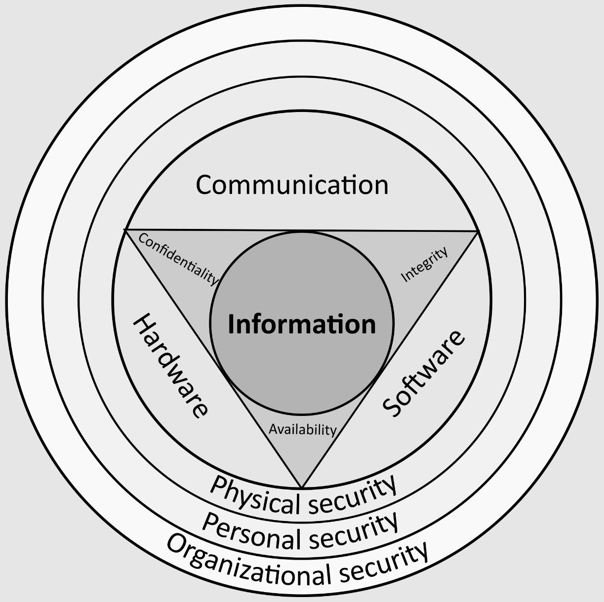
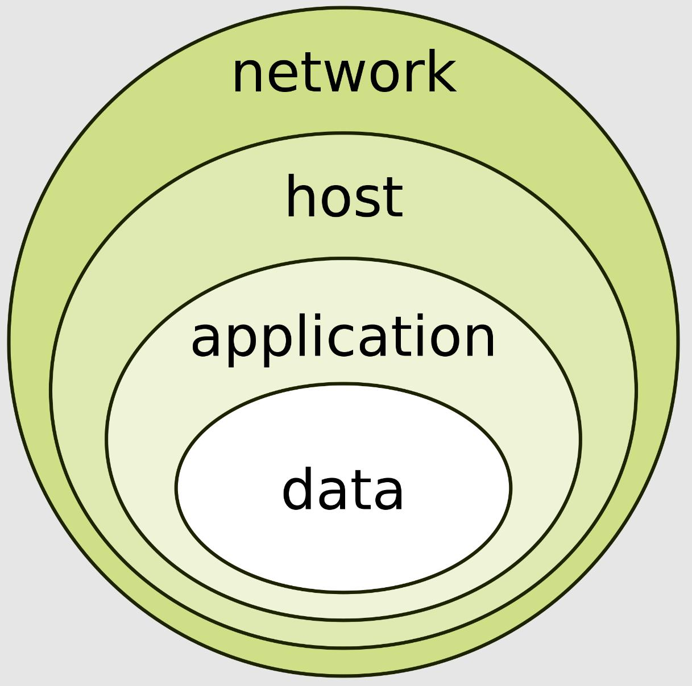

# 信息安全与加密算法

> 作者: 潘深练
>
> 创建: 2022-06-18
>
> 版权声明：自由转载-非商用-非衍生-保持署名（[创意共享3.0许可证](https://creativecommons.org/licenses/by-nc-nd/3.0/deed.zh)）

## 一、信息安全

### 1、概述

信息安全，有时简称为 InfoSec ，是通过降低信息风险来保护信息的实践。信息安全涵盖了组织用来保护信息的工具和流程。这包括防止未经授权的人访问业务或个人信息的策略设置，保护信息及信息系统免受未经授权的进入、使用、披露、破坏、修改、检视、记录及销毁。信息安全是一个不断发展的领域，涵盖范围广泛，从网络与基础设施安全，到测试和审计。

信息安全的核心是信息保障，即维护信息的 **机密性**、**完整性** 和 **可用性** (CIA，信息安全的三项基本原则) 的行为，确保在出现关键问题时信息不会以任何方式受到损害。这些问题包括但不限于自然灾害、计算机/服务器/网络故障和物理盗窃。

以下展示了关于 **信息安全** 的多种定义，并从不同的来源进行了总结：

1. “保护信息的机密性、完整性和可用性。注意：此外，还可能涉及其他属性，例如真实性、可问责性、不可否认性和可靠性。” (ISO/IEC 27000:2009) 
2. “保护信息和信息系统免受未经授权的访问、使用、披露、中断、修改或破坏，以提供机密性、完整性和可用性。” (CNSS, 2010) 
3. “确保只有授权用户（机密性）在需要时（可用性）才能访问准确和完整的信息（完整性）。” ( ISACA , 2008)
4. “信息安全是保护组织知识产权的过程。” （皮普金，2000）
5. “...信息安全是一门风险管理学科，其工作是管理信息风险对企业造成的成本。” （麦克德莫特和吉尔，2001 年）
6. “对信息风险和控制处于平衡状态的充分知情的保证感。” （安德森，J.，2003 年）
7. “信息安全是对信息的保护，并将信息暴露给未授权方的风险降至最低。” （文特尔和埃洛夫，2003）
8. “信息安全是一个多学科研究和专业活动领域，它涉及所有可用类型（技术、组织、以人为本和法律）的安全机制的开发和实施，以便在其所有位置（内部和组织范围之外），因此，信息系统，在这些信息系统中，信息被创建、处理、存储、传输和销毁，不受威胁。对信息和信息系统的威胁可以分类，并可以定义相应的安全目标每一类威胁。作为威胁分析的结果确定的一组安全目标应定期修订，以确保其充分性并与不断发展的环境保持一致。当前相关的一组安全目标可能包括：
    - 机密性
    - 完整性
    - 可用性
    - 隐私性
    - 真实性
    - 可信赖性
    - 不可否认性
    - 问责制
    - 可审计性。”
（Chordantseva 和希尔顿，2013 年）
9. 使用电信系统或设备的信息和信息资源安全意味着保护信息、信息系统或书籍免受未经授权的访问、损坏、盗窃或破坏（Kurose 和 Ross，2010 年）。

### 2、威胁

#### 2.1、形式

信息安全威胁有许多不同的形式。当今最常见的一些威胁是：
- 软件攻击
- 知识产权盗窃
- 身份盗窃
- 设备或信息盗窃、破坏
- 信息勒索

大多数人都经历过某种软件攻击。病毒、蠕虫、网络钓鱼攻击和特洛伊木马是软件攻击的一些常见示例。对于信息技术 ( IT ) 领域的许多企业来说，知识产权盗窃也是一个广泛的问题。身份盗窃是试图以他人身份获取该人的个人信息或利用他们通过社会工程获取重要信息的机会。由于当今大多数设备都是移动的，设备或​​信息的盗窃在今天变得越来越普遍，容易被盗，并且随着数据容量的增加也变得更加可取。破坏通常包括破坏组织的网站，试图导致其客户丧失信心。信息勒索包括盗窃公司的财产或信息，试图收取款项，以换取将信息或财产返还给其所有者，就像勒索软件一样。有很多方法可以帮助保护自己免受其中一些攻击，但最实用的预防措施之一是定期提高用户意识。对任何组织的头号威胁是用户或内部员工，他们也被称为内部威胁。

政府、军队、公司、金融机构、医院、非营利组织和私营企业积累了大量有关其员工、客户、产品、研究和财务状况的机密信息。如果有关企业客户或财务或新产品线的机密信息落入竞争对手或黑帽黑客的手中，企业及其客户可能遭受广泛的、无法弥补的财务损失，并损害公司的利益。名声。从业务角度来看，信息安全必须与成本相平衡；其中 Gordon-Loeb 模型为解决这一问题提供了一种数学经济学方法。

对于个人而言，信息安全对隐私有重大影响，不同文化对隐私的看法截然不同。

#### 2.1、应对策略

对安全威胁或风险的可能反应是：

1. 减少/缓解——实施保障措施和对策以消除漏洞或阻止威胁
2. 分配/转移——将威胁的成本转移给另一个实体或组织，例如购买保险或外包
3. 接受——评估对策的成本是否超过了威胁造成的可能损失成本

### 3、历史

从通信的早期开始，外交官和军事指挥官就明白，有必要提供某种机制来保护通信的机密性，并通过某种手段来检测篡改。尤利乌斯·凯撒（Julius Caesar）被认为是公元前50年 **凯撒密码** 的发明者，该密码的创建是为了防止他的秘密信息落入坏人手中时被读取。然而，大部分保护是通过应用程序处理控制来实现的。对敏感信息进行了标记，以表明其应由受信任的人进行保护和运输，并在安全的环境或坚固的箱子中进行保护和储存。随着 **邮政服务** 的扩大，政府建立了官方组织来拦截、破译、阅读和封存信件（例如，1653年成立的英国秘密办公室）。

19世纪中期，开发了更复杂的分类系统，使政府能够根据敏感程度管理其信息。例如，英国政府于1889年颁布了**《官方保密法》** ，在一定程度上将其编纂成法典。该法第1节涉及间谍活动和非法披露信息，而第2节涉及违反官方信任的行为。很快增加了公共利益辩护，为国家利益的披露辩护。1889年，印度通过了一项类似的法律，即《印度官方保密法》，该法案与英国殖民时期有关，用于打击反对拉吉政策的报纸。1923年通过了一个更新的版本，该版本扩展到所有用于治理的机密或机密信息。到第一次世界大战时，**多层分类系统** 被用来与各个战线交流信息，这鼓励了外交和军事总部更多地使用代码制定和破译部门。战争期间，随着机器被用来扰乱和解读信息，编码变得更加复杂。

**计算机安全** 的建立开创了信息安全的历史。第二次世界大战期间就出现了这种需求。第二次世界大战期间，盟国共享的信息量要求对分类系统和程序控制进行正式调整。随着越来越复杂的保险箱和存储设施的发展，一系列神秘的标记逐渐演变，以指示谁可以处理文件（通常是军官而不是士兵），以及文件应存放在哪里。德国人用来加密战争数据并被艾伦·图灵成功解密的 **恩尼格玛密码机**（Enigma Machine），可以被视为创建和使用安全信息的一个突出例子。为了确保文件被正确销毁，程序不断演化，正是由于未能遵守这些程序，才导致了战争中一些最伟大的情报政变（例如，U-570的缴获）。

冷战期间，各种大型计算机 **联网**，以完成更复杂的任务，这种通信过程比计算机中心来回邮寄磁带更容易。因此，美国国防部高级研究计划署（ARPA）开始研究在美国武装部队内部建立网络通信系统以交换信息的可行性。1968年，拉里·罗伯茨博士制定了 ARPANET 项目，该项目后来演变为 **互联网** 。

1973 年，互联网先驱罗伯特·梅特卡夫 (Robert Metcalfe ) 发现 ARPANET 安全的重要元素存在许多缺陷，例如：“密码结构和格式的漏洞；拨号连接缺乏安全程序；以及不存在的用户标识和授权”。由于缺乏控制和保护措施来保护数据免受未经授权的访问。因为公众知道电话号码，所以黑客可以轻松访问 ARPANET。由于一系列安全隐患，再加上对计算机安全的不断挑战，以及系统的主机和用户数量呈指数级增长，“网络安全” 经常被称为 “**网络不安全**”。

20 世纪末和 21 世纪初，**电信**、**计算硬件** 和 **软件** 以及 **数据加密** 取得了飞速发展。更小、更强大和更便宜的计算设备的可用性使得电子数据处理在小型企业和家庭用户的范围内。1980 年代初期 **传输控制协议** / **互联网协议** (TCP/IP) 的建立使不同类型的计算机能够进行通信。这些计算机很快通过互联网相互连接。

通过互联网进行的电子数据处理和电子商务的快速增长和广泛使用，以及国际恐怖主义的多次发生，促使人们需要更好的方法来保护计算机及其**存储**、**处理** 和 **传输** 的信息。计算​​机安全和信息保障学科与众多专业组织一起出现，它们都拥有确保信息系统安全性和可靠性的共同目标。

### 4、风险管理

#### 4.1、安全控制

选择和实施适当的安全控制最初将帮助组织将风险降低到可接受的水平。控制选择应遵循并应基于风险评估。控制的性质可能不同，但从根本上说，它们是保护信息 **机密性**、**完整性** 或 **可用性** （CIA）的方法。ISO/IEC 27001定义了不同领域的控制，组织可以根据组织的要求实施额外的控制。ISO/IEC 27002 提供了组织信息安全标准的指南。

1. 行政
- 行政控制（也称为程序控制）由批准的书面政策、程序、标准和指南组成。

2. 逻辑
- 逻辑控制（也称为技术控制）使用软件和数据来监控和控制对信息和计算系统的访问。

3. 物理
- 物理控制监视和控制工作场所和计算设施的环境。

#### 4.2、纵深防御

信息安全必须在信息的整个 **生命周期** 内保护信息，从信息的最初创建到信息的最终处置。信息在移动和静止时都必须受到保护。在其生命周期中，信息可能会通过许多不同的信息处理系统和信息处理系统的许多不同部分。信息和信息系统受到威胁的方式有很多种。为了在其生命周期内充分保护信息，信息处理系统的每个组件都必须有自己的保护机制。安全措施的建立、分层和重叠称为 “**纵深防御**”。与众所周知的只有最薄弱环节一样坚固的金属链相比，纵深防御战略旨在建立一个结构，如果一项防御措施失败，其他措施将继续提供保护。

**回想一下前面关于管理控制、逻辑控制和物理控制的讨论。这三种类型的控制可用于形成构建纵深防御战略的基础**。使用这种方法，纵深防御可以被概念化为三个不同的层或平面，层层嵌套。通过将深度防御视为形成洋葱的层，可以获得对深度防御的额外见解，数据位于洋葱的核心，人是洋葱的下一个外层，网络安全，基于主机的安全, 和应用程序安全形成洋葱的最外层。这两种观点同样有效，并且都为实施良好的纵深防御战略提供了宝贵的见解。

**信息安全与网络安全**

信息安全在范围和目的上都不同于网络安全。这两个术语经常互换使用，但更准确地说，**网络安全是信息安全的一个子类别**。信息安全是一个广阔的领域，涵盖了物理安全、端点安全、数据加密、网络安全等诸多领域。它还与信息保障密切相关，信息保障可以保护信息免受自然灾害和服务器故障等威胁。

网络安全主要通过可以预防或缓解这些威胁的实践和工具来解决与技术相关的威胁。另一个相关类别是数据安全，其重点是保护组织的数据免受意外或恶意暴露给未经授权的各方。

#### 4.3、分类

信息安全和风险管理的一个重要方面是认识信息的价值并为信息定义适当的程序和保护要求。并非所有信息都是平等的，因此并非所有信息都需要相同程度的保护，这需要为信息分配安全分类。

#### 4.4、访问控制

对受保护信息的访问必须仅限于有权访问该信息的人员。计算机程序，以及在许多情况下处理信息的计算机，也必须获得授权。这要求建立机制来控制对受保护信息的访问，访问控制机制的复杂程度应与受保护信息的价值相称，信息越敏感或越有价值，控制机制就越需要加强。建立访问控制机制的基础在 **识别** 和 **认证**。

访问控制一般分为三个步骤：识别、认证和授权。

- 识别（Identification）

识别是对某人是谁或某物是什么的断言。如果一个人说“你好，我的名字是John Doe ”，他们就是在声称自己是谁。然而，他们的主张可能是真实的，也可能不是真实的。在授予 John Doe 访问受保护信息的权限之前，有必要验证声称是 John Doe 的人确实是 John Doe。通常，声明采用 **用户名** 的形式。通过输入该用户名，您声称 “我是该用户名所属的人”。

- 认证（Authentication）

认证（身份验证）是验证身份声明的行为。当 John Doe 进入银行取款时，他告诉银行出纳员他是 John Doe，这是一种身份声明。银行出纳员要求查看带照片的身份证件，因此他将驾驶执照交给出纳员。银行出纳员检查许可证以确保上面印有 John Doe，并将许可证上的照片与自称 John Doe 的人进行比较。如果照片和姓名与此人相符，则出纳员已确认 John Doe 就是他自称的那个人。同样，通过输入正确的密码，用户提供了他/她是用户名所属的人的证据。

可以使用三种不同类型的信息进行身份验证：

- 您知道的信息：诸如 PIN 码、密码或您母亲的娘家姓
- 您拥有的东西：驾驶执照或磁卡
- 你是什​​么：生物特征，包括掌纹、指纹、声纹和视网膜（眼睛）扫描

**强身份验证** 需要提供不止一种类型的身份验证信息（双因素身份验证）。**用户名是当今计算机系统上最常见的身份识别形式，而密码是最常见的身份验证形式**。用户名和密码已经达到了它们的目的，但它们越来越不够用了。用户名和密码正在慢慢地被更复杂的身份验证机制所取代或补充，例如基于时间的一次性密码算法（手机验证码等）。

- 授权（Authorization）

在成功识别并验证了人、程序或计算机之后，必须确定允许他们访问哪些信息资源以及允许他们执行哪些操作（运行、查看、创建、删除或更改）。这称为授权。访问信息和其他计算服务的授权始于管理政策和程序。这些政策规定了可以访问哪些信息和计算服务、由谁访问以及在什么条件下访问。然后配置访问控制机制以强制执行这些策略。不同的计算系统配备了不同种类的访问控制机制。有些甚至可能提供不同访问控制机制的选择。系统提供的访问控制机制将基于访问控制的三种方法之一，或者它可以从这三种方法的组合中推导出来。

非自主性方法将所有访问控制整合到一个集中管理之下。对信息和其他资源的访问通常基于个人在组织中的职能（角色）或个人必须执行的任务。自主性方法使信息资源的创建者或所有者能够控制对这些资源的访问。在强制访问控制方法中，根据分配给信息资源的安全分类授予或拒绝访问。

当今使用的常见访问控制机制的示例包括 **基于角色** 的访问控制，可用于许多高级数据库管理系统；UNIX 和 Windows 操作系统中提供的简单文件权限；Windows 网络系统中提供的 **组策略对象** ；和 Kerberos、RADIUS、TACACS 以及许多防火墙和路由器中使用的 **简单访问列表**。

为了有效，政策和其他安全控制必须是可执行和维护的。有效的政策确保人们对自己的行为负责。例如，美国财政部关于处理敏感或专有信息的系统的指南规定，必须记录所有失败和成功的身份验证和访问尝试，并且所有对信息的访问都必须留下某种类型的审计线索。

此外，在谈论访问控制时，需要知道原则需要生效。该原则赋予个人执行其工作职能的访问权限。政府在处理差异许可时使用了这一原则。即使不同部门的两名员工拥有绝密许可，他们也必须有知情权才能交换信息。在需要知道的原则内，网络管理员授予员工最少的权限，以防止员工访问超出他们应有的权限。需要知道有助于强制执行 **机密性-完整性-可用性** 三元组。需要知道直接影响三合会的机密领域。

#### 4.5、密码学

信息安全使用密码学将可用信息转换成一种形式，使其不能被授权用户以外的任何人使用；这个过程称为 **加密**。拥有加密密钥的授权用户可以通过解密过程将已加密（变得不可用）的信息转换回其原始可用形式。**密码学用于信息安全，以保护信息在信息传输（电子或物理）和存储信息时免遭未经授权或意外泄露**。

密码学还通过其他有用的应用程序提供信息安全，包括改进的 **身份验证方法**、**消息摘要**、**数字签名**、**不可否认性** 和 **加密的网络通信**。诸如 Telnet 和文件传输协议(FTP) 等较旧的、安全性较低的应用程序正逐渐被更安全的应用程序所取代，例如使用加密网络通信的安全外壳(SSH)。可以使用诸如 WPA/WPA2 或较旧（且安全性较低）的 WEP 等协议对无线通信进行加密。有线通信（例如 ITU‑T G.hn) 使用 AES 进行加密，使用 X.1035 进行身份验证和密钥交换进行保护。GnuPG 或 PGP 等软件应用程序可用于加密数据文件和电子邮件。

如果没有正确实施，密码学可能会引入安全问题。密码学解决方案需要使用行业认可的解决方案来实施，这些解决方案已经过密码学独立专家的严格同行评审。加密密钥的长度和强度也是一个重要的考虑因素。弱或太短的密钥将产生弱加密。用于加密和解密的密钥必须受到与任何其他机密信息相同程度的严格保护。必须保护它们免受未经授权的披露和破坏，并且它们必须在需要时可用。公钥基础设施(PKI)解决方案解决了围绕密钥管理的许多问题。

## 二、架构安全性

即使只限定在“软件架构设计”这个语境下，系统安全仍然是一个很大的话题。我们谈论的计算机系统安全，不仅仅是指“防御系统被黑客攻击”这样狭隘的安全,，还至少应包括（不限于）以下这些问题的具体解决方案：

- 认证（Authentication）：系统如何正确分辨出操作用户的真实身份？
- 授权（ Authorization）：系统如何控制一个用户该看到哪些数据、能操作哪些功能？
- 凭证（Credential）：系统如何保证它与用户之间的承诺是双方当时真实意图的体现，是准确、完整且不可抵赖的？
- 保密（Confidentiality）：系统如何保证敏感数据无法被包括系统管理员在内的内外部人员所窃取、滥用？
- 传输（Transport Security）：系统如何保证通过网络传输的信息无法被第三方窃听、篡改和冒充？
- 验证（Verification）：系统如何确保提交到每项服务中的数据是合乎规则的，不会对系统稳定性、数据一致性、正确性产生风险？

与安全相关的问题，一般不会直接创造价值，解决起来又烦琐复杂，费时费力，因此经常性被开发者有意无意地忽略掉。庆幸的是这些问题基本上也都是与具体系统、具体业务无关的通用性问题，这意味着它们往往会存在着业界通行的、已被验证过是行之有效的解决方案，乃至已经形成行业标准，不需要开发者自己从头去构思如何解决。

### 1、认证

#### 认证的标准

世纪之交，Java 迎来了 Web 时代的辉煌，互联网的迅速兴起促使 Java 进入了快速发展时期。这时候，基于 HTML 和 JavaScript 的超文本 Web 应用迅速超过了“Java 2 时代”之前的 Java Applets 应用，B/S 系统对最终用户认证的需求使得“安全认证”的重点逐渐从“代码级安全”转为“用户级安全”，即你是否信任正在操作的用户。在 1999 年，随 J2EE 1.2（它是 J2EE 的首个版本，为了与 J2SE 同步，初始版本号直接就是 1.2）发布的 Servlet 2.2 中，添加了一系列用于认证的 API，主要包括下列两部分内容：

- 标准方面，添加了四种内置的、不可扩展的认证方案，即
    - Basic
        - HTTP Basic Authentication 
    - Form
        - Form Based Authentication 
    - Digest
        - HTTP Digest Authentication 
    - Client-Cert 
        - HTTPS Client Authentication
    - [参考说明：J2EE 1.4 Tutorial - Understanding Login Authentication](http://lia.deis.unibo.it/Courses/TecnologieWeb0708/materiale/laboratorio/guide/j2ee14tutorial7/Security5.html)

- 实现方面，添加了与认证和授权相关的一套程序接口，譬如
    - HttpServletRequest::isUserInRole()
    - HttpServletRequest::getUserPrincipal()
    - 等方法

引用 J2EE 1.2 对安全的改进还有另一个原因，它内置的 Basic、Digest、Form 和 Client-Cert 这四种认证方案都很有代表性，刚好分别覆盖了通信信道、协议和内容层面的认证。而这三种层面认证恰好涵盖了主流的三种认证方式，具体含义和应用场景列举如下。

- 通信信道上的认证：你和我建立通信连接之前，要先证明你是谁。在网络传输（Network）场景中的典型是基于 SSL/TLS 传输安全层的认证。
- 通信协议上的认证：你请求获取我的资源之前，要先证明你是谁。在互联网（Internet）场景中的典型是基于 HTTP 协议的认证。
- 通信内容上的认证：你使用我提供的服务之前，要先证明你是谁。在万维网（World Wide Web）场景中的典型是基于 Web 内容的认证。

#### 认证的实现

了解过业界标准的认证规范以后，这部分简要介绍一下在 Java 技术体系内通常是如何实现安全认证的。Java 其实也有自己的认证规范，第一个系统性的 Java 认证规范发布于 Java 1.3 时代，是由 Sun 公司提出的同时面向代码级安全和用户级安全的认证授权服务——JAAS（Java Authentication and Authorization Service，Java 认证和授权服务，Java 1.3 处于扩展包中，Java 1.4 时纳入标准包）。尽管 JAAS 已经考虑了最终用户的认证，但代码级安全在规范中仍然占更主要的地位。可能今天用过甚至听过 JAAS 的 Java 程序员都已经不多了，但是这个规范提出了很多在今天仍然活跃于主流 Java 安全框架中的概念，譬如一般把用户存放在“Principal”之中、密码存在“Credentials”之中、登录后从安全上下文“Context”中获取状态等常见的安全概念，都可以追溯到这一时期所定下的 API：

- LoginModule （javax.security.auth.spi.LoginModule）
- LoginContext （javax.security.auth.login.LoginContext）
- Subject （javax.security.auth.Subject）
- Principal （java.security.Principal）
- Credentials（javax.security.auth.Destroyable、javax.security.auth.Refreshable）

JAAS 开创了这些沿用至今的安全概念，但规范本身实质上并没有得到广泛的应用，笔者认为有两大原因，一方面是由于 JAAS 同时面向代码级和用户级的安全机制，使得它过度复杂化，难以推广。在这个问题上 Java 社区一直有做持续的增强和补救，譬如 Java EE 6 中的 JASPIC、Java EE 8 中的 EE Security：

- JSR 115：Java Authorization Contract for Containers（JACC）
- JSR 196：Java Authentication Service Provider Interface for Containers（JASPIC）
- JSR 375： Java EE Security API（EE Security）

而另一方面，可能是更重要的一个原因，在 21 世纪的第一个十年里，以“With EJB”为口号，以 WebSphere、Jboss 等为代表的 J2EE 容器环境，与以“Without EJB”为口号、以 Spring、Hibernate 等为代表的轻量化开发框架产生了激烈的竞争，结果是后者获得了全面胜利。这个结果使得依赖于容器安全的 JAAS 无法得到大多数人的认可。

在今时今日，实际活跃于 Java 安全领域的是两个私有的（私有的意思是不由 JSR 所规范的，即没有 java/javax.*作为包名的）的安全框架：

- Apache Shiro
- Spring Security

相较而言，Shiro 更便捷易用，而 Spring Security 的功能则要复杂强大一些。无论是单体架构还是微服务架构大部分都选择了 Spring Security 作为安全框架，这个选择与功能、性能之类的考量没什么关系，就只是因为 Spring Boot、Spring Cloud 全家桶的缘故。这里不打算罗列代码来介绍 Shiro 与 Spring Security 的具体使用，只从目标上看，两个安全框架提供的功能都很类似，大致包括以下四类：

- 认证功能：以 HTTP 协议中定义的各种认证、表单等认证方式确认用户身份，这是本节的主要话题。
- 安全上下文：用户获得认证之后，要开放一些接口，让应用可以得知该用户的基本资料、用户拥有的权限、角色，等等。
- 授权功能：判断并控制认证后的用户对什么资源拥有哪些操作许可，这部分内容会放到“授权”介绍。
- 密码的存储与验证：密码是烫手的山芋，存储、传输还是验证都应谨慎处理，我们会放到“保密”去具体讨论。

### 2、授权

- 确保授权的过程可靠
    - OAuth 2
        - 授权码模式（Authorization Code）
        - 隐式授权模式（Implicit）
        - 密码模式（Resource Owner Password Credentials）
        - 客户端模式（Client Credentials）
    - SAML 2.0

- 确保授权的结果可控
    - DAC
    - MAC
    - ABAC
    - RBAC (Role-Based Access Control)

### 3、凭证

- Cookie-Session
- JWT（JSON Web Token）

### 4、保密

- 密码强度
- 客户端加密
- 密码存储和验证

### 5、传输

#### 摘要、加密与签名

- 加密算法
    - 哈希摘要（不可逆）
    - 对称加密
    - 非对称加密
- 数字证书
    - CA
    - RA
- 安全传输层

### 6、验证

- 数据有效性校验
- 业务校验
- 逻辑校验

**详见凤凰架构关于《架构安全性》的介绍**

[认证](http://icyfenix.cn/architect-perspective/general-architecture/system-security/authentication.html) | [授权](http://icyfenix.cn/architect-perspective/general-architecture/system-security/authorization.html) | [凭证](http://icyfenix.cn/architect-perspective/general-architecture/system-security/credentials.html) | [保密](http://icyfenix.cn/architect-perspective/general-architecture/system-security/confidentiality.html) | [传输](http://icyfenix.cn/architect-perspective/general-architecture/system-security/transport-security.html) | [验证](http://icyfenix.cn/architect-perspective/general-architecture/system-security/verification.html)

## 三、加密算法

- Cryptographic Cipher（加密密码）
    - Classical Cipher（经典密码）
        - Substitution Cipher（代换密码）
            - Single Substitution（单一替代）
                - Monoalphabetical Cipher（单字母密码）
                    - Atbash Cipher（埃特巴什密码）
                        - Caesar Cipher（凯撒密码）
                            - Affine Cipher（仿射密码）
            - Multiple Substitution（多重替代）
                - Polyalphabetical Cipher（多元代数密码）
                    - Vigenere Cipher（维吉尼亚密码）
                        - Gronsfeld Cipher（格罗斯菲尔德密码）
                            - Beaufort Cipher（博福特密码）
                                - Auto Key Cipher（自动密钥密码）
                                    - Running Key Cipher（运行时密钥密码）
                - Polygraphic Cipher（多字密码）
                    - Hill Cipher（希尔密码）
        - Transpositional Cipher（换位密码）
            - Rail Fence Cipher（围栏密码）
                - Route Cipher（路由密码）
                    - Columnar Cipher（列式密码）
                        - Double Transpositional Cipher（双换位密码）
                            - Myszkowski Transposition Cipher（Myszkowski转置密码）
                                - Disrupted Cipher（中断式密码）
                                    - Grilles Cipher（格栅密码）
    - Modern Cipher（现代密码）
        - Symmetric Cipher（对称密码） | Secret cryptography（私钥密码）
            - Block cipher（分组密码）
                - **Lucifer / DES**（1977）
                - IDEA
                - **RC5**
                - **Rijndael / AES**（2001）
                - Blowfish（1993）
                - **3DES** 
            - Stream Cipher（流密码）
                - **RC4**
                - A5/1
                - A5/2
                - Chameleon
                - FISH
                - Helix
                - ISAAC
                - MUGI
                - Panama
                - Phelix
                - Pike
                - Salsa20
                - SEAL
                - SOBER
                - SOBER-128
                - WAKE
        - Asymmetric Cipher (非对称密码) | Public-key cryptography（公钥密码）
            - Integer Factorization Cryptosystems（整数因式分解密码系统）
                - **RSA**（公钥加密算法，1977）
            - Discrete Log Cryptosystems（离散对数密码系统）
                - **DSA**（数字签名算法，只能用于签名，1991）
            - Elliptic Curves Cryptosystems（椭圆曲线密码系统，1985）
                - ElGamal（基于Diffie-Hellman 密钥交换）
        - Hash Functions（哈希函数）
            - MD2
            - MD4
            - **MD5**
            - **SHA**
            - SHA-1
            - SHA-2(SHA-256，SHA-512)
            - HMAC
            - HMAC-MD5
            - HMAC-SHA1
            - RIPEMD160

## 四、信息安全威胁

可能对信息安全产生威胁的四种方式：

### 1、窃听

- 加密，可以混淆窃听
    - （1）通过**对称加密**，由于经常要更换秘钥 key ，所以有可能秘钥 key 也被窃听，导致不安全
    - （2）于是使用**非对称加密**，信息使用公钥 pub 加密发送，然后接收方使用私钥 pri 解密，其中公钥 pub 事先发给发送方保存，接收方私自保存私钥 pri 不公开。所有公钥 pub 被窃听不会产生安全问题，因为没有私钥 pri 可以解密。

### 2、篡改

- **MAC**，防篡改。消息认证码（Message Authentication Code）有多种实现方式，其中最常见的是 HMAC（Hash MAC），即使用哈希算法来实现 MAC，还有一种是基于分组密码算法的 MAC，不常见。还可以用 HASH（散列）算法，包括 MD5、SHA1/224/256/384/512 等。比如版本控制系统 GIT 就使用 SHA1 来检查文件是否有修改。MAC 的原理，简单来说即是：
    - （1）传入两个参数 message 和 key，进行一系列计算后得到一个值叫 MAC。
    - （2）只有 message 和 key 相同的情况下，才能得到相同的 MAC
- **数字签名**，防篡改。MAC 虽好，但是遇到和对称密码同样的问题：密钥 key 如何交换。其中一个解决方式就是数字签名，这个“签名”你基本可以想象成现实生活中的手写签名，具有类似的作用。原理上和非对称加密有点像，但有个很大的区别，发送方是用私钥（Pri）进行签名，而接收方用公钥（Pub）进行验签，这跟加密情况正好相反。

### 3、否认

- 数字签名，抗否认（抵赖）。跟篡改一样的道理，别人不能篡改了，那证明信息就不是别人的信息，你发出去的信息就不能抵赖了（当然允许的情况下你可以选择撤回）

### 4、欺骗

- 欺骗或伪装，属于中间人攻击。中间人可以通过窃听公钥 pub 之后，伪装公钥 pub' 和 pri' ，于是在发送方和接收方中间既可以收也可以发。
- CA（数字证书），针对中间人攻击，我们无法确认其身份，所以需要寻求解决方案来确认身份，建立可信通讯，于是出现了 CA 证书。
    - 常见的 CA 有著名的 VeriSign、Thawte、GeoTrust，全球 CA 认证服务市场的三巨头。
    - 三种 CA 隐患
        - （1）冒领证书
        - （2）窃取 CA 的私钥
        - （3）伪装 CA

> 无论是为了防止窃听引入对称加密 key ，还是为了防止篡改做了消息认证码（MAC，本质也是对称加密），其中都涉及到一个问题，那就是秘钥 key 是对称秘钥，在后续秘钥交换（为了安全性一段时间会更换秘钥）的时候，会存在被窃取的可能性，所以就需要加强防窃听和防篡改机制，例如针对防止窃听时使用非对称加密（pub + pri），例如针对防止篡改时使用数字签名（本质就是换成非对称加密），这样一来就相对更加安全。

## 文献参考

- [wikipedia - Information security](https://en.wikipedia.org/wiki/Information_security)
- [imperva - Information Security: The Ultimate Guide](https://www.imperva.com/learn/data-security/information-security-infosec/)
- [凤凰架构 - 构建可靠的大型分布式系统](http://icyfenix.cn/)
- [wikipedia - Cryptography](https://en.wikipedia.org/wiki/Cryptography)
- [J2EE 1.4 Tutorial - Understanding Login Authentication](http://lia.deis.unibo.it/Courses/TecnologieWeb0708/materiale/laboratorio/guide/j2ee14tutorial7/Security5.html)
- [SCWCD 1.4 Study Guide - Compare and contrast the authentication types (BASIC, DIGEST, FORM, and CLIENT-CERT)](http://java.boot.by/wcd-guide/ch05s03.html)
- [Aliyun - 关于窃听、篡改、否认、欺骗](https://developer.aliyun.com/article/630633)