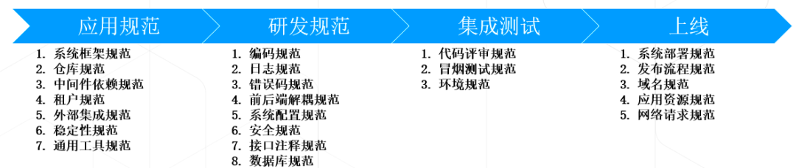
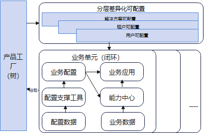
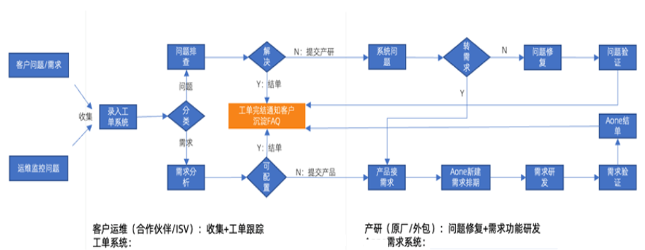
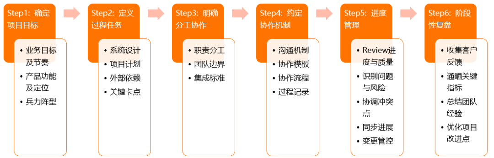
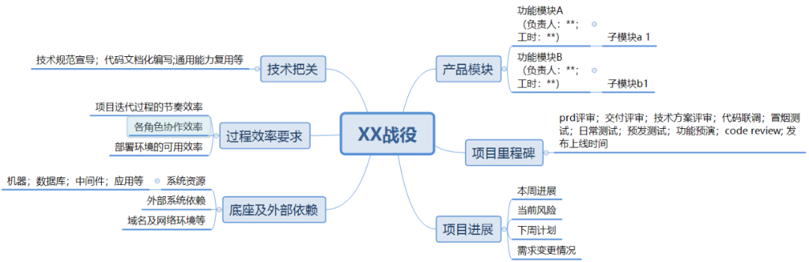

# 研发效能的思考总结


> 作者: 天蓉 | 阿里巴巴 
>
> 创建: 2022-07-22 09:00 发表于北京


原链：[《阿里开发者 - 研发效能的思考总结》](https://mp.weixin.qq.com/s/rg-NHLYljH8e6OWZpHtfmg)

## 前言

在谈效能之前，我想先谈谈作为一个技术人或者技术 TL（Technical Leader，技术领导）

> 研发的核心价值是什么？

之前看了一篇文章，比较有意思，分享一下观念：

```txt
一、T外包公司：

    最核心的竞争力不是技术，而是快速响应、资源调配整合、项目成本控制等方面。

二、企业信息化公司：

    研发的核心价值有三个层次：
        第一层是运用技术更好的去支撑业务；
        第二层是用技术推动业务，用自身业务经验（服务很多客户）帮助客户；
        第三层是去用经验积累去影响行业。

三、解决特定场景和问题的产品公司：

    核心价值就在于技术，专注与做技术深度。
```

**那我们的核心价值是什么？**

（1）高效支撑业务：一个是支撑，一个是高效

- **支撑**：对我们的要求就是：阶段性与业务目标，落地产品对齐。

- **高效**：研发效能的思考落地。用数据说明我们的价值

（2）用技术影响行业：这个需要持续的积累和思考。

（3）建技术壁垒和技术基建，确保系统稳定，业务健康和持久发展。

 很多时候，我们一直在思考如何高效支撑业务这个课题上。阿里技术分享平台或者网上都有非常多的文章分享，每个TL针对自己团队的状况也有一套自己的方法论。今天我结合自己所面临的状况，把自己的思考总结分享一下。

 ## 个人思考

从几个维度分别进行思考：

### 1.研发的流程效能：拆分阶段，发现关键问题，提出方案

1）需求阶段

问题：需求反复，需求不清晰，需求争议

解决方案：

（1）确保需求的有效期，明确业务价值和需求范围，并确保需求理解的一致性。

（2）需求内容，先小范围内沟通对焦；等需求讨论清晰，再拉落地相关同学参与。

（3）需求有争议时，为避免反复，拉上相关同学一起对焦。

（4）日常需求，定期排期，通晒。

2）研发阶段：

这个在 #**2.研发的生产效能** 单独说明。

3）联调与测试阶段：

问题：联调效率低，环境不可用，提测代码质量低

解决方案：

（1）前后端分离，各自具备 Mock 的能力

（2）日常环境治理，降级系统服务的依赖，确保测试环境问题

（3）基准测试用例，冒烟测试，自动化脚本测试，确保提测质量。

4）发布阶段：

问题：发布频率高；定位问题耗时；部署系统时长

解决方案：

（1）对同一时间的发布系统做适当合并。

（2）与业务约定发布频率，控制发布周期。

（3）系统依赖治理，缩短部署时长；并提前打包

（4）针对排查问题耗时，提供相应的问题排查工具。

### 2.研发的生产效能

针对研发的过程生产，我们从如下几个方面去提升研发效能：

（1）全链路技术规范：



每一个过程，通过规范文档统一标准，并通过宣传和考试的方式，让大家都熟知内容。并通过典型案例通晒，强化规范内容的价值。

（2）全链路业务可配置

- 页面可配：表单页，列表页，详情页，单据页等中后台页面可配置。

典型案例：宜搭的页面搭建


- 逻辑可配：业务参数可配置；业务规则可配置；

典型案例：类目特征；


- 模型可配：用元数据方式定义数据表或业务模型+扩展字段两种方式

典型案例：类目属性 ；NBF建模平台


- 服务&流程编排：基于原子服务能力进行二次组合。

典型案例：AECP 的服务编排；NBF 的服务编排等


基于上诉的原子工具能力，再结合产品工厂和解决方案能力，把横向和纵向的业务配置化能力链接在一起，形成一个分层的全链路业务可配置视图。



（3）统一横向支撑工具

拉通团队内部共性的支撑工具，共建一份。比如 excel 批量导入导出，审批流，通知工具等。

（4）非功能性代码

- 应用脚手架：一键生成应用工程，包括依赖的jar包等。

- 代码规范的模板：错误码模板；日志模板；工程结构等

- 中间件隔离层：包括使用的案例

- 通用工具类：外部开源的工具类；业务抽象的通用类；自研抽象的通用工具类；

- 业务标准拦截：用户登录；服务异常处理；dao的执行时间等

- 稳定性：限流；应用自检；


把所有应用的共性代码抽象，沉淀为 jar，在工程中默认引入。

（5）部署交付：部署手册指导；统一的问题排查工具；

（6）接口文档化：web 层统一遵循 swagger 规范；能力中心/工具遵循接口规范的文档和 client 的使用案例说明等。

（7）系统协作的清晰边界

我们在落地过程中，往往会存在系统调用，系统依赖等问题，建议在启动初期，把这些关键问题定义出来，然后寻找 TL 或 pm 协调解决。

### 3.研发的协作效能

通过流程规范和模板，约定大家的协作模式

1）日常答疑的协作流程



2）项目过程管理



通过如下战役模板，同步项目进展：



3）日常需求排期

约定需求排期周期，固定时间，并沟通需求通过协作管理工具。

后续可通过协作管理工具，分析统计数据。


### 4.研发的人员效能

（1）学习与培训：

通过持续的学习，或借力其他团队的方式，提升技术水平。

通过沉淀团队规范，文档，案例等方案，让大家补齐知识。

通过复盘总结，沉淀典型案例，内部分享，避免重复采坑。

（2）考试

光学习肯定是不行的，还需要通过考试的方式强化。可以使用这个工具：阿里在线考试系统。


## 效能指标

制定过程的指标数据，每月通晒与对比，分析数据，定位效能问题。关键指标可参考：

（1）需求交付周期，需求交付数，项目数

（2）代码提交量

（3）Bug 数

（4）线上问题与故障

## 总结

通过优化研发过程，并有明确的数据量化，证明研发对业务的价值。
